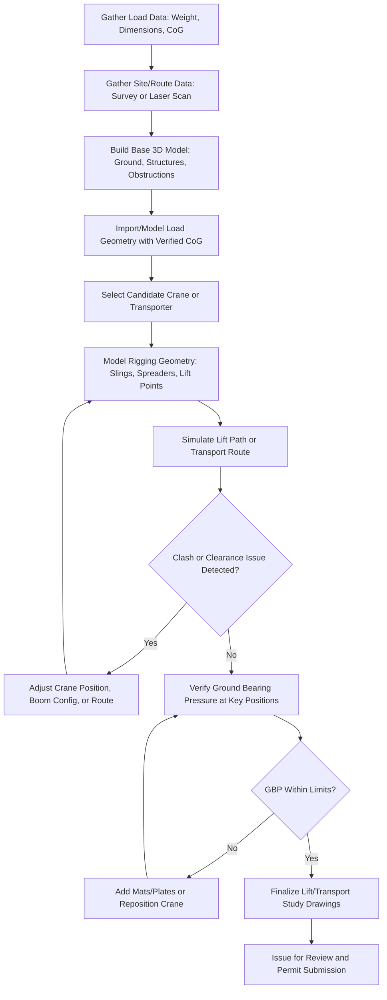

## 2D and 3D CAD Modeling for Lift and Transport Studies

### Purpose and Role in Heavy-Lift Engineering

CAD modeling in heavy-lift and specialized logistics serves as the primary tool for validating that a lift or transport operation is geometrically, structurally, and operationally feasible before physical execution. Unlike general mechanical CAD, lift and transport studies emphasize spatial clearance, weight/CoG accuracy, rigging geometry, and route feasibility over manufacturing detail.

**Key Points**

- CAD outputs in this domain function as engineering evidence, not just visualization — they support permit applications, crane selection, and client/regulatory sign-off.
- Models must reconcile theoretical (design) geometry with as-built/as-found conditions, since discrepancies are a leading cause of field lift failures.

### 2D CAD in Lift and Transport Studies

2D drawings remain the primary deliverable format for many lift plans, route surveys, and regulatory submissions due to their simplicity, print-friendliness, and universal readability.

**Common 2D Applications**

- **Lift plan drawings**: Plan and elevation views showing crane position(s), boom angle, load radius, rigging configuration, and exclusion zones.
- **Route survey drawings**: Plan-view overlays of transport routes showing road width, turn radii, overhead obstructions (in profile/elevation), and swept-path envelopes.
- **Rigging arrangement drawings**: Sling/spreader bar geometry, angles, and attachment points, often annotated with calculated leg tensions.
- **Ground bearing pressure (GBP) layout drawings**: Outrigger/crawler footprint positions relative to mats, plates, or known subsurface conditions.

**Typical 2D CAD Tools**

- AutoCAD (industry-standard for civil/route drawings, DWG format widely required by permitting authorities)
- MicroStation (common in infrastructure/utility-heavy transport corridor work)
- Vector-based rigging diagram tools bundled with lift-planning software (e.g., LiftPlanner, CraneSmart 2D modules)

### 3D CAD in Lift and Transport Studies

3D modeling is used where spatial complexity, interference risk, or dynamic simulation cannot be adequately captured in 2D — increasingly the default for complex heavy-lift and abnormal-load transport engineering.

**Common 3D Applications**

- **Clash/interference detection**: Verifying clearance between the load, rigging, crane boom/jib, and surrounding structures (pipe racks, buildings, existing equipment) in congested lift zones such as brownfield plants.
- **Swept-path and envelope analysis**: 3D corridor modeling for SPMT (Self-Propelled Modular Transporter) and abnormal load transport, verifying clearance through underpasses, roundabouts, and utility crossings.
- **Rigging geometry and CoG verification**: 3D placement of lift points relative to a modeled or scanned center of gravity, checking sling angles and load balance in three planes simultaneously.
- **Multi-crane tandem lift simulation**: Verifying synchronized boom paths and load-sharing geometry avoid collision throughout the full lift sequence, not just at start/end positions.
- **Marine/offshore lift and load-out modeling**: Vessel deck layout, sea-fastening geometry, and crane reach envelopes for barge-based or floating crane operations.

**Typical 3D CAD/Simulation Tools**

- Autodesk Inventor / AutoCAD Plant 3D / Navisworks (clash detection against plant 3D models)
- SolidWorks (rigging hardware and spreader bar design)
- Rhino3D / Grasshopper (used in some specialized rigging and structural fabrication contexts)
- Point-cloud-integrated platforms combining laser scan data with CAD (see below)
- Dedicated lift-simulation software: 3D Lift Plan, CraneSmart 3D, LiftPlanner 3D modules — purpose-built for crane selection, boom clearance, and ground bearing simulation

### Point Cloud and Laser Scan Integration

For brownfield lifts and complex transport routes, 3D laser scanning (LiDAR) is increasingly used to generate accurate as-built point clouds, which are then imported into CAD as a modeling reference:

1. **Scan acquisition**: Terrestrial laser scanning of the lift/transport zone, capturing existing structures, obstructions, and ground conditions.
2. **Point cloud registration**: Multiple scan stations aligned into a single coordinate system.
3. **CAD import and modeling**: Point cloud imported (via .RCP, .E57, or similar formats) into the CAD environment as a reference layer; new geometry (crane position, load, rigging) modeled directly against the accurate as-built data.
4. **Clash detection**: Automated or manual interference checks between proposed lift/transport geometry and scanned obstructions.

[Inference] The specific accuracy tolerance required (commonly cited informally as within a few centimeters for heavy-lift clearance studies) is project- and risk-driven rather than fixed by a single universal standard, and should be defined in the project's lift study scope of work.

### Core Data Inputs Required for Accurate Modeling

| Input | Source | Criticality |
| --- | --- | --- |
| Load dimensions and weight | Manufacturer drawings, weighing, or as-built survey | Critical — errors directly affect crane/rigging sizing |
| Center of Gravity (CoG) | Calculated, provided by OEM, or determined via trial lift/weighing | Critical — affects rigging point placement and stability |
| Crane/transporter specifications | OEM load charts, technical datasheets | Critical — defines capacity envelope |
| Site/route topography | Survey, LiDAR scan, existing drawings | High — affects ground bearing and swept path accuracy |
| Existing structure/obstruction geometry | As-built drawings, laser scan, site survey | High — governs clearance and clash detection validity |
| Soil bearing capacity data | Geotechnical report | High — feeds ground bearing pressure calculations, though not a CAD input per se |

### Typical 3D Lift Study Workflow

### Ground Bearing Pressure Modeling in CAD

3D and 2D CAD models are frequently used to calculate and visualize outrigger or crawler ground bearing pressure (GBP), a critical input for mat/plate sizing:

$$GBP = \frac{\text{Point Load at Outrigger/Track}}{\text{Contact Area}}$$

The CAD model provides the geometric contact area (outrigger pad or crawler track footprint) and load distribution, which is then compared against geotechnical allowable bearing capacity — modeled crane/transporter position directly drives where these checks are performed.

**Example**

A crawler crane with a track contact area of 2.5 m² per side carries 220 t on that side during peak load radius:

$$GBP = \frac{220,000 \, kg \times 9.81 \, m/s^2}{2.5 \, m^2} = 863,280 \, Pa \approx 0.86 \, MPa$$

This figure is then checked in the CAD-linked report against the geotechnical allowable bearing pressure for the specific ground condition at that modeled position.

### Swept Path Analysis for Abnormal Load Transport

Specialized software modules (e.g., AutoTURN, integrated with CAD route drawings) simulate the swept path of an SPMT or trailer combination through a route:

- **Vehicle/trailer parameters**: Wheelbase, articulation points, steering lock angle, overall length/width of the load-carrying configuration.
- **Route geometry**: Extracted from 2D/3D CAD survey data — curb lines, roundabout geometry, junction layouts.
- **Output**: Swept path envelope overlay showing whether the combined vehicle-and-load footprint clears fixed obstacles (curbs, poles, signal boxes, bridge parapets) at each point along the route.

### Integration with Structural and Rigging Calculations

CAD geometry is rarely used in isolation — in professional heavy-lift engineering practice, 3D models typically feed (or are cross-checked against) analytical calculations:

- **Sling angle and leg tension**: Geometric angles taken directly from the 3D model are used in the tension formulas covered under Factor of Safety standards, rather than assumed or estimated.
- **Spreader bar bending moment**: Load point positions modeled in CAD define the span and eccentricity used in beam bending calculations.
- **Boom clearance envelopes**: 3D boom sweep volumes are checked against modeled site obstructions to confirm clearance throughout the full lift arc, not just at the final set position.

[Unverified] The degree to which CAD and structural/rigging calculation software are directly integrated (via API, plugin, or shared data model) versus handled as a manual cross-check varies significantly by company and software stack, and is not standardized industry-wide.

### Common Pitfalls in Lift/Transport CAD Modeling

- **Modeling from design drawings instead of as-built/as-found conditions**, missing field modifications, temporary structures, or as-installed deviations.
- **Using a nominal/assumed CoG** instead of a verified value, propagating error through all downstream rigging and stability calculations.
- **Static-only clash checking** — verifying clearance only at the final lift position, missing collisions that occur mid-boom-swing or during a multi-crane tandem lift sequence.
- **Neglecting dynamic sway/wind envelope** in 3D clearance models, especially for tall or wind-sensitive loads.
- **Failing to update the 3D model when field conditions change** (e.g., a newly installed scaffold or temporary utility line), rendering the clash analysis invalid without the team's knowledge.

### Conclusion

2D CAD remains the standard deliverable format for permitting, regulatory submission, and simplified lift plans, while 3D CAD — increasingly combined with laser scan point clouds — has become the primary tool for validating complex, congested, or high-consequence heavy-lift and abnormal transport operations. The reliability of either output is fundamentally bounded by the accuracy of the underlying input data: load geometry, CoG, and as-built site conditions.

**Related Topics**

- Laser Scanning and Point Cloud Workflows for Brownfield Lift Engineering
- Ground Bearing Pressure Calculation and Mat/Plate Sizing
- Swept Path Analysis Software for SPMT and Abnormal Load Routing
- Spreader Bar and Lifting Beam Structural Design
- Multi-Crane Tandem Lift Simulation and Sequencing
- As-Built Survey Methods for Legacy Equipment Weight and CoG Verification