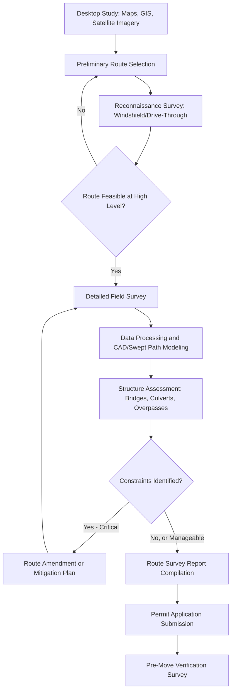

## Road Route Survey Methodology

### Purpose and Scope

Road route survey methodology in heavy-lift and specialized logistics establishes the systematic process for verifying that a proposed overland transport route can physically, structurally, and legally accommodate an abnormal or heavy indivisible load (HIL). The survey converts assumptions from desktop planning into field-verified data suitable for engineering sign-off, permit applications, and route engineering (e.g., swept path, bridge assessment).

**Key Points**

- A route survey is not a single inspection — it is a layered process moving from desktop analysis to progressively more detailed field verification.
- The methodology must produce data usable by multiple downstream disciplines: swept path engineers, structural/bridge engineers, and permitting authorities.

### Survey Stages Overview

### Stage 1: Desktop Study

Before any field work, a desktop study establishes candidate routes using available remote data:

- **Satellite and aerial imagery** (Google Earth, GIS platforms) to identify obvious obstructions, roundabouts, junctions, and general road geometry.
- **Existing road authority data**: known bridge weight limits, height restrictions, and posted road classifications.
- **Topographic and geotechnical maps**: gradient profiles, known soft ground, flood zones.
- **Historical route data**: prior abnormal load movements on the same or similar corridor, including known problem points from previous survey reports.

[Inference] The specific desktop tools used vary by region and operator; some jurisdictions provide dedicated abnormal-load route-planning GIS portals, while others require the surveyor to assemble data from multiple independent sources.

### Stage 2: Reconnaissance Survey

A lower-detail drive-through or initial site visit to validate the desktop study's assumptions before committing resources to full detailed survey:

- Confirm general route viability (no gross obstructions missed by imagery, e.g., recent construction).
- Identify obvious pinch points, low bridges, tight junctions, or roundabouts requiring detailed measurement.
- Photograph key locations for later reference and stakeholder discussion.
- Note visible utility infrastructure (overhead lines, poles, signal boxes) at a preliminary level.

### Stage 3: Detailed Field Survey

The core data-gathering stage, producing quantitative measurements suitable for engineering analysis.

**Core Measurements Taken**

- **Road width**: Carriageway width at regular intervals and at all critical points (junctions, roundabouts, narrow sections), typically measured with a laser distance meter, measuring wheel, or GNSS/RTK survey equipment.
- **Vertical clearance**: Height of all overhead obstructions — bridges, gantries, pedestrian bridges, overhead cables/utility lines, tree canopies, tunnel entrances — usually measured with a height stick, laser rangefinder, or vehicle-mounted clearance pole.
- **Horizontal clearance**: Width restrictions from fixed roadside objects — kerbs, poles, signage, barriers, buildings — critical for swept path validation.
- **Turning radii**: Radius at junctions and roundabouts, needed for swept path software input.
- **Road camber and cross-fall**: Affects trailer stability and load tilt, especially relevant for tall/narrow high-CoG loads.
- **Gradient (longitudinal slope)**: Affects traction, braking distance, and in some cases load stability calculations.
- **Surface condition**: Potholes, uneven surfaces, unpaved sections, or weight-bearing concerns (e.g., verges used for wide-load bypass).
- **GNSS/RTK positioning**: Coordinates tagged to all measurements and photographs for accurate CAD reconstruction and swept path modeling.

**Structures Requiring Dedicated Assessment**

- **Bridges and overpasses**: Load rating verification against the abnormal load's axle configuration and gross weight — often requiring a separate bridge assessment engineer, not just the route surveyor.
- **Culverts**: Buried structures under the road that may have unknown or reduced load ratings, particularly relevant for very heavy axle loads (SPMT configurations).
- **Level crossings**: Rail crossing geometry, angle of crossing, and any load restrictions.
- **Underpasses and tunnels**: Height, width, and in some cases ventilation/access restrictions for prolonged occupation during the move.

**Utility and Street Furniture Survey**

- Overhead line heights and voltage class (informing required clearance and utility company notification/de-energization needs).
- Traffic signal locations and whether temporary removal/relocation is required.
- Street lighting, signage, and bus shelters within the swept path envelope.
- Underground utilities in areas where temporary ground bearing (e.g., crane pads, jacking points) is planned.

### Survey Equipment and Technology

| Equipment/Method | Application |
| --- | --- |
| GNSS/RTK survey equipment | High-accuracy positioning of route features and obstructions |
| Laser distance meters / rangefinders | Width and height measurements at obstructions |
| Height/clearance poles | Manual vertical clearance verification, often as a cross-check |
| Total station | Precise measurement of junction geometry, structure dimensions |
| Mobile LiDAR / mobile mapping systems | Continuous point cloud capture of the entire route while driving, generating comprehensive 3D route data efficiently |
| Terrestrial laser scanning | High-detail scanning of critical pinch points, bridges, or complex junctions |
| Drone/UAV photogrammetry | Aerial overview of route corridor, useful for large junctions, elevated obstruction assessment, and visual documentation |
| Vehicle-mounted survey rigs | Combine GNSS, cameras, and clearance sensors for continuous data logging during a drive-through |

[Unverified] The extent to which mobile LiDAR versus traditional manual measurement is used as the primary method varies by contractor capability, project budget, and route complexity — both remain in active industry use, often in combination.

### Data Processing and Deliverables

Raw survey data is processed into deliverables usable by downstream engineering and permitting teams:

1. **Route survey report**: Narrative and tabulated findings — critical points, measurements, photographs, GPS coordinates, and recommended mitigation.
2. **CAD route drawings**: 2D plan/profile drawings of the route with annotated constraints (see 2D/3D CAD Modeling topic for methodology).
3. **Swept path analysis inputs**: Junction and route geometry formatted for import into swept path software (e.g., AutoTURN).
4. **Structure assessment reports**: Bridge/culvert load rating verification, often produced by a separate structural engineering discipline using the surveyor's geometric data.
5. **Constraint schedule**: A prioritized list of critical points requiring mitigation — e.g., "temporary traffic signal removal required at Junction X," "overhead line de-energization required at Chainage Y."

### Constraint Categories and Typical Mitigations

| Constraint Type | Example | Typical Mitigation |
| --- | --- | --- |
| Insufficient vertical clearance | Low bridge, overhead cable | Alternative route, temporary cable lift/de-energization, load height reduction |
| Insufficient horizontal clearance | Narrow carriageway, tight junction | Temporary removal of street furniture, use of verge/opposing lane, escort-controlled traffic management |
| Bridge/culvert load rating exceeded | Weak structure under heavy axle load | Alternative route, load spreading (more axles/trailers), engineered temporary bridging |
| Excessive gradient | Steep incline/decline | Alternative route, additional traction/braking verification, speed restriction |
| Tight turning radius | Roundabout, sharp junction | Swept path re-verification, use of multiple steering axles, temporary removal of central island features (rare, high-cost) |

### Route Survey Report Structure (Typical)

A comprehensive route survey report typically includes:

- **Executive summary**: Route overview, feasibility conclusion, key constraints.
- **Load and vehicle configuration reference**: Dimensions, weight, and axle configuration of the load/transporter combination the survey was conducted against.
- **Route overview map**: Full route with chainage/mile markers referencing detailed findings.
- **Chainage-by-chainage findings**: Sequential documentation of every measured point, obstruction, and constraint.
- **Photographic record**: Geo-tagged photographs of all critical points.
- **Structure assessment summary**: Bridge/culvert findings and load rating conclusions (or reference to separate structural report).
- **Constraint schedule and mitigation recommendations**.
- **Appendices**: Raw survey data, swept path drawings, equipment calibration records.

### Pre-Move Verification Survey

Given that route conditions can change between the initial detailed survey and the actual move date (construction activity, new obstructions, seasonal vegetation growth, temporary signage), a **pre-move verification survey** is standard practice shortly before transport execution:

- Re-check all critical pinch points identified in the detailed survey.
- Confirm planned mitigations (utility removals, traffic management) have been implemented as required.
- Identify any new obstructions introduced since the original survey.

[Inference] The time window between pre-move verification and actual transport execution is generally kept as short as practically possible on high-risk routes, though the specific interval is project- and risk-driven rather than fixed by a universal standard.

### Common Pitfalls in Route Survey Methodology

- **Relying solely on desktop/satellite imagery** without field verification, missing recently constructed obstructions or inaccurate imagery-derived measurements.
- **Surveying against outdated load/vehicle configuration data**, invalidating clearance calculations if the actual transport configuration changes.
- **Overlooking seasonal variables** — vegetation growth, temporary ice/snow-related road narrowing, or seasonal water table effects on ground bearing.
- **Insufficient structure assessment rigor** — treating bridge/culvert crossings as a simple visual check rather than obtaining formal load rating verification from a qualified structural engineer.
- **Failing to re-verify the route close to the move date**, allowing intervening changes (new construction, parked vehicles, temporary signage) to invalidate the original survey.

### Conclusion

Road route survey methodology progresses from broad desktop analysis through reconnaissance to detailed, quantitative field measurement, producing engineering-grade data that feeds swept path analysis, structural assessment, and permitting. Its reliability depends on rigorous, up-to-date field verification against the actual planned load and transporter configuration, combined with a pre-move re-check to catch late-emerging changes.

**Related Topics**

- Swept Path Analysis for SPMT and Abnormal Load Transport
- Bridge and Culvert Load Rating Assessment for Heavy Transport
- Utility Coordination and Temporary Infrastructure Relocation
- Mobile LiDAR and Point Cloud Route Mapping
- Abnormal Load Permitting and Regulatory Coordination
- Traffic Management Planning for Abnormal Load Movements