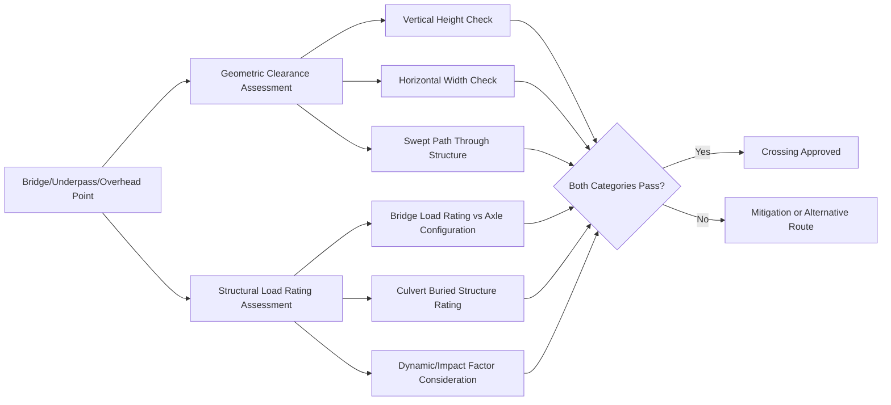

## Bridge, Underpass, and Overhead Clearance Assessment

### Purpose and Scope

Bridge, underpass, and overhead clearance assessment is the discipline-specific verification stage within route engineering that confirms both structural adequacy (can the structure carry the load) and geometric adequacy (does the load physically fit) at every crossing and overhead obstruction along a heavy transport route. Unlike general route survey measurements, this assessment often requires input from a qualified structural/bridge engineer, particularly for load rating.

**Key Points**

- Clearance assessment has two independent failure modes: structural (bridge cannot bear the load) and geometric (load does not physically clear). Passing one does not imply passing the other.
- Assessment must be performed against the actual load/transporter axle configuration, not just gross weight — axle spacing and individual axle loads govern bridge response.

### Two Categories of Assessment

### Geometric Clearance Assessment

**Vertical Clearance (Overhead Obstructions)**

- Applies to bridges (passing over the route), overhead gantries, pedestrian bridges, tunnel/underpass soffits, overhead utility lines, and tree canopies.
- Measured from the road surface (or a defined reference datum) to the lowest point of the obstruction.
- Compared against the load's transport height *plus* a mandatory clearance margin — commonly cited informally in the 150–300 mm range for hard structures, though the specific figure is typically set by the relevant road/permitting authority or project-specific procedure rather than a single universal number. [Unverified]
- Must account for **trailer deck deflection under load**, tire pressure variance, and road camber at the specific crossing point, since these can reduce actual achieved clearance versus a purely static "trailer height" figure.
- For overhead electrical lines, clearance requirements are typically driven by electrical safety standards (minimum approach distances scaled by voltage class) rather than purely mechanical clearance, and usually require utility company coordination or temporary de-energization/lifting.

**Horizontal Clearance**

- Applies to tunnel/underpass side walls, bridge parapets, abutments, and any structure forming a "gateway" the load must pass through.
- Assessed in combination with swept path analysis, since the load's position within the lane (and any mid-corner offset during a turn) affects the horizontal clearance achieved at a given point, not just the static roadway width.
- Particularly critical where the crossing occurs on or near a curve, since the swept envelope shifts laterally relative to the straight-line carriageway width.

**Example**

A load with a transport height of 5.10 m approaches an overhead bridge with a measured soffit height of 5.40 m. Applying a 200 mm safety margin:

$$\text{Required Clearance} = 5.10\,m + 0.20\,m = 5.30\,m$$

Since the bridge soffit (5.40 m) exceeds the required clearance (5.30 m), the crossing passes on a purely static basis — but this conclusion must still be checked against trailer deflection under load and any camber/cross-fall at that specific location before being finalized.

### Structural Load Rating Assessment

**Why Bridges Require Specialist Assessment**

Bridges and culverts are designed to specific code-based load models (e.g., highway design vehicles under national bridge codes) that may not reflect the actual load distribution of an abnormal transport configuration. An SPMT or multi-axle trailer combination often spreads load very differently from standard highway traffic, which can mean a bridge is either:

- Adequate for a heavy load that would exceed a naive "posted weight limit" check, because the load is spread across many axles/lines over a large footprint, or
- Inadequate for a load below the posted limit, if axle spacing creates a concentrated loading pattern the bridge's design model did not anticipate.

**Key Structural Inputs Required**

- **Bridge type and construction**: Reinforced concrete, prestressed concrete, steel girder, masonry arch — each has different load response characteristics.
- **Span configuration and condition**: Single span vs. multi-span, and current structural condition (inspection reports, known deterioration).
- **Axle configuration of the load/transporter**: Number of axle lines, spacing between lines, load per axle line — the primary input for bridge response calculation.
- **Speed of crossing**: Very low speed or static (jacked/rolled) crossings may reduce dynamic/impact load factors compared to normal traffic speed, which can be a mitigation option for marginal cases.
- **Existing bridge load rating documentation**: Where available from the road authority, providing a baseline rather than requiring assessment from first principles.

**Assessment Process (Typical)**

1. Obtain existing bridge design/as-built drawings and any prior load rating assessments from the road authority.
2. Model the abnormal load's axle configuration against the bridge's structural model (often using bridge-specific software or standard load rating methodologies such as those derived from AASHTO LRFR in North America, or national equivalents elsewhere).
3. Calculate the bridge's response (bending moment, shear) under the abnormal load configuration and compare against the bridge's rated capacity.
4. Apply any additional impact/dynamic factors appropriate to the crossing speed and condition.
5. Issue a formal load rating conclusion: pass, pass with conditions (e.g., speed restriction, single-lane crossing, escort requirement), or fail.

[Inference] The specific software and methodology used for bridge load rating varies significantly by country and road authority — some use proprietary bridge management software, others rely on manual calculation against national bridge design codes — so the assessment approach should be confirmed with the relevant road authority or a qualified bridge engineer for each project.

### Culverts and Buried Structures

Culverts present a distinct challenge because they are often undocumented or poorly documented relative to bridges, yet can be equally vulnerable to concentrated heavy axle loads:

- **Identification risk**: Culverts may not appear prominently on maps or may be assumed adequate without formal assessment, since they are visually less imposing than a bridge.
- **Cover depth consideration**: The depth of fill/road material over the culvert affects how load is distributed to the structure below — shallow cover concentrates load more directly onto the culvert.
- **Assessment approach**: Similar structural load rating principles apply, but often with greater uncertainty due to limited as-built documentation, sometimes requiring exploratory investigation (test pits, ground-penetrating radar) to confirm culvert type, dimensions, and condition before assessment.

### Underpass and Tunnel-Specific Considerations

- **Combined vertical and horizontal constraint**: Underpasses typically constrain both dimensions simultaneously, often in a curved or non-rectangular profile (arched tunnels, for example), requiring 3D clearance envelope checking rather than simple height/width lookup.
- **Ventilation and access restrictions**: Some tunnels have restrictions on vehicle type, load type (e.g., hazardous materials), or require temporary ventilation system verification for slow-moving abnormal loads occupying the tunnel for extended periods.
- **Structural load rating**: Where the underpass structure itself carries traffic or a rail line above, the same load rating principles as bridges apply to the structure forming the roof of the underpass.

### Mitigation Strategies for Failed Assessments

| Failure Mode | Mitigation Options |
| --- | --- |
| Insufficient vertical clearance | Alternative route; temporary lifting/de-energization of overhead lines; reduce load transport height (e.g., lower trailer deck, remove load sub-components) |
| Insufficient horizontal clearance | Alternative route; single-lane/contraflow crossing; temporary removal of parapet-mounted features (rare) |
| Bridge load rating exceeded | Alternative route; load spreading via additional axle lines/trailers; reduced crossing speed; single-vehicle-on-structure restriction; engineered temporary bridging/bypass |
| Culvert load rating uncertain/exceeded | Alternative route; temporary load-spreading mats over the culvert; engineered temporary crossing structure |

### Documentation and Sign-Off

A formal clearance assessment package typically includes:

- **Structure inventory**: List of all bridges, underpasses, culverts, and overhead obstructions along the route with reference chainage.
- **Geometric clearance findings**: Measured dimensions vs. required clearance for each point, with pass/fail/conditional status.
- **Structural load rating reports**: Formal engineering sign-off for each structure requiring load assessment, typically prepared or reviewed by a licensed structural/bridge engineer.
- **Conditions and restrictions schedule**: Any speed limits, lane restrictions, single-vehicle-on-structure rules, or escort requirements attached to specific crossings.
- **Road authority approval correlation**: Reference to formal permit conditions issued by the relevant authority based on the assessment findings.

### Common Pitfalls

- **Treating a posted weight limit sign as sufficient assessment**, ignoring that abnormal load axle configurations can behave very differently from the standard vehicles the posted limit assumes.
- **Overlooking culverts** due to their low visual profile compared to bridges, resulting in an unassessed structural risk.
- **Using static trailer height without margin for deflection and camber**, resulting in an overly optimistic geometric clearance conclusion.
- **Failing to coordinate with the utility owner** for overhead line clearance, leading to last-minute delays or safety incidents during transport.
- **Assessing structural load rating against gross weight alone** rather than actual axle configuration, producing an inaccurate pass/fail conclusion in either direction.

### Conclusion

Bridge, underpass, and overhead clearance assessment requires two parallel, independent verification tracks — geometric fit and structural load capacity — each with its own data requirements, assessment methodology, and failure modes. Reliable conclusions depend on assessing against the actual planned axle configuration and transport dimensions, incorporating realistic safety margins, and involving qualified structural expertise for load rating decisions rather than relying on generic posted limits.

**Related Topics**

- Road Route Survey Methodology
- Swept Path Analysis for SPMT and Abnormal Load Transport
- Utility Coordination and Overhead Line Clearance Procedures
- Axle Load Distribution and Bridge Load Rating Methods (AASHTO LRFR and National Equivalents)
- Temporary Bridging and Load-Spreading Techniques for Weak Structures
- Abnormal Load Permitting and Regulatory Coordination