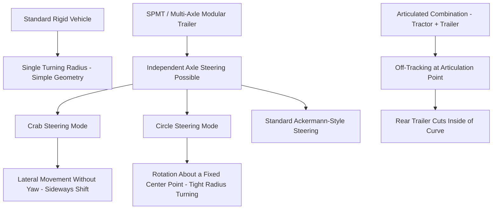

## Turning Radius and Swept Path Analysis

### Purpose and Scope

Turning radius and swept path analysis verifies that a vehicle-and-load combination can physically negotiate junctions, roundabouts, and curved route sections without colliding with fixed infrastructure. It converts the vehicle's steering geometry and the route's physical constraints into a predicted "swept envelope" — the actual ground footprint the combination occupies while turning — which is then checked against available space.

**Key Points**

- Swept path is fundamentally different from static vehicle width — a long, multi-axle or articulated combination occupies a larger and non-rectangular footprint while turning than its straight-line width suggests.
- Analysis must be performed against the specific vehicle/trailer/load combination and its actual steering capabilities, not a generic vehicle template.

### Core Concepts

**Turning Radius**

The radius of the circular path traced by a defined reference point on the vehicle (commonly the outer front wheel or outer body edge) when steering is at full lock. For heavy transport combinations, multiple radii are relevant:

- **Outer turning radius**: The largest radius, traced by the outermost point of the vehicle/load (often the load overhang or outer trailer edge).
- **Inner turning radius**: The smallest radius, traced by the innermost wheel or axle — the gap between inner and outer radius defines the minimum required road width for that specific turn.
- **Kerb-to-kerb turning radius**: Practical minimum radius achievable without mounting kerbs, used for standard junction design.

**Swept Path**

The full envelope traced by all points of the vehicle/load combination as it moves through a turn, including:

- **Off-tracking**: The tendency of trailer axles (and articulation points) to follow a tighter path than the towing unit, causing the rear of a long combination to "cut the corner."
- **Overhang swing**: Front and rear overhangs (including load overhang beyond the trailer bed) swinging outward on the opposite side of the turn direction — critical for multi-axle low-loaders and long loads.
- **Tail swing**: Specifically the rearward overhang's outward swing during a turn, relevant to trailer types with significant rear overhang.

### Why Multi-Axle and Articulated Combinations Behave Differently

Self-Propelled Modular Transporters (SPMTs), the platform trailers most associated with heavy-lift transport, typically offer multiple steering modes because each axle line has independently controlled steering:

- **Standard (Ackermann-style) steering**: Conventional turning behavior, front and rear axle lines steer in coordination to follow a curved path.
- **Crab steering**: All wheels steer in the same direction, allowing the entire platform to shift laterally without changing orientation — useful for aligning with a load-out position or navigating a narrow lane offset without a turn.
- **Circle (pivot) steering**: Wheels steer to rotate the platform around a fixed central point, achieving very tight effective turning radii not possible with conventional articulated trailers — valuable in highly space-constrained junctions.

[Inference] The specific steering modes and their labeling can vary slightly between SPMT manufacturers (e.g., Goldhofer, Scheuerle, Cometto), though the crab/circle/standard conceptual categories are broadly consistent across the major platforms.

### Swept Path Analysis Software

**AutoTURN** (Transoft Solutions) is the most widely referenced software in the transport engineering industry for swept path analysis, integrating with CAD platforms (AutoCAD, MicroStation) to simulate vehicle turning against surveyed route geometry.

**Typical Software Workflow**

1. Import surveyed route geometry (from CAD route drawings, see Road Route Survey Methodology) as the base layer.
2. Select or configure a vehicle template matching the specific transporter/trailer/load combination — including wheelbase, articulation points, steering lock angles, and overall envelope dimensions (including load overhang).
3. Define the intended travel path (centerline) through the junction or curve.
4. Run the simulation to generate the swept path envelope overlay.
5. Compare the envelope against surveyed fixed obstacles (kerbs, poles, signage, barriers, structures).
6. Iterate: adjust travel path, steering mode (for SPMTs), or approach angle to resolve any envelope/obstacle conflicts.

**Custom Vehicle Template Configuration**

Standard software libraries include common vehicle types (trucks, buses, fire engines), but heavy-lift work almost always requires custom templates reflecting:

- Total combination length, including load overhang front and rear.
- Number of axle lines and spacing (for SPMT/modular trailers).
- Articulation point locations (for conventional low-loader/semi-trailer combinations).
- Maximum steering lock angle per axle line.
- Overall width, including any load overhang beyond the trailer bed width.

### Manual Turning Radius Estimation (Simplified Reference)

For preliminary/desktop-level checks before full software simulation, a simplified approximation for a single-articulation-point combination's off-tracking can be referenced:

$$R_{inner} = \sqrt{R_{outer}^2 - L^2}$$

Where $R_{outer}$ is the turning radius of the towing/lead unit's outer front point, $R_{inner}$ is the resulting inner path radius after off-tracking, and $L$ is the wheelbase or effective distance to the trailing reference point.

[Inference] This formula provides only a first-order approximation for simple single-articulation cases; multi-axle SPMT combinations with independent steering do not follow this simplified relationship and require dedicated software simulation rather than manual calculation, given their more complex kinematics.

### Key Data Inputs for Accurate Swept Path Analysis

| Input | Source | Impact if Inaccurate |
| --- | --- | --- |
| Vehicle/trailer wheelbase and axle spacing | Manufacturer specification | Incorrect off-tracking prediction |
| Load overhang dimensions | Load engineering drawings | Missed collision risk at overhang extremities |
| Maximum steering lock angle | Manufacturer/OEM data | Overestimated maneuverability, unachievable turns predicted as feasible |
| Route geometry (kerb lines, obstacles) | Field survey (see Road Route Survey Methodology) | Entire analysis invalid if geometry is inaccurate |
| Intended travel path/approach angle | Route/traffic planning | Different approach angles can significantly change achievable clearance at the same junction |

### Interpreting Swept Path Results

**Clearance Categories**

- **Pass — adequate clearance**: Swept envelope clears all fixed obstacles with an acceptable margin.
- **Marginal — tight clearance**: Envelope clears but with minimal margin; often flagged for additional field verification, reduced speed, or spotter/escort guidance during actual transport.
- **Fail — envelope conflict**: Swept path intersects a fixed obstacle at the modeled approach; requires route amendment, obstacle removal/relocation, or alternative steering strategy (e.g., switching an SPMT to circle steering for that specific junction).

**Common Resolution Strategies**

- Adjusting the **approach angle** into a junction (a wider or narrower entry angle can significantly change the achievable exit path).
- Using **wide/opposing lane or verge** temporarily (requires traffic management and permitting).
- For SPMTs, switching **steering mode** for the specific maneuver (e.g., circle steering to rotate through a tight junction rather than attempting a standard curved path).
- **Temporary removal or relocation** of street furniture (signage, bollards, temporary barriers) within the marginal clearance zone.
- **Route amendment**, avoiding the problematic junction entirely if mitigation is impractical.

### Roundabout-Specific Considerations

Roundabouts present a distinct swept path challenge due to their central island and often tight approach/exit geometry:

- **Mounting the central island**: For sufficiently reinforced roundabouts, driving over a mountable central island apron is a common mitigation for long combinations, subject to road authority approval and verification the island can bear the load.
- **Multiple lane usage**: Long combinations often require use of multiple lanes or the full roundabout width, necessitating traffic management to close the roundabout to other traffic during the abnormal load's passage.
- **Sequential axle tracking**: For very long SPMT combinations, the swept path analysis must verify the entire vehicle length can clear the roundabout, not just the leading unit — the rear of the combination may still be off-tracking through the entry while the front approaches the exit.

### Common Pitfalls

- **Using a generic or default vehicle template** instead of the actual project-specific combination dimensions and steering characteristics.
- **Analyzing only a single approach angle**, missing that a different entry trajectory into a junction could resolve an apparent clearance failure.
- **Ignoring load overhang** in the swept path template, since the load itself — not just the trailer — often defines the true outer envelope.
- **Failing to re-verify swept path after route survey updates**, when field-measured obstacle positions differ from initial desktop/imagery-based estimates.
- **Treating a "marginal" result as a pass** without flagging it for field verification, escort management, or speed restriction during actual execution.

### Conclusion

Turning radius and swept path analysis translates route geometry and vehicle steering kinematics into a predictive collision-check tool, most rigorously performed using dedicated software such as AutoTURN against accurately surveyed route data. For SPMT-based heavy transport, the availability of crab and circle steering modes provides mitigation flexibility beyond what conventional articulated combinations can achieve, but accurate custom vehicle templates and precise route survey data remain the foundation of a reliable analysis in either case.

**Related Topics**

- Road Route Survey Methodology
- SPMT Steering Modes and Configuration Planning
- Bridge, Underpass, and Overhead Clearance Assessment
- Traffic Management Planning for Abnormal Load Movements
- Roundabout and Junction Mitigation Strategies for Long Combinations
- CAD Modeling for Lift and Transport Studies