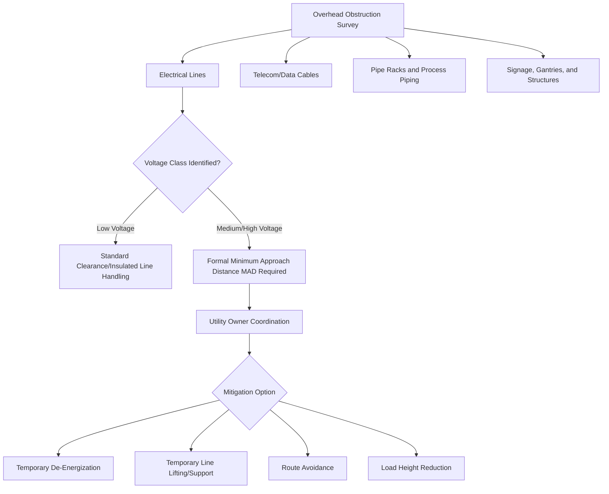
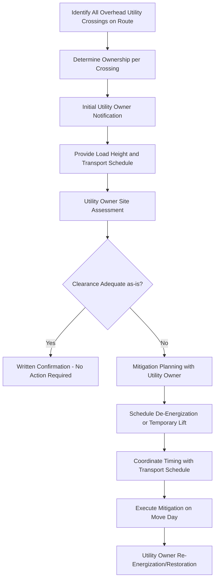

## Utility Line and Overhead Obstruction Management

### Purpose and Scope

Utility line and overhead obstruction management addresses the identification, risk assessment, and mitigation of overhead hazards — primarily electrical lines, but also telecom cables, pipelines on racks, and overhead signage/gantries — along a heavy transport route or within a lift zone. This discipline sits at the intersection of route engineering and electrical safety, and typically requires direct coordination with the utility owner rather than being resolved through transport engineering alone.

**Key Points**

- Overhead electrical line management is governed primarily by electrical safety clearance requirements (minimum approach distances), not simply mechanical height clearance.
- Utility coordination often has the longest lead time of any route engineering activity — de-energization, temporary lifting, or line relocation can require weeks to months of advance notice.

### Categories of Overhead Obstructions

### Electrical Line Risk Assessment

**Why Electrical Lines Require Specialized Treatment**

Unlike a static structure, overhead electrical lines present an active hazard where contact — or even sufficiently close approach, due to arc-flash/flashover risk at higher voltages — can cause electrocution, fire, or equipment damage. Clearance requirements are therefore based on **Minimum Approach Distance (MAD)** principles rather than pure mechanical clearance.

**Key Data Required for Assessment**

- **Voltage class**: Low voltage (LV), medium voltage (MV), or high voltage (HV) — the primary driver of required clearance distance.
- **Conductor height at the specific crossing point**: Line sag varies significantly with ambient temperature, load current, and span length — the height must be assessed under worst-case sag conditions (typically warmest expected temperature during the transport window), not just a single static measurement.
- **Conductor type**: Bare overhead conductor vs. insulated/covered conductor — insulated conductors may have different (though not necessarily zero-risk) clearance considerations.
- **Line ownership and operational status**: Identifying the responsible utility company, and whether the line is a critical/non-switchable feed or one that can be de-energized without major service disruption.

[Inference] Specific numeric MAD values are governed by national/regional electrical safety codes and utility company standards (e.g., OSHA-referenced tables in the US, or national equivalents elsewhere) and scale with voltage class; because these figures vary by jurisdiction and are safety-critical, they should be confirmed directly with the relevant utility owner or a qualified electrical safety professional for each project rather than assumed from general industry figures.

### Line Sag and Worst-Case Height Assessment

Overhead conductor height is not a fixed value — it varies due to:

- **Thermal expansion**: Conductors sag lower as temperature increases (both ambient and current-carrying/I²R heating).
- **Span length**: Longer spans between support structures generally produce greater sag.
- **Ice/wind loading** (in applicable climates): Can affect both sag and lateral conductor position.
- **Time of day/season**: Peak electrical demand periods may increase conductor temperature and thus sag.

For heavy transport planning, the assessed clearance should reflect the **worst-case (lowest) anticipated conductor height** during the transport window, not a single measurement taken under favorable conditions — a common and serious error is measuring line height on a cool day and applying that figure to a summer transport date.

### Utility Coordination Process

**Typical Coordination Steps**

1. **Identify all crossings and ownership**: Cross-reference route survey findings against utility company service area maps; a single route may involve multiple utility owners (different electrical distributors, telecom providers, municipal authorities).
2. **Formal notification**: Submit a request to each affected utility owner with load height, width, transport date/time window, and specific crossing locations.
3. **Utility site assessment**: The utility owner (or their contracted crew) typically conducts their own site visit to confirm line height, voltage class, and feasible mitigation options.
4. **Mitigation agreement**: Formalize the agreed approach — de-energization, temporary lifting, or confirmation that existing clearance is adequate.
5. **Scheduling coordination**: Align the mitigation timing precisely with the transport schedule, since de-energization affects other customers and lifting crews have their own availability constraints.
6. **Day-of-move execution**: Utility crew (not the transport contractor) typically performs the actual de-energization, lifting, or lowering, then restoration once the load has passed.

### Mitigation Options

| Mitigation | Description | Typical Use Case |
| --- | --- | --- |
| Temporary de-energization | Utility switches off power to the line for the duration of the crossing | High-voltage lines where physical lifting is impractical or unsafe |
| Temporary line lifting | Utility crew uses insulated lifting equipment/poles to raise the conductor above the load during passage | Lower-voltage or single-line crossings where brief de-energization is avoided |
| Temporary support structures | Additional temporary poles/gantries installed to raise line height along a stretch of route | Longer sections requiring sustained clearance improvement, or repeated crossings |
| Route avoidance | Alternative route selected to avoid the crossing entirely | Where utility coordination cost/lead time exceeds the value of the direct route |
| Load height reduction | Reducing the transport configuration height (lower trailer deck type, partial disassembly) | Where utility mitigation is not feasible or excessively costly |
| Timed crossing (off-peak) | Scheduling crossing during lower electrical demand periods to reduce conductor sag from current heating | Marginal clearance cases where full de-energization isn't warranted |

### Non-Electrical Overhead Obstructions

**Telecom and Data Cables**

- Generally lower risk than electrical lines but still require identification and clearance verification.
- Often owned by multiple, sometimes hard-to-identify providers (especially where infrastructure has been resold or shared).
- Mitigation is typically simpler — temporary lifting or cutting/reinstatement (with owner agreement) is more common than for electrical lines.

**Pipe Racks and Process Piping (Industrial/Plant Routes)**

- Relevant for heavy-lift moves within industrial facilities (refineries, petrochemical plants, power stations).
- May carry hazardous materials, requiring additional safety protocols beyond simple mechanical clearance (e.g., hot work permits if any modification is needed nearby).
- Often require plant engineering sign-off in addition to (or instead of) a public utility company, since the asset owner is the facility operator.

**Signage and Gantry Structures**

- Includes highway signage gantries, pedestrian bridges, and similar fixed structures.
- Assessment is primarily geometric/structural (see Bridge, Underpass, and Overhead Clearance Assessment) rather than a live-hazard utility concern, though the coordination process (owner identification, temporary removal agreement) follows similar principles.

### Lead Time Considerations

Utility coordination frequently represents the critical path constraint on overall route engineering timelines:

- **De-energization requests**: May require formal outage planning by the utility, which can involve customer notification periods, system load studies, or coordination with other planned maintenance.
- **Temporary lifting crew scheduling**: Specialized utility crews with appropriate insulated equipment may have limited availability, especially for multiple crossings requiring simultaneous or sequential mitigation on a single move.
- **Permit and approval layering**: Utility mitigation often must be finalized before the overall transport permit application can be completed, since permitting authorities may require confirmation that overhead clearance issues are resolved.

[Inference] While utility coordination lead times are consistently cited across the industry as a common schedule-critical item, the specific duration required varies substantially by utility owner, voltage class, and regional regulatory processes — early engagement is the generally recommended practice rather than a fixed lead-time figure being universally applicable.

### Documentation and Records

- **Utility crossing schedule**: List of all overhead utility crossings with ownership, voltage class, measured/assessed height, and required mitigation.
- **Written utility owner agreements**: Formal confirmation of mitigation approach and scheduling commitment from each affected utility.
- **Day-of-move coordination log**: Contact details and confirmed attendance of utility crews for each crossing requiring live mitigation on the move date.
- **As-executed record**: Confirmation that agreed mitigations were successfully performed, retained as part of the overall transport execution record.

### Common Pitfalls

- **Measuring conductor height under favorable (cool, low-demand) conditions** and failing to account for worst-case sag during the actual transport window.
- **Underestimating utility coordination lead time**, causing schedule delays when de-energization or crew scheduling cannot be arranged in time.
- **Overlooking secondary/minor utility owners** (smaller telecom providers, private line owners) not captured in primary route survey data.
- **Failing to formally confirm mitigation execution** on the move day, resulting in an unplanned encounter with a still-energized or unlifted line.
- **Treating all overhead lines as equal risk**, rather than differentiating clearance and mitigation requirements by voltage class and hazard level.

### Conclusion

Utility line and overhead obstruction management requires treating electrical lines as active safety hazards governed by minimum approach distance principles, assessed under worst-case sag conditions, and resolved through direct coordination with utility owners rather than transport engineering alone. Given the typically long lead times for de-energization or temporary lifting arrangements, utility coordination should begin early in the route engineering process and is frequently the schedule-governing activity for the overall move.

**Related Topics**

- Road Route Survey Methodology
- Bridge, Underpass, and Overhead Clearance Assessment
- Abnormal Load Permitting and Regulatory Coordination
- Traffic Management Planning for Abnormal Load Movements
- Electrical Safety and Minimum Approach Distance Standards
- Industrial Plant Route Engineering for In-Plant Heavy Moves