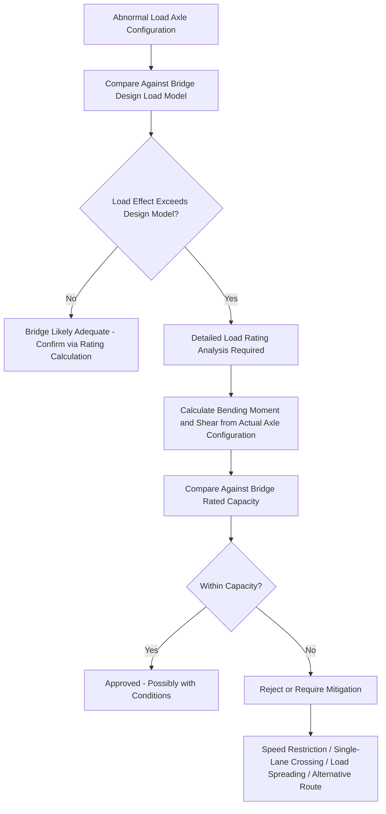

## Bridge Load Rating and Structural Capacity Verification

### Purpose and Scope

Bridge load rating and structural capacity verification is the formal engineering process of determining whether an existing bridge or similar structure can safely carry a specific abnormal load configuration. It produces a quantitative, code-referenced conclusion — distinct from the general geometric/structural screening covered under route clearance assessment — typically requiring a licensed structural or bridge engineer's sign-off before a heavy transport move can be approved to cross the structure.

**Key Points**

- Load rating is configuration-specific: a rating conclusion is valid only for the specific axle spacing, load distribution, and crossing speed it was calculated against, not for the load's gross weight alone.
- Load rating methodology differs meaningfully by jurisdiction (AASHTO-based in North America, Eurocode-based in Europe, and various national standards elsewhere), so the specific code framework must be confirmed for each project location.

### Why Load Rating Differs from Design Load Checking

Bridges are originally designed against a code-specified design vehicle or load model intended to envelope normal highway traffic. Abnormal loads frequently fall outside this envelope in ways that are not simply "heavier" — axle spacing, footprint, and load concentration can differ substantially from standard design vehicles, meaning gross weight alone is an unreliable predictor of bridge response.

### Core Inputs for Load Rating Analysis

| Input | Description | Source |
| --- | --- | --- |
| Bridge structural drawings | As-built or design drawings showing span, member sizes, reinforcement | Road authority archives, original design records |
| Bridge inspection/condition report | Current structural condition, deterioration, prior repairs | Road authority bridge management records, recent inspection |
| Existing load rating (if available) | Prior rating conclusion under standard rating vehicles | Road authority bridge management system |
| Abnormal load axle configuration | Number of axle lines, spacing, load per line | Transport engineer / trailer OEM specification |
| Crossing speed | Planned speed across the structure | Transport plan |
| Dynamic/impact allowance basis | Whether crawl-speed or normal-speed crossing, affecting impact factor | Transport plan and applicable code |

### Load Rating Methodologies by Region

**AASHTO LRFR (Load and Resistance Factor Rating) — United States**

- The dominant methodology for bridge load rating in the US, evaluating bridges at multiple rating levels: Design Load, Legal Load, and Permit Load ratings.
- **Permit load rating** is the relevant category for abnormal/overweight loads, typically evaluated with reduced live load factors and dynamic allowance reflecting controlled, escorted crossing conditions (e.g., single-vehicle-on-span, reduced speed) rather than normal highway traffic assumptions.
- Rating Factor (RF) is the key output metric:

$$RF = \frac{C - \gamma_{DC} \cdot DC - \gamma_{DW} \cdot DW}{\gamma_{LL}(LL + IM)}$$

Where $C$ is structural capacity, $DC$ and $DW$ are dead load effects (structural and wearing surface), $LL$ is live load effect from the abnormal load configuration, $IM$ is dynamic/impact allowance, and $\gamma$ terms are the corresponding load factors. An $RF \geq 1.0$ generally indicates the bridge can carry the evaluated load under the rating methodology's assumptions.

**Eurocode-Based Assessment — Europe**

- Bridge assessment for abnormal loads in many European jurisdictions references Eurocode 1 (EN 1991-2) load models, with national annexes often providing specific abnormal/special vehicle load models (e.g., various "special vehicle" categories used for permit-load assessment).
- Assessment similarly compares the abnormal vehicle's load effects against the bridge's assessed resistance, often incorporating reduced partial safety factors for short-duration, controlled abnormal load crossings compared to standard traffic load combinations.

**Other National Standards**

[Inference] Many countries outside North America and the EU maintain their own national bridge design and assessment codes (often historically derived from British Standards, AASHTO, or Eurocode frameworks with local adaptation), and the specific rating methodology, terminology, and permit-load provisions should be confirmed with the relevant national road authority for any project outside these two frameworks.

### Structural Response Factors Considered

- **Bending moment and shear**: The primary structural response calculated from the load's position and axle configuration as it traverses the span, since these govern most reinforced concrete and steel girder bridge capacity checks.
- **Distribution factors**: How load from a specific wheel/axle line is distributed across multiple girders or the deck slab — dependent on bridge type, girder spacing, and deck stiffness.
- **Dynamic/impact allowance**: An additional factor applied to account for the dynamic effect of a moving load; often significantly reduced for slow, controlled abnormal load crossings compared to standard traffic-speed assumptions, since dynamic amplification decreases substantially at very low speeds or when the load is essentially crawling or static.
- **Multiple presence/lane factors**: For narrow bridges, whether the abnormal load occupies the full width (excluding other traffic) affects the load combination assumptions used in rating.
- **Existing structural condition**: Deterioration (corrosion, cracking, prior damage) reduces effective capacity below the original as-designed rating, making current inspection data essential rather than relying on design-stage capacity alone.

### Assessment Process (Typical Workflow)

1. **Structure identification and data gathering**: Obtain all available drawings, inspection reports, and prior rating data for each bridge/culvert on the route.
2. **Preliminary screening**: Compare the abnormal load's basic parameters (gross weight, axle spacing) against the bridge's existing legal/permit load rating, where available, to quickly identify structures clearly adequate or clearly requiring detailed analysis.
3. **Detailed structural modeling**: For structures failing preliminary screening or lacking adequate existing rating data, build or reference a structural analysis model (often using bridge rating software or standard hand-calculation methods for simpler spans) incorporating the actual axle configuration.
4. **Rating factor calculation**: Compute the governing rating factor(s) for critical structural elements (main girders, deck slab, bearings, substructure where relevant).
5. **Condition adjustment**: Apply reductions for any known structural deterioration identified in recent inspection reports.
6. **Conditions determination**: Where the rating factor is marginal, determine whether conditions (reduced speed, single-lane/single-vehicle crossing, specific lane/path positioning) can bring the crossing within acceptable limits.
7. **Formal sign-off**: Structural/bridge engineer issues a written load rating conclusion referencing the specific load configuration, crossing conditions, and any restrictions.

### Common Load Rating Conditions and Restrictions

| Condition | Purpose |
| --- | --- |
| Reduced crossing speed (e.g., crawl speed) | Reduces dynamic/impact load allowance |
| Single-vehicle-on-span restriction | Eliminates multiple-presence load combination, isolating the abnormal load's effect |
| Specified lane/path position | Controls load distribution across girders, avoiding worst-case eccentric loading |
| No stopping on structure | Avoids sustained static loading at any single point, relevant for fatigue-sensitive or marginal structures |
| Escort/spotter positioning | Operational control measure rather than structural, but often paired with structural conditions in the overall crossing plan |
| Load spreading via additional axle lines | Reduces per-axle load, directly improving the calculated rating factor |

### Culvert-Specific Rating Considerations

Culverts require adapted assessment approaches distinct from bridge girder/deck analysis:

- **Soil-structure interaction**: Load distribution through the fill material above a buried culvert (unlike a bridge deck) depends on cover depth and soil properties, requiring different analytical methods (e.g., soil arching considerations) than open-span bridge rating.
- **Structure type variation**: Reinforced concrete box culverts, corrugated metal pipe, and masonry arch culverts each require different assessment approaches reflecting their distinct structural behavior.
- **Documentation gaps**: As noted in overhead/underpass clearance assessment, culverts are frequently under-documented, sometimes necessitating exploratory investigation before rating analysis can proceed with confidence.

### Documentation and Sign-Off Package

A complete bridge load rating package for a heavy transport project typically includes:

- **Structure inventory and screening summary**: All bridges/culverts on the route with rating status (existing rating sufficient, detailed assessment required, assessment complete).
- **Detailed rating calculation reports**: For each structure requiring analysis, showing inputs, methodology, governing rating factor, and conclusion.
- **Conditions and restrictions schedule**: Any operational conditions attached to each crossing.
- **Engineer's certification**: Formal sign-off from the licensed structural/bridge engineer responsible for the assessment, referenced in the permit application.

### Common Pitfalls

- **Relying on gross weight comparison against a posted limit** instead of axle-configuration-specific rating analysis, producing an unreliable pass/fail conclusion.
- **Using outdated inspection data** for structural condition, missing deterioration that has reduced effective capacity since the bridge's original design rating.
- **Applying normal-traffic dynamic/impact factors** to a slow, controlled abnormal load crossing, resulting in an overly conservative (and potentially unnecessarily restrictive) conclusion — or the reverse error of under-applying impact factors for a crossing that will not actually be crawl-speed.
- **Overlooking culverts** in favor of focusing analytical effort only on visually prominent bridge structures.
- **Failing to align the rating's assumed conditions (speed, lane position, single-vehicle) with what is actually specified and enforced in the transport plan**, invalidating the rating's basis if the crossing is executed differently than assessed.

### Conclusion

Bridge load rating and structural capacity verification is a configuration-specific, code-governed engineering process that must be performed against the actual axle configuration, current structural condition, and planned crossing conditions of a heavy transport move — not inferred from gross weight or posted limits alone. Given jurisdictional variation in rating methodology (AASHTO LRFR, Eurocode-based national annexes, or other national standards) and the safety-critical nature of the conclusion, this assessment should be performed or reviewed by a qualified structural/bridge engineer familiar with the applicable regional code framework.

**Related Topics**

- Bridge, Underpass, and Overhead Clearance Assessment
- Road Route Survey Methodology
- Culvert and Buried Structure Assessment Techniques
- Abnormal Load Permitting and Regulatory Coordination
- Temporary Bridging and Load-Spreading Techniques for Weak Structures
- Ground Bearing Pressure Calculation and Mat/Plate Sizing