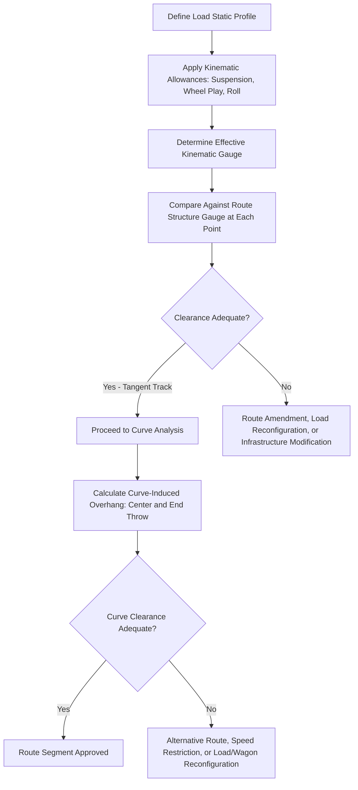

## Rail Route Clearance and Curve Radius Constraints

### Purpose and Scope

Rail route clearance and curve radius constraints govern whether an oversized rail-transported load (or a rail-mounted crane/vehicle) can physically traverse a given rail route without infringing on the loading gauge, fixed infrastructure, or exceeding the mechanical curving capability of the wagon/load combination. This is the rail-mode equivalent of road swept path and overhead clearance analysis, but governed by fundamentally different geometric principles due to the fixed, guided nature of rail travel.

**Key Points**

- Unlike road transport, rail vehicles cannot steer around an obstruction — the entire route's clearance envelope (kinematic gauge) must accommodate the load at every point, since the path is fixed by the track itself.
- Curve radius constraints interact directly with load length and overhang, since rigid or semi-rigid long loads sweep outward on curves in a way analogous to road vehicle off-tracking, but governed by different, rail-specific geometric rules.

### Core Concepts

**Loading Gauge**

The maximum cross-sectional profile (height and width envelope) that a rail vehicle or load may occupy to safely clear all trackside infrastructure — tunnels, bridges, platforms, signals, overhead line equipment (OLE) structures — along a given route. Loading gauges vary significantly by country and even by specific rail network/route classification.

**Kinematic Gauge**

An extension of the static loading gauge concept that accounts for the dynamic lateral and vertical movement of a rail vehicle in motion — suspension movement, wheel/rail play, curve-induced body overhang (see below), and vehicle roll — added as a clearance allowance around the basic static vehicle/load profile.

**Structure Gauge**

The corresponding minimum clearance envelope that trackside infrastructure must respect, effectively the "negative space" the loading/kinematic gauge must fit within. Structure gauge and loading gauge together define the pass/fail clearance relationship at any given point on the route.

### Curve-Induced Geometric Effects

**Center Throw (Mid-Point Overhang)**

On a curve, the middle portion of a long rigid vehicle or load swings outward (away from the curve center) relative to the chord line between its truck/bogie pivot points, since the vehicle body is straight while the track curves beneath it.

**End Throw (End Overhang)**

Conversely, the ends of the vehicle/load swing inward (toward the curve center) beyond the bogie pivot points, particularly pronounced for vehicles/loads with significant overhang beyond their bogies.

A simplified approximation for center throw on a curve is commonly expressed as:

$$C_t \approx \frac{L^2}{8R}$$

Where $C_t$ is the center throw (lateral displacement), $L$ is the wheelbase or effective bogie-center distance, and $R$ is the curve radius. [Inference] This is a standard simplified geometric approximation used for preliminary estimation; precise clearance engineering for a specific rail authority's infrastructure typically requires that authority's own detailed kinematic gauge calculation methodology rather than this approximation alone, since actual practice incorporates additional factors (superelevation, dynamic allowances, specific vehicle suspension characteristics) beyond simple geometry.

**Practical Implication**

This means a load that clears comfortably on straight (tangent) track can still infringe on structure gauge specifically at curves — curve locations require dedicated clearance checoriginal beyond the tangent-track assessment, and tighter curves produce proportionally greater throw for a given vehicle/load length.

### Minimum Curve Radius Constraints

Every rail wagon and load combination has a **minimum negotiable curve radius**, governed by:

- **Bogie pivot spacing (wheelbase)**: Longer wheelbase or fixed-axle spacing generally increases the minimum curve radius the vehicle can negotiate without excessive flange wear, binding, or derailment risk.
- **Load rigidity and mounting**: A load rigidly mounted across multiple wagons (requiring articulation or specialized coupling) introduces additional curving constraints beyond the wagons' own individual capability.
- **Multi-wagon/well-wagon or Schnabel car configurations**: Specialized heavy-lift rail wagons (e.g., Schnabel cars, which cradle the load directly between two articulated wagon sections) are specifically engineered with defined minimum curve radius ratings that must be checked against every curve on the intended route.

[Unverified] Specific minimum curve radius figures are wagon/equipment-specific (varying by manufacturer and design) and route-specific (varying by track class and rail authority standards); these values should be obtained directly from the wagon/equipment provider's technical specifications and cross-checked against the rail infrastructure owner's route data rather than assumed generically.

### Superelevation (Cant) Considerations

Rail curves are typically banked (superelevated) to counteract lateral forces at normal operating speed. For heavy-lift/abnormal loads:

- **Speed restrictions on curves** may alter the effective cant deficiency or excess experienced by the load, which can affect both ride stability and the precise clearance geometry (since cant angle affects the load's rotational position relative to vertical).
- **High-CoG loads** are particularly sensitive to cant-related tilt, requiring stability verification in addition to pure clearance geometry — a load that clears geometrically at speed may behave differently, or require different clearance allowances, when transported at a restricted crawl speed with different effective cant deficiency.

### Route Survey Data Requirements for Rail Clearance Assessment

| Data Category | Specific Requirement |
| --- | --- |
| Track geometry | Curve radii and locations, gradient profile, superelevation values at each curve |
| Structure gauge data | Rail authority's defined clearance envelope at every structure (tunnels, bridges, platforms, OLE gantries) along the route |
| Overhead line equipment (OLE) height | Critical for electrified routes — analogous to road overhead line clearance but governed by rail-specific standards and typically requiring possession/isolation coordination with the infrastructure manager |
| Platform and lineside structure positions | Horizontal clearance points, particularly at stations |
| Existing gauge clearance records | Prior oversized load movements on the same route, if available, providing precedent data |
| Wagon/load technical specification | Static profile dimensions, bogie spacing, minimum curve radius rating, kinematic allowance data |

### Coordination with Rail Infrastructure Manager

Unlike road transport (where the operator typically self-certifies against surveyed data with permitting authority approval), rail movements of oversized loads generally require direct technical clearance from the rail infrastructure owner/manager, since:

- The infrastructure manager holds the authoritative structure gauge and route geometry data.
- Movement often requires a dedicated **path/possession booking**, since an oversized load may need to occupy the "wrong line" (opposing track) at pinch points, or require temporary isolation of overhead line equipment.
- Special/exceptional load movements on many rail networks require a formal gauge clearance certificate or equivalent approval issued by the infrastructure manager's engineering department before movement is authorized.

[Inference] The specific formal process (naming, documentation requirements, lead times) for this clearance certification varies substantially between rail networks and countries — for example, differing significantly between a mainline national rail infrastructure manager and a private industrial siding — and should be confirmed directly with the specific rail infrastructure manager for the route in question.

### Common Mitigation Strategies for Rail Clearance/Curve Constraints

| Constraint | Mitigation Options |
| --- | --- |
| Structure gauge infringement at a fixed point | Alternative route; temporary structure modification (rare, high-cost); load reconfiguration to reduce profile |
| Curve radius below minimum wagon rating | Alternative route avoiding the tight curve; use of a different, more curve-capable wagon type; sectional/disassembled load transport |
| Curve-induced center/end throw clearance failure | Speed restriction through the curve; temporary lineside clearance improvement; alternative route |
| OLE height/clearance conflict | Temporary OLE isolation and support (coordinated with infrastructure manager, analogous to road overhead line mitigation); routing via a non-electrified line where available |

### Common Pitfalls

- **Assessing clearance only on tangent (straight) track**, missing curve-specific center/end throw infringements that only manifest at curve locations.
- **Using a generic or approximate curve throw calculation** for final engineering sign-off rather than the specific rail infrastructure manager's detailed kinematic gauge methodology.
- **Overlooking minimum curve radius as a hard mechanical constraint** distinct from clearance — a wagon/load combination may have adequate clearance geometry but still be mechanically incapable of negotiating a curve below its rated minimum radius.
- **Failing to engage the rail infrastructure manager early**, given that formal gauge clearance certification and path/possession booking can carry long lead times comparable to or exceeding road utility coordination.
- **Not accounting for superelevation effects on high-CoG load stability**, treating the assessment as a pure clearance geometry problem without considering dynamic/stability implications at curves.

### Conclusion

Rail route clearance and curve radius constraints require reconciling three interacting factors — static loading gauge, dynamic kinematic allowances, and curve-induced geometric throw — against the rail infrastructure manager's authoritative structure gauge data, while separately verifying the wagon/load combination's mechanical minimum curve radius capability. Because rail movement lacks the road vehicle's ability to steer around a localized obstruction, curve locations demand dedicated clearance analysis beyond tangent-track checks, and formal coordination with the infrastructure manager is typically a mandatory, often long-lead-time component of route approval.

**Related Topics**

- Road Route Survey Methodology
- Bridge, Underpass, and Overhead Clearance Assessment
- Schnabel Car and Specialized Heavy-Lift Rail Wagon Configurations
- Utility Line and Overhead Obstruction Management
- Multi-Modal Transport Planning (Rail-to-Road Transshipment)
- Abnormal Load Permitting and Regulatory Coordination