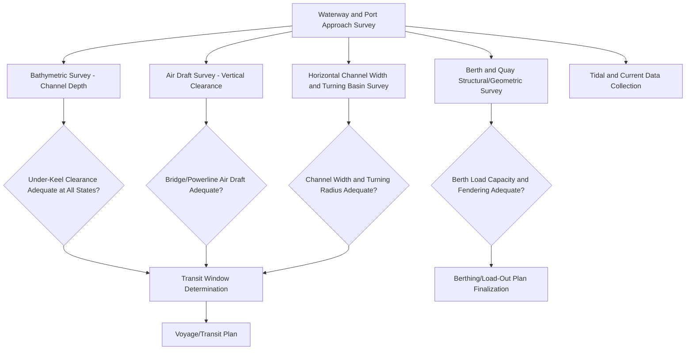
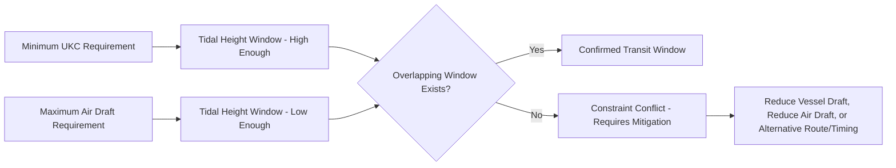

## Waterway and Port Approach Surveys

### Purpose and Scope

Waterway and port approach surveys establish whether a marine or inland waterway route — and the ports/terminals at either end — can safely accommodate the vessel or barge carrying a heavy-lift cargo, covering bathymetric (depth), horizontal channel, air draft (vertical), and berth/quay infrastructure adequacy. This discipline extends route engineering principles into the marine domain, where the "vehicle" is a vessel/barge and the "route" is a navigable channel subject to tidal, current, and seasonal variation.

**Key Points**

- Marine route constraints are inherently dynamic — tide, river stage, siltation, and seasonal water level changes mean a channel's usable depth is a variable, not a fixed number, unlike most road/rail constraints.
- Both the transit route and the origin/destination port infrastructure (berth, quay, approach channel) require independent verification, since either can independently constrain the operation regardless of the other's adequacy.

### Core Survey Components

### Bathymetric Survey (Depth Assessment)

**Purpose**: Confirm sufficient water depth exists along the entire transit route and at berth to maintain adequate **Under-Keel Clearance (UKC)** for the specific vessel/barge's draft under worst-case (lowest anticipated) water level conditions.

**Survey Methods**

- **Multibeam echosounder (MBES) survey**: The standard modern method for comprehensive channel bathymetry, producing full-coverage depth data across the survey swath rather than single-line soundings.
- **Single-beam echosounder**: Simpler, lower-cost method still used for less critical or preliminary surveys, providing depth along discrete survey lines rather than full coverage.
- **Side-scan sonar**: Used to identify seabed obstructions (wrecks, debris, rock outcrops) rather than precise depth, often run concurrently with bathymetric survey.
- **Existing hydrographic charts and port authority survey data**: Used as a baseline/desktop input, though typically requiring verification via fresh survey for critical or infrequently-dredged channels, since chart data can be significantly outdated relative to current seabed conditions.

**Under-Keel Clearance (UKC) Calculation**

UKC is the vertical gap between the vessel/barge's deepest point (keel or bottom of load, for a submersible/semi-submersible heavy-lift vessel) and the seabed, calculated as:

$$UKC = \text{Chart Datum Depth} + \text{Tidal Height} - \text{Vessel Draft} - \text{Squat} - \text{Safety Margin}$$

Where **squat** is the vessel's dynamic increase in effective draft due to forward motion (particularly significant in shallow/restricted channels), and the **safety margin** accounts for survey accuracy, wave-induced motion, and operational contingency.

[Inference] Minimum acceptable UKC is typically expressed as a percentage of vessel draft (commonly cited informally in the range of 10–20% for restricted/shallow channels) or as an absolute minimum value, but the specific required margin is generally set by the port authority, harbor master, or pilotage organization for the specific waterway rather than a single universal figure, and should be confirmed with that authority for each project.

### Tidal and Water Level Data

Since water depth varies continuously, the survey must incorporate:

- **Tidal prediction data**: Predicted tidal heights for the planned transit window, referenced to the same chart datum used in the bathymetric survey.
- **Tidal window calculation**: The specific time period(s) during which tidal height provides adequate UKC for the planned draft — often a narrow window requiring precise transit timing.
- **River stage data (for inland waterways)**: Seasonal and rainfall-driven water level variation, which can be less predictable than astronomical tides and may require real-time monitoring closer to the transit date.
- **Storm surge and meteorological effects**: Wind-driven water level changes (surge or setdown) that can significantly alter actual water level from pure tidal prediction, particularly relevant in exposed or storm-prone regions.

### Air Draft Survey (Vertical Clearance)

Analogous to overhead clearance assessment in road/rail routes, air draft survey confirms the vessel (including any deck cargo, crane boom, or superstructure) can clear all overhead obstructions:

- **Fixed bridges**: Height above the water surface at the relevant tidal state, requiring the same worst-case (highest water level) consideration as bathymetric survey requires worst-case lowest water level — the two constraints often push toward opposite ends of the tidal cycle, requiring the transit window to satisfy both simultaneously.
- **Overhead power lines crossing the waterway**: Similar to road overhead line management, requiring voltage class identification and potential utility coordination if clearance is marginal.
- **Overhead cables/aerial crossings** (cableways, aerial tramways) in some industrial or riverine settings.

### Horizontal Channel and Turning Basin Assessment

- **Channel width**: Verified against the vessel/barge (and tug, if towed) beam, accounting for the vessel's maneuvering envelope in currents and wind, analogous conceptually to road swept path but governed by hydrodynamic rather than mechanical steering constraints.
- **Turning basin adequacy**: Where the vessel must turn to berth or reverse course, the available turning basin diameter must accommodate the vessel's turning circle under the specific current/wind conditions expected.
- **Bend and channel alignment**: Sharp bends in narrow channels may require specific transit procedures (tug assistance, reduced speed, specific timing relative to current direction) rather than a simple pass/fail width check.

### Berth and Quay Assessment

**Structural Capacity**

- **Bollard and fendering system rating**: Verification that mooring bollards and fender systems can accommodate the specific vessel's mooring loads, particularly relevant for larger heavy-lift vessels than the berth may typically service.
- **Quay/wharf structural load capacity**: For load-out or load-in operations involving SPMT or crane operation directly on the quay, the quay deck's load-bearing capacity must be verified against the point loads or distributed loads imposed — analogous to ground bearing pressure assessment on land, but for a marine structure.
- **Berth pocket depth**: Localized bathymetric survey specifically at the berth location, since berth pockets can silt independently of the main channel and may require dedicated dredging verification.

**Geometric Adequacy**

- **Berth length**: Sufficient quay length for the vessel plus mooring line access.
- **Ramp/linkspan compatibility**: For Ro-Ro (roll-on/roll-off) heavy-lift operations using SPMTs to drive cargo on/off a vessel via a ramp, the ramp gradient, width, and load rating must be verified against the SPMT/load configuration — this assessment overlaps directly with the swept path and ground bearing principles covered in road-based route engineering.

### Data Sources and Coordination Bodies

| Data/Approval Type | Typical Source |
| --- | --- |
| Hydrographic charts | National hydrographic office, port authority |
| Tidal predictions | National tidal prediction service, port authority |
| Fresh bathymetric survey | Specialist hydrographic survey contractor |
| Berth/quay structural data | Port/terminal operator engineering department |
| Navigational approval/pilotage | Harbor master, port authority, marine pilots |
| Weather/met-ocean forecasting | National meteorological service, specialist marine forecasting provider |

### Voyage and Transit Window Planning

Combining bathymetric, air draft, and channel constraints typically produces a **transit window** — a specific combination of date, time, and tidal state during which all constraints are simultaneously satisfied:

Where UKC and air draft constraints conflict (i.e., the channel is only deep enough at high tide, but a bridge only provides adequate clearance at low tide), mitigation options include reducing vessel draft (partial deballasting, cargo reconfiguration), reducing air draft (lowering crane boom, removing temporary superstructure), or selecting an alternative route/berth avoiding the conflicting structure.

### Common Pitfalls

- **Relying on outdated hydrographic chart data** without fresh survey verification, particularly in channels subject to active siltation or recent dredging changes.
- **Calculating UKC without accounting for vessel squat**, especially significant in shallow or narrow channels at higher transit speeds.
- **Assessing air draft and UKC independently without checking for a genuine overlapping transit window**, discovering the conflict only during execution planning rather than early survey stages.
- **Overlooking berth pocket-specific siltation**, assuming the main channel survey applies equally at the berth location.
- **Underestimating quay structural capacity requirements** for heavy SPMT or crane point loads during load-out, treating the quay as adequate based on general port infrastructure assumptions rather than a specific load capacity verification.
- **Failing to incorporate storm surge/meteorological effects**, relying purely on astronomical tidal prediction in exposed or storm-prone locations.

### Conclusion

Waterway and port approach surveys must reconcile dynamic, time-varying constraints — tidal height, current, and seasonal water level — against fixed vessel and infrastructure parameters across four interlocking domains: bathymetric depth, air draft, horizontal channel geometry, and berth/quay capacity. Because UKC and air draft requirements often push toward opposite ends of the tidal cycle, transit planning frequently reduces to identifying a narrow overlapping window rather than a simple universal pass/fail conclusion, making close coordination with hydrographic, tidal, and port authority data sources essential.

**Related Topics**

- Road Route Survey Methodology
- Ground Bearing Pressure Calculation and Mat/Plate Sizing
- Marine Load-Out and Ro-Ro Transport Operations
- Multi-Modal Transport Planning (Rail-to-Road Transshipment)
- Sea-Fastening Design for Marine Heavy-Lift Cargo
- Met-Ocean Forecasting for Marine Heavy-Lift Operations