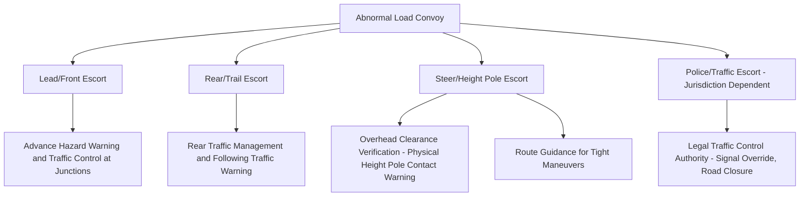
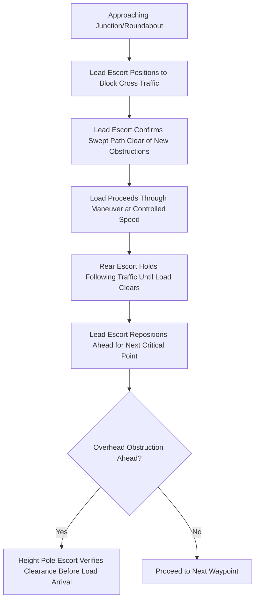

## Pilot Car and Escort Route Coordination

### Purpose and Scope

Pilot car and escort route coordination establishes the operational framework for deploying escort vehicles ahead of, alongside, and behind an abnormal load during transport, ensuring the route survey and permitting findings are actively enforced and monitored in real time. Escorts function as the live execution layer that bridges the desktop/field engineering assessment (route survey, swept path, clearance analysis) and the actual moving operation.

**Key Points**

- Escort requirements are typically mandated by permit conditions based on load dimensions/weight thresholds, not left to operator discretion — regulatory authorities in most jurisdictions specify minimum escort configurations tied to specific size/weight bands.
- Escorts serve multiple simultaneous functions: traffic management, hazard spotting, height/width verification, and communication relay — not simply a warning presence.

### Escort Vehicle Types and Roles

**Lead (Front) Escort**

- Travels ahead of the load, providing advance warning to oncoming and cross traffic at junctions, and physically confirming the route ahead is clear of unexpected obstructions (parked vehicles, temporary road works) not captured in the original survey.
- Often equipped with a height pole set to the load's maximum height, physically testing clearance at marginal overhead points ahead of the load's arrival — this is a critical redundant verification layer beyond the desktop survey conclusion.
- Coordinates directly with the load driver/convoy commander regarding upcoming hazards, junction approach strategy, and any need to stop or slow.

**Rear (Trail) Escort**

- Travels behind the load, managing following traffic — preventing unsafe overtaking attempts, maintaining a buffer zone, and providing visibility/warning to approaching traffic from behind, particularly on narrow roads where the load occupies most or all of the carriageway.
- May also carry rear-facing warning signage/lighting distinct from the load's own marking.

**Steer/Height Pole Escort**

- In some configurations, a dedicated escort (sometimes combined with the lead escort role) specifically manages height verification via a calibrated pole extending to the load's maximum height, or provides close-range visual guidance to the driver during tight maneuvers (junction turns, narrow bridge crossings) where the driver's own sightlines are inadequate.

**Police/Traffic Authority Escort**

- Required in many jurisdictions for the largest/most complex movements, or where legal traffic control authority is needed — stopping cross traffic, overriding signals, or closing roads/junctions temporarily.
- [Inference] The specific threshold at which police escort becomes mandatory (versus private/civilian pilot cars being sufficient) varies substantially by jurisdiction and is typically defined in the specific permit conditions issued by the relevant road/traffic authority, rather than a single universal rule.

### Escort Requirement Determination

Escort configuration requirements are typically driven by a combination of:

| Factor | Typical Influence on Escort Requirement |
| --- | --- |
| Load width | Wider loads generally require more escorts and may mandate wide-load signage/escort at lower thresholds than height/length alone would trigger |
| Load height | Height-triggered escort often specifically requires a height pole escort due to overhead clearance risk |
| Load length | Longer loads may require additional rear escort emphasis due to extended off-tracking and following-traffic risk |
| Route classification | Urban/congested routes may require escort configurations beyond the minimum regulatory threshold due to junction density and traffic volume |
| Time of travel | Night movements or peak-hour restrictions may alter required escort configuration or lighting/signage requirements |
| Number of load units in convoy | Multi-unit convoys (e.g., separate crane and load transport) may each require independent escort coverage or a coordinated shared configuration |

[Unverified] Specific numeric thresholds (e.g., exact width/height/length figures triggering each escort tier) are set by individual national, state/provincial, or regional transport authorities and vary significantly between jurisdictions — these figures should be confirmed against the specific permit conditions for the project's location rather than assumed from general industry practice.

### Communication Protocols

Reliable, continuous communication between all escort vehicles and the load driver/convoy commander is fundamental to safe execution:

- **Two-way radio (typically UHF/VHF)**: The standard primary communication method, allowing all convoy members to hear route updates, hazard warnings, and stop/go instructions simultaneously.
- **Standardized radio terminology**: Many operators use structured call protocols for critical information (e.g., height pole contact warnings, "clear" confirmations at junctions) to reduce ambiguity under time pressure.
- **Backup communication**: Mobile phone or secondary radio channel as a fallback if primary radio communication fails, particularly important in areas with poor radio coverage.
- **Pre-move briefing**: All escort personnel briefed on the specific route, known critical points from the route survey, escort positions/roles, and communication protocol before departure — ensuring the field survey's findings are actually transmitted to the people executing the move, not just documented in a report.

### Coordination with Traffic Management and Utility Mitigation

Escort operations must be synchronized with other route engineering mitigations planned for the same movement:

- **Utility de-energization/lifting timing**: Escort schedule and convoy speed must align with the utility mitigation window established during utility coordination (see Utility Line and Overhead Obstruction Management), since arriving early or late at a crossing point relative to the arranged mitigation creates a serious safety risk.
- **Traffic signal coordination**: In jurisdictions where signals can be temporarily overridden or where police escort provides manual traffic control, escort vehicles coordinate directly with traffic authorities managing signal timing at key junctions.
- **Multi-agency coordination**: For complex urban movements, escorts may need to coordinate with local police, temporary traffic management contractors, and the road authority's own traffic control center simultaneously.

### Escort Positioning During Specific Maneuvers

**Junction and Roundabout Approach**

- Lead escort positions ahead of the junction to hold cross traffic before the load's arrival, timed to the load's approach speed and the specific swept path maneuver planned.
- Where the load must use the opposing lane or full roundabout width, escort coordination (potentially with police) ensures opposing/conflicting traffic is fully stopped before the load commits to the maneuver.

**Overhead Obstruction Approach**

- Height pole escort travels sufficiently ahead of the load to provide adequate warning time if unexpected contact occurs — allowing the convoy to stop before the load itself reaches the obstruction, not merely at the same time.
- Any contact or near-contact triggers an immediate stop-and-reassess protocol rather than proceeding on the assumption the original survey clearance still holds.

**Narrow Section/Single-Lane Working**

- Escorts may need to hold traffic in both directions to allow the load to occupy the full carriageway width through a constrained section, requiring careful timing coordination especially where visibility between the two traffic-holding points is limited.

### Documentation and Post-Move Review

- **Escort briefing pack**: Route survey findings, critical point list, communication protocol, and role assignments distributed to all escort personnel before the move.
- **Incident/near-miss log**: Any contact, near-contact, or unexpected obstruction encountered during the move recorded for post-move review and to inform future survey/escort planning on the same or similar routes.
- **Post-move debrief**: Review of escort performance, any deviations from planned execution, and lessons learned — particularly valuable for repeat movements on the same route or corridor.

### Common Pitfalls

- **Treating escort deployment as a checkbox compliance exercise** rather than an active safety verification layer that can catch survey-stage errors or newly emerged obstructions.
- **Inadequate pre-move briefing**, leaving escort personnel unaware of specific critical points identified during the route survey, reducing their ability to anticipate and manage known risks.
- **Poor communication protocol discipline**, leading to delayed or ambiguous hazard warnings during time-critical maneuvers.
- **Misalignment between escort schedule and utility/traffic mitigation timing**, arriving at a crossing point before or after the arranged de-energization or signal control window.
- **Insufficient escort vehicle positioning distance** ahead of the load at height-critical points, providing inadequate warning time to stop before contact.
- **Assuming private pilot car escorts satisfy legal traffic control functions** (e.g., stopping cross traffic at a junction) that in many jurisdictions legally require police or authorized traffic control personnel.

### Conclusion

Pilot car and escort route coordination functions as the real-time execution and verification layer for a heavy transport move, actively re-confirming route survey findings, managing traffic interactions, and providing critical redundant hazard detection (particularly overhead clearance via height pole escort) that static desktop or even recent field survey data cannot guarantee remains valid on the actual move day. Effective coordination depends on clear role definition, disciplined communication protocol, thorough pre-move briefing, and precise timing alignment with other mitigations such as utility de-energization and traffic signal control.

**Related Topics**

- Road Route Survey Methodology
- Utility Line and Overhead Obstruction Management
- Traffic Management Planning for Abnormal Load Movements
- Abnormal Load Permitting and Regulatory Coordination
- Turning Radius and Swept Path Analysis
- Convoy Communication Protocols for Heavy Transport Operations