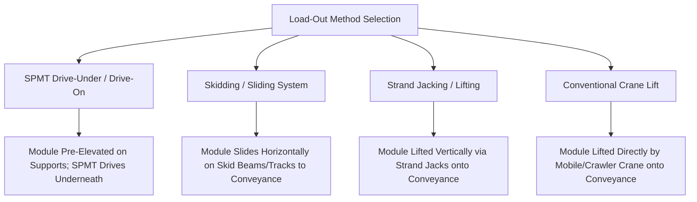
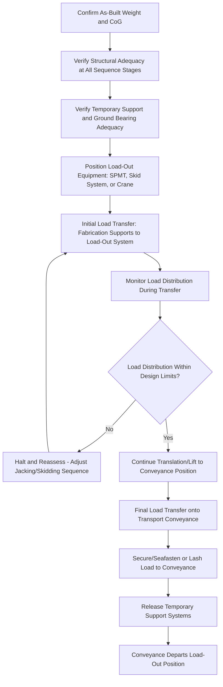

## Load-Out Sequencing from Fabrication Yards

### Purpose and Scope

Load-out sequencing from fabrication yards defines the planned, step-by-step process for transferring a completed heavy module or structure from its fabrication position onto the transport conveyance (SPMT, barge, trailer, or rail wagon), ensuring structural integrity, weight distribution control, and operational safety are maintained throughout every stage of the transition. Unlike a single discrete lift, load-out is typically an extended, multi-hour or multi-day operation involving a continuous change of support conditions.

**Key Points**

- Load-out sequencing must account for changing structural support conditions throughout the operation — a module's internal stress distribution at the midpoint of a skidding or jacking operation can differ significantly from either its fully-supported starting or ending condition.
- The sequence must be engineered as an integrated whole with the fabrication yard layout, transport route to the load-out point, and the receiving conveyance — not planned as isolated steps.

### Load-Out Method Categories

**SPMT Drive-Under/Drive-On**

- The module is fabricated or pre-positioned on temporary support stools/grillage at a height allowing SPMT trailers to drive underneath.
- SPMTs raise their hydraulic suspension to lift the module off the temporary supports, then transport it away — widely used for modules where site conditions allow SPMT access beneath the structure.
- Requires precise coordination of SPMT positioning relative to the module's designed lift/support points, verified against the module's structural design for point loading at those specific locations.

**Skidding/Sliding Systems**

- The module is fabricated on or moved onto a skid track system (steel skid beams with low-friction sliding shoes, or hydraulic skid shoes), then horizontally translated using strand jacks, hydraulic push/pull systems, or winches to the load-out position or directly onto a waiting barge/trailer.
- Common for very large modules where crane lift capacity is impractical, or where the fabrication yard is adjacent to a quayside allowing direct skidding onto a barge.
- Requires continuous friction and load monitoring throughout the skid, since skid shoe loading can vary as the module's center of gravity moves relative to the support points during translation.

**Strand Jacking**

- Hydraulic strand jacks (using high-tensile steel strand bundles) lift the module vertically, allowing precise, synchronized multi-point lifting for very heavy or awkwardly shaped structures where conventional crane lift is impractical.
- Often used in combination with skidding (lift, then horizontal translation, then lower) for complex load-out sequences.

**Conventional Crane Lift**

- Direct lift by mobile or crawler crane onto the transport conveyance, following standard heavy-lift rigging principles (see Factor of Safety Standards and related lift engineering topics).
- Simpler where module weight and yard access permit, but limited by crane capacity and often less suitable for the largest fabrication yard modules.

### Core Sequencing Considerations

**Weight and CoG Verification Before Sequencing**

- Accurate module weight and center of gravity (CoG) data — verified via weighing (see related weighing topics) rather than purely theoretical calculation — is a prerequisite for reliable sequencing, since load distribution across jacks, skid shoes, or SPMT lines depends directly on this data.
- Discrepancies between theoretical and as-built weight/CoG are common in fabrication (material substitutions, as-built deviations, outfitting additions) and must be reconciled before finalizing the sequence.

**Support Point and Load Path Transition Management**

- At every stage of the sequence, the module's support reactions redistribute as it transitions from temporary fabrication supports to the load-out system to the final transport conveyance.
- Structural engineering analysis must verify the module can withstand the stress state at each *intermediate* configuration, not just the start and end conditions — a critical distinction, since intermediate support configurations (e.g., a module partially transferred between skid tracks) can produce different, sometimes governing, structural load cases.

**Ground Bearing and Temporary Works Verification**

- Temporary support structures (grillage, stools, skid tracks) and the ground/hardstanding beneath them must be verified for the point/distributed loads imposed at each sequence stage, following the same ground bearing pressure principles applied to crane outriggers (see related CAD/GBP topics), but here applied to fixed temporary support locations over an extended operational duration.

### Typical Sequencing Workflow

### Multi-Point Load Monitoring During Sequencing

For strand jacking and skidding operations involving multiple synchronized support points, real-time load monitoring is standard practice:

- **Load cells at each jack/skid shoe**: Continuously measure actual load at each support point throughout the operation.
- **Synchronization control systems**: Hydraulic power units (HPUs) controlling multiple strand jacks or skid shoes are typically synchronized via a central control system, adjusting individual jack/shoe movement to maintain the module within acceptable level/attitude tolerances and load distribution limits throughout the sequence.
- **Pre-defined load limit thresholds**: Operations are typically halted automatically or manually if any individual support point's load exceeds a pre-defined threshold, indicating unexpected load redistribution (potentially due to an unanticipated stiffness variation in the module or an obstruction in the skid path).

[Inference] The specific tolerance bands for load distribution deviation and synchronization (e.g., maximum allowable differential movement between jack points) are project- and equipment-specific, generally defined by the structural engineer's analysis and the jacking/skidding system manufacturer's operational limits, rather than a single industry-wide figure.

### Coordination with Fabrication Yard Layout and Access Route

- **Internal yard route survey**: The path from the module's fabrication position to the final load-out point (quayside, SPMT marshalling area, rail siding) must itself be verified for ground bearing, clearance, and turning capability — essentially an internal-scale application of the same route survey principles used for public road transport (see Road Route Survey Methodology).
- **Sequencing with other yard activities**: Load-out of a large module often requires temporary suspension or careful coordination of other fabrication yard activities (crane operations, vehicle movements) in the vicinity of the load-out path.
- **Staging and marshalling area requirements**: Sufficient space must be available for SPMT marshalling, skid track assembly, or crane positioning without conflicting with ongoing fabrication work elsewhere in the yard.

### Interface with Receiving Conveyance

**Barge/Vessel Load-Out**

- Requires coordination of quayside bathymetry, tidal window, and vessel/barge ballasting to maintain a stable, appropriately trimmed platform as the module transfers weight onto the vessel — ballast adjustments are often made progressively throughout the load-out to compensate for the shifting weight as the module moves aboard.
- See also Waterway and Port Approach Surveys for the broader marine access context.

**SPMT/Trailer Load-Out**

- Requires the SPMT configuration (number of axle lines, platform arrangement) to be finalized based on verified module weight/CoG before load-out begins, since reconfiguring SPMT arrangement after the module is loaded is operationally difficult.
- Ground bearing verification along the SPMT's path from load-out position to the yard exit/public road interface is required, following the same principles as the temporary support ground bearing check.

**Rail Load-Out**

- Requires precise alignment between the load-out skid/jacking system and the rail wagon's load-bearing points, particularly critical for specialized wagons (e.g., Schnabel cars) with specific, non-negotiable load attachment geometry.

### Sequencing Documentation

A complete load-out sequencing package typically includes:

- **Step-by-step sequence narrative and drawings**: Each stage of the operation illustrated with the module's position, support configuration, and key personnel/equipment positions.
- **Structural analysis report**: Covering all intermediate load cases throughout the sequence, not just start/end conditions.
- **Load monitoring plan**: Instrumentation locations, monitored parameters, and pre-defined action thresholds/hold points.
- **Temporary works design**: Grillage, skid track, and any other temporary support structure design verification.
- **Contingency/hold-point procedures**: Defined stop criteria and response procedures if monitored parameters exceed acceptable limits at any sequence stage.

### Common Pitfalls

- **Basing sequencing entirely on theoretical weight/CoG** without incorporating as-built weighing verification, risking unexpected load distribution during execution.
- **Analyzing only the initial and final structural configurations**, missing a governing intermediate load case during the transition sequence.
- **Underestimating internal yard route/access constraints**, treating the load-out path as a formality rather than requiring the same rigor as public road route survey.
- **Inadequate real-time load monitoring** on multi-point jacking/skidding operations, missing early warning signs of unexpected load redistribution before they become critical.
- **Poor coordination with vessel ballasting** during barge load-out, resulting in excessive trim or list as weight transfers onto the vessel.
- **Failing to coordinate load-out timing with other yard activities**, creating congestion or safety conflicts in the marshalling/access areas.

### Conclusion

Load-out sequencing from fabrication yards requires treating the entire transfer operation as a continuous structural and logistical process — verifying structural adequacy at every intermediate configuration, not just start and end states, while coordinating temporary works, ground bearing, real-time load monitoring, and receiving conveyance interface requirements as an integrated system. As-built weight and CoG verification, rather than theoretical design data, should underpin the final sequencing plan given the frequency of fabrication-stage deviations from design assumptions.

**Related Topics**

- Weighing and Center of Gravity Determination Methods
- Ground Bearing Pressure Calculation and Mat/Plate Sizing
- Strand Jacking Systems and Synchronized Lift Control
- Waterway and Port Approach Surveys
- Sea-Fastening Design for Marine Heavy-Lift Cargo
- SPMT Configuration Planning and Axle Load Distribution