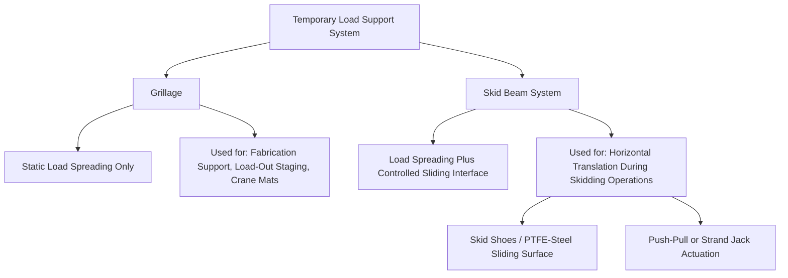
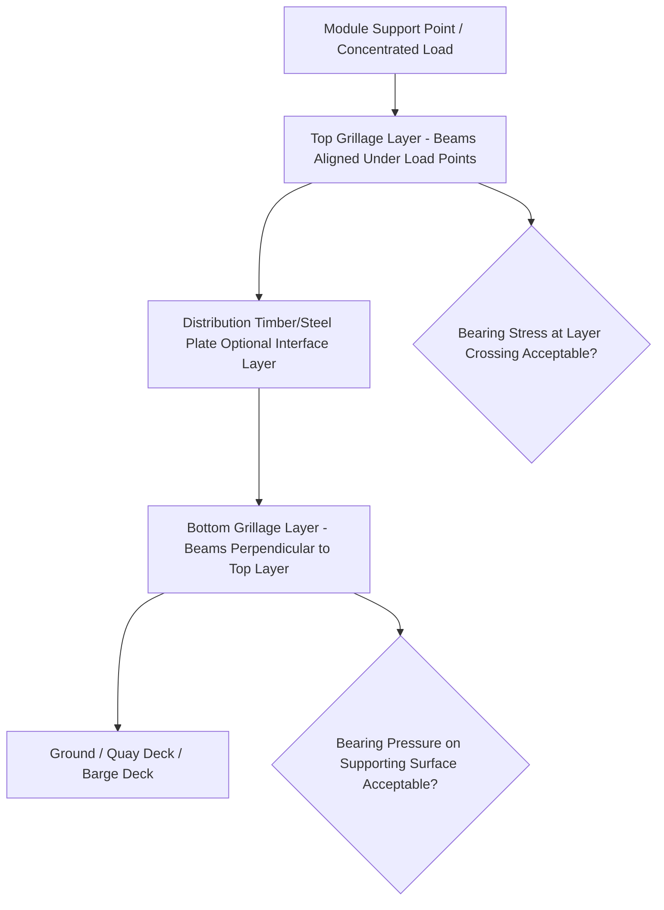

## Skid Beam and Grillage Design

### Purpose and Scope

Skid beam and grillage design covers the engineering of temporary steel support and load-spreading structures used during load-out, load-in, jacking, and skidding operations. These systems distribute concentrated module loads across a wider footprint, provide the sliding interface for horizontal translation, and bridge between the module's structural support points and the underlying ground, quay, or barge deck.

**Key Points**

- Grillage and skid beams serve two related but distinct functions: load spreading (reducing point load to an acceptable bearing pressure) and, for skid systems specifically, providing a controlled low-friction sliding path.
- Design must account for both the temporary works structure itself (bending, shear, buckling) and its interaction with the supporting surface (ground bearing, quay deck capacity, barge deck strength).

### Grillage vs. Skid Beam — Functional Distinction

**Grillage**

- A stacked or layered arrangement of steel beams (commonly H-beams, box girders, or built-up sections) distributing a concentrated load from above (module support point, crane outrigger, or crawler track) across a wider area onto the ground or deck below.
- Typically static — used where the load remains stationary on the grillage (fabrication support stools, crane matting, or a fixed load-out staging position) rather than requiring horizontal movement.
- Often arranged in orthogonal layers (e.g., a top layer running one direction, a lower layer running perpendicular) to spread load progressively over an increasing footprint with depth.

**Skid Beam System**

- Functionally similar to grillage in providing load spreading, but incorporates a low-friction sliding interface (typically PTFE-faced skid shoes sliding on stainless steel or specially prepared skid beam surfaces) allowing controlled horizontal translation of the module along the beam's length.
- Used specifically for skidding operations (see Load-Out Sequencing from Fabrication Yards), where the module must be moved horizontally from one position to another — such as from fabrication position to a barge, or across a load-out quay.

### Core Design Loads and Considerations

**Vertical Load Distribution**

The primary design function is converting a concentrated module support reaction into an acceptable bearing pressure on the underlying surface:

$$q = \frac{P}{A}$$

Where $q$ is bearing pressure, $P$ is the point load at the support location, and $A$ is the effective contact/distribution area achieved by the grillage or skid beam footprint — the same fundamental principle as ground bearing pressure calculation for crane outriggers, but applied to a fixed or translating support system rather than a crane.

**Bending and Shear in Beam Elements**

Each layer of the grillage or skid beam system must be checked as a structural beam under the applied point/line loads from the layer above, verifying adequate section capacity against bending moment and shear force at the governing span (typically between support points in the layer below).

**Bearing Stress at Beam Crossings**

Where grillage layers cross (in a typical orthogonal stacked arrangement), local bearing stress at the crossing point must be checked against the steel section's web crippling/bearing capacity, since this is often a more critical local failure mode than overall beam bending.

**Buckling and Stability**

- Individual grillage/skid beams must be checked for lateral-torsional buckling, particularly where unrestrained lengths are significant relative to section depth.
- Overall stability of the stacked grillage arrangement against lateral loads (wind, skidding-induced friction forces, seismic where relevant) must be verified, especially for taller multi-layer grillage stacks.

**Friction and Horizontal Load (Skid Systems Specifically)**

- Skid systems must account for the friction force generated at the sliding interface, which becomes a horizontal load the jacking/pulling system must overcome and which the skid beam/track must resist without lateral displacement.
- Friction coefficient depends on the specific skid shoe material (commonly PTFE) against the mating surface (commonly stainless steel plate), with values significantly lower than steel-on-steel friction specifically to reduce the actuation force required — [Inference] specific friction coefficient values are equipment/system-specific and should be obtained from the skid system manufacturer or supplier's technical data rather than assumed generically, since surface condition, lubrication, and contact pressure all affect actual achieved friction.

### Typical Grillage Configuration

**Typical Construction**

- **Top layer**: Beams positioned directly under the module's discrete support/lift points, sized to resist the concentrated reaction with acceptable bending and local bearing stress.
- **Distribution interface**: Sometimes a timber packing layer, steel plate, or elastomeric pad between grillage layers to accommodate minor surface irregularities and improve load distribution uniformity.
- **Bottom layer**: Beams oriented perpendicular to the top layer, spreading the load further and providing the final bearing footprint onto the ground, quay, or barge deck.
- **Additional layers**: For very heavy loads or poor ground conditions, additional grillage layers may be added to achieve the required footprint area and acceptable bearing pressure.

### Material and Section Selection

| Consideration | Typical Approach |
| --- | --- |
| Beam section type | Universal beams (I/H-sections), box girders, or built-up plate girders depending on load magnitude and available equipment |
| Steel grade | Standard structural steel grades, selected per project structural design code requirements |
| Section reuse | Grillage beams are typically reusable temporary works equipment, requiring inspection for damage/deformation between uses rather than being project-specific one-off fabrication |
| Skid beam surface treatment | Stainless steel cladding or specially prepared surface at the sliding interface, distinct from the structural beam material selection |
| Timber packing (where used) | Hardwood packing pieces sized and graded for the specific bearing stress application |

### Interface with Ground/Deck Capacity

Grillage and skid beam design cannot be finalized independently of the supporting surface's actual capacity:

- **Ground conditions**: Requires geotechnical data (allowable bearing capacity) analogous to crane ground bearing pressure assessment, with the grillage footprint sized to achieve an acceptable pressure for the specific soil/ground conditions present.
- **Quay/wharf deck capacity**: For marine load-out, the quay structure's own load rating (see Waterway and Port Approach Surveys) governs the maximum acceptable grillage footprint pressure, which may be a more restrictive constraint than the grillage's own structural capacity.
- **Barge deck capacity**: Similarly, barge deck structural capacity (often expressed as a maximum distributed or point load rating by the vessel's structural engineer or class society documentation) constrains grillage design for barge-based load-out or transport.

### Skid Track Alignment and Guidance

For skidding operations specifically, additional design considerations beyond load spreading apply:

- **Track alignment tolerance**: Skid beams/tracks must be installed to a precise alignment and level tolerance to ensure smooth, predictable translation without binding or unexpected lateral load generation.
- **Guidance/lateral restraint systems**: Physical guides or stops may be incorporated to prevent unintended lateral drift of the module during translation, particularly important on longer skid runs.
- **Track joint design**: Where skid tracks are assembled from multiple beam sections (common for long skid runs), joints must be designed to maintain a smooth, continuous sliding surface without steps or misalignment that could cause the skid shoe to catch or bind.

### Monitoring During Use

- **Settlement monitoring**: For grillage on ground (as opposed to a rigid quay/barge deck), settlement monitoring during load application is standard practice, verifying actual ground response matches the geotechnical design assumptions.
- **Deflection monitoring**: For long-span or heavily loaded grillage/skid beam arrangements, structural deflection monitoring may be employed to verify behavior remains within design predictions throughout the operation.
- **Level/alignment monitoring during skidding**: Continuous or periodic verification that the module remains within acceptable level and alignment tolerances as it translates along the skid track.

### Common Pitfalls

- **Sizing grillage for the design/theoretical load without incorporating as-built weight/CoG verification**, risking under-design if actual loads exceed theoretical assumptions.
- **Overlooking local bearing/crippling stress at grillage layer crossings**, focusing structural checks only on overall beam bending while missing a more critical local failure mode.
- **Inadequate ground/quay/barge deck capacity verification**, treating grillage structural design as sufficient without confirming the supporting surface itself can accept the resulting bearing pressure.
- **Poor skid track alignment tolerance control**, leading to binding, uneven friction, or unexpected lateral loads during translation.
- **Reusing grillage/skid equipment without adequate inspection**, missing accumulated damage or deformation from prior use that reduces effective capacity below its original rated design.
- **Underestimating friction-induced horizontal loads** on skid systems, undersizing the jacking/pulling system or the lateral restraint at the skid track.

### Conclusion

Skid beam and grillage design applies core load-spreading structural principles — bending, shear, local bearing, and buckling checks on stacked beam elements — while requiring careful integration with the specific supporting surface's capacity (ground, quay, or barge deck) and, for skid systems, the added complexity of friction-induced horizontal loads and precise alignment tolerance for controlled sliding. As temporary works with safety-critical structural function, these systems warrant the same rigor in design verification and in-service monitoring as the permanent structures they support.

**Related Topics**

- Load-Out Sequencing from Fabrication Yards
- Ground Bearing Pressure Calculation and Mat/Plate Sizing
- Strand Jacking Systems and Synchronized Lift Control
- Waterway and Port Approach Surveys
- Weighing and Center of Gravity Determination Methods
- Sea-Fastening Design for Marine Heavy-Lift Cargo