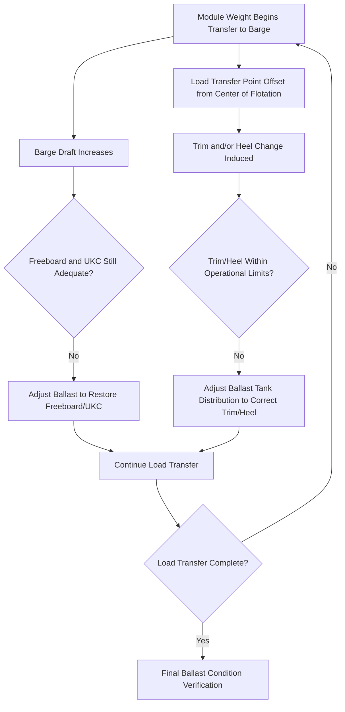

## Ballasting and De-Ballasting for Barge Load-Outs

### Purpose and Scope

Ballasting and de-ballasting for barge load-outs is the controlled management of a barge's internal ballast water (or other ballast medium) to maintain safe, stable trim and draft as a heavy module transfers its weight from quayside or skid track onto the barge deck. Because module weight transfer during load-out is progressive rather than instantaneous, ballast control must actively compensate throughout the operation, not just at the final loaded condition.

**Key Points**

- Ballasting during load-out is a dynamic, continuous process synchronized with the load transfer sequence — not a one-time adjustment made before or after the operation.
- The primary objectives are simultaneously maintaining acceptable trim (fore-aft tilt), heel/list (side-to-side tilt), freeboard, and under-keel clearance throughout the entire transfer, any of which can become critical independently of the others.

### Why Ballast Control Is Required During Load-Out

As a module's weight progressively transfers from fixed quayside/skid supports onto the barge, the barge's draft increases and its trim/heel can shift, particularly if the load transfer is not perfectly symmetric relative to the barge's center of flotation:

Without active ballast compensation, a load-out could result in excessive trim (potentially causing the module's skid path to become non-level, risking binding or uneven load distribution), excessive heel (risking instability or uneven structural loading), or inadequate freeboard/under-keel clearance as draft increases.

### Ballast System Components

**Ballast Tanks**

- Barges used for heavy-lift load-out typically have multiple ballast tanks arranged in a grid pattern (port/starboard, fore/aft) allowing independent control of trim and heel by selectively filling or emptying specific tank combinations.
- Tank capacity and arrangement are vessel-specific, documented in the barge's stability booklet/trim and stability data provided by the vessel operator or naval architect.

**Ballast Pumps and Piping System**

- Dedicated pumping system allowing controlled transfer of ballast water into or out of specific tanks, typically with sufficient pump capacity to make meaningful trim/heel corrections within the timeframe required by the load transfer sequence.
- Cross-connection piping allowing ballast to be moved between tanks (rather than solely to/from the sea) for more rapid trim/heel correction without needing to pump overboard and then re-ballast.

**Draft, Trim, and Heel Monitoring**

- Draft marks (physical markings on the hull) provide visual reference for draft at bow, stern, and midships, though often supplemented by more precise instrumentation for critical load-out operations.
- Inclinometers or electronic heel/trim sensors provide real-time readings to the ballast control operator during the operation.
- Some modern operations incorporate integrated ballast control systems with real-time monitoring and semi-automated tank selection, though [Inference] the degree of automation versus manual/procedural control varies by vessel and operator, with many heavy-lift barge load-outs still relying substantially on procedural manual ballast control coordinated closely with the load transfer sequence.

### Ballast Control Sequencing Coordination

**Synchronization with Load Transfer**

- The ballast control plan is developed jointly with the load-out sequencing plan (see Load-Out Sequencing from Fabrication Yards), identifying at each stage of the module transfer how much weight has moved onto the barge and where, allowing pre-calculation of the expected trim/heel/draft change at each stage.
- Real-time monitoring during actual execution is compared against this pre-calculated ballast plan, with corrections made as needed if actual behavior deviates from prediction (due to, for example, actual module weight/CoG differing slightly from theoretical values).

**Pre-Ballasting**

- Before load transfer begins, the barge may be pre-ballasted to a specific initial trim/heel condition (sometimes a deliberate slight trim toward the load-out point) to optimize the ballast response required as the load transfers, or to pre-compensate for the anticipated final loaded condition.

**Progressive De-Ballasting or Ballasting During Transfer**

- As weight transfers onto the barge, ballast is typically progressively removed (de-ballasted) from the receiving side/area to counteract the increasing draft and any heel toward that side — though the specific ballast/de-ballast direction depends on the barge's initial condition and the load transfer geometry.
- Corrections are typically made in a stepwise, monitored manner synchronized with discrete stages of the load transfer sequence (e.g., after each skid increment or jacking stage) rather than continuously, allowing verification at each hold point before proceeding.

### Key Parameters Monitored and Controlled

| Parameter | Definition | Why Controlled |
| --- | --- | --- |
| Draft | Vertical distance from waterline to keel | Governs under-keel clearance and freeboard adequacy |
| Trim | Fore-aft inclination (difference between bow and stern draft) | Excessive trim can affect skid track levelness and load transfer geometry |
| Heel/List | Port-starboard inclination | Excessive heel risks structural eccentricity and stability concerns |
| Freeboard | Height of deck above waterline | Must remain adequate for safety and to avoid deck immersion |
| Metacentric height (GM) | Measure of transverse stability | Must remain positive and adequate throughout the operation, particularly as the module's weight raises the vessel's overall center of gravity |

### Stability Verification Throughout the Operation

Beyond simply managing trim and heel, the barge's overall stability (particularly metacentric height, GM) must be verified as adequate at every stage of the load transfer, since adding a high-CoG module progressively raises the combined vessel-plus-cargo center of gravity:

- **Intact stability criteria**: Applicable regulatory or class society stability criteria (e.g., minimum GM, maximum permissible heel angle under specified conditions) must be satisfied throughout the load-out, not just in the final loaded condition.
- **Progressive stability calculation**: A stability engineer typically calculates the vessel's stability condition at multiple discrete stages of the load transfer sequence, identifying the most critical (governing) stage — which may not necessarily be the final fully-loaded condition, particularly if the module's CoG is significantly elevated relative to the barge deck during certain transfer stages.
- **Free surface effect**: Partially filled ballast tanks introduce a free surface effect that reduces effective GM; this is incorporated into stability calculations and is a factor in decisions about which tanks to use for fine trim/heel adjustment versus maintaining as fully pressed (full) tanks where possible.

### Coordination with Environmental Conditions

- **Tidal state**: Ballast planning must account for the tidal window during which load-out occurs (see Waterway and Port Approach Surveys), since water level changes independently affect draft/freeboard relative to the quay, separate from ballast-induced draft changes.
- **Wind and current**: Significant wind or current during load-out can affect barge position control and potentially induce additional heel or motion, requiring the ballast plan to retain adequate margin rather than being calculated to a precise theoretical optimum with no contingency.
- **Weather window selection**: Marine heavy-lift load-outs are typically scheduled within a defined weather window with acceptable wind/wave/current conditions, coordinated with the overall met-ocean forecasting for the operation.

### Ballast Plan Documentation

A complete ballast plan for a barge load-out typically includes:

- **Stage-by-stage ballast condition table**: Predicted tank contents, draft, trim, heel, and stability parameters (GM, freeboard) at each defined stage of the load transfer sequence.
- **Ballast pump/valve operating sequence**: Specific instructions for which tanks to fill/empty and in what sequence at each stage.
- **Monitoring and hold-point criteria**: Defined acceptable ranges for draft/trim/heel at each stage, with procedures for pausing the load transfer if actual readings deviate beyond acceptable limits.
- **Contingency procedures**: Response plan if unexpected ballast behavior occurs (e.g., pump failure, unexpected heel beyond predicted values), including emergency ballast capability.

### Common Pitfalls

- **Calculating the ballast plan only for the final loaded condition**, missing a potentially more critical intermediate stability or trim condition during the transfer.
- **Failing to account for free surface effect** in partially-filled ballast tanks, overestimating actual available stability margin.
- **Insufficient synchronization between ballast control and load transfer sequencing**, resulting in reactive rather than proactive ballast adjustment and increased risk of exceeding trim/heel limits before correction can be applied.
- **Underestimating pump capacity requirements relative to the load transfer rate**, resulting in an inability to make timely corrections during rapid load transfer stages.
- **Neglecting tidal state effects on draft/freeboard**, conflating ballast-induced and tide-induced draft changes and misinterpreting monitored readings.
- **Inadequate contingency margin for wind/current effects**, planning to a precise theoretical optimum without operational buffer for real-world environmental variability.

### Conclusion

Ballasting and de-ballasting for barge load-outs requires continuous, stage-synchronized management of trim, heel, draft, and overall vessel stability as module weight progressively transfers onto the barge, with the governing stability or trim condition not necessarily occurring at the final fully-loaded state. Reliable execution depends on a jointly developed ballast and load transfer sequencing plan, robust real-time monitoring, adequate pump capacity relative to the transfer rate, and appropriate contingency margin for environmental variability and as-built weight/CoG deviations from theoretical design values.

**Related Topics**

- Load-Out Sequencing from Fabrication Yards
- Waterway and Port Approach Surveys
- Sea-Fastening Design for Marine Heavy-Lift Cargo
- Weighing and Center of Gravity Determination Methods
- Met-Ocean Forecasting for Marine Heavy-Lift Operations
- Skid Beam and Grillage Design