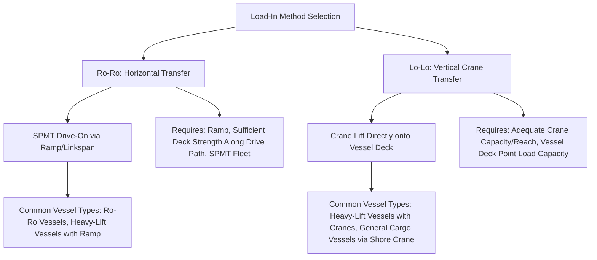
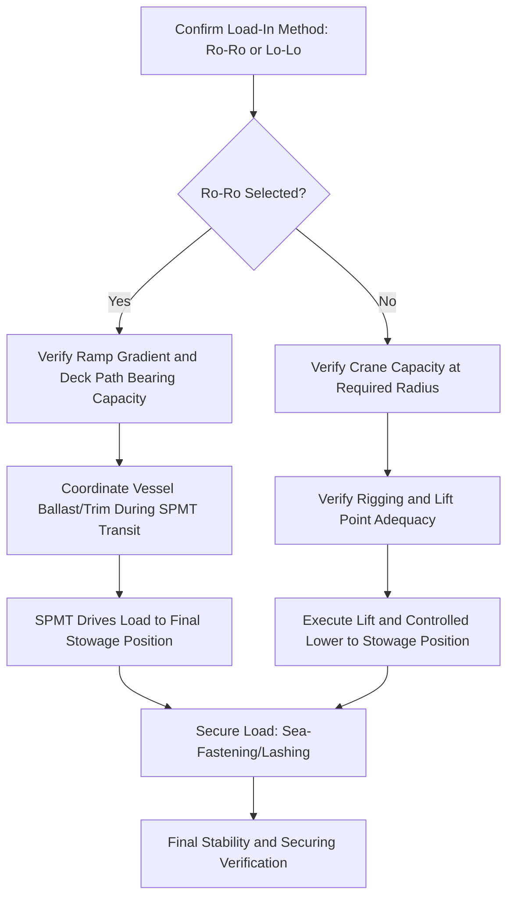

## Ro-Ro and Lo-Lo Load-In Methods

### Purpose and Scope

Ro-Ro (Roll-on/Roll-off) and Lo-Lo (Lift-on/Lift-off) are the two principal methods for loading heavy-lift cargo onto or off a vessel, distinguished by whether the cargo moves horizontally under its own or auxiliary transport power (Ro-Ro) or is transferred vertically by crane (Lo-Lo). Method selection fundamentally shapes vessel selection, port infrastructure requirements, cargo securing strategy, and overall project engineering from a very early planning stage.

**Key Points**

- Ro-Ro and Lo-Lo are not simply alternative execution techniques for the same problem — they impose different requirements on vessel type, port infrastructure, cargo configuration, and sea-fastening design, and the choice is typically made early enough to influence multiple downstream engineering decisions.
- Many heavy-lift projects use a hybrid approach, combining Lo-Lo for initial positioning with Ro-Ro (SPMT-based) for final precise placement, or vice versa.

### Method Comparison Overview

### Ro-Ro Load-In Method

**Core Principle**

Cargo is moved horizontally onto the vessel using SPMTs (or, for smaller/wheeled cargo, its own wheels/tracks) via a ramp or linkspan connecting the quay to the vessel deck, rather than being lifted vertically.

**Key Infrastructure Requirements**

- **Ramp or linkspan**: A structure bridging the gap and elevation difference between quay and vessel deck, which must accommodate the SPMT/load configuration's gradient tolerance and ground bearing/point load requirements.
- **Ramp gradient limits**: SPMT combinations have maximum gradeability limits (governed by hydraulic system capability and load stability considerations), constraining the maximum acceptable ramp angle — steeper ramps may require load reconfiguration, additional SPMT lines, or an alternative vessel with a more favorable ramp geometry.
- **Deck strength along the full drive path**: Unlike a single-point crane lift, Ro-Ro loading requires the vessel's deck to sustain SPMT point loads (or distributed track loads) continuously along the entire path from ramp to final stowage position, not just at one location.
- **Vessel motion during loading**: Since the vessel is typically waterborne (not dry-docked) during Ro-Ro loading, vessel trim, heel, and any wave-induced motion at the ramp interface must be controlled and monitored — similar ballast management principles apply as covered in Ballasting and De-Ballasting for Barge Load-Outs, adapted for the loading (rather than load-out) direction.

**Typical Vessel Types**

- **Purpose-built Ro-Ro heavy-lift vessels**: Vessels specifically designed with stern or side ramps and reinforced deck areas rated for SPMT operation.
- **Semi-submersible heavy-lift vessels used in a "float-on" configuration**: While semi-submersible vessels are more commonly associated with float-on/float-off (a related but distinct method using vessel ballasting rather than a ramp), some configurations incorporate Ro-Ro-compatible access for specific cargo types.
- [Inference] The specific ramp/linkspan design and deck reinforcement varies significantly by vessel, and compatibility with a specific SPMT/load configuration should be verified directly against the vessel's technical specifications and class documentation for each project.

### Lo-Lo Load-In Method

**Core Principle**

Cargo is lifted vertically by crane — either the vessel's own onboard crane(s), a shore-based crane, or occasionally a combination — and lowered directly onto the vessel deck or into a cargo hold.

**Key Infrastructure/Equipment Requirements**

- **Crane capacity and reach**: Must exceed the module's weight (with appropriate rigging factor of safety margin, see Factor of Safety Standards) at the required lift radius, accounting for the horizontal distance from the crane's position to the final stowage location on deck.
- **Rigging and lift point engineering**: Standard heavy-lift rigging principles apply (sling/spreader bar configuration, lift point verification on the module), following the same engineering rigor as any critical lift.
- **Vessel deck point load capacity at set-down location**: The vessel deck (or the sea-fastening/grillage structure prepared on deck) must be verified to accept the module's point/distributed load at its final stowage position.
- **Onboard crane vs. shore crane**: Many heavy-lift vessels are equipped with substantial onboard cranes (sometimes with capacities of many hundreds to over a thousand tonnes, and increasingly higher on newer purpose-built tonnage) specifically to enable self-loading without dependency on shore-based crane availability at every port.

**Typical Vessel Types**

- **Purpose-built heavy-lift vessels**: Equipped with one or more heavy-capacity cranes, often capable of tandem lift operation (both cranes lifting a single module together) for the largest cargo.
- **General cargo/project cargo vessels using shore crane**: For lighter or more standard project cargo, a general vessel without onboard heavy-lift cranes may be loaded using shore-based mobile or crawler cranes at the quay.

### Float-On/Float-Off (Related Method, Distinct from Ro-Ro/Lo-Lo)

While the item specifically covers Ro-Ro and Lo-Lo, float-on/float-off (FloFlo) is a closely related third method worth distinguishing:

- A semi-submersible heavy-lift vessel ballasts down, submerging its cargo deck below the waterline, allowing the cargo (often another vessel, or a floating structure) to be floated into position over the submerged deck.
- The vessel then de-ballasts, raising the deck (and the cargo resting on it) out of the water.
- This method avoids both horizontal ramp-based transfer and crane lifting entirely, instead using vessel buoyancy control as the transfer mechanism — conceptually related to the ballasting principles covered in barge load-out but applied in the opposite (float cargo onto a submerging deck) sense.

### Method Selection Factors

| Factor | Favors Ro-Ro | Favors Lo-Lo |
| --- | --- | --- |
| Cargo weight/size | Very large modules exceeding practical crane lift capacity | Cargo within available crane capacity at required radius |
| Port ramp/linkspan availability | Ramp-equipped berth available | Standard quay without ramp infrastructure |
| SPMT fleet availability | Sufficient SPMT capacity available at load-in location | SPMT fleet not required/available |
| Deck strength distribution | Vessel deck rated for distributed SPMT path loading | Vessel deck rated primarily at specific stowage point locations |
| Loading time constraints | Ro-Ro can be faster for very heavy/large single units once ramp is set | Lo-Lo may allow more precise incremental positioning via crane control |
| Vessel crane availability | Vessel lacks adequate onboard crane capacity | Vessel equipped with adequate onboard heavy-lift crane(s) |

### Sequencing and Coordination Considerations

Regardless of method, both approaches converge on the same subsequent requirement: once the cargo is positioned on deck, it must be secured via sea-fastening (welded, bolted, or lashed restraint systems) designed to withstand the anticipated motion and acceleration forces during the voyage — a distinct engineering discipline covered separately.

### Common Pitfalls

- **Selecting load-in method late in project planning**, after vessel or port infrastructure commitments have already constrained available options.
- **Verifying ramp gradient without confirming full-path deck strength** for Ro-Ro operations, missing a mid-path bearing capacity limitation beyond the ramp itself.
- **Assuming vessel onboard crane capacity without verifying actual capacity at the specific required lift radius**, since capacity typically de-rates significantly with increasing radius.
- **Overlooking vessel motion/trim control requirements during Ro-Ro loading**, treating the vessel as a fixed platform rather than accounting for waterborne response to progressive weight transfer.
- **Failing to verify deck point load capacity at the specific Lo-Lo set-down location**, assuming general vessel deck strength is adequate without location-specific verification.
- **Inadequate early coordination between load-in method selection and sea-fastening design**, since the two are interdependent (cargo orientation and final position affect achievable securing arrangements).

### Conclusion

Ro-Ro and Lo-Lo load-in methods represent fundamentally different transfer mechanisms — horizontal SPMT-based transit via ramp versus vertical crane lift — each imposing distinct infrastructure, equipment, and engineering verification requirements that should be resolved early in project planning given their downstream influence on vessel selection and cargo configuration. Both methods converge on the shared subsequent requirement for robust sea-fastening once cargo reaches its final stowage position, making load-in method and securing design inherently interdependent engineering decisions.

**Related Topics**

- Ballasting and De-Ballasting for Barge Load-Outs
- Sea-Fastening Design for Marine Heavy-Lift Cargo
- Waterway and Port Approach Surveys
- Factor of Safety Standards in Heavy-Lift Engineering
- Load-Out Sequencing from Fabrication Yards
- SPMT Configuration Planning and Axle Load Distribution