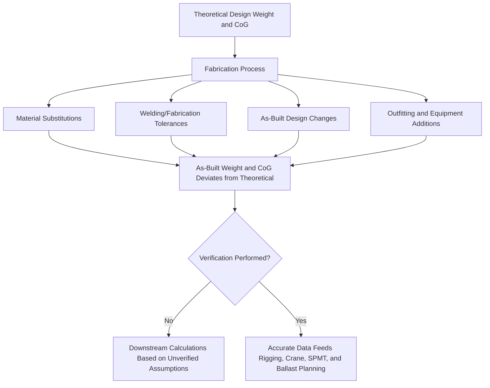
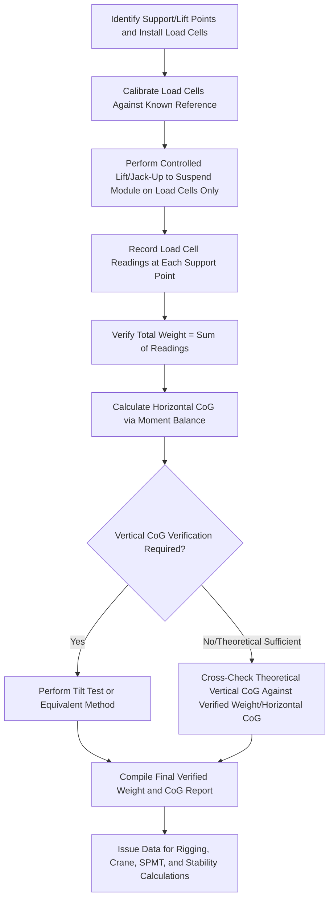

## Weighing and Center of Gravity Verification Procedures

### Purpose and Scope

Weighing and center of gravity (CoG) verification procedures establish the empirical, field-measured determination of a module's actual mass and CoG location, replacing or validating theoretical design calculations before critical lift, load-out, or transport operations. Since nearly every downstream engineering calculation — rigging sizing, crane selection, sling angle/tension, SPMT axle load distribution, ballast planning — depends directly on accurate weight and CoG data, this verification is foundational rather than a peripheral quality check.

**Key Points**

- Theoretical (design/calculated) weight and CoG frequently diverge from as-built reality due to material substitutions, welding/fabrication tolerances, as-built deviations, and outfitting/equipment additions accumulated during construction.
- CoG verification determines position in three dimensions (longitudinal, transverse, and vertical), not just total weight — vertical CoG in particular is critical for stability calculations but is often the most difficult dimension to verify accurately.

### Why As-Built Verification Is Necessary

[Inference] The magnitude of typical theoretical-versus-as-built deviation varies significantly by project and fabrication quality control rigor; because even a modest unverified deviation can meaningfully affect safety-critical calculations (particularly CoG-dependent stability and load distribution), formal weighing verification is standard practice for critical heavy-lift and transport operations rather than being reserved only for cases where large deviation is suspected.

### Weighing Methods

**Load Cell Weighing (Direct Method)**

- Load cells (hydraulic, strain gauge, or similar) are placed at each of the module's support/lift points, directly measuring the reaction force at each point during a controlled lift or jack-up.
- Summing all load cell readings gives total weight; the distribution of readings across the known geometric positions of the support points allows calculation of horizontal (longitudinal and transverse) CoG position via moment balance.
- Considered one of the most direct and commonly reliable methods where the module can be supported at a limited, well-defined number of discrete points.

**Weighbridge/Platform Scale Weighing**

- For modules transportable to a fixed weighbridge or platform scale (more common for smaller/transportable items than for very large fabricated modules), direct total weight measurement is obtained, though horizontal CoG determination typically still requires either multiple scale readings at different support configurations or a supplementary method.

**Strand Jack or Hydraulic Jack Weighing**

- Where a module is supported/lifted using strand jacks or hydraulic jacks as part of the load-out or lift sequence itself, the jacking system's own load monitoring instrumentation (pressure transducers correlated to load) can provide weighing data as an integrated part of the lift-out sequence, avoiding a separate dedicated weighing operation.

**Draft Survey (Marine-Specific Method)**

- For cargo already loaded onto a vessel or barge, weight can be determined via draft survey — measuring the vessel's draft change (before and after loading, or between defined loading stages) and correlating this to displaced water volume/weight using the vessel's hydrostatic data.
- Commonly used for bulk or general cargo weight verification, and applicable to heavy-lift cargo weighing in a marine load-out context as a cross-check against load cell or jack-based weighing methods.

### Center of Gravity Determination Principles

**Horizontal (Longitudinal and Transverse) CoG via Moment Balance**

Using load cell readings at multiple known support point locations, horizontal CoG position is calculated via a moment balance approach:

$$\bar{x} = \frac{\sum (P_i \times x_i)}{\sum P_i}$$

Where $\bar{x}$ is the CoG coordinate in a given horizontal direction, $P_i$ is the load measured at support point $i$, and $x_i$ is that support point's known coordinate in the same direction. The equivalent calculation is performed independently for the perpendicular horizontal axis to fully locate the horizontal CoG position.

**Vertical CoG Determination (More Complex)**

Vertical CoG cannot be directly measured via simple load cell readings at a single support configuration, since load cells at a level support arrangement do not directly reveal how mass is distributed with height. Common approaches include:

- **Tilt test method**: The module is tilted to a known angle (using controlled jacking at one end or a similar method), and the resulting change in load distribution across support points is used to back-calculate vertical CoG height via trigonometric/moment analysis.
- **Pendulum/inclining test (more common for whole vessels, but conceptually applicable)**: A known weight is shifted a known distance, and the resulting inclination is measured to calculate the metacentric height, from which vertical CoG can be derived if other stability parameters are known — this approach is more standard in vessel inclining experiments than typical module weighing, but the underlying principle (controlled disturbance, measured response) is analogous.
- **Calculated/theoretical vertical CoG cross-checked against horizontal verification**: In many practical module weighing procedures, only horizontal CoG is empirically verified via load cell weighing, while vertical CoG is retained from theoretical/design calculation but cross-checked for consistency with the verified weight and horizontal CoG data — [Inference] the specific approach taken (full empirical vertical CoG determination via tilt test versus reliance on theoretical vertical CoG) is project-risk-driven, with more rigorous vertical CoG verification typically applied to taller, less symmetric, or higher-consequence modules where vertical CoG uncertainty poses greater stability risk.

### Typical Weighing Procedure Workflow

### Load Cell Calibration and Accuracy Considerations

- **Pre-use calibration**: Load cells must be calibrated against a traceable reference standard before use, with calibration certificates retained as part of the weighing documentation package.
- **Measurement accuracy class**: Load cells used for critical heavy-lift weighing are typically selected with an accuracy class appropriate to the required precision of the final weight/CoG determination — [Unverified] specific accuracy requirements are generally project- and risk-specific rather than governed by a single universal standard, though industry practice favors higher-precision instrumentation for larger or higher-consequence lifts given the compounding effect of measurement error on CoG calculation accuracy.
- **Environmental factors**: Temperature effects on load cell readings, and ensuring load cells are correctly oriented and unaffected by any lateral/eccentric loading not aligned with their intended measurement axis.

### Common Sources of Error

| Error Source | Effect | Mitigation |
| --- | --- | --- |
| Uncalibrated or improperly calibrated load cells | Systematic weight/CoG error | Pre-use calibration against traceable reference |
| Inaccurate support point coordinate data | CoG calculation error despite accurate load readings | Precise survey of actual support point positions, not assumed/design positions |
| Module not fully suspended on load cells during reading | Partial/inaccurate weight capture if module still partially resting on other supports | Verify full transfer of load onto load cells before recording readings |
| Wind or dynamic disturbance during weighing | Reading instability/inaccuracy | Perform weighing in calm conditions, take multiple readings and average where appropriate |
| Temporary attachments/rigging included or excluded inconsistently | Confusion between "as-weighed" and "as-lifted" configuration weight | Clear documentation of exactly what was included in the weighed configuration |

### Documentation and Reporting

A complete weighing and CoG verification report typically includes:

- **Methodology description**: Weighing method used (load cell, weighbridge, draft survey, etc.) and equipment specifications.
- **Calibration records**: Load cell calibration certificates and traceability documentation.
- **Raw measurement data**: Individual support point readings, environmental conditions during weighing, and any repeat measurements taken.
- **Calculated results**: Total weight, horizontal CoG coordinates (longitudinal and transverse), and vertical CoG (whether empirically verified or theoretical/cross-checked).
- **Comparison against theoretical/design values**: Explicit statement of the deviation between as-built verified data and original design assumptions, flagging any significant discrepancy for engineering review.
- **Configuration definition**: Clear statement of exactly what was included in the weighed item (permanent structure only, or including specific temporary attachments/outfitting) to avoid downstream confusion.

### Downstream Applications of Verified Data

Verified weight and CoG data feeds directly into numerous subsequent engineering calculations across the broader heavy-lift and transport process:

- **Rigging and lift point design**: Sling angle, leg tension, and spreader bar loading calculations (see Factor of Safety Standards) depend directly on accurate weight and CoG.
- **Crane selection and load chart verification**: Crane capacity at the required lift radius must be checked against verified (not theoretical) weight.
- **SPMT axle configuration**: Number and arrangement of SPMT lines is determined based on verified weight/CoG to achieve acceptable axle load distribution.
- **Vessel/barge stability and ballast planning**: As covered in Ballasting and De-Ballasting for Barge Load-Outs, accurate CoG (including vertical CoG) is essential for reliable stability calculation throughout a marine load-out or load-in sequence.
- **Load-out sequencing structural analysis**: Intermediate structural load cases during load-out sequencing (see Load-Out Sequencing from Fabrication Yards) depend on accurate weight/CoG data to correctly predict support reactions at each stage.

### Common Pitfalls

- **Proceeding with critical lift or transport planning using only theoretical weight/CoG**, particularly for modules with significant potential for as-built deviation from design.
- **Failing to fully suspend the module on load cells before recording readings**, capturing partial/inaccurate load data if other supports remain partially engaged.
- **Neglecting vertical CoG verification for tall or asymmetric modules**, relying on theoretical vertical CoG despite elevated stability risk sensitivity to vertical CoG error.
- **Inconsistent configuration definition** between the weighed condition and the actual as-lifted/as-transported condition, introducing unaccounted weight or CoG shift from added/removed items between weighing and execution.
- **Using uncalibrated or inappropriately rated load cells**, introducing systematic error that compounds through downstream CoG and stability calculations.
- **Failing to flag significant deviation from theoretical design values for engineering review**, missing an opportunity to catch a fabrication error or design assumption error before it propagates into execution planning.

### Conclusion

Weighing and center of gravity verification procedures provide the empirical foundation upon which nearly all subsequent heavy-lift and transport engineering calculations depend, with load cell weighing during a controlled lift/jack-up being the most common direct method for both total weight and horizontal CoG determination. Vertical CoG verification presents greater methodological complexity and is often addressed through a risk-based combination of empirical tilt testing and theoretical cross-checking, but should not be overlooked for tall, asymmetric, or high-consequence modules given its direct influence on stability calculations throughout load-out, transport, and load-in operations.

**Related Topics**

- Factor of Safety Standards in Heavy-Lift Engineering
- Load-Out Sequencing from Fabrication Yards
- Ballasting and De-Ballasting for Barge Load-Outs
- SPMT Configuration Planning and Axle Load Distribution
- Ro-Ro and Lo-Lo Load-In Methods
- Ground Bearing Pressure Calculation and Mat/Plate Sizing