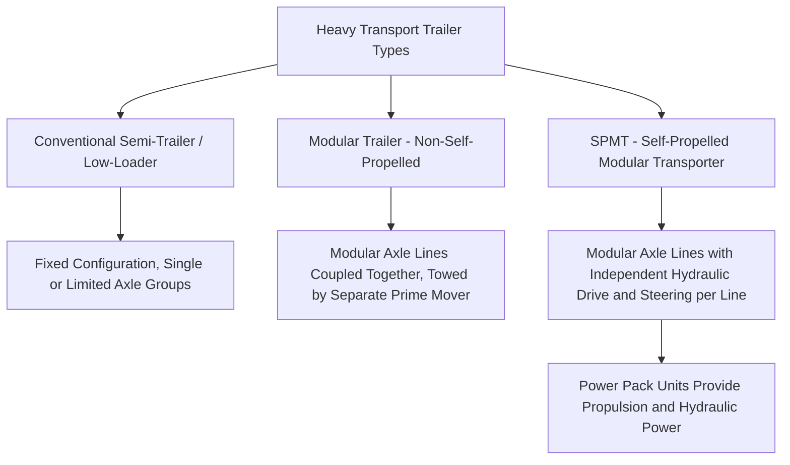
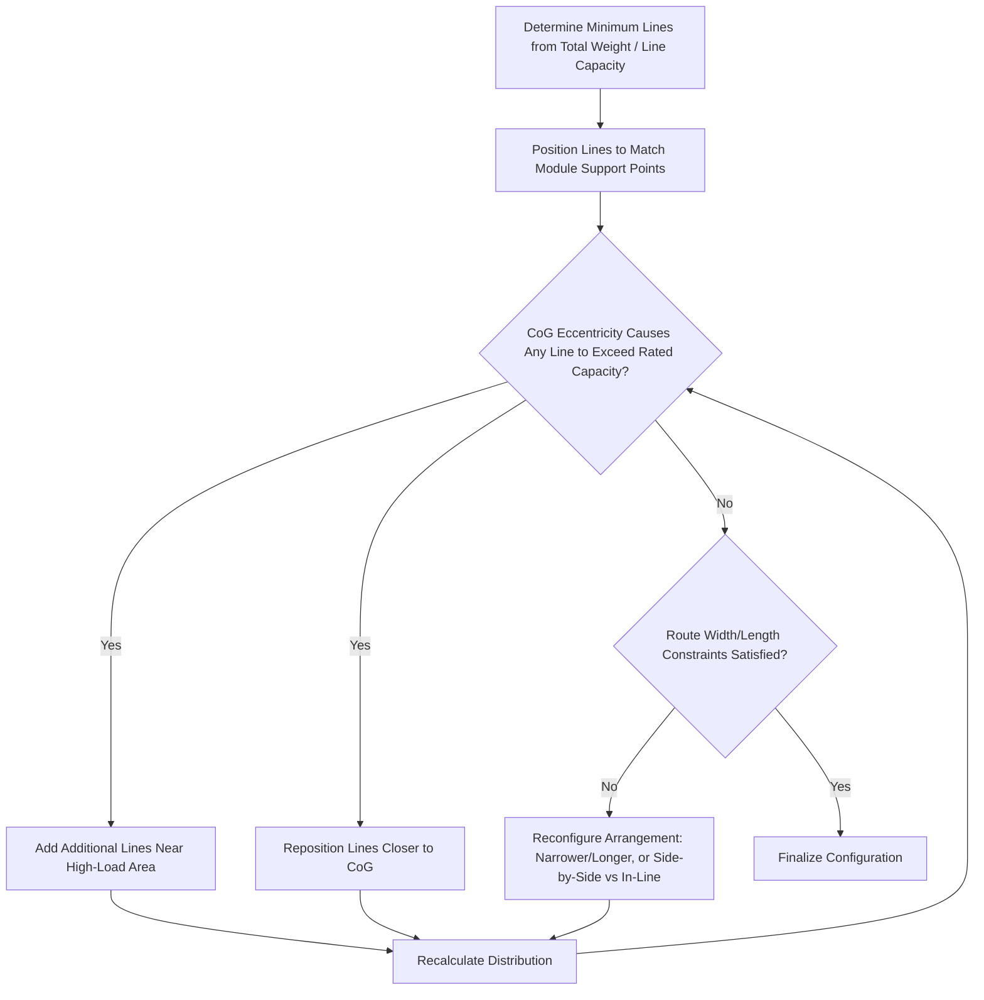

## Trailer and SPMT Configuration Planning

### Purpose and Scope

Trailer and SPMT (Self-Propelled Modular Transporter) configuration planning determines the specific arrangement, quantity, and coupling of trailer/SPMT units required to safely and stably transport a given load, converting verified weight and CoG data into a physical axle and platform layout that satisfies load capacity, ground bearing, and geometric constraints. This is a core engineering deliverable that directly governs route feasibility (see Turning Radius and Swept Path Analysis), ground bearing assessment, and load-out/load-in method selection.

**Key Points**

- Configuration planning must satisfy multiple simultaneous constraints — individual axle load limits, overall platform load capacity, ground bearing pressure, and geometric/steering requirements — rather than optimizing for weight capacity alone.
- SPMT configurations are modular and reconfigurable in ways conventional trailers are not, offering greater flexibility but requiring more detailed engineering to determine the optimal arrangement for a specific load.

### Trailer Types Overview

**Conventional Semi-Trailer / Low-Loader**

- Fixed or limited-configuration trailers (e.g., extendable low-loaders, multi-axle low-bed trailers) towed by a conventional tractor unit.
- Suitable for moderate abnormal loads not requiring the full flexibility of a modular system, generally simpler and lower-cost for loads within their rated capacity and dimensional range.

**Modular Trailer (Non-Self-Propelled)**

- Individual axle line modules that can be coupled together in various configurations (side-by-side, in-line) to create a wider or longer platform, towed by a separate prime mover (conventional tractor) rather than having independent propulsion.
- Offers more configuration flexibility than a fixed low-loader while remaining less complex (and typically less costly) than a full SPMT system.

**SPMT (Self-Propelled Modular Transporter)**

- Each axle line module contains its own hydraulic drive motors and independent steering, with propulsion and hydraulic power supplied by one or more separate Power Pack Units (PPUs) connected via hydraulic hoses and electronic control cabling.
- Axle lines can be coupled together in a wide variety of configurations — in-line (extending length), side-by-side (extending width), or combined arrangements — to match the specific load's footprint and weight distribution requirements.
- Provides independent steering per axle line, enabling the standard, crab, and circle steering modes discussed in Turning Radius and Swept Path Analysis.

### Core Configuration Planning Inputs

| Input | Source | Role in Configuration |
| --- | --- | --- |
| Verified total weight | Weighing and CoG Verification Procedures | Determines minimum total number of axle lines required |
| Verified CoG (longitudinal, transverse, vertical) | Weighing and CoG Verification Procedures | Governs axle line arrangement to keep individual line loads within limits |
| Module footprint/support point locations | Structural design, load-out engineering | Determines where SPMT/trailer platforms must physically interface with the load |
| Individual axle line rated capacity | SPMT/trailer manufacturer specification | Sets the maximum load per line, driving the minimum number of lines needed |
| Route ground bearing constraints | Route survey, geotechnical data | May further limit acceptable load per axle line/wheel below the equipment's own rated maximum |
| Route geometry (width, turning radius) | Road Route Survey Methodology, swept path analysis | Constrains maximum overall platform width/length achievable for the route |

### Axle Line Load Distribution Calculation

The fundamental configuration calculation determines how many axle lines are required and how they must be arranged to keep every individual line within its rated capacity, accounting for the load's CoG position:

$$P_i = \frac{W}{n} \pm \frac{W \times e \times d_i}{\sum d_i^2}$$

Where $P_i$ is the load on axle line $i$, $W$ is total load weight, $n$ is the total number of axle lines, $e$ is the CoG eccentricity from the geometric center of the axle line arrangement, and $d_i$ is the distance of axle line $i$ from that geometric center. This moment-distribution approach mirrors the sling leg tension and multi-crane load-sharing principles covered under Factor of Safety Standards, but applied to a rigid platform system rather than flexible slings.

**Example**

A module weighs 800 t with its CoG offset 1.5 m longitudinally from the geometric center of a proposed 8-line SPMT arrangement (4 lines forward, 4 lines aft, each set 6 m from center). Approximate line loads:

$$P_{avg} = \frac{800}{8} = 100 \, t \text{ per line (before eccentricity correction)}$$

The eccentricity correction then redistributes load between the forward and aft line groups, increasing load on the lines closer to the CoG offset and reducing it on the opposite group — the specific redistribution requires the full moment calculation above using each line's actual distance from the arrangement's geometric center, with the configuration engineer iterating the arrangement (adding lines, adjusting spacing, or repositioning support points) if either group's calculated load exceeds the line's rated capacity.

### Configuration Arrangement Strategies

**In-Line Extension**

- Additional axle lines added in the direction of travel (fore-aft), increasing overall platform length and load capacity without increasing width — useful where route width is constrained but length is less critical.

**Side-by-Side Extension**

- Additional axle lines added laterally, increasing overall platform width and capacity — useful where the module's footprint is wide but route length/turning constraints favor a shorter overall platform.

**Combined/Grillage Configurations**

- For very heavy or large modules, combined arrangements (multiple rows and columns of axle lines, sometimes linked via a rigid grillage/spreader structure atop the SPMT platforms) distribute load across a large number of lines while accommodating irregular module footprints.

### Ground Bearing Pressure Interaction

Individual axle line/wheel load must be checked not only against the equipment's own rated capacity but also against ground bearing capacity along the entire planned route (see related ground bearing pressure principles):

$$GBP = \frac{P_i}{A_{tire/track}}$$

Where $A_{tire/track}$ is the contact area of the tire or track at that axle line. On routes with variable ground conditions (paved road vs. unpaved yard access vs. temporary mats), the configuration may need adjustment — more lines with lower individual loading — specifically to satisfy the most restrictive ground bearing section of the route, even if the equipment's own rated capacity would allow fewer, more heavily loaded lines.

### Coupling and Control System Considerations (SPMT-Specific)

- **Power Pack Unit (PPU) capacity and positioning**: PPUs must provide sufficient hydraulic flow/pressure for the total number of coupled axle lines, with PPU positioning planned to avoid interference with the load or route obstacles.
- **Electronic synchronization**: Modern SPMT systems use electronic control systems to synchronize steering and elevation across all coupled axle lines, critical for maintaining a level, stable platform and coordinated steering response — particularly important for very large multi-line configurations where manual coordination would be impractical.
- **Redundancy considerations**: For critical/high-consequence moves, configuration planning may incorporate redundancy margin (additional lines beyond the calculated minimum) to provide contingency capacity in case of a line malfunction during transport. [Inference] The specific redundancy margin applied is project-risk-driven and determined by the transport engineer and operator's risk assessment, rather than a fixed universal requirement.

### Coordination with Route and Load-Out/Load-In Engineering

Configuration planning is not performed in isolation — it directly interacts with several other engineering disciplines:

- **Swept path analysis**: The finalized SPMT platform dimensions (length, width, steering capability) become direct inputs into swept path software (see Turning Radius and Swept Path Analysis).
- **Load-out sequencing**: The configuration must be finalized before load-out sequencing planning proceeds, since the SPMT arrangement determines how the module physically interfaces with the transporter during the transfer (see Load-Out Sequencing from Fabrication Yards).
- **Ro-Ro load-in ramp compatibility**: For marine load-in via ramp, the SPMT configuration's overall footprint and axle spacing must be checked against ramp gradient and width constraints (see Ro-Ro and Lo-Lo Load-In Methods).

### Documentation and Deliverables

A complete SPMT/trailer configuration plan typically includes:

- **Configuration drawing**: Plan view showing axle line positions, module support point locations, and overall platform dimensions.
- **Load distribution calculation report**: Individual line load calculations accounting for CoG eccentricity, confirming all lines remain within rated capacity.
- **Ground bearing pressure verification**: Cross-check of individual line/wheel loading against route ground bearing capacity at all relevant route sections.
- **PPU and control system layout**: Positioning and capacity confirmation for hydraulic power and control systems.
- **Steering mode plan**: Identification of which steering modes (standard, crab, circle) will be used at specific route locations, coordinated with swept path analysis findings.

### Common Pitfalls

- **Basing configuration on theoretical rather than verified weight/CoG**, risking an inadequate or inefficiently over-specified arrangement once actual as-built data is available.
- **Checking only equipment-rated axle line capacity without verifying route-specific ground bearing constraints**, missing a more restrictive limit imposed by weak ground sections along the route.
- **Failing to account for CoG eccentricity in the initial arrangement**, requiring late reconfiguration when eccentricity calculations reveal an unacceptable individual line load.
- **Underestimating PPU capacity requirements** for large multi-line configurations, resulting in inadequate hydraulic power/flow for full system operation.
- **Finalizing configuration without coordinating with swept path and ramp/route geometry constraints**, discovering a route incompatibility only after the configuration has otherwise been committed.
- **Insufficient redundancy consideration for critical/high-consequence loads**, leaving no contingency margin in case of an individual line malfunction during transport.

### Conclusion

Trailer and SPMT configuration planning translates verified weight, CoG, and route data into a specific physical axle arrangement satisfying individual line capacity, ground bearing, and geometric constraints simultaneously — requiring iterative calculation and close coordination with swept path analysis, ground bearing assessment, and load-out/load-in engineering rather than being determined by total weight capacity alone. The modular flexibility of SPMT systems in particular enables sophisticated in-line, side-by-side, and combined arrangements, but this flexibility places correspondingly greater emphasis on rigorous load distribution and ground bearing verification during the planning process.

**Related Topics**

- Weighing and Center of Gravity Verification Procedures
- Turning Radius and Swept Path Analysis
- Ground Bearing Pressure Calculation and Mat/Plate Sizing
- Load-Out Sequencing from Fabrication Yards
- Ro-Ro and Lo-Lo Load-In Methods
- Factor of Safety Standards in Heavy-Lift Engineering