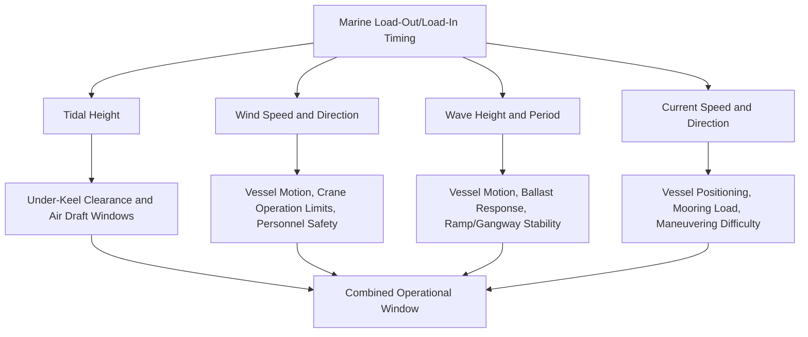
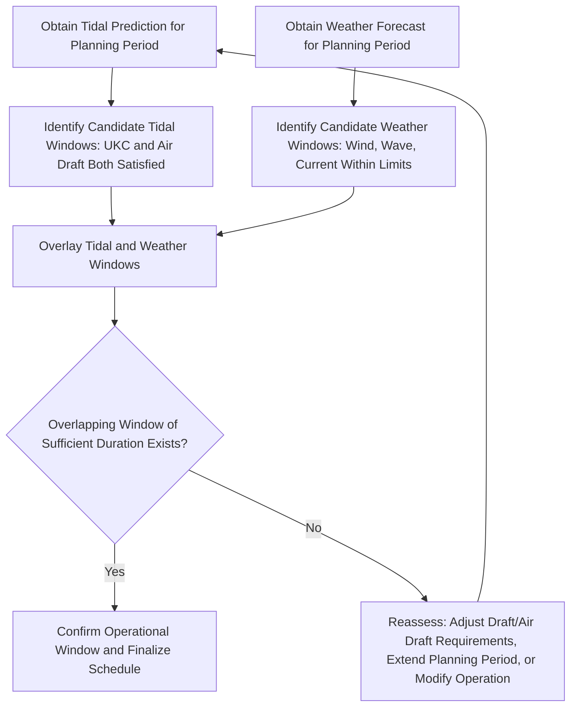

## Tidal Windows and Weather-Dependent Load-Out Timing

### Purpose and Scope

Tidal windows and weather-dependent load-out timing planning establishes the specific date/time periods during which environmental conditions — tidal height, wind, wave, and current — simultaneously satisfy all safety-critical constraints for a marine load-out or load-in operation. Unlike land-based transport, marine heavy-lift operations are governed by naturally recurring but variable environmental cycles that must be forecast, monitored, and actively managed throughout the operational timeline.

**Key Points**

- Tidal and weather windows are rarely determined by a single constraint — the final acceptable window is typically the overlap (intersection) of multiple independent environmental and operational limits, which can be significantly narrower than any single constraint suggests.
- Environmental conditions must be verified as acceptable not just at the planned start time, but throughout the entire anticipated duration of the operation, since load-out/load-in sequences often extend over many hours.

### Environmental Factors Governing Timing

### Tidal Window Determination

**Under-Keel Clearance and Air Draft Constraints**

As established in Waterway and Port Approach Surveys, tidal height simultaneously affects two often-opposing constraints: sufficient depth (favoring higher tide) and adequate air draft/overhead clearance (favoring lower tide). The tidal window for load-out is the specific time period where both constraints are satisfied concurrently, which may be considerably narrower than either constraint's individual acceptable range.

**Draft Change During the Operation**

During load-out itself, vessel/barge draft changes progressively as the module transfers weight aboard (see Ballasting and De-Ballasting for Barge Load-Outs). This means the tidal window calculation must account not just for the vessel's initial (light) condition, but for its condition throughout the operation as draft increases — the critical UKC moment may occur partway through the load transfer rather than at the start or finish.

**Tidal Prediction and Real-Time Verification**

- **Predicted tidal curves**: Standard tidal prediction (from national hydrographic/tidal services) provides the baseline planning tool for identifying candidate windows well in advance.
- **Real-time tide gauge monitoring**: Closer to and during the actual operation, real-time tide gauge data is typically used to verify actual water level matches or exceeds prediction, since meteorological effects (see below) can cause actual levels to deviate from pure astronomical prediction.
- **Spring vs. neap tide consideration**: Tidal range varies through the lunar cycle (larger range at spring tides, smaller at neap tides); depending on whether the constraint is primarily UKC-driven or air-draft-driven, planners may specifically target spring or neap tide periods to maximize the available window.

### Weather Window Constraints

**Wind Limits**

- Crane operations (both onboard vessel cranes and any shore crane involved in Lo-Lo load-in) have manufacturer-specified maximum wind speed limits for safe operation, which become progressively more restrictive as load size/windage area increases.
- SPMT operation during Ro-Ro loading and general personnel safety on deck/quayside also impose practical wind limits, particularly for tall or high-windage cargo.
- [Inference] Specific wind speed thresholds are equipment-, load-, and operator-procedure-specific rather than governed by a single universal figure, and should be confirmed against the specific crane manufacturer's operating limits and the project's lift plan for the actual cargo involved.

**Wave and Swell Limits**

- Vessel motion induced by wave action can affect crane lift precision (particularly for Lo-Lo operations requiring accurate positioning), ramp/linkspan stability during Ro-Ro operations, and overall operational safety.
- Barge-based operations are typically more wave-sensitive than larger heavy-lift vessels due to lower inherent stability and smaller mass, often requiring more sheltered conditions or calmer sea states.
- Combined wind-wave conditions (e.g., wind against tide creating steeper, more hazardous wave conditions in a channel or harbor approach) may be more restrictive than either factor considered independently.

**Current Limits**

- Strong currents can complicate vessel positioning and station-keeping during load-out/load-in, increasing mooring line loads and making precise vessel positioning relative to quay or ramp more difficult.
- Current direction relative to wind direction can also influence vessel behavior at berth (e.g., wind-against-current conditions creating different vessel motion characteristics than wind-with-current).

### Combined Window Calculation

The combined window must have sufficient **duration**, not just an instantaneous moment of compliance — since load-out/load-in operations extend over hours, the window must remain acceptable for the full anticipated duration plus reasonable contingency margin for delays.

### Forecast Lead Time and Confidence

| Forecast Horizon | Typical Use | Confidence Level |
| --- | --- | --- |
| Long-range (weeks to months) | Initial project scheduling, tidal window identification | Tidal: high confidence (astronomical); Weather: low confidence (climatological only) |
| Medium-range (3–7 days) | Firming up planned operation date, initial weather trend awareness | Tidal: high confidence; Weather: moderate confidence, subject to revision |
| Short-range (24–72 hours) | Final go/no-go decision-making window | Tidal: high confidence; Weather: higher confidence, though still subject to change |
| Real-time/nowcast | During actual operation execution | Tidal: verified via gauge; Weather: direct observation and short-term forecast |

[Inference] Since tidal prediction is astronomically deterministic and highly reliable well in advance, while weather forecasting confidence increases only as the operation approaches, marine heavy-lift load-out scheduling commonly finalizes the tidal window far in advance while retaining weather-driven go/no-go decision authority much closer to the actual date — though the specific decision-point timing is project- and operator-specific practice rather than a fixed industry standard.

### Meteorological Effects on Tidal Prediction

Pure astronomical tidal prediction can be modified by meteorological conditions, introducing uncertainty beyond the deterministic tidal calculation itself:

- **Storm surge**: Low atmospheric pressure and onshore wind can raise water levels above astronomical prediction, which may be favorable for UKC but adverse for air draft constraints.
- **Setdown**: Conversely, high pressure and offshore wind can lower water levels below prediction, favorable for air draft but adverse for UKC.
- **River discharge effects (for estuarine/riverine locations)**: Rainfall-driven increased river flow can elevate water levels independent of tidal state, relevant for waterway and port locations with significant river influence.

Given this uncertainty, real-time water level monitoring in the period immediately before and during the operation is standard practice to verify actual conditions align with the planning assumptions, rather than relying purely on astronomical prediction close to execution.

### Go/No-Go Decision Framework

Many marine heavy-lift operations employ a formal, staged go/no-go decision process:

1. **Initial scheduling decision** (weeks/months ahead): Based on tidal window identification and seasonal weather pattern awareness, establishing a target date/window.
2. **Medium-term confirmation** (days ahead): Reviewing medium-range weather forecast trends, confirming or adjusting the target window if forecast conditions appear unfavorable.
3. **Final go/no-go decision** (typically within 24–48 hours of the operation): Based on short-range forecast confidence and, where available, real-time observational data, making the final commit/postpone decision.
4. **In-operation monitoring and abort criteria**: Pre-defined criteria for pausing or aborting an in-progress operation if actual conditions deviate unacceptably from forecast during execution.

### Contingency and Postponement Planning

- **Alternative window identification**: Given weather uncertainty, identifying one or more backup tidal windows (e.g., the next suitable tidal window, which may be the following day or the following spring/neap cycle depending on the specific constraint) provides schedule resilience if the primary window is lost to unfavorable weather.
- **Partial operation contingency**: For some operations, a partially-completed load transfer may need to be safely paused and resumed in a subsequent window if conditions deteriorate mid-operation — requiring the operational plan to define safe pause points and hold conditions rather than assuming the operation will always complete in a single continuous window.
- **Cost and schedule impact of postponement**: Vessel/equipment standby costs and broader project schedule impacts of a missed window are typically significant, making robust forecasting and realistic window planning an important commercial as well as technical consideration — though these cost implications are project-specific and outside the direct scope of the environmental/technical assessment itself.

### Documentation

- **Tidal window analysis report**: Predicted tidal curve for the planning period with UKC and air draft constraint overlays, identifying candidate windows.
- **Weather monitoring and forecasting plan**: Defined forecast sources, review frequency, and escalation/decision points leading up to the operation.
- **Go/no-go decision criteria document**: Specific, pre-agreed thresholds (wind speed, wave height, tidal height) that trigger a go, delay, or abort decision at each stage.
- **Contingency schedule**: Identified backup windows and the plan for handling a postponement.

### Common Pitfalls

- **Calculating the tidal window based only on the operation's start condition**, missing a more restrictive UKC or air draft moment partway through the load transfer as draft changes.
- **Relying purely on long-range weather forecasting for final commitment**, given the inherently lower confidence of weather prediction at longer lead times compared to tidal prediction.
- **Overlooking meteorological effects on water level** (storm surge/setdown), treating astronomical tidal prediction as the sole determinant of actual water level.
- **Insufficient window duration margin**, planning to the theoretical minimum required time without contingency for operational delays extending the operation beyond the originally calculated window.
- **Lack of pre-defined abort/pause criteria**, leading to ad hoc decision-making under time pressure if conditions begin to deteriorate during an in-progress operation.
- **Failing to identify backup windows in advance**, resulting in extended, costly delays if the primary window is lost to unfavorable weather.

### Conclusion

Tidal windows and weather-dependent load-out timing require reconciling deterministic but sometimes opposing tidal constraints (UKC versus air draft) with inherently less certain weather forecasting across wind, wave, and current parameters, converging on a combined operational window of sufficient duration for the full operation. Because weather forecast confidence improves only as the operation approaches while tidal prediction remains reliable far in advance, effective planning typically separates early tidal-window-based scheduling from a later, staged weather-driven go/no-go decision process, supported by real-time monitoring and pre-defined contingency/abort criteria.

**Related Topics**

- Waterway and Port Approach Surveys
- Ballasting and De-Ballasting for Barge Load-Outs
- Ro-Ro and Lo-Lo Load-In Methods
- Met-Ocean Forecasting for Marine Heavy-Lift Operations
- Sea-Fastening Design for Marine Heavy-Lift Cargo
- Load-Out Sequencing from Fabrication Yards