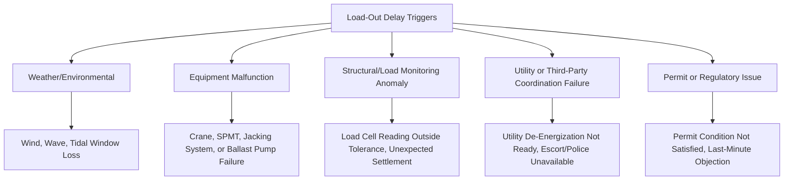
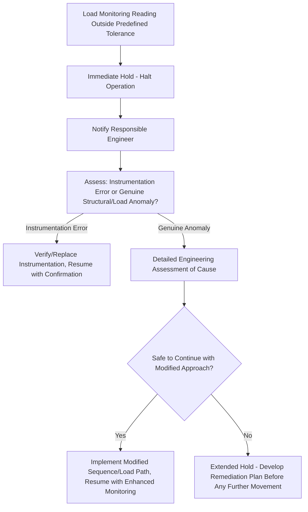

## Contingency Planning for Load-Out Delays

### Purpose and Scope

Contingency planning for load-out delays addresses the pre-emptive identification of potential disruptions to a planned load-out or load-in operation, and the development of response procedures that preserve safety, structural integrity, and schedule/cost control when an operation cannot proceed as originally planned. Because load-out often involves an extended, multi-stage transition of a module between support conditions (see Load-Out Sequencing from Fabrication Yards), a delay is rarely a simple "pause" — it typically requires actively managing an intermediate, non-design-standard state until the operation can resume or be safely reversed.

**Key Points**

- The central technical challenge of load-out delay contingency is that many intermediate load-out states are not intended to be sustained indefinitely — structural, ground bearing, and stability calculations are often based on transient, time-limited conditions.
- Contingency planning must be integrated into the original engineering design (defining safe pause points and hold conditions) rather than developed reactively once a delay has already occurred.

### Categories of Delay Triggers

### Weather and Environmental Delays

**Nature of the Risk**

As covered in Tidal Windows and Weather-Dependent Load-Out Timing, marine load-out operations are bounded by tidal and weather windows that can close unexpectedly if forecast conditions do not materialize as predicted, or if an operation runs longer than planned and extends beyond the available window.

**Contingency Considerations**

- **Pre-defined safe pause points**: The load-out sequence should be engineered from the outset to include specific, structurally-verified points at which the operation can be safely halted for an extended period if weather deteriorates mid-operation, rather than assuming the operation will always run to completion within a single window.
- **Reversibility assessment**: For each planned pause point, the engineering plan should specify whether the operation can be safely reversed (returning the module to a previous stable configuration) if conditions prevent forward progress, and what reversal entails operationally.
- **Extended hold ballast/mooring plan**: For marine operations paused mid-load-transfer, a specific ballast and mooring configuration for extended hold conditions (potentially different from the active transfer condition) may be required to maintain stability and position over a longer, unplanned duration.

### Equipment Malfunction Contingencies

**Critical Equipment Categories**

- **Crane failure** (mechanical, hydraulic, or control system) during a Lo-Lo lift or crane-based load-out stage.
- **SPMT/trailer malfunction** (individual axle line failure, hydraulic system fault, control system fault) during Ro-Ro transfer.
- **Strand jack or hydraulic jack failure** during a jacking/skidding sequence.
- **Ballast pump or valve failure** during a marine load-out requiring active ballast management.

**Contingency Approaches**

- **Redundancy provision**: As noted in Trailer and SPMT Configuration Planning, incorporating redundancy margin (additional capacity beyond the calculated minimum) provides a buffer allowing continued safe operation, or at minimum a safe hold condition, if an individual component fails.
- **Backup equipment availability**: Identifying backup cranes, SPMT lines, or pump units that could be mobilized within an acceptable timeframe if primary equipment fails, particularly for schedule-critical or high-consequence operations.
- **Fail-safe hold procedures**: Defined procedures for safely stabilizing the load in its current position if a critical piece of equipment fails mid-operation, before attempting any repair or replacement — prioritizing structural/positional safety over immediate schedule recovery.
- **Pre-operation equipment inspection and testing**: Rigorous pre-operation checks and, where practical, load testing of critical systems before commencing the actual load-out, reducing (though not eliminating) the likelihood of an in-operation failure.

### Structural and Load Monitoring Anomalies

**Nature of the Risk**

As discussed in Load-Out Sequencing from Fabrication Yards, real-time load monitoring during multi-point jacking or skidding operations can reveal unexpected load distribution, potentially indicating an issue with the module's actual structural behavior, an obstruction in a skid path, or a discrepancy between as-built and theoretical assumptions.

**Contingency Response Framework**

- **Immediate hold as default response**: Pre-defined procedures should mandate an immediate halt to any further movement when monitored parameters exceed defined thresholds, rather than allowing the operation to continue while the anomaly is assessed.
- **Root cause investigation before resumption**: Distinguishing between an instrumentation fault and a genuine structural/load distribution issue is critical, since resuming operation based on a misdiagnosed instrumentation error could mask an actual developing problem.
- **Engineering sign-off for resumption**: Formal engineering review and explicit sign-off before resuming operation after any anomaly-triggered hold, rather than resumption based solely on the field team's judgment.

### Utility and Third-Party Coordination Failures

**Nature of the Risk**

As covered in Utility Line and Overhead Obstruction Management and Pilot Car and Escort Route Coordination, many transport and load-out operations depend on precisely timed third-party actions (utility de-energization, police escort availability, port authority berth allocation) that are outside the direct control of the transport contractor.

**Contingency Considerations**

- **Confirmed backup timing windows**: Where possible, pre-arranging alternative timing windows with third parties in case the primary window is missed due to an unrelated delay earlier in the operation.
- **Clear communication protocols for real-time coordination failure**: Defined escalation procedures if a coordinated third-party action (e.g., utility de-energization) is not confirmed ready at the expected time, including who has authority to hold the operation versus proceed.
- **Buffer time in scheduling**: Building reasonable buffer time into the overall schedule between dependent third-party actions and the point at which the load-out operation actually requires them, reducing the likelihood that a minor upstream delay cascades into a missed coordination window.

### Permit and Regulatory Delay Contingencies

- **Permit condition non-compliance discovered late**: If a permit condition is found to be unsatisfied close to the planned operation date (e.g., a required structural assessment not yet finalized, see Bridge Load Rating and Structural Capacity Verification), contingency planning should identify the minimum realistic timeline to achieve compliance versus the cost/impact of postponement.
- **Last-minute third-party objection or legal challenge**: In some jurisdictions or high-profile projects, permits may be subject to late-stage challenge or objection; contingency planning may need to account for this risk in project scheduling, though the specific legal/regulatory response is typically outside the direct technical scope of the transport engineering team.

### Cost and Schedule Impact Considerations

While the primary focus of contingency planning is safety and technical integrity, delays carry significant commercial consequences that inform contingency strategy prioritization:

- **Standby costs**: Vessel, crane, SPMT, and personnel standby costs typically accrue during any delay, creating commercial pressure that must be balanced against the primary safety and technical considerations — contingency plans should be structured so that safety-critical decisions are not compromised by this pressure.
- **Cascading schedule impact**: A delay in one operation (e.g., a load-out) can cascade into subsequent dependent operations (transport, load-in, downstream construction schedule), making early identification of realistic contingency timelines valuable for broader project schedule management.
- **Insurance and contractual considerations**: [Inference] Many heavy-lift contracts include specific provisions addressing delay-related costs and responsibilities, though the specific contractual framework varies by project and is a commercial/legal matter outside the direct technical scope of contingency engineering planning itself.

### Contingency Plan Documentation Structure

A complete load-out delay contingency plan typically includes:

- **Pre-identified safe pause points**: Specific stages in the load-out sequence engineered and verified as safe for extended hold, with associated hold conditions (ballast configuration, support configuration, monitoring requirements).
- **Trigger criteria and escalation matrix**: Defined thresholds (weather, equipment status, monitoring readings) that trigger a hold, and the corresponding decision-making authority and escalation path for each trigger category.
- **Reversal procedures**: Where applicable, defined procedures for safely reversing an in-progress operation back to a previous stable state.
- **Resumption criteria and sign-off requirements**: Clear criteria for when and how an operation may resume after a hold, including required engineering review/sign-off.
- **Communication and notification plan**: Who must be notified of a delay/hold, and the process for coordinating with affected third parties (utility owners, port authorities, escort services) regarding rescheduling.

### Common Pitfalls

- **Treating contingency planning as a reactive, post-delay exercise** rather than integrating pause point and hold condition engineering into the original load-out sequence design.
- **Failing to structurally verify pause points in advance**, discovering only during an actual delay that the current intermediate state cannot be safely sustained for the required duration.
- **Ambiguous decision-making authority during a hold**, leading to delayed or inconsistent responses when time-critical decisions are needed.
- **Under-communicating with third parties about potential rescheduling needs**, resulting in extended delays while backup coordination windows are arranged reactively rather than having been pre-identified.
- **Allowing commercial/schedule pressure to influence safety-critical resumption decisions**, resuming operation without adequate engineering verification following an anomaly-triggered hold.
- **Insufficient redundancy or backup equipment planning**, leaving no practical recovery path if a single critical piece of equipment fails mid-operation.

### Conclusion

Contingency planning for load-out delays requires anticipating that an extended, multi-stage operation may need to pause in an intermediate, non-final configuration, and ensuring — through advance engineering rather than reactive assessment — that such pause points are structurally verified, clearly triggered, and governed by defined resumption criteria. Effective contingency planning integrates weather/environmental, equipment, structural monitoring, and third-party coordination risk categories into a single coherent framework, prioritizing safety and technical integrity over schedule or cost pressure when delay-triggered decisions must be made.

**Related Topics**

- Load-Out Sequencing from Fabrication Yards
- Tidal Windows and Weather-Dependent Load-Out Timing
- Ballasting and De-Ballasting for Barge Load-Outs
- Utility Line and Overhead Obstruction Management
- Trailer and SPMT Configuration Planning
- Pilot Car and Escort Route Coordination