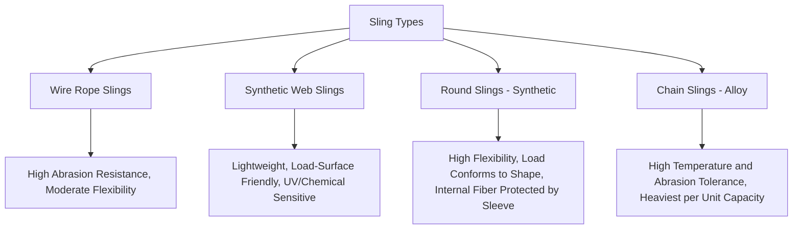
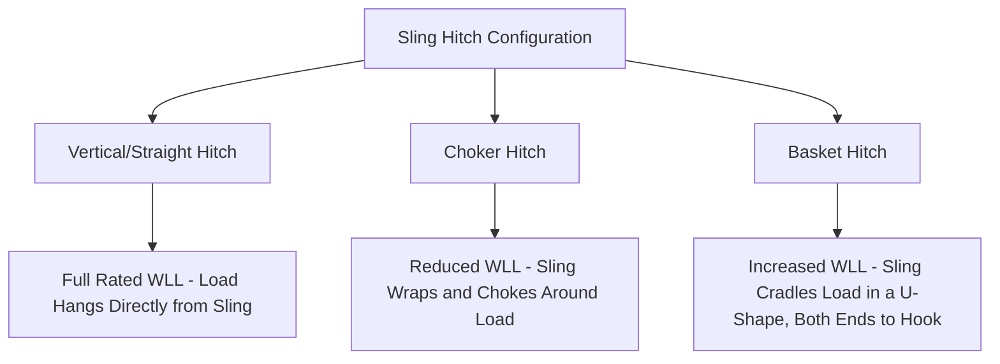

## Sling Types, Angles, and Working Load Limits

### Purpose and Scope

Sling types, angles, and working load limits form the foundational rigging knowledge for connecting a load to a lifting device, covering the physical characteristics of each sling type, how geometric configuration affects load-carrying capability, and how Working Load Limit (WLL) is determined and applied in practice. This topic underpins virtually all subsequent rigging engineering, including the Factor of Safety principles and multi-leg load-sharing considerations already established.

**Key Points**

- Sling selection is governed by load characteristics (weight, edges/surface, environmental exposure), not solely by capacity — different sling types trade off capacity, durability, flexibility, and load protection differently.
- WLL is a configuration-specific rating — the same sling has different WLL values depending on the hitch type (vertical, choker, basket) and sling angle used.

### Sling Type Overview

**Wire Rope Slings**

- Constructed from twisted steel wire strands around a core, offering high strength-to-weight ratio and good abrasion resistance.
- Susceptible to kinking and permanent deformation if bent too sharply (below minimum recommended bend radius) or crushed.
- Common construction types include 6x19 and 6x36 classifications (referring to strand/wire arrangement), each offering different balances of flexibility versus abrasion resistance.
- Governed by standards including ASME B30.9 (US) and EN 13414-1 (Europe).

**Synthetic Web Slings**

- Flat woven webbing, typically polyester or nylon, offering lightweight handling and a wide bearing surface that reduces point-load damage to load surfaces (particularly valuable for coated, machined, or fragile load surfaces).
- Susceptible to damage from UV exposure, chemical exposure, cutting/abrasion from sharp load edges, and heat — requiring edge protection (corner protectors/pads) when rigging around sharp corners.
- Available in various configurations: flat/eye-and-eye, endless (grommet), and twisted-eye configurations, each suited to different rigging applications.
- Governed by ASME B30.9 (US) and EN 1492-1 (Europe).

**Round Slings (Synthetic)**

- Continuous loop of synthetic fiber yarns (commonly polyester) enclosed within a protective woven sleeve, offering high flexibility and the ability to conform closely to irregular load shapes.
- The load-bearing fiber core is protected from direct abrasion/UV exposure by the outer sleeve, though sleeve damage should prompt inspection/retirement consideration since the sleeve's condition is often the primary visual indicator of overall sling condition.
- Governed by EN 1492-2 (Europe) and comparable standards elsewhere.

**Chain Slings (Alloy)**

- Constructed from alloy steel chain (commonly Grade 80 or Grade 100), offering high resistance to heat, abrasion, and cutting damage compared to synthetic alternatives — suited to harsh environments, sharp-edged loads, or high-temperature applications.
- Heavier per unit of rated capacity than wire rope or synthetic alternatives, and less forgiving of shock loading than synthetic slings, which have some inherent elasticity/energy absorption.
- Governed by ASME B30.9 (US) and EN 818-4 (Europe), with Grade 80 and Grade 100 chain having distinct WLL tables per the applicable standard.

### Sling Configuration Types (Hitches)

**Vertical (Straight) Hitch**

- The sling connects directly from the lifting hook to the load's attachment point with no wrapping, providing the sling's full rated (100%) WLL.
- Provides no inherent resistance to load rotation or shifting, relying entirely on the load's own attachment point design for stability.

**Choker Hitch**

- The sling wraps around the load and back through its own eye/fitting, "choking" tight around the load — commonly used where no dedicated lift point exists and the sling must grip the load directly.
- WLL is reduced compared to vertical hitch (commonly to roughly 75–80% of vertical WLL, though the exact factor is sling-type and standard-specific) due to the additional bending stress at the choke point and reduced load-bearing efficiency of the wrapped configuration.
- Choke angle (the angle at which the sling body approaches the choke point) further affects capacity — a shallow choke angle further reduces effective WLL compared to a choke angle closer to 90°, per most manufacturer/standard tables.

**Basket Hitch**

- The sling passes under or around the load in a U-shape, with both ends connected to the lifting hook, effectively doubling the sling's rated capacity compared to vertical hitch when the two legs are vertical (parallel).
- WLL for a basket hitch depends heavily on the angle between the two legs of the basket — as the legs spread apart from vertical, the same angle-derating principles discussed under Factor of Safety Standards apply, reducing effective capacity from the ideal doubled value.

### Sling Angle Effects on Working Load Limit

As established under Factor of Safety Standards, sling angle from horizontal directly affects tension in each leg for a given vertical load:

$$T = \frac{W}{n \times \sin(\theta)}$$

For sling selection and WLL verification, this means the *rated* WLL of a sling (as marked on its tag) must be compared against the *actual calculated tension* in that leg given the specific rigging geometry used — not against the total load weight directly.

**WLL Angle Factor Table (Common Reference Values)**

| Angle from Horizontal | Approximate Load Multiplier (Angle Factor) |
| --- | --- |
| 90° (vertical) | 1.00 |
| 75° | 1.04 |
| 60° | 1.15 |
| 45° | 1.41 |
| 30° | 2.00 |

[Inference] These angle factor values are standard trigonometric derivations widely referenced across rigging industry tables (essentially $1/\sin\theta$); however, specific manufacturer or standard-published WLL tables may present pre-calculated derated capacity values directly rather than requiring the rigger to apply the angle factor manually, so field practice should reference the specific sling's rated capacity table for the applicable angle where available.

### Working Load Limit Determination

**Sourcing WLL Data**

- **Sling identification tag**: Every certified sling is required to carry a permanently attached tag stating its WLL for standard configurations (vertical, choker, basket at specified angle ranges), material type, and relevant standard/certification reference.
- **Manufacturer capacity tables**: For configurations not directly stated on the tag (e.g., specific basket angles), manufacturer-published capacity tables provide the applicable derated WLL.
- **Never rely on visual estimation or memory**: Given the safety-critical nature and the number of interacting factors (sling type, hitch, angle, and any additional derating for temperature or chemical exposure), WLL should always be verified against the specific sling's tag/documentation rather than assumed from general knowledge or a similar sling used previously.

**Additional Derating Factors**

- **Temperature**: Synthetic slings in particular have specified maximum service temperatures beyond which WLL must be reduced or the sling must not be used at all; wire rope and chain slings have their own, generally higher, temperature limit considerations.
- **Chemical exposure**: Synthetic sling materials (polyester, nylon) have differing chemical resistance profiles; exposure to certain chemicals may require WLL derating or sling replacement per manufacturer guidance.
- **Sling condition/wear**: Any visible damage (cuts, abrasion, UV degradation for synthetics; corrosion, wear, deformation for wire rope/chain) may trigger a derating or outright retirement decision per the applicable inspection standard, rather than assuming full rated WLL remains valid regardless of visible condition.

### Sling Selection Decision Factors

| Load Characteristic | Favors |
| --- | --- |
| Sharp edges, high heat, abrasive surfaces | Chain slings, or synthetic slings with robust edge/heat protection |
| Delicate, coated, or machined surfaces | Synthetic web or round slings (wide, soft bearing surface) |
| Irregular or curved load shape | Round slings (high conformability) |
| Very high capacity, standard industrial environment | Wire rope slings |
| Environments with UV/chemical exposure | Wire rope or chain slings over unprotected synthetics |
| Need for visual/tactile condition inspection | Wire rope (visible wire condition) or chain (visible link condition) over round slings (core protected/hidden by sleeve) |

### Inspection Requirements

- **Pre-use inspection**: Visual inspection before each use is standard practice across all sling types, checking for visible damage, correct/legible tag, and general condition.
- **Periodic (formal) inspection**: More thorough, documented inspection at defined intervals (commonly annual, though frequency may increase based on usage severity) per the applicable standard (e.g., ASME B30.9 inspection provisions), often performed by a qualified/competent person.
- **Retirement criteria**: Each sling type has specific, standard-defined retirement criteria (e.g., specific numbers of broken wires per length for wire rope, cut/abrasion thresholds for webbing, elongation or wear thresholds for chain) that should be followed rather than subjective visual judgment alone.

### Common Pitfalls

- **Applying vertical hitch WLL to a choker or basket configuration** without applying the correct configuration-specific derating.
- **Ignoring sling angle when calculating required WLL**, using total load weight instead of actual calculated leg tension.
- **Using a sling type poorly matched to load characteristics** (e.g., unprotected synthetic sling against sharp load edges), risking premature failure from cutting/abrasion damage not accounted for in the rated WLL.
- **Failing to apply temperature or chemical exposure derating** for synthetic slings used outside their standard service envelope.
- **Relying on memory or a similar sling's rating** instead of checking the specific sling's tag and applicable capacity table for the actual configuration in use.
- **Overlooking choke angle effects** on choker hitch capacity, applying a flat percentage reduction without checking the actual choke angle against the manufacturer's specific derating table.

### Conclusion

Sling types, angles, and working load limits interact as a combined system where sling material properties, hitch configuration, and geometric angle collectively determine the actual safe capacity available for a specific lift — with WLL functioning as a configuration-specific rating rather than a single fixed number per sling. Reliable rigging practice requires verifying WLL against the sling's actual tag/documentation for the precise hitch type and angle in use, selecting sling type based on load characteristics beyond capacity alone, and maintaining rigorous inspection discipline given the safety-critical and sometimes hidden nature of sling degradation.

**Related Topics**

- Factor of Safety Standards in Heavy-Lift Engineering
- Shackle and Rigging Hardware Selection
- Spreader Bar and Lifting Beam Design
- Multi-Leg Sling Load Sharing and Derating
- Below-the-Hook Lifting Device Design
- Rigging Inspection Criteria and Retirement Thresholds