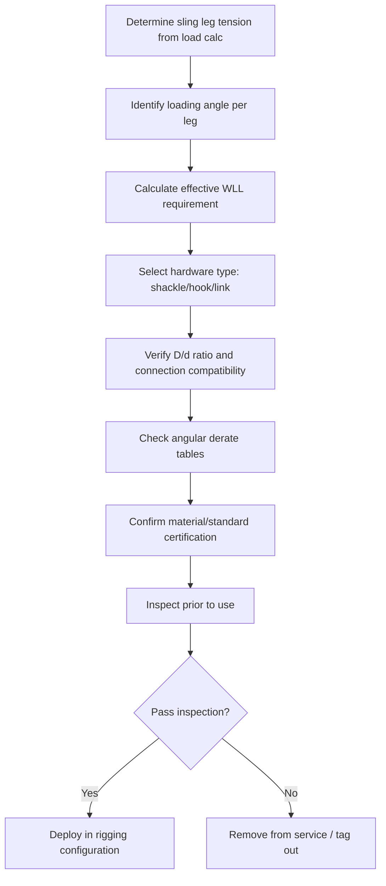

## Shackles, Hooks, and Rigging Hardware Selection

### Overview

Rigging hardware forms the connective backbone of every heavy-lift operation, transferring load between slings, wire rope, chain, and the lifted object or crane hook. Shackles, hooks, master links, eye bolts, turnbuckles, and swivels each carry distinct load ratings, failure modes, and application constraints. Selection errors in hardware are a leading cause of dropped-load incidents because hardware is often perceived as a "simple" component compared to slings or cranes, yet it operates at the same critical load path with less redundancy.

### Shackles

**Types**

- **Anchor (bow) shackles** — Larger, rounded bow shape; accepts multiple sling legs or angled loading without concentrating load on the pin. Preferred for multi-leg bridle configurations.
- **Chain (D-type) shackles** — Narrower, D-shaped body; rated for in-line pulls only. Loading at an angle reduces working load limit (WLL) significantly.
- **Screw pin shackles** — Threaded pin, hand-tightened; used for temporary or frequently reconfigured rigging. Pin can back out under vibration or repeated slack-taut cycling unless moused or secured.
- **Bolt-type (safety) shackles** — Bolt, nut, and cotter pin; pin cannot rotate or loosen under vibration. Standard for permanent, overhead, or personnel-adjacent lifts per most heavy-lift and crane-suspended-personnel codes.
- **Round pin shackles** — Lower-rated, for straight tension only, no side loading. Common in general rigging, not typically specified for heavy-lift critical paths.

**Material and Rating Standards**

Shackles used in heavy-lift work are typically manufactured to:

- **US:** Federal Specification RR-C-271 (legacy), ASME B30.26 (performance criteria for below-the-hook rigging hardware), and manufacturer ratings per Van Beest/Crosby (G-209, G-2130, G-2160, S-209, S-2130 series designations).
- **International:** EN 13889 (forged steel bow shackles), ISO 2415.

Working Load Limit is stamped on the bow. Angular loading derates capacity:

$$WLL_{effective} = WLL_{rated} \times \cos(\theta)$$

where $\theta$ is the angle between the shackle's centerline and the direction of pull. At $\theta = 45°$, effective capacity drops to roughly 71% of rated WLL; manufacturers often publish discrete derate tables rather than requiring field calculation, since angular loading also induces bending stress the cosine formula alone does not capture.

**Sizing and Pin Compatibility**

Shackle size is selected by matching WLL to calculated sling tension (see Rigging Fundamentals load calculations), then checking:

- Bow width accommodates the number and diameter of sling legs without pinching or cross-loading
- Pin diameter is compatible with the wire rope thimble or sling eye (undersized pins cause sling eye distortion; oversized pins in a bow reduce effective bearing area)
- D/d ratio (shackle pin diameter to sling rope diameter) meets manufacturer minimums to avoid choking the sling eye

**Inspection Criteria**

- No visible bending, elongation, or twisting of the bow
- Pin threads (screw pin) not stripped; pin fully seats and cannot be turned by hand once loaded
- No nicks, gouges, or corrosion pitting exceeding 10% of original cross-section
- Legible WLL stamp; unmarked or illegible shackles are removed from service
- Bolt-type: cotter pin present and not substituted with wire or improvised fasteners

### Hooks

**Types**

- **Eye hooks** — Fixed eye for direct sling attachment; used at crane hook or below master link
- **Sorting hooks** — Open throat, hand-guided; general material handling, not typically heavy-lift critical path
- **Grab hooks** — Chain-specific, engage a single chain link to shorten or adjust leg length; reduce chain WLL when engaged (never rated at full chain capacity)
- **Foundry/ram's horn hooks** — Deep throat, designed for ladle and specialized industrial loads
- **Swivel hooks** — Rotate under load to prevent sling twist; bearing-mounted swivel adds a rotational failure mode absent in fixed hooks

**Safety Latches**

Heavy-lift and most jurisdictional standards (OSHA 1926.1413 for below-the-hook devices, ASME B30.10) require hooks to have a latch unless the specific application (certain below-the-hook lifting devices with positive engagement) is exempted by engineering justification. The latch's function is to prevent sling/load disengagement during slack conditions, not to bear load — a latch is not rated to carry working load.

**Throat Opening and Deformation**

Hook capacity is governed by the manufacturer's rated WLL, but field inspection focuses on **throat opening deformation** as the primary sign of overload:

$$\text{Deformation \%} = \frac{\text{measured opening} - \text{nominal opening}}{\text{nominal opening}} \times 100$$

A throat opening exceeding 5–15% of nominal (manufacturer-specific threshold; commonly cited at 5% per ASME B30.10 guidance and 15% per some crane hook standards for larger hooks) is cause for immediate removal from service, since permanent deformation indicates the hook has been stressed beyond its elastic limit even if it has not visibly failed.

**Twist** is checked by comparing the hook tip's lateral offset from the plane of the hook body/shank — commonly a 10° twist threshold triggers removal.

### Master Links and Rigging Rings

Master links distribute multiple sling legs onto a single crane hook connection point. Selection criteria:

- Link diameter and cross-section rated for the *combined* vector sum of all leg tensions, not the sum of individual leg WLLs
- Sufficient bow radius so multiple shackles or sling eyes do not pinch or cross-load each other
- Oblong master links paired with a smaller "master coupling link" are common in multi-leg bridles to control leg spread and prevent link overload from too many components sharing one bearing point

### Eye Bolts and Lifting Points

- **Shoulder (should-eye) bolts** — Rated for both vertical and angular loading up to a manufacturer-specified angle (commonly 45° from vertical), with significant derating as angle increases
- **Shoulderless (plain) eye bolts** — Vertical, in-line loading only; angular loading induces bending on the threaded shank, a failure mode the design does not resist
- **Swivel hoist rings** — Rotate and pivot to self-align with the load vector, eliminating bending loads inherent to fixed eye bolts; preferred for angular or multi-directional rigging on machinery and fabricated loads

Installation torque, thread engagement depth, and base material (parent metal must have adequate thickness and strength around the tapped hole) are critical; a correctly rated eye bolt installed in inadequate parent material will pull out at a fraction of its rated capacity.

### Turnbuckles and Rigging Adjusters

Used for fine-tuning sling/guy-line tension and leveling loads:

- Jaw-jaw, jaw-eye, eye-eye configurations selected based on end-connection compatibility
- WLL derates with the turnbuckle open (extended) versus closed; manufacturers publish separate ratings per thread engagement
- Body must not be side-loaded; turnbuckles are in-line tension devices only

### Hardware Selection Workflow

### Compatibility and Cross-Loading Considerations

A recurring heavy-lift hardware failure mode is **fitting incompatible components together** — e.g., a screw-pin shackle pin diameter too small for a wire rope thimble, causing the thimble to spread and the rope to lose its designed bend radius, or two shackle bows point-loading against each other rather than bearing on their rounded backs. Rigging plans should specify exact component part numbers/WLL, not just "shackle, rated for X tons," since bow geometry and pin bearing area vary by manufacturer even at equal WLL.

### Example

A 3-leg bridle lifts a 45-metric-ton transformer, each leg at 35° from vertical.

Per-leg tension:

$$T_{leg} = \frac{W}{n \times \cos(\theta)} = \frac{45}{3 \times \cos(35°)} = \frac{45}{3 \times 0.819} \approx 18.3 \text{ t/leg}$$

Applying a design factor of 5:1 (typical for shackles per ASME B30.26 and manufacturer catalogs):

$$WLL_{required} = 18.3 \times \text{(no additional multiplier — 5:1 is already built into catalog WLL)}$$

Since catalog WLL already reflects the applicable design factor, the shackle is selected directly at ≥18.3 t rated WLL per leg — commonly the next standard size up (e.g., 20 t or 25 t bow shackle), with the master link separately verified for the vector-summed resultant at the crane hook connection point.

### Standards and Certification References

- ASME B30.26 — Rigging Hardware
- ASME B30.10 — Hooks
- EN 13889 — Forged Steel Bow Shackles
- ISO 2415 — Shackles
- OSHA 1926.1413 — Below-the-hook devices (crane standard applicability for personnel/critical lifts)

**Related Topics**

- Wire Rope and Synthetic Sling Selection Criteria
- Below-the-Hook Lifting Device Design
- Multi-Leg Bridle Sling Angle Calculations
- Rigging Hardware Inspection and Retirement Criteria
- Crane Hook Block and Headache Ball Selection
- Spreader Bar and Lifting Beam Fundamentals