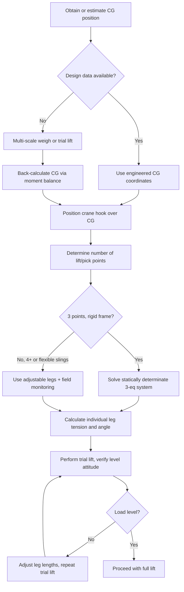

## Center of Gravity and Multi-Point Lift Calculations

### Overview

Center of gravity (CG) determination is the foundation on which every multi-point lift calculation rests. An inaccurate CG estimate propagates directly into incorrect sling leg tensions, uneven load distribution, and — in the worst case — a load that tips or slews unpredictably once it clears the ground. For heavy-lift and specialized cargo (irregular fabrications, modules with unevenly distributed internal equipment, asymmetric vessels), CG is frequently *not* at the geometric centroid, and treating it as such is a common root cause of rigging incidents.

### Determining Center of Gravity

**From Design Data**

The most reliable source is the manufacturer's or engineer's calculated CG, typically provided as coordinates (X, Y, Z) from a defined datum/origin on general arrangement or weight-and-balance drawings. For fabricated equipment, this is derived from a weighted summation of all component masses and their individual centroids:

$$\bar{x} = \frac{\sum_{i} m_i x_i}{\sum_i m_i}, \quad \bar{y} = \frac{\sum_{i} m_i y_i}{\sum_i m_i}, \quad \bar{z} = \frac{\sum_{i} m_i z_i}{\sum_i m_i}$$

where $m_i$ is the mass of component $i$ and $(x_i, y_i, z_i)$ its individual centroid location relative to a common datum.

**Empirical Determination (Trial Lift / Weigh Method)**

When design data is unavailable or unverified (common with modified, retrofitted, or field-fabricated equipment), CG is determined empirically:

1. **Multi-scale weighing** — Load is set on 3 or more load cells/scales at known, measured positions. Each scale reads a reaction force $R_i$. CG position is back-calculated by taking moments about reference axes:

$$\bar{x} = \frac{\sum_i R_i x_i}{\sum_i R_i}, \quad \bar{y} = \frac{\sum_i R_i y_i}{\sum_i R_i}$$

This method gives horizontal (plan-view) CG position directly but does not resolve vertical (height) CG.

2. **Trial lift with adjustment** — Load is lifted a small height (a few centimeters) using an initial best-estimate sling configuration with the crane hook centered over the estimated CG. If the load tilts, it indicates the actual CG is offset toward the "low" side. Sling lengths are adjusted (via chain hoists, come-alongs, or adjustable shackle/turnbuckle legs) between iterative trial lifts until the load hangs level. This is standard heavy-lift practice for the *final* verification step regardless of how CG was initially estimated.
3. **Tilt-table or pendulum method** — For determining vertical CG height specifically, the object is suspended from a single point and allowed to hang freely; the resulting angle, combined with a known dimension, allows vertical CG height to be back-calculated trigonometrically. Rarely used in field heavy-lift work outside specialized cases (e.g., vehicle or aircraft CG certification).

### Two-Point Lift Calculations

For two lift points at horizontal distances $a$ and $b$ from the CG (where $a + b = L$, the total distance between points), load distribution follows simple lever/moment balance:

$$R_1 = W \times \frac{b}{L}, \quad R_2 = W \times \frac{a}{L}$$

where $W$ is total weight, $R_1$ and $R_2$ are the reactions (sling tensions, assuming vertical slings) at each point. The lift point *closer* to the CG carries the *larger* share of the load — a frequently misunderstood relationship, since intuition often assumes symmetric points share load equally, when in fact only a CG exactly at the midpoint produces equal $R_1 = R_2$.

### Multi-Point (3+) Lift Calculations

With three or more lift points, the system becomes **statically indeterminate** if all points are rigid (no ability to individually adjust length) — there are more unknowns (individual leg tensions) than independent equilibrium equations (ΣF = 0, ΣM = 0 in each relevant plane) can solve for directly.

**Practical resolution methods:**

1. **Adjustable legs (chain hoists / come-alongs on each leg)** — Most common heavy-lift solution. Each leg's tension is set and monitored (via load pins or dynamometers) independently, and lengths are adjusted until the load is level and each leg carries its planned share, resolving the indeterminacy through active control rather than pure statics.
2. **Spreader frame with defined load points** — When a rigid spreader/lifting frame connects to the load at defined, engineered pick points (see Spreader Bars and Lifting Beams module), the frame's own structural design (not the sling system) resolves indeterminacy, and each pick point's reaction is calculated from the frame's engineered geometry using structural analysis (statically determinate if the frame is designed with, e.g., pin/roller-equivalent connections, or requiring finite element analysis if fully rigid/continuous).
3. **Statically determinate 3-point approximation** — For a rigid frame with exactly 3 support/pick points (not 4+), the system *is* statically determinate — three points define a plane, and reactions can be solved directly via the three equilibrium equations (ΣFz = 0, ΣMx = 0, ΣMy = 0) taking moments about the CG location:

$$\sum F_z = 0: \quad R_1 + R_2 + R_3 = W$$

$$\sum M_x = 0: \quad R_1 y_1 + R_2 y_2 + R_3 y_3 = W y_{cg}$$

$$\sum M_y = 0: \quad R_1 x_1 + R_2 x_2 + R_3 x_3 = W x_{cg}$$

Solving this system (three equations, three unknowns $R_1, R_2, R_3$) gives each point's exact vertical reaction, assuming vertical slings/supports at each point.

**Four-plus-point lifts** are inherently indeterminate for pure statics and require either the adjustable-leg field method above, or engineering analysis (finite element modeling of the spreader structure and load) to determine a valid, safe distribution — often specifying a *range* of acceptable tensions per leg rather than one exact value, with field monitoring to keep each leg within that band.

### Asymmetric and Off-Center Loads

For loads with CG offset from the geometric center of the lift points, sling leg angles differ from each other even in a "symmetric-looking" rig, because the hook must be positioned directly above the CG (not above the geometric centroid) for the load to hang level. This means:

- Individual sling leg *lengths* often differ (shorter legs on the side closer to CG, to bring the hook over the CG position)
- Individual leg *angles from vertical* differ correspondingly, requiring separate angular-derate calculations per leg (see Shackles/Hooks module) rather than one uniform angle applied to all legs
- Hardware selection (shackles, master link) must be sized to the *highest* individual leg tension, not an average

### Practical Field Verification

Regardless of how thoroughly CG is calculated in advance, heavy-lift practice universally requires a **trial lift** — raising the load a short distance, holding it, and visually/instrumentally confirming it hangs level (or at the intended attitude, for loads with an intentionally non-level lift orientation) before proceeding to the full lift height or travel path. [Inference] Skipping trial lift verification in favor of calculated values alone is a practice generally discouraged across heavy-lift standards and contractor procedures, since unmodeled factors (internal liquid/product shift, as-built weight deviations from design drawings, unaccounted-for attached equipment) routinely cause real CG to differ from calculated CG by a nontrivial margin.

### Example

A rectangular module weighs 60 t. Calculated/as-built CG is located 3.5 m from lift point A and 2.5 m from lift point B along the long axis (total span 6 m between points).

$$R_A = W \times \frac{b}{L} = 60 \times \frac{2.5}{6} = 25 \text{ t}$$

$$R_B = W \times \frac{a}{L} = 60 \times \frac{3.5}{6} = 35 \text{ t}$$

Point B, being closer to CG, carries the larger share (35 t) despite intuition suggesting a 30/30 split for "symmetric-looking" rigging — sling and shackle hardware at point B must be sized to 35 t plus the appropriate design factor and angular derate, not to half the total load.

**Related Topics**

- Multi-Leg Bridle Sling Angle Calculations
- Spreader Bars and Lifting Beams
- Shackles, Hooks, and Rigging Hardware Selection
- Load Cell and Dynamometer Monitoring During Lifts
- Trial Lift Procedures and Acceptance Criteria
- Weight and CG Verification for Transport and Skidding Operations