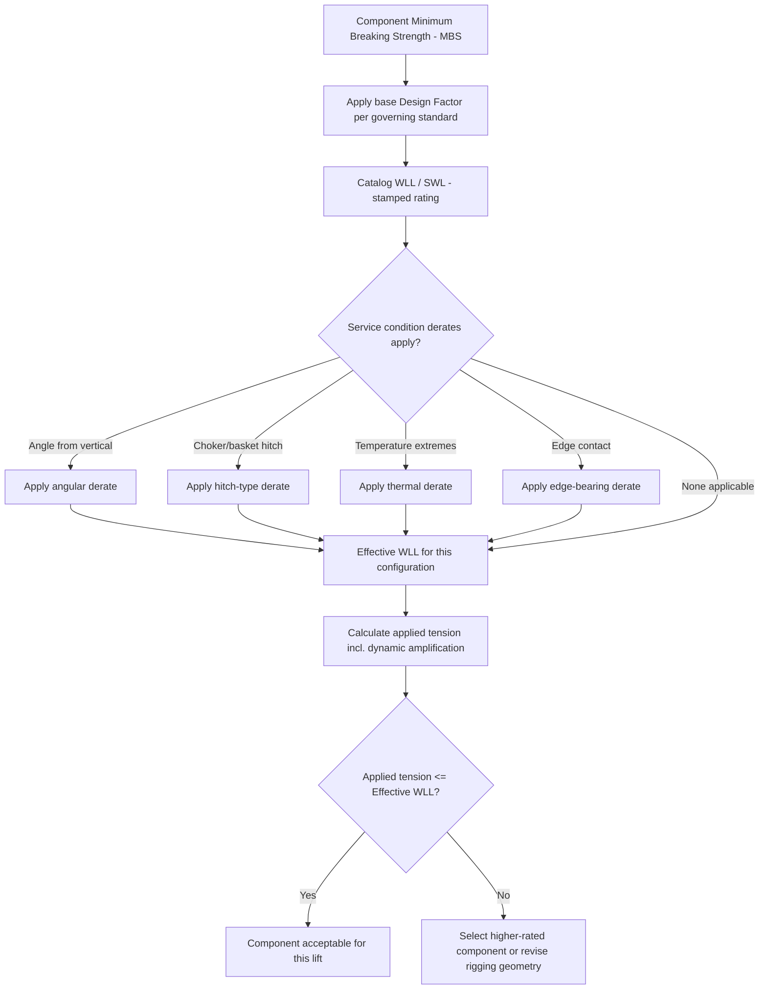

## Safe Working Load and Factor of Safety in Rigging

### Overview

Safe Working Load (SWL) — also termed Working Load Limit (WLL) in most current standards — and its underlying Factor of Safety (FoS, also called Design Factor) are the quantitative foundation that connects a component's ultimate physical strength to the load it is permitted to carry in service. Every rigging calculation covered elsewhere in this chapter (sling tension, shackle selection, spreader bar sizing) terminates in a comparison against a component's WLL, making correct understanding of how that number is derived essential to interpreting it correctly rather than treating it as an arbitrary manufacturer figure.

### Core Definitions

**Minimum Breaking Strength / Ultimate Load (MBS/UL)** — The load at which a component fails catastrophically, determined by destructive testing of a sample population or by calculation validated against such testing.

**Design Factor (Factor of Safety)** — The ratio between MBS and WLL:

$$DF = \frac{MBS}{WLL}$$

**Working Load Limit (WLL) / Safe Working Load (SWL)** — The maximum load a component is authorized to carry in normal service, derived by dividing MBS by the applicable design factor:

$$WLL = \frac{MBS}{DF}$$

The terms SWL and WLL are frequently used interchangeably in practice, though some standards bodies (notably in the transition from older UK/Commonwealth terminology to modern international standards) have shifted formally from "SWL" to "WLL" to emphasize that the rated figure is a *limit* on a specific, defined component under specific, defined conditions — not a general safety allowance that absorbs uncertainty in the load itself.

### Why Design Factors Exist

The design factor is not a single margin against one uncertainty — it is a composite allowance covering multiple independent sources of variability, including:

- **Material property variation** — actual yield/tensile strength of a given manufactured batch versus the nominal/minimum specified value
- **Manufacturing and fabrication tolerances** — dimensional variance, weld quality, forging/casting defects below the threshold of standard inspection
- **Dynamic and shock loading** — sudden load application (two-blocking, snatch loads, load swinging into an obstruction) that exceeds the static calculated tension, sometimes substantially
- **Wear, fatigue, and service degradation** — a component's actual strength declines over its service life from corrosion, abrasion, and cyclic loading, and the design factor provides margin against this decline between inspection intervals
- **Calculation and estimation uncertainty** — imprecision in load weight, CG location, and sling angle measurements in the field

Because these factors compound rather than being independently and fully captured elsewhere, design factors are set well above 1.0, and different component types receive different design factors based on how failure occurs and how consequential/sudden that failure mode is.

### Design Factors by Component Type

Design factors are not uniform across rigging hardware — they are calibrated by industry consensus standards to the failure characteristics of each component class:

| Component | Typical Design Factor | Governing Standard (representative) |
| --- | --- | --- |
| Alloy chain slings | 4:1 | ASME B30.9 |
| Wire rope slings | 5:1 | ASME B30.9 |
| Synthetic web/round slings | 5:1–7:1 | ASME B30.9 |
| Shackles (alloy) | 5:1–6:1 | ASME B30.26 / manufacturer catalog |
| Hooks | 5:1 (approx., per ASME B30.10 provisions) | ASME B30.10 |
| Wire rope (running, on cranes) | 3.5:1–5:1 (duty-dependent) | ASME B30.5 / manufacturer |
| Below-the-hook lifting devices (custom) | 2:1 (yield) / higher on ultimate, per design case | ASME B30.20 |
| Crane structural components | Varies — often stated as load combinations rather than a single scalar DF | ASME B30.5 / manufacturer |

[Unverified] — exact design factors vary by edition of the governing standard, jurisdiction, and specific manufacturer certification, so the values above should be confirmed against the current edition of the applicable standard and the specific component's certification documentation before use in a real lift plan; this table is a general orientation, not a substitute for the stamped/certified rating on the component itself.

Note that a *lower* published design factor (e.g., 2:1 for some engineered lifting devices, evaluated against yield rather than ultimate strength) does not imply the component is "less safe" — it reflects that engineered devices with documented, controlled manufacturing and predictable failure modes (ductile yielding with visible warning, versus sudden brittle fracture) can be rated more precisely and closer to their actual strength, whereas mass-produced hardware and slings carry higher factors to blanket-cover unknown provenance, wear history, and less predictable failure behavior.

### Static vs. Dynamic Loading Adjustments

The design factor built into a component's catalog WLL assumes **static** (or near-static, slowly-applied) loading. Heavy-lift operations frequently introduce dynamic amplification that the base WLL does not automatically account for:

$$T_{dynamic} = T_{static} \times DAF$$

where $DAF$ (Dynamic Amplification Factor) is applied for conditions such as:

- Crane boom/load acceleration and deceleration during pick and set
- Wind-induced load oscillation
- Sudden stops (particularly with mobile/crawler cranes traveling with a suspended load)
- Multi-crane lifts where load sharing between cranes changes dynamically as rigging geometry shifts

[Inference] Published DAF values vary considerably by lift plan methodology and governing engineering specification (some heavy-lift engineering guides apply a blanket 10–25% dynamic allowance for standard crane lifts, with higher factors for more dynamic operations such as float-over or barge-based lifts subject to wave action) — the specific DAF for a given operation should come from the project's engineered lift plan or applicable heavy-lift standard rather than a generic assumption, since this is one of the more methodology-dependent figures in rigging engineering.

### Cumulative Design Factor in a Rigging System

A rigging system is a chain of components (sling → shackle → master link → hook), and the overall system's effective margin is governed by its **weakest link**, not an average or sum of individual component factors:

$$WLL_{system} = \min(WLL_{sling}, WLL_{shackle}, WLL_{masterlink}, WLL_{hook}, \ldots)$$

This is why rigging plans specify every component's individual WLL rather than a single system-level number — a correctly selected 20 t sling paired with an undersized 15 t shackle produces a 15 t system, and the sling's excess capacity provides no benefit to overall system safety.

### Derating Conditions That Reduce Effective WLL Below Catalog Value

Beyond the base design factor, several service conditions reduce a component's *effective* WLL below its catalog-stamped value, requiring a derate calculation on top of (not instead of) the base design factor:

- **Sling angle from vertical** (see Shackles/Hooks and CG modules) — effective capacity reduces as angle from vertical increases
- **Temperature** — synthetic slings derate significantly above/below manufacturer-specified temperature bands; wire rope and chain have their own, less severe, thermal limits
- **Choker hitch vs. vertical/basket hitch** — sling configuration changes effective WLL as a fraction of the vertical-rated WLL (choker hitches commonly rated at ~80% of vertical WLL for wire rope, with specific published factors per sling type)
- **Edge contact / bend radius** — sharp or small-radius edges bearing on a sling reduce its effective strength below the rated WLL for a padded or large-radius bend
- **Chemical exposure and UV degradation** — synthetic slings in particular lose strength from exposure over time, independent of the mechanical design factor

### Determining Whether a Lift Is Within Limits

The core verification for every rigging component in a lift plan reduces to:

$$T_{applied} \leq WLL_{derated}$$

where $T_{applied}$ includes static tension plus any applicable dynamic amplification, and $WLL_{derated}$ is the catalog WLL after applying all relevant service-condition derates (angle, hitch type, temperature, edge effects). A common field error is comparing calculated tension only against the *catalog* WLL while omitting angle or hitch-type derates, which can result in a component appearing adequately rated on paper while actually operating above its true effective capacity for the specific rigging configuration used.

### Example

A wire rope sling has a catalog vertical WLL of 10 t (MBS approximately 50 t at the standard 5:1 design factor). It is used in a choker hitch at a 30° angle from vertical, with a manufacturer-published choker derate factor of 0.8 applied on top of the angular derate.

$$WLL_{effective} = WLL_{catalog} \times \cos(\theta) \times \text{choker factor} = 10 \times \cos(30°) \times 0.8 = 10 \times 0.866 \times 0.8 \approx 6.9 \text{ t}$$

If the calculated static leg tension for this configuration is 6.5 t, and the project's lift plan specifies a 15% dynamic amplification for standard mobile crane picks:

$$T_{applied} = 6.5 \times 1.15 \approx 7.5 \text{ t}$$

Here $T_{applied}$ (7.5 t) **exceeds** $WLL_{effective}$ (6.9 t) — this sling, though seemingly oversized at a glance (10 t catalog rating against a 6.5 t static tension), is under-capacity once the choker hitch derate and dynamic amplification are correctly applied, and a higher-rated sling or a change in hitch configuration (e.g., to vertical/basket rather than choker) is required.

**Related Topics**

- Shackles, Hooks, and Rigging Hardware Selection
- Center of Gravity and Multi-Point Lift Calculations
- Sling Hitch Configurations (Vertical, Choker, Basket)
- Dynamic Load Amplification in Crane Operations
- Wire Rope and Synthetic Sling Inspection and Retirement Criteria
- Below-the-Hook Lifting Device Design (ASME B30.20)