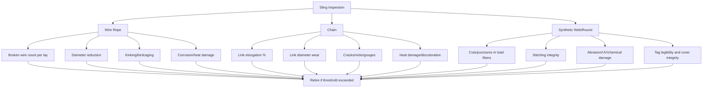

## Wire Rope, Chain, and Synthetic Sling Inspection

### Overview

Sling inspection is the primary field control that verifies a component's *actual* condition still matches the assumptions embedded in its catalog Working Load Limit (see Safe Working Load and Factor of Safety module). A sling's rated capacity is calculated from a new, undamaged, correctly manufactured item — service wear, damage, and degradation erode that margin continuously, and inspection is the mechanism that catches deterioration before it consumes the design factor entirely. Wire rope, chain, and synthetic slings degrade through materially different mechanisms, so each requires a distinct inspection discipline rather than a single generic checklist.

### Inspection Frequency Categories

Across all sling types, standards (ASME B30.9 and equivalents) generally define three inspection tiers:

- **Initial inspection** — before first use, verifying correct rating, tagging, and no shipping/manufacturing damage
- **Frequent inspection** — visual, by the operator or rigger, before each use or each shift
- **Periodic inspection** — documented, by a designated/qualified inspector, at intervals based on service severity (typically annually at minimum, more frequently for severe service — defined by frequency of use, load severity, and environmental exposure)

### Wire Rope Sling Inspection

**Broken Wire Criteria**

The primary quantitative retirement criterion for wire rope is broken wire count, assessed over defined lengths:

- **Running rope (on drums/sheaves):** typically retired at 6 randomly distributed broken wires in one rope lay, or 3 broken wires in one strand in one lay
- **Standing/sling rope:** retirement thresholds are generally more conservative, since slings see fewer bend cycles but are often subjected to higher relative loading and abrasion at the same points repeatedly

A **lay** is the length along the rope in which one strand makes one complete revolution around the core — the standard unit of measurement for distributing broken wire counts, since counting broken wires over an arbitrary length can misrepresent true degradation concentration.

**Diameter Reduction**

Wire rope diameter is measured across the crown of two opposite strands, not across a valley, and compared to nominal diameter. Common retirement thresholds:

- Greater than 5% reduction from nominal diameter due to internal or external wire loss/wear
- Greater than 5% reduction due to core failure/loss (rope goes "soft" and diameter often reduces measurably, sometimes accompanied by a wire rope going noticeably slack or "birdcaging")

$$\text{Diameter Reduction \%} = \frac{d_{nominal} - d_{measured}}{d_{nominal}} \times 100$$

**Other Wire Rope Rejection Criteria**

- **Kinking** — permanent, localized deformation from improper handling (uncontrolled spooling, pulling rope through a tight radius); a kink permanently damages the rope's internal geometry and is not repairable
- **Birdcaging** — strands separate and displace outward from the core, typically from sudden load release (shock unloading) or torsional imbalance; indicates internal rope structure is compromised even where individual wires are not visibly broken
- **Core protrusion** — independent wire rope core (IWRC) or fiber core pushing out between strands
- **Corrosion** — pitting, especially internal corrosion not visible without opening the rope (a significant concern for slings stored or used in marine/humid environments), which reduces cross-sectional area without proportional visible wire breakage
- **Heat damage** — discoloration (bluish/straw tinting) indicating exposure to temperatures that alter the wire's heat-treatment properties, reducing strength independent of visible wear
- **End fitting damage** — cracked, worn, or deformed swaged sleeves, thimbles pulled out of shape, or hand-spliced eyes with reduced tuck engagement

### Chain Sling Inspection

**Link Elongation/Stretch**

Chain retirement is primarily governed by measurable stretch, since chain link steel yields (elongates) measurably before ultimate failure — providing an inspectable warning that wire rope's more brittle failure characteristics don't offer to the same degree:

$$\text{Elongation \%} = \frac{L_{measured} - L_{nominal}}{L_{nominal}} \times 100$$

measured over a reference length (commonly per-link or over a fixed number of links, per manufacturer/standard guidance) — a chain exceeding a specified elongation threshold (commonly 3% per widely referenced alloy chain sling standards, though the exact figure is manufacturer/standard-specific) is retired regardless of whether individual links show other visible damage.

**Link Wear**

Chain link cross-sectional diameter is measured at the point of maximum wear (typically where adjacent links bear against each other) and compared to nominal:

- Retirement commonly triggered at approximately 10% reduction in link diameter from nominal (again standard/manufacturer-specific — should be confirmed against the applicable chain manufacturer's published criteria)

**Other Chain Rejection Criteria**

- **Nicks, gouges, and cuts** — reduce local cross-section and, more importantly, create stress concentration points that can initiate cracking under cyclic load, independent of overall diameter loss
- **Bent or twisted links** — indicate the chain has been side-loaded or overloaded beyond its design geometry
- **Cracks** — any visible crack is immediate cause for retirement, regardless of size, since chain link steel crack propagation under cyclic loading is a well-documented brittle-adjacent failure path
- **Weld repairs** — field welding of alloy chain is generally prohibited outside of manufacturer-certified repair processes, since improper welding alters the heat-treated microstructure the chain's rated strength depends on
- **Heat damage / discoloration** — similar concern to wire rope; alloy chain's strength is heavily dependent on a specific heat-treatment condition that improper heat exposure (fire, cutting torch proximity, improper welding) can destroy without visible deformation

### Synthetic Sling Inspection (Web and Round Slings)

Synthetic slings (nylon, polyester, high-performance fiber round slings) present the most visually accessible but arguably fastest-degrading inspection profile of the three sling types, since fiber damage from UV, abrasion, and chemical exposure can occur without leaving obvious surface signs proportional to actual strength loss.

**Core Rejection Criteria**

- **Cuts, snags, or punctures** in the load-bearing fibers — any cut exceeding manufacturer-specified depth/length thresholds is cause for removal; unlike a wire rope broken wire count, a single deep cut in a synthetic sling's core fibers can represent a large fraction of total load-bearing capacity at that cross-section
- **Broken or worn stitching** — for web slings, load-bearing stitch patterns are engineered; broken stitches at load-bearing seams are immediate rejection criteria, not cosmetic damage
- **Excessive abrasion** — surface fiber wear that exposes or thins the load-bearing yarns, visible as a "fuzzy" or worn surface texture distinct from the sling's original weave
- **Chemical/acid or caustic burns** — visible as brittleness, discoloration, or a change in surface texture; chemical exposure can degrade synthetic fiber strength substantially with minimal visible surface change depending on the chemical and exposure duration, making manufacturer chemical compatibility charts important for slings used in chemical-exposure environments
- **Heat damage / melting** — fused, glazed, or melted fibers, indicating exposure beyond the sling material's rated temperature range
- **UV degradation** — long-term outdoor storage/use exposure causes progressive strength loss; polypropylene is generally more UV-sensitive than nylon or polyester, and manufacturer guidance on maximum service life under UV exposure should govern retirement scheduling independent of visible damage
- **Missing, illegible, or damaged tag** — the sling's identification tag carries its WLL and construction data; a sling with an illegible or missing tag is generally retired since the rated capacity cannot be field-verified

**Round Sling Specific Inspection**

Round slings enclose load-bearing yarns inside a protective cover, which complicates inspection since the load-bearing fibers are not directly visible:

- Cover damage exposing the internal core is itself a rejection criterion, independent of confirmed damage to the core fibers, because the cover's protective function against abrasion/UV/cuts is compromised
- Any visible reduction in the sling's cross-sectional bulk (a section that appears thinner than the rest of the sling) indicates internal core yarn damage or displacement

### Comparative Inspection Summary

### Documentation and Recordkeeping

Periodic inspections require documented records, typically including: sling identification (serial/tag number), inspection date, inspector identity/qualification, findings, and disposition (accepted, repaired, or retired). This creates an auditable service history that supports both regulatory compliance and internal fleet management, and allows trending of specific sling populations against expected service life for a given severity of use.

### Example

A 2-year-old alloy chain sling used in an industrial demolition application (severe service — repeated shock loading, high-cycle use) is due for periodic inspection.

Nominal link diameter is 16 mm. Field measurement at the point of visible maximum wear reads 14.3 mm.

$$\text{Wear \%} = \frac{16 - 14.3}{16} \times 100 \approx 10.6\%$$

At approximately 10.6% diameter reduction — exceeding a common 10% retirement threshold for chain link wear — this sling is retired from service even though it shows no cracks, elongation beyond threshold, or other independently disqualifying damage; wear alone at this magnitude is sufficient grounds for removal, since the reduced cross-section directly reduces the link's actual breaking strength below the margin the rated WLL assumes.

**Related Topics**

- Safe Working Load and Factor of Safety in Rigging
- Sling Hitch Configurations (Vertical, Choker, Basket)
- Shackles, Hooks, and Rigging Hardware Selection
- Rigging Equipment Documentation and Certification Recordkeeping
- Below-the-Hook Lifting Device Design (ASME B30.20)
- Environmental and Chemical Exposure Effects on Rigging Hardware