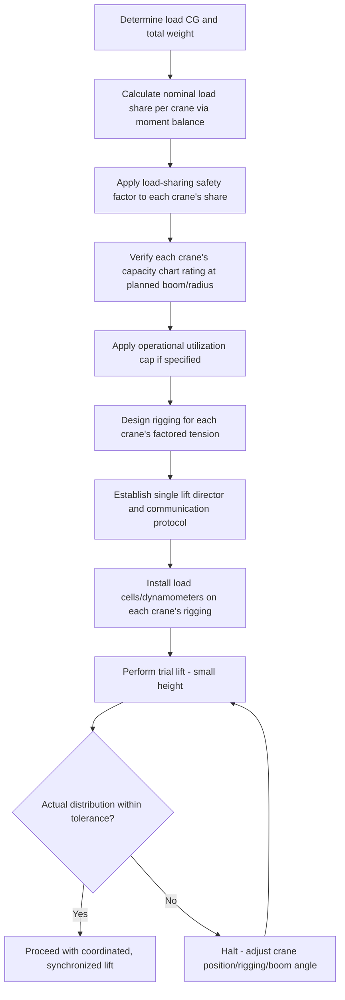

## Tandem and Multi-Crane Lift Load Sharing

### Overview

Tandem (dual) and multi-crane lifts involve two or more cranes simultaneously supporting a single load — a configuration used when a load exceeds a single crane's capacity, when a load's dimensions require support at widely separated points beyond what one crane's rigging can span, or when a load must be maneuvered/rotated in a manner one crane cannot achieve alone. Unlike single-crane multi-point rigging (see Center of Gravity module), load sharing between independent cranes introduces additional complexity because each crane has its own boom deflection characteristics, its own operator, and its own capacity chart — meaning load distribution errors compound across both the rigging geometry *and* the relative behavior of two separate machines.

### Fundamental Load Distribution Calculation

For a two-crane tandem lift, initial load distribution follows the same moment-balance principle as a two-point single-crane lift, treating each crane's hook position as a support point relative to the load's CG:

$$R_1 = W \times \frac{b}{L}, \quad R_2 = W \times \frac{a}{L}$$

where $a$ and $b$ are the horizontal distances from the CG to each crane's hook position (projected in plan view), and $L = a + b$. This gives the *nominal* static share each crane must be rated to carry.

### Why Nominal Distribution Is Insufficient

Unlike a single crane's own multi-leg rigging, where all legs terminate at one rigid hook point, tandem lifts involve two independently supported points that can move relative to each other. Several factors mean actual load share deviates from the simple nominal calculation, and multi-crane lift planning applies a **load-sharing safety factor** on top of the nominal distribution — commonly requiring each crane to be rated for a higher percentage of total load than its calculated nominal share, precisely because the following effects are difficult to predict and control with full precision:

- **Boom deflection differences** — Two cranes, even of identical make/model, deflect differently under load due to boom angle, length, and reeving differences; as one crane's boom deflects more than the other under load application, the load shifts additional weight onto the *less-deflecting* (relatively "stiffer" at that instant) crane
- **Ground/outrigger settlement variance** — Differential settlement between the two cranes' pick locations shifts effective load distribution, particularly on soft or uneven ground
- **Unequal hook/boom-tip synchronization during hoisting** — If both cranes do not raise their hooks at precisely matched rates, the load tilts, transferring additional load to whichever crane is lifting faster/higher at that moment
- **Load flexibility** — If the lifted object itself is not perfectly rigid (long, slender loads especially), differential crane movement can induce load deflection that changes the effective load path

### Industry-Standard Load-Sharing Factors

[Inference] Common heavy-lift industry practice applies a design allowance where each crane in a two-crane tandem lift is rated to carry more than its calculated nominal share — frequently cited guidance suggests each crane should be capable of handling on the order of 75% (rather than the nominal 50%) of total load in a symmetric two-crane lift, though the specific factor used varies by engineering firm, lift complexity, and applicable heavy-lift guideline, and should be confirmed against the project's specific lift plan methodology and the crane manufacturer/owner's requirements rather than assumed as a universal figure. For asymmetric distributions (CG not centered between the two cranes), the factor is applied proportionally, with the more heavily loaded crane typically requiring an even greater margin above its nominal share.

### Capacity Chart Derating for Multi-Crane Configurations

Beyond the load-sharing factor itself, each crane's *own* capacity chart rating for the specific boom length, radius, and configuration used in the lift must independently satisfy standard single-crane capacity requirements — a crane's rated capacity at a given radius does not change because it is sharing the load with another crane. Additionally, many lift plans apply a further utilization cap (commonly a percentage of each crane's charted capacity, such as 75–80%, distinct from the load-sharing factor above) as an operational margin specifically for multi-crane lifts, reflecting the reduced ability to react to an unexpected dynamic event when two independent machines are involved.

### Rigging and Communication Requirements

**Synchronized Operation**

- A single, designated **lift director** (or signal person with defined authority over both crane operators) coordinates the lift, since independent operator judgment calls that make sense for a single crane can create dangerous divergence in a tandem lift
- Radio communication protocols specifying exact terminology, with practice/dry-run communication before the actual lift where practical
- Both cranes should hoist, boom, and swing in a coordinated, typically simultaneous and matched-rate sequence — a common practice is very slow, incremental movement with frequent pause-and-check points rather than continuous motion, particularly during pick-up and set-down

**Rigging Configuration**

- Each crane's rigging (slings, shackles, spreader/lifting beam elements) is calculated and rated independently for that crane's share of the load, using the load-sharing-factored tension, not the nominal tension
- Where a rigid spreader or lifting frame spans between both crane hooks, the frame itself must be engineered for the multi-crane load case, including scenarios where load distribution shifts during the lift (not just the static, level, evenly-distributed case)

### Load Monitoring During the Lift

Real-time load monitoring is standard practice for multi-crane lifts, using load cells or dynamometers in the rigging path of each crane to provide the lift director with actual, live tension data — since the calculated nominal/factored distribution is a planning basis, not a guarantee of actual distribution once the lift is underway. Load cell data allows the lift director to halt the lift and adjust (via crane repositioning, boom angle change, or rigging adjustment) if actual distribution diverges from planned distribution beyond an established tolerance band.

### More Than Two Cranes

Three-or-more-crane lifts introduce the same statically indeterminate condition discussed in the Center of Gravity module for multi-point single-crane lifts, compounded by the independent-machine factors above. These configurations are rare, reserved for exceptionally large or geometrically constrained loads, and virtually always require detailed engineering analysis (finite element modeling of load distribution across all support points under multiple loading scenarios) rather than field-adjustable resolution alone, given the substantially higher consequence of an uncontrolled load-shift event across three or more independently operated cranes.

### Engineering Lift Plan Requirements

Multi-crane lifts virtually always require a formal, engineered lift plan (versus a field-developed rigging plan for many single-crane lifts), typically including:

- Calculated load distribution under nominal and worst-case (e.g., one crane momentarily taking a disproportionate share during an asynchronous movement) scenarios
- Ground bearing pressure analysis at each crane's outrigger/track position, since two heavily loaded cranes near each other can also interact through shared or overlapping ground pressure zones
- Crane positioning and boom clearance analysis to prevent boom/load/structure interference between the two machines
- A documented, rehearsed communication and abort/emergency-lower procedure

### Example

A 140 t module is lifted by two mobile cranes. The module's CG sits 6 m from Crane A's hook position and 4 m from Crane B's hook position (10 m total span between hook positions).

Nominal distribution:

$$R_A = 140 \times \frac{4}{10} = 56 \text{ t}, \quad R_B = 140 \times \frac{6}{10} = 84 \text{ t}$$

Applying a project-specified load-sharing factor requiring each crane to be capable of handling 75% of total load (a common conservative planning basis for two-crane symmetric-type lifts, adapted here for an asymmetric case by ensuring the *already higher-loaded* crane's rating carries the larger of either its nominal share or the 75% threshold):

$$R_{B,factored} = \max(84, \, 140 \times 0.75) = \max(84, 105) = 105 \text{ t}$$

Crane B — already carrying the larger nominal share — must therefore be selected and configured (boom length/radius) to a rated capacity of at least 105 t at its working radius, not the 84 t nominal figure, reflecting the added margin the load-sharing factor requires for the more heavily loaded machine in this configuration.

**Related Topics**

- Center of Gravity and Multi-Point Lift Calculations
- Crane Capacity Charts and Configuration Selection
- Ground Bearing Pressure and Outrigger/Mat Sizing
- Safe Working Load and Factor of Safety in Rigging
- Lift Plan Development and Engineering Review Process
- Load Cell and Dynamometer Monitoring During Lifts