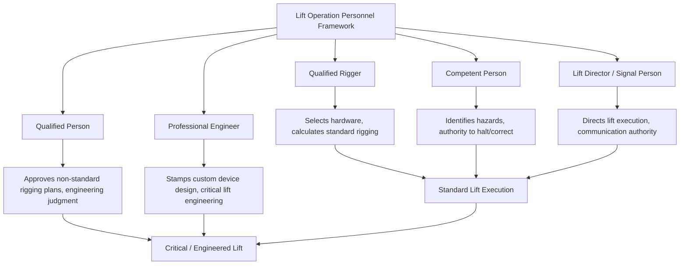

## Rigging Certification and Competent Person Requirements

### Overview

Rigging operations are governed not only by equipment standards (sling ratings, hardware selection, load calculations covered elsewhere in this chapter) but by a parallel framework of *personnel* qualification requirements — defining who is legally and technically authorized to design rigging, direct a lift, inspect equipment, and physically rig a load. This framework distinguishes several overlapping but distinct roles, each with different training depth, certification pathways, and scope of authority, and conflating them is a common source of both regulatory non-compliance and real operational risk.

### Key Personnel Roles

**Qualified Rigger**

A rigger who has been trained and can demonstrate the skill and knowledge to properly rig a load for a given lift — including selecting appropriate hardware, calculating sling angles and tensions, and inspecting rigging components before use. In many regulatory frameworks (notably U.S. OSHA construction standards, 29 CFR 1926.1401 definitions and related crane subpart provisions), a "qualified rigger" is defined by demonstrated knowledge and skill rather than a specific mandatory certificate — meaning an employer must be able to document *how* a given rigger's qualification was verified (training records, practical evaluation, documented experience), even where no single third-party certification is legally mandated for all rigging work.

**Qualified/Competent Person**

Distinct terminology with specific legal meaning in many jurisdictions:

- **Competent Person** — (US OSHA usage) An individual capable of identifying existing and predictable hazards in the surroundings or working conditions, and who has authorization to take prompt corrective measures to eliminate them. For rigging/lifting, this typically applies to the person responsible for hazard identification during the operation (ground conditions, overhead obstructions, weather).
- **Qualified Person** — An individual who, by possession of a recognized degree, certificate, or professional standing, or who by extensive knowledge, training, and experience, has successfully demonstrated the ability to solve problems relating to the subject matter and work. This standard is invoked for rigging plan design, load calculations, and engineering judgment calls that exceed routine rigging.

[Inference] The precise legal definitions, evidentiary requirements, and which activities require a "competent person" versus a "qualified person" versus a certified rigger vary meaningfully by jurisdiction and applicable regulatory framework (OSHA in the US, provincial/territorial regulations in Canada, HSE guidance in the UK, and equivalent bodies elsewhere) — this content should be treated as a general orientation to the *categories* of role that virtually all frameworks recognize in some form, not a substitute for consulting the specific regulation applicable to a given project's jurisdiction.

**Lift Director / Signal Person**

For complex lifts (particularly critical and multi-crane lifts, see Tandem and Multi-Crane Lift Load Sharing module), a designated lift director holds overall authority and communication control during the lift itself, distinct from the rigger(s) who prepared the rigging beforehand. Signal person qualification (in frameworks that formally define it) typically requires demonstrated knowledge of standard hand signals, radio communication protocols, and the basic physics/geometry of crane operation sufficient to recognize an unsafe condition developing during the lift.

**Professional Engineer (PE) / Chartered Engineer**

For engineered lifts — custom below-the-hook devices (see Spreader Bars and Lifting Beams module), multi-crane configurations, or lifts exceeding standard rigging complexity — a licensed engineer's stamped calculations and design are typically required, particularly for:

- Custom-fabricated lifting devices and spreader/lifting frames
- Critical lifts as defined by project specification or regulatory threshold (commonly defined by percentage of crane capacity utilized, load value, or consequence of failure)
- Lift plans for unusual geometry, non-standard rigging configurations, or lifts near critical infrastructure

### Certification Pathways

While "qualified rigger" status does not universally require a single mandated third-party certificate, industry practice and many individual employer/project specifications reference established certification bodies and programs as the documented basis for demonstrating qualification:

- **NCCCO (National Commission for the Certification of Crane Operators)** — offers a Rigger Level I and Level II certification program widely referenced in North American construction and industrial rigging as a documented qualification pathway, distinguishing basic rigging tasks (Level I) from more complex rigging design and multi-leg/multi-point configurations (Level II)
- **Employer-based qualification programs** — documented in-house training, practical evaluation, and supervised experience, common where no external certification is mandated but the employer must still be able to demonstrate the basis for qualification if challenged
- **Manufacturer/equipment-specific training** — for specialized rigging hardware, some manufacturers offer or require product-specific training as a component of overall rigger qualification for that equipment

[Unverified] — the specific certifications recognized or required as sufficient documentation of "qualified rigger" status vary by jurisdiction, industry sector (construction vs. general industry vs. maritime, for example), and individual project/employer specification; the certifications named above are commonly referenced examples, not an exhaustive or universally mandatory list.

### Scope of Authority Distinctions

A frequent point of confusion in practice is assuming a certification in one area confers authority in an adjacent one. Typical (though jurisdiction-dependent) distinctions:

- A qualified rigger is authorized to rig a *standard* lift within their demonstrated competency, but is generally **not** automatically authorized to design custom lifting devices or approve non-standard/critical lift plans — that authority typically sits with a qualified/competent person at a higher designation, or a PE for engineered devices
- A signal person's authority governs *communication and hazard-stop authority during the lift*, not rigging design — a signal person identifying an unsafe condition can halt a lift, but is not necessarily the person who calculated the original rigging plan
- Crane operator certification (a separate, extensively regulated pathway in most jurisdictions) does not itself confer rigging qualification — an operator is qualified to operate the crane, not necessarily to design or inspect the rigging attached to it, though in smaller operations one individual sometimes holds multiple qualifications

### Documentation Requirements

Regardless of specific jurisdictional certification requirements, sound rigging practice generally expects the following to be documented and available for review:

- Training records and/or certification documentation for each rigger and signal person involved in a given lift
- The basis for "qualified" determination where no external certificate exists (practical evaluation records, supervised experience logs)
- Identification of the specific individual(s) designated as competent person and lift director for a given operation, particularly for critical/complex lifts where this designation should be explicit rather than assumed
- Engineering stamps/certifications for any custom rigging device or critical lift plan requiring PE sign-off

### Critical Lift Threshold Determination

Many organizations and project specifications define a **critical lift** by threshold criteria (commonly including some combination of: load exceeding a defined percentage of crane capacity at the working radius, use of two or more cranes, lift over occupied structures/roadways, lifts involving personnel platforms, or non-routine rigging configurations), and critical lift designation triggers elevated personnel requirements — typically mandating qualified/competent person review and, often, PE-stamped lift plans, beyond what a standard lift requires. [Inference] The specific numeric thresholds (e.g., load at X% of chart capacity) vary considerably by company policy and project specification rather than being set by a single universal regulatory figure, so project-specific critical lift definitions should govern rather than an assumed industry-standard percentage.

### Example

A construction project's rigging plan calls for a 3-leg bridle lift of a 22 t precast element using standard shackles and wire rope slings, at 40% of the crane's rated capacity at the working radius — below the project's defined critical lift threshold of 75% of chart capacity.

Under a typical framework, this lift requires:

- A **qualified rigger** (documented via NCCCO Rigger Level I/II certification or equivalent employer-verified qualification) to select hardware and perform the sling angle/tension calculations
- A **competent person** on site with authority to assess ground conditions, weather, and overhead hazards before and during the lift
- A **signal person** if the operator's view of the load path is obstructed

Because the lift falls below the critical lift threshold, it does **not** require a PE-stamped lift plan under this project's framework — that requirement would only trigger if the load, capacity utilization, or configuration crossed into the project's defined critical lift criteria (e.g., if capacity utilization exceeded 75%, or a second crane were introduced).

**Related Topics**

- Tandem and Multi-Crane Lift Load Sharing
- Safe Working Load and Factor of Safety in Rigging
- Below-the-Hook Lifting Device Design (ASME B30.20)
- Critical Lift Plan Development and Engineering Review Process
- Crane Operator Certification and Licensing Requirements
- Site-Specific Hazard Assessment for Heavy-Lift Operations