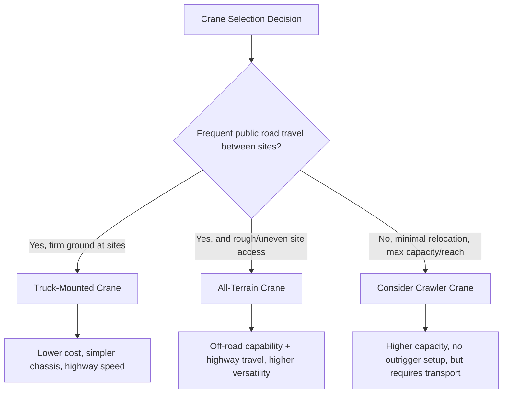

## Truck-Mounted and All-Terrain Mobile Cranes

### Overview

Truck-mounted and all-terrain (AT) cranes represent the most common wheeled mobile crane configurations in heavy-lift and general construction service, distinguished from crawler cranes (covered separately in this chapter) by their ability to self-travel on public roads between sites without separate transport, and from each other primarily by chassis design, axle configuration, and the resulting trade-off between road travel speed/legality and off-road/rough-terrain capability.

### Truck-Mounted Cranes

**Configuration**

A truck-mounted crane consists of a crane superstructure (boom, cab, counterweight, hoist machinery) mounted on a commercial highway truck chassis, typically with the crane operator's cab separate from the truck's driving cab. Outriggers extend from the chassis to provide a stable lifting base, since the truck's highway suspension and tires are not load-bearing during lift operations.

**Characteristics**

- Highway-legal axle spacing and configuration allows travel at normal highway speeds between job sites without special escort in many jurisdictions (subject to overall length/weight/axle-load permitting requirements, particularly for larger units)
- Two operating cabs — a lower truck cab for road travel and a separate upper crane cab for lift operations — is common on larger truck cranes, though some designs consolidate to a single cab
- Generally limited to reasonably firm, level ground for outrigger setup; not intended for rough/unimproved terrain
- Boom types include telescopic (most common on modern truck cranes) and, on older or specialized units, lattice boom

**Typical Application**

Truck cranes are frequently selected where a project requires moderate lift capacity with frequent relocation between sites primarily via public roads — commercial construction, utility work, and general industrial lifts where the travel efficiency between a series of job sites outweighs the need for off-road mobility.

### All-Terrain (AT) Cranes

**Configuration**

All-terrain cranes are purpose-built (not a commercial truck chassis adaptation) with a single cab design (in most modern AT cranes) that serves both road travel and, on many models, crane operation — some models retain a separate upper cab for the crane function while still being purpose-engineered as a unified chassis/crane system. All axles are typically both steered and driven (all-wheel drive, all-wheel steer), a defining characteristic that distinguishes AT cranes from truck-mounted cranes.

**Characteristics**

- **All-wheel drive and all-wheel steer** — enables genuine off-road and rough-terrain mobility (within the crane's rated ground clearance and articulation limits) while retaining full highway travel capability, combining attributes that truck-mounted cranes and rough-terrain cranes each only partially offer
- **Crab steering and coordinated steering modes** — multiple steering modes (standard front-steer, crab steer where all wheels turn in the same direction for lateral movement, and coordinated/circle steering for tight-radius maneuvering) improve maneuverability in constrained sites
- **Higher capacity range** — AT crane product lines span from smaller compact units up through some of the largest wheeled mobile cranes manufactured, often overlapping with and in some very large models exceeding typical crawler crane capacities for a given configuration, particularly with the largest telescopic and telescopic-with-lattice-extension AT models
- **Central tire inflation systems** — many AT cranes include the ability to adjust tire pressure for different surface conditions (higher pressure for highway travel, lower for improved traction/flotation off-road)
- **Multi-axle configurations** — larger capacity AT cranes require additional axles to distribute weight for highway legal travel, which increases overall length and turning radius as capacity increases

### Comparative Selection Factors

| Factor | Truck-Mounted | All-Terrain |
| --- | --- | --- |
| Highway travel speed | Generally higher (standard truck chassis/suspension) | Good, though larger multi-axle units may have lower practical top speed |
| Off-road/rough terrain capability | Limited | Strong (all-wheel drive/steer) |
| Site access flexibility | Requires reasonably firm, prepared ground | Handles uneven, soft, or constrained sites better |
| Typical capacity range | Small to moderate | Small through very large (widest range of any wheeled mobile crane type) |
| Relative acquisition/operating cost | Generally lower | Generally higher, reflecting drivetrain complexity |
| Cab configuration | Often two cabs (road + crane) | Often single or purpose-integrated cab design |

[Inference] Exact capacity overlap and specific highway travel speed/permitting differences vary significantly by specific manufacturer model, jurisdiction axle-weight regulations, and configuration (number of axles, counterweight carried during travel) — the comparative characterization above describes general industry tendencies rather than fixed universal figures, and specific project crane selection should be based on the actual manufacturer capacity chart and the specific jurisdiction's road travel regulations for the unit under consideration.

### Outrigger and Setup Considerations

Both crane types depend on outriggers for lift stability, since neither type's road-going suspension/tires are rated to bear lift loads:

- **Outrigger spread** (fully extended vs. mid-extended vs. fully retracted) directly affects the crane's rated capacity chart — most capacity charts are published per specific outrigger spread configuration, and a crane operated at reduced outrigger spread has substantially reduced capacity at every radius compared to full spread
- **Ground bearing pressure** under each outrigger pad must be verified against actual ground/mat capacity (see Ground Bearing Pressure and Outrigger/Mat Sizing, referenced in the Rigging Fundamentals chapter), particularly critical for AT cranes operating on softer or less-prepared ground than their off-road mobility might otherwise suggest is acceptable for a stationary lift
- **Level setup** — outriggers must establish a level crane platform within the manufacturer's specified tolerance; operating outside level tolerance derates capacity and, in more severe cases, is an outright prohibited condition on the capacity chart

### Boom Configuration

Both truck-mounted and AT cranes predominantly use **telescopic boom** construction in current production, with boom extension achieved via internal hydraulic cylinders and sliding boom sections. Capacity at any given lift is a function of:

- Boom length (extended configuration)
- Boom angle (radius)
- Outrigger spread configuration
- Counterweight installed
- Any boom extension/jib attachments fitted

Load charts are read as a matrix against these variables, and the applicable configuration's specific chart line — not a single "crane capacity" number — governs the maximum permitted load at the planned lift radius and boom length.

### Regulatory and Travel Considerations

- **Permitting** — larger truck-mounted and especially larger multi-axle AT cranes frequently require oversize/overweight permits and escort vehicles for road travel, varying by jurisdiction's specific axle weight and overall length/width limits
- **Counterweight during travel** — many jurisdictions restrict how much counterweight can be carried on the crane itself during road travel (versus transported separately by support trucks), affecting how quickly a crane can be rigged for lifting upon arrival versus requiring counterweight to be delivered and installed on site
- **Operator licensing** — operating a truck-mounted or AT crane on public roads may require both a commercial driver's license (for the road-travel function) and separate crane operator certification (for the lifting function), which is a distinguishing licensing consideration compared to crawler cranes that are typically transported rather than self-driven

### Example

A utility contractor requires a crane to install prefabricated substation equipment across multiple sites in a single week, with sites ranging from paved municipal yards to unimproved rural access roads with soft shoulder conditions.

A **truck-mounted crane** would offer efficient highway travel between sites but risks inadequate mobility/flotation at the unimproved rural sites, potentially requiring the crane to remain on prepared roadway and rig from a greater, capacity-reducing radius, or requiring separate ground improvement before setup.

An **all-terrain crane** — despite higher acquisition/rental cost — better serves this mixed-site-condition scenario: all-wheel drive/steer allows it to reach closer, more favorable rigging positions at the rough-terrain sites while retaining full highway travel capability between sites, avoiding the need for a crawler crane's separate transport logistics at every relocation.

**Related Topics**

- Crawler Cranes and Track-Mounted Systems
- Crane Capacity Charts and Configuration Selection
- Ground Bearing Pressure and Outrigger/Mat Sizing
- Rough-Terrain Cranes vs. All-Terrain Cranes
- Crane Transport, Permitting, and Route Surveys
- Boom Extension, Jib, and Attachment Configurations