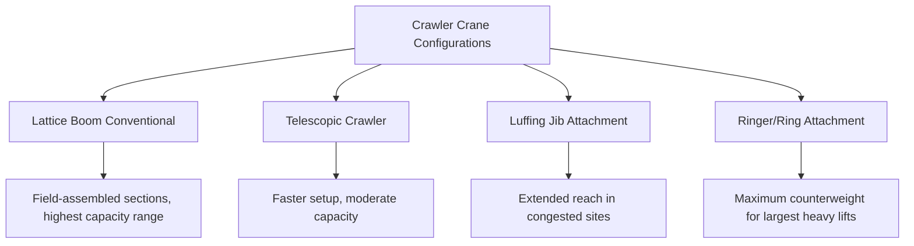

## Crawler Crane Configurations and Ground Conditions

### Overview

Crawler cranes replace the wheeled/outrigger stability system used by truck-mounted and all-terrain cranes (see previous module) with continuous track undercarriages, fundamentally changing both how the crane distributes load to the ground and how it must be transported between sites. This trade-off — sacrificing self-propelled highway travel for superior ground bearing distribution, pick-and-carry capability, and generally higher achievable capacity at a given size — makes crawler cranes the preferred choice for the largest and most capacity-intensive heavy-lift operations, at the cost of substantially more complex mobilization logistics.

### Track Undercarriage Fundamentals

**Ground Bearing Distribution**

A crawler's continuous track spreads the crane's total weight (crane + counterweight + load) over a much larger contact area than outrigger pads, directly reducing ground bearing pressure for a given total weight:

$$P = \frac{W_{total}}{A_{track}}$$

where $A_{track}$ is the total ground contact area of both tracks combined. This lower, more evenly distributed pressure is what allows crawler cranes to operate on softer ground than an equivalent-capacity wheeled crane could tolerate without extensive matting, though crawler cranes still frequently require ground improvement (timber mats, engineered pads) for very soft ground or very high-capacity lifts.

**No Outrigger Setup**

Unlike wheeled cranes, a crawler crane lifts directly from its tracks with no separate outrigger deployment step — the crane can typically begin lift operations essentially immediately upon reaching level, adequately prepared ground, without the outrigger extension/leveling sequence wheeled cranes require. This also means crawler crane capacity charts are not divided by outrigger spread configuration (a major chart variable for wheeled cranes) but instead primarily by boom length/configuration, radius, and counterweight.

### Common Crawler Crane Configurations

**Lattice Boom (Conventional)**

The traditional and still widely used crawler configuration: a bolted/pinned lattice boom structure, assembled from sections on site, offering high strength-to-weight ratio and the ability to reach very long boom lengths and heavy capacities through modular section assembly. Boom length is changed by adding or removing sections — a field assembly/disassembly process rather than hydraulic telescoping.

**Telescopic Crawler Cranes**

A telescopic boom (similar in principle to truck/AT crane booms) mounted on a crawler undercarriage, combining crawler ground-bearing advantages with the setup speed of a telescoping boom (no field boom-section assembly required). Generally available in a lower capacity/reach range than the largest lattice boom crawlers, but faster to mobilize and reconfigure than lattice designs.

**Luffing Jib Attachments**

A secondary, hydraulically or mechanically luffed (angle-adjustable) jib mounted at the main boom's tip, used to extend reach and working radius flexibility, particularly valuable in congested sites (urban high-rise construction is a common application) where the luffing jib's steep angle capability allows working close to the crane's own base while still achieving significant height.

**Ringer and Ring Attachments**

For very high-capacity heavy lifts, some crawler crane systems add a separate ring (a large-diameter counterweight-supporting ring structure independent of the crawler undercarriage itself), which allows substantially greater counterweight to be applied without that counterweight's load passing through and limiting the crawler undercarriage's own structural rating — a configuration reserved for the largest heavy-lift applications, such as major industrial module installation or large wind turbine erection.

### Ground Condition Assessment

**Bearing Capacity Determination**

Before crawler crane setup, the ground's allowable bearing capacity must be established, typically via:

- **Geotechnical investigation** — soil borings, plate load tests, or standard penetration tests providing a documented allowable bearing pressure for the specific site
- **Engineering judgment based on known site history** — for previously tested or well-characterized industrial sites, existing geotechnical data may be applied, though this carries more risk than site-specific testing if conditions have changed (fill placement, water table changes, prior excavation)
- **Visual/qualitative assessment** — for lower-risk, lighter lifts, a competent person's visual assessment of soil type, moisture, and any visible signs of prior disturbance may be judged sufficient by project procedure, though this approach is generally discouraged for larger or critical lifts given its inherently higher uncertainty

**Comparing Applied Pressure to Allowable Bearing Capacity**

$$FS_{bearing} = \frac{q_{allowable}}{q_{applied}}$$

where $q_{applied}$ is the crane's calculated ground bearing pressure under the specific lift condition (including load, boom position, and swing angle — pressure is not uniform across the track footprint and varies significantly with boom orientation relative to the tracks) and $q_{allowable}$ is the site's determined safe bearing capacity. A design factor is applied here as well (commonly requiring $FS_{bearing}$ of 2 or greater, though specific project/geotechnical engineering requirements govern the exact value), reflecting uncertainty in both the soil data and the crane's actual load distribution under dynamic/swinging conditions.

**Non-Uniform Track Pressure**

Because the crane's counterweight and boom are positioned toward the rear and the load is out over the front (at whatever swing angle the boom currently sits), ground pressure is **not evenly distributed** across the two tracks or along a single track's length — the track nearer the counterweight and the track nearer the load-side generally see different pressure depending on boom swing position, and the leading/trailing edges of each track see different pressure than the track's center. [Inference] Crane manufacturers typically publish track pressure data or provide calculation methodology accounting for this non-uniformity as a function of load, radius, and swing angle, and this manufacturer-specific data — rather than a simple total-weight-over-total-area average — should govern actual ground pressure verification for a specific lift, since the average figure can understate peak pressure at the most heavily loaded track zone.

### Ground Improvement (Matting)

When native ground bearing capacity is insufficient for calculated crane pressure, ground improvement is used to increase the effective bearing area and/or distribute load into deeper, more competent soil layers:

- **Timber mats** — thick engineered timber mats placed under and beyond the track footprint, spreading pressure over a larger area before it reaches the native soil surface
- **Steel plates** — used similarly to timber mats, sometimes in combination, particularly for very high-pressure applications or where timber mat degradation/replacement cost is a concern
- **Compacted aggregate/engineered fill** — improving the near-surface soil condition directly, often combined with matting
- **Multiple layers / cribbing** — for the most demanding ground conditions, layered mat systems (crane mats over a compacted aggregate base, for example) further reduce pressure transmitted to weak native soil

Matting design (mat size, thickness, layer configuration) is itself an engineering calculation, verifying that the mat's own bending/deflection under the track's pressure is within acceptable limits, and that pressure at the *base* of the mat system (transmitted into the native soil) meets the site's allowable bearing capacity — a mat that is too thin or too small in area does not fully solve an inadequate native soil condition.

### Transport and Mobilization Logistics

Unlike self-propelled wheeled cranes, crawler cranes generally cannot travel under their own power on public roads and require disassembly (boom sections, counterweight, crawler/carbody components) for transport via specialized trailers, followed by on-site reassembly:

- **Mobilization time** — reassembly of a large lattice boom crawler crane can take substantially longer than setting up a comparable wheeled crane, a significant project scheduling consideration
- **Assembly crane requirement** — larger crawler crane assembly frequently requires a secondary, smaller "assist" crane to lift boom sections and counterweight into position during buildup
- **Site access for transport** — the disassembled components (particularly very heavy counterweight sections and long boom sections) themselves constitute heavy-lift transport loads, requiring their own route survey and permitting consideration (see Crane Transport, Permitting, and Route Surveys)

### Traveling (Pick-and-Carry) with Load

A capability generally unique to crawler cranes among the mobile crane types discussed in this chapter: the ability to travel (crawl) short distances *while* carrying a suspended load, used in some heavy industrial and module-placement applications. This capability is governed by a **separate, generally more conservative capacity chart** than the static lift chart, since dynamic effects of travel (uneven ground induced load swing, track articulation over irregular surfaces) introduce additional loading the static chart does not account for. [Inference] Not all crawler cranes or all load/configuration combinations are rated for pick-and-carry operation — this should be confirmed against the specific crane's manufacturer-published pick-and-carry chart (where one exists) rather than assumed as a universal crawler crane capability.

### Example

A lattice boom crawler crane with a total operating weight (crane, counterweight, and load) of 450 t sits on a track system with a combined ground contact area of 30 m² under a particular boom/load configuration.

Average applied pressure:

$$q_{applied} = \frac{450,000 \text{ kg} \times 9.81 \text{ m/s}^2}{30 \text{ m}^2} \approx 147,150 \text{ Pa} \approx 147 \text{ kPa}$$

If site geotechnical data establishes an allowable bearing capacity of 100 kPa for the native soil, the crane as configured **exceeds** allowable capacity ($FS = 100/147 \approx 0.68$, below the required factor of safety), requiring either ground improvement (mats sized to spread the load over a larger effective area) or a reduced-capacity configuration (shorter boom, less counterweight, or a lift plan repositioning the crane where more favorable native soil is available) before proceeding — a straightforward illustration of why ground condition verification is treated as an equal-priority calculation alongside the crane's own structural/capacity chart limits, not a secondary or assumed-adequate consideration.

**Related Topics**

- Truck-Mounted and All-Terrain Mobile Cranes
- Ground Bearing Pressure and Outrigger/Mat Sizing
- Crane Transport, Permitting, and Route Surveys
- Crane Capacity Charts and Configuration Selection
- Tandem and Multi-Crane Lift Load Sharing
- Boom Extension, Jib, and Attachment Configurations