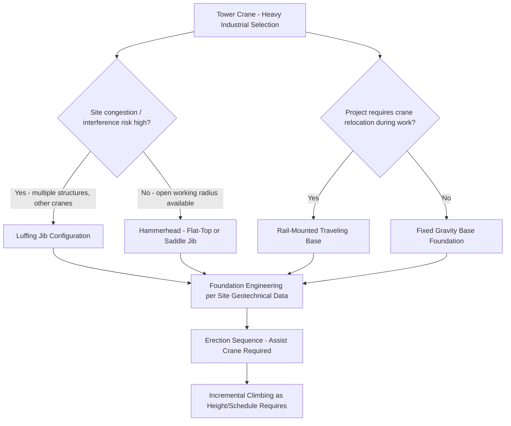

## Tower Cranes in Heavy Industrial Applications

### Overview

Tower cranes are fixed-base, vertically-erected cranes that trade the mobility of truck-mounted, all-terrain, and crawler cranes (covered in this chapter's preceding modules) for sustained high-hook height, extended horizontal reach, and long-duration on-site service without the repeated setup/breakdown cycle mobile cranes undergo between lifts. While most commonly associated with high-rise building construction, tower cranes serve a distinct and significant role in heavy industrial applications — refinery and petrochemical turnarounds, power plant construction, and heavy manufacturing facility buildouts — where sustained lift capability over an extended project duration outweighs the mobility advantages mobile cranes offer.

### Core Configuration Types

**Hammerhead (Flat-Top and Saddle Jib) Tower Cranes**

The horizontal jib configuration most associated with tower cranes: a horizontal working jib extends from the mast, with the trolley (hoist rope carriage) traveling along the jib's length to vary working radius, while a shorter counter-jib carries counterweight. Two principal sub-variants:

- **Saddle jib (top-slewing with A-frame/pendant support)** — a peaked A-frame structure above the jib with pendant cables supporting the jib in tension, the traditional and still common configuration
- **Flat-top** — eliminates the A-frame/pendant structure, relying on the jib's own truss depth for stiffness; simplifies erection (particularly relevant where multiple cranes operate in proximity, since flat-top design reduces jib-to-jib and jib-to-structure interference height) and is increasingly common on modern industrial and construction sites

**Luffing Jib Tower Cranes**

The jib angle is adjustable (luffed) rather than fixed horizontal, allowing the crane to reduce its working radius and jib angle for operation in highly congested sites or where slewing (rotating) with a fixed horizontal jib would create interference with adjacent structures, other cranes, or site boundaries — a significant consideration in dense industrial retrofit/turnaround environments where multiple structures and existing equipment already occupy the site.

**Self-Erecting Tower Cranes**

Smaller-capacity units that raise and configure their own mast and jib via integrated hydraulic systems, without requiring a separate assist crane for erection. Generally lower capacity than hammerhead/luffing types and less common in heavy industrial application (more associated with smaller building construction), but occasionally used for lighter, extended-duration industrial lift needs where minimal erection footprint/logistics is valued.

### Heavy Industrial Application Considerations

**Extended Project Duration Justification**

Tower cranes' fixed installation makes economic and logistical sense specifically where a project's duration and repeated lift activity over months (rather than a discrete lift event) favor a fixed installation's per-lift efficiency over a mobile crane's superior flexibility but higher relative cost/logistics burden for sustained, repeated use over that same duration. Common heavy industrial scenarios:

- **Power plant construction** (fossil, nuclear, and increasingly renewable/battery storage facility construction) — extended construction duration with continuous material and module handling needs
- **Refinery/petrochemical turnarounds and major expansions** — particularly where a tower crane's ability to work over and around existing, operating process equipment (via appropriate exclusion zones and coordination) suits the constrained, congested nature of a live industrial site better than repeated mobile crane mobilization
- **Heavy manufacturing facility construction** — shipyards, large fabrication facilities, and similar heavy-industry buildouts

**Foundation and Anchoring**

Unlike mobile cranes' outrigger or track ground-bearing distribution, a tower crane's entire structural load path concentrates through its base foundation, requiring purpose-engineered foundation design:

- **Fixed/gravity base foundations** — a substantial reinforced concrete foundation, engineered specifically for the crane's overturning moment, vertical load, and horizontal (wind/operational) loads at the specific site's soil conditions
- **Traveling/rail-mounted base** — for applications requiring the crane to relocate along a defined track during the project (moving between sequential work areas within a large industrial site), a rail system replaces the fixed foundation, introducing its own bearing and rail-alignment engineering requirements
- **Tie-in/anchoring to adjacent structure** — for very tall installations, the mast is laterally tied to the adjacent building/structure at intervals as it climbs, a configuration more common in high-rise construction but occasionally relevant to tall industrial structure construction (large process towers, stack construction) as well

**Climbing/Height Growth**

Tower cranes gain height incrementally rather than being erected at final height in one operation:

- **External climbing** — the crane climbs on the outside of the mast, with a climbing frame/hydraulic system inserting new mast sections at the base of the tower section, progressively raising the entire upper crane assembly
- **Internal (building) climbing** — for building-integrated applications, the crane climbs within the structure itself (through a floor opening), less common in typical industrial (non-high-rise) applications but occasionally used in tall industrial structure construction

### Capacity and Load Chart Structure

Tower crane capacity is governed primarily by the trolley/hook radius (distance from the mast centerline) rather than boom angle as with telescopic mobile cranes — capacity decreases as radius increases, following the jib's own structural bending capacity and the counterweight/counter-jib moment balance:

$$M_{load} = W_{load} \times R_{radius} \leq M_{rated}$$

where $M_{rated}$ is the crane's maximum permitted overturning/structural moment at the jib. This means, distinct from mobile crane charts organized around boom length/angle/outrigger spread, tower crane charts are typically organized as maximum load at each discrete radius point along the jib, often presented as a simple radius-versus-capacity table or graph.

### Wind and Environmental Exposure

Because tower cranes remain erected and exposed to weather for the full project duration — unlike a mobile crane present only during discrete lift operations — wind loading is a persistently critical operational and structural consideration:

- **Operational wind limits** — maximum wind speed for active lifting, typically well below the crane's *structural* survival wind rating, since dynamic load control during active lifting is far more sensitive to wind-induced load swing than the stationary structure's ability to simply withstand wind pressure
- **Out-of-service (weathervaning) condition** — when not actively lifting, the slewing brake is typically released, allowing the jib to freely weathervane (align with wind direction) rather than resisting wind load rigidly, significantly reducing structural loading during storms compared to a fixed orientation
- **Anemometer monitoring** — wind speed monitoring at the jib tip (where wind speed is generally highest due to height and reduced ground-level obstruction) is standard for operational go/no-go decisions

### Interference Management in Multi-Crane Industrial Sites

Heavy industrial construction sites frequently operate multiple tower cranes simultaneously, in close enough proximity that jib sweep radius, height (top-slewing units at different final heights), and slewing paths create collision risk:

- **Anti-collision systems** — increasingly standard on modern installations, using zone-based slewing/radius limitation, often integrated with real-time position sensing between adjacent cranes
- **Height staggering** — cranes at different final heights allow jibs to pass over/under each other in defined zones, combined with operational protocols restricting simultaneous slewing into shared airspace
- **Site-specific crane interface/coordination procedures** — formal documented protocols governing which crane has priority in shared zones, communication requirements between operators, and defined no-go time windows for specific crane movements

### Erection, Climbing, and Dismantling as Critical Lift Events

Each stage of a tower crane's service life — initial erection, height climbing, and eventual dismantling — constitutes its own critical lift operation (see Rigging Certification and Competent Person Requirements module for critical lift personnel/engineering requirements), typically requiring:

- A separate mobile (usually crawler or large AT) assist crane rated for the specific mast/jib section weights and lift heights involved
- Engineered erection/climbing/dismantling procedures specific to the manufacturer's design, since climbing sequences involve transient structural configurations (partially completed mast, temporary support conditions) not present during normal, fully-erected operation
- Weather window planning, since erection and especially climbing operations are typically more wind-sensitive than routine lifting once fully erected and ballasted/counterweighted

### Example

A refinery expansion project requires continuous heavy lifting of structural steel and equipment modules over an 18-month construction duration, within a congested existing process area with limited mobile crane maneuvering room and several tall existing process towers creating overhead obstruction concerns.

A **luffing jib tower crane** on a fixed gravity foundation is selected over repeated mobile crane mobilization: the luffing jib's reduced-radius/steep-angle capability allows the crane to work close to its base without its jib sweeping into the existing process towers during slewing, while its single, long-duration installation avoids the cost and schedule impact of repeatedly mobilizing and de-mobilizing a large mobile crane (with the associated route surveys and permitting per the Crane Transport module) for each of the numerous individual lifts spread across the 18-month schedule. Foundation design accounts for the specific soil conditions adjacent to the existing operating units, and an anti-collision coordination protocol is established given a second tower crane operating on an adjacent portion of the same expansion.

**Related Topics**

- Crawler Crane Configurations and Ground Conditions
- Truck-Mounted and All-Terrain Mobile Cranes
- Ground Bearing Pressure and Outrigger/Mat Sizing
- Rigging Certification and Competent Person Requirements
- Tandem and Multi-Crane Lift Load Sharing
- Wind Loading and Environmental Limits on Crane Operations