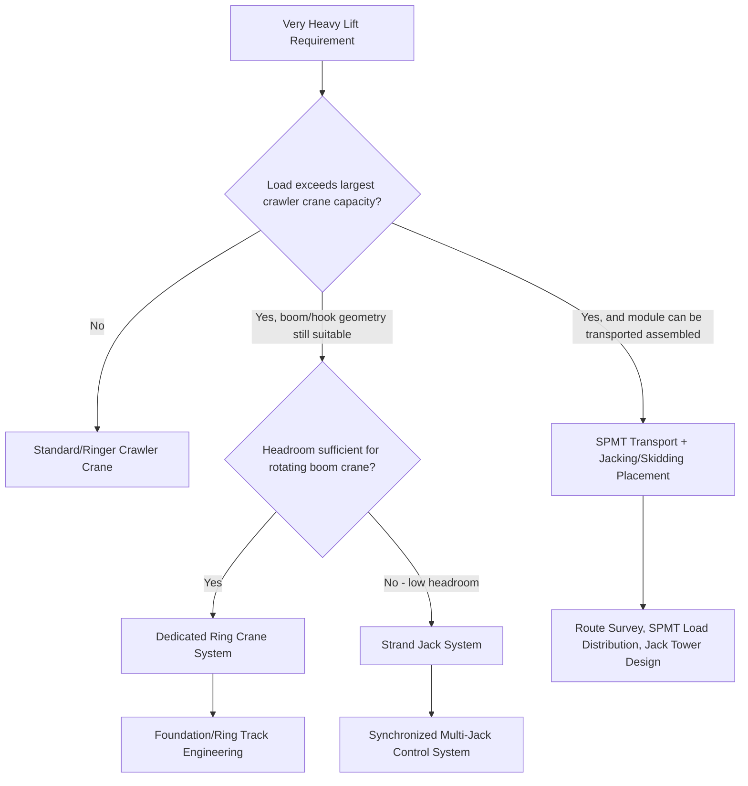

## Ring Cranes and Very Heavy Lift Capacity Systems

### Overview

Ring cranes and other very heavy lift (VHL) capacity systems occupy the extreme upper end of the crane capability spectrum, engineered for lifts that exceed what even the largest conventional crawler cranes (see Crawler Crane Configurations module) can achieve — typically thousands of metric tons at significant radius. These systems are purpose-deployed for a narrow set of applications: nuclear plant module installation, large-scale petrochemical reactor/column setting, wind turbine installation at increasing turbine sizes, and other megaproject-scale lifts where the lift itself is frequently the schedule-critical, headline engineering event of the entire project.

### Ring Crane Fundamentals

**Core Configuration**

A ring crane separates the crane's slewing/rotating upperworks from a conventional crawler undercarriage by mounting the entire rotating structure — boom, counterweight, and hoist machinery — on a large-diameter ring (a circular track/bearing structure) that rests directly on the ground or on a prepared ring foundation, rather than on the crawler tracks that would otherwise need to carry that entire structural and counterweight load.

**Why This Matters Structurally**

In a conventional crawler crane, all load — boom load, counterweight, and the crane's own structural weight — passes through the crawler undercarriage and track system, which becomes the limiting structural element as capacity scales upward. By transferring the primary vertical and moment loads directly to a large-diameter ring bearing on the ground (or a purpose-built ring foundation), a ring crane configuration allows:

$$M_{overturning} = W_{load} \times R_{load} - W_{counterweight} \times R_{counterweight}$$

to be resisted by a much larger effective base diameter and ground contact area than any crawler undercarriage could practically provide, since the ring's diameter can be sized specifically to the required stability moment rather than constrained by standard crawler track dimensions. This is the fundamental reason ring crane systems can achieve capacities substantially beyond conventional crawler crane maximums.

**Mobility Trade-off**

Ring cranes generally have limited or no self-propelled travel capability with load — the ring bearing system prioritizes stability and capacity over mobility, meaning ring cranes are typically assembled at a specific location for a specific major lift or sequence of lifts, then disassembled and relocated (often to another position on the same megaproject site) as a substantial, engineered undertaking rather than routine crane travel.

### Common Ring Crane / VHL System Types

**Ringer Attachment (Crawler-Base Hybrid)**

As introduced in the Crawler Crane module, a "ringer" configuration adds a ring structure around (or adjacent to) a crawler crane's base, allowing significantly increased counterweight to be applied without that counterweight's moment passing entirely through the crawler undercarriage's own structural rating — effectively a hybrid between a standard crawler crane and a full ring crane, retaining more of the crawler's assembly/mobility characteristics while substantially increasing achievable capacity.

**Dedicated Ring Crane Systems**

Purpose-built systems (several major heavy-lift equipment manufacturers produce dedicated ring crane product lines) where the entire upperworks rotates on the ring with no conventional crawler undercarriage beneath it at all — the ring itself, resting on a prepared foundation or ground-bearing ring track, is the crane's entire ground interface. These systems achieve the highest capacities in the mobile/semi-mobile crane category, engineered specifically for the largest industrial and energy-sector megaproject lifts.

**Strand Jack and Hydraulic Jacking Systems**

For lifts that exceed even the largest ring crane capacities, or where the lift geometry (very low headroom, very heavy but compact loads) doesn't suit a rotating boom crane at all, strand jack systems provide an alternative approach: multiple hydraulic strand jacks, each gripping and incrementally pulling a high-tensile steel strand bundle, lift a load in small synchronized increments from a supporting frame or tower structure positioned around/above the load.

- **Synchronization** is the critical engineering/operational control — multiple strand jacks must lift in precisely coordinated increments to keep the load level and to ensure the calculated load distribution across jack points is actually achieved in practice, generally managed via a centralized hydraulic control and monitoring system rather than independent jack operation
- **Applications** — module installation in extremely low-headroom environments (inside existing process structures), very heavy single-piece lifts (reactor vessels, large modules) where total weight exceeds practical crane capacity even at ring-crane scale, and specialized applications like bridge segment lifting/launching
- **Not a crane in the rotating-boom sense** — strand jacking is fundamentally a vertical (and, with appropriately configured systems, combined vertical/horizontal skidding) lift technique rather than a boom-and-hook crane, and lift planning/personnel qualification considerations differ substantially from conventional crane operations

**Self-Propelled Modular Transporters (SPMTs) Combined with Jacking/Skidding**

Not a crane at all, but frequently used in combination with or as an alternative to ring cranes/strand jacks for the heaviest module installations: SPMTs transport a fully assembled, extremely heavy module to its final position, where hydraulic jacking towers or skidding systems then lower/position the module onto its final foundation — avoiding a lift (in the crane sense) entirely for the final placement of the heaviest modules, an approach increasingly favored for the largest petrochemical and power modules where the total weight exceeds what is practically liftable by any crane system.

### Foundation and Site Engineering for Ring Systems

Given the extreme concentrated loads involved, ring crane and VHL jacking system deployment requires foundation/ground engineering at a level typically exceeding even large crawler crane ground bearing verification (see Crawler Crane module):

- **Ring track/foundation design** — often a purpose-engineered reinforced concrete ring foundation or extensive matting/ground improvement system specifically designed for the ring's bearing pressure distribution and the specific lift sequence's changing load/moment as the boom slews and the load is raised
- **Settlement monitoring** — given the consequence of differential settlement under such concentrated, high-value lifts, active settlement monitoring during erection, load testing, and the critical lift itself is standard practice, not merely a design-phase calculation
- **Long lead engineering** — ring crane and strand jack system deployment for a major megaproject lift is typically planned many months to years in advance, given the scale of foundation work, equipment mobilization, and engineering analysis required, in sharp contrast to the relatively rapid mobilization of standard mobile cranes

### Assembly, Load Testing, and Critical Lift Status

Every ring crane or strand jack deployment for a major lift is, by virtually any reasonable critical lift definition (see Rigging Certification and Competent Person Requirements module), a critical lift requiring:

- Full PE-stamped engineering for the crane/jacking system configuration, foundation, and lift plan
- Formal load testing of the assembled system (and, for strand jacks, rigorous pre-lift synchronization testing) before the actual critical lift
- Detailed, rehearsed lift execution procedures, often including full-scale rehearsals or mock trial lifts where practical
- Extensive weather window and contingency planning, given the schedule-critical and effectively irreversible nature of many single-lift megaproject events (once a reactor vessel or major module lift is committed, an aborted lift is often far more consequential than an aborted standard crane lift)

### Example

A petrochemical project requires installation of a 2,800 t reactor module into a process area with 40 m of overhead clearance available but a congested surrounding pipe rack and structure limiting crane boom slewing radius severely.

Given the load exceeds standard large crawler crane capacity at the required radius, and available headroom is adequate for a rotating structure but site congestion limits practical boom slewing paths, a **dedicated ring crane system** is selected over a strand jack approach (which would require an even more extensive supporting tower/frame structure occupying additional footprint the congested site cannot readily accommodate) — the ring crane's ability to be positioned with a compact ground footprint relative to its capacity, combined with adequate available headroom for its boom configuration, better fits the site constraints than the alternative VHL approaches, at the cost of the substantial foundation engineering and long-lead mobilization the ring system itself requires.

**Related Topics**

- Crawler Crane Configurations and Ground Conditions
- Tandem and Multi-Crane Lift Load Sharing
- Ground Bearing Pressure and Outrigger/Mat Sizing
- Rigging Certification and Competent Person Requirements
- SPMT (Self-Propelled Modular Transporter) Operations
- Module Transport and Heavy Haul Route Engineering