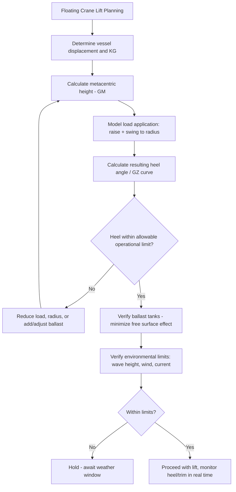

## Floating and Sheerleg Cranes for Marine Lifts

### Overview

Floating and sheerleg cranes extend heavy-lift capability onto and from the water, serving applications no land-based crane (mobile, crawler, tower, or ring — see preceding modules) can reach: offshore platform installation and decommissioning, port/harbor construction, shipbuilding, and marine module transfer between vessel and shore or vessel and vessel. Unlike land-based systems where ground bearing and foundation engineering dominate stability analysis, floating crane stability is governed by naval architecture principles — buoyancy, metacentric height, and vessel trim — fundamentally changing how capacity, load path, and safe operating envelopes are determined.

### Sheerleg Cranes

**Configuration**

A sheerleg crane consists of a fixed or limited-slew A-frame (sheerleg) structure mounted on a barge or purpose-built hull, with the boom/lifting apparatus suspended from or integrated with the sheerleg frame. Unlike a fully slewing (rotating) crane vessel, many sheerleg designs have limited or no slewing capability — the vessel itself is repositioned (via tugs, its own propulsion if self-propelled, or winched mooring lines) to change the load's position relative to the hull, rather than rotating the crane structure atop a fixed hull position.

**Characteristics**

- **High capacity for structural simplicity** — the fixed, non-slewing (or limited-slewing) sheerleg structure can be engineered with substantial strength-to-weight efficiency compared to a fully rotating crane superstructure, historically making sheerlegs a favored configuration for some of the highest-capacity floating lift systems
- **Revolving vs. fixed sheerlegs** — some modern sheerleg designs incorporate a limited slewing range (rather than zero), improving operational flexibility while retaining much of the structural efficiency advantage of the sheerleg configuration over a fully rotating crane vessel
- **Typical application** — heavy topside/module lifts in shipyards, offshore platform installation and (increasingly significant) decommissioning/removal, and salvage operations

### Floating (Fully Revolving) Crane Vessels

**Configuration**

A fully slewing crane, similar in principle to a very large ring crane or crawler crane's rotating upperworks (see previous modules), mounted on a purpose-built vessel or barge hull. The crane can rotate through a full or near-full range independent of the vessel's heading, offering substantially greater operational flexibility than a sheerleg for positioning the load without repositioning the entire vessel.

**Characteristics**

- **Full slewing capability** — significantly improves operational efficiency for lifts requiring the load to be positioned at varying angles relative to the vessel without repeated vessel repositioning
- **Semi-submersible and monohull variants** — semi-submersible crane vessels, in particular, offer enhanced stability by lowering the vessel's center of buoyancy/increasing waterplane characteristics, valuable for the largest offshore lift capacities and operation in more exposed sea conditions
- **Dynamic positioning (DP)** — many modern large floating crane vessels incorporate DP systems (computer-controlled thruster systems maintaining vessel position/heading without conventional anchoring), critical for offshore lifts where anchoring is impractical (water depth, seabed conditions) or where precise, continuously adjustable positioning is required during the lift itself

### Stability: The Governing Engineering Discipline

Floating crane stability analysis differs fundamentally from land-based crane stability (which reduces to ground bearing pressure and overturning moment against a fixed base), because a floating vessel's stability is governed by **buoyancy and metacentric height**, and — critically — the lift's own load and boom position actively change the vessel's stability characteristics as the lift proceeds.

**Metacentric Height (GM)**

$$GM = KB + BM - KG$$

where $KB$ is the height of the center of buoyancy above the keel, $BM$ is the metacentric radius (a function of the vessel's waterplane moment of inertia and displaced volume), and $KG$ is the height of the vessel's center of gravity above the keel. A positive, adequate $GM$ is required for stable equilibrium — as $GM$ decreases (or, in the extreme, goes negative), the vessel becomes increasingly prone to excessive heel or, in severe cases, capsizing risk.

**How Lifting Affects Stability**

Raising a load with the crane, and swinging that load out to radius, both raise the vessel's effective center of gravity and introduce a heeling moment:

$$\theta_{heel} \approx \frac{W_{load} \times R_{radius}}{W_{displacement} \times GM}$$

(a simplified small-angle relationship; actual naval architecture calculations use more complete righting-arm/GZ curve analysis rather than this linearized approximation alone) — meaning, unlike a land crane where the ground/foundation simply resists overturning moment as a fixed reaction, a floating crane's own vessel *tilts* in response to the load, and that tilt itself changes the effective radius and load geometry, creating an interactive effect land-based crane stability calculations do not need to address.

**Free Surface Effect**

Liquid ballast or any partially-filled tank aboard the vessel reduces effective GM (the "free surface effect," where liquid shifts toward the low side as the vessel heels, amplifying rather than resisting the heel), a naval-architecture-specific consideration with no land-crane analog, making ballast tank management (full or empty tanks preferred over partially filled) an active part of lift planning and execution.

### Environmental Limits

Floating crane operations are substantially more environmentally constrained than land-based crane operations, since sea state (wave height/period), wind, current, and vessel motion (heave, pitch, roll) all directly affect both crane structural loading and load control:

- **Significant wave height limits** — operational limits are typically expressed as maximum allowable significant wave height for active lifting, often considerably lower than the vessel's survival/transit sea-state rating, mirroring the operational-vs-structural wind limit distinction discussed for tower cranes
- **Relative motion between lifting vessel and load/target structure** — for lifts transferring a load between a floating crane and a fixed structure (a jacket, platform, or quayside), or between two floating vessels, relative motion (both vessels/structures moving independently in the sea state) is often the governing constraint rather than the crane's own static capacity, since dynamic load amplification from relative motion can substantially exceed static calculated tension
- **Weather window planning** — offshore lift operations are typically planned around forecast weather windows with defined go/no-go criteria, and lift execution sequences are designed to minimize total exposure time within the critical, most motion-sensitive phase of the operation (e.g., final load transfer/mating)

### Load Transfer Techniques for Motion Compensation

Given the relative-motion challenge above, several specialized techniques are used for the most motion-sensitive marine lift phases:

- **Active heave compensation (AHC)** — hydraulic/winch systems that actively adjust hoist rope length in real time to counteract vessel heave motion, keeping the load's absolute vertical position more stable relative to a fixed target than the crane's own hook position (which moves with the vessel) would otherwise allow
- **Motion-monitoring and predictive lift-window software** — real-time vessel motion sensing combined with short-term wave/motion forecasting to identify brief, favorable motion windows for critical operations (touch-down, mating) within an overall acceptable sea state
- **Tandem vessel/crane operations** — for very large or long loads, coordinated lifts between a floating crane and another vessel (or land-based crane, in near-shore applications) introduce the same multi-support load-sharing considerations discussed in the Tandem and Multi-Crane Lift module, compounded by each unit's independent motion characteristics

### Applications Specific to Marine/Offshore Heavy Lift

- **Single-lift topside installation** — very large floating crane vessels can install complete platform topsides in a single lift, an approach that has, on the largest modern vessels, substantially reduced the offshore hook-up/commissioning duration compared to traditional piece-by-piece offshore construction
- **Decommissioning/reverse installation** — removing platform topsides and substructures at end of field life, a growing application area as older offshore fields reach decommissioning, generally requiring similar or greater engineering rigor than original installation given uncertain as-found structural condition
- **Subsea and pipeline-related lifts** — installation of subsea structures, manifolds, and related infrastructure, often combining crane capability with the vessel's other specialized marine construction systems

### Example

A semi-submersible floating crane vessel with 20,000 t total displacement and a GM of 3.2 m is planning to lift a 1,200 t topside module at a 45 m working radius.

Using the simplified heel relationship for illustration:

$$\theta_{heel} \approx \frac{1,200 \times 45}{20,000 \times 3.2} \approx \frac{54,000}{64,000} \approx 0.84 \text{ rad (illustrative only — see note below)}$$

[Inference] This simplified calculation is presented for conceptual illustration only — the resulting figure well exceeds any realistic operational heel angle, which demonstrates precisely why actual naval architecture stability analysis uses full righting-arm (GZ) curve methodology, vessel-specific hydrostatic data, and classification-society-approved stability software rather than the small-angle linearized formula shown above; the linearized relationship breaks down well before reaching angles this large and is not a valid substitute for a proper stability assessment in real lift planning. In practice, the vessel's actual allowable lift envelope (maximum load at each radius, for the as-loaded ballast/displacement condition) would come from the vessel's class-approved lift capacity documentation cross-referenced against its real-time loading computer/stability system — illustrating why floating crane lift planning depends on vessel-specific, class-society-reviewed data to a degree land-based crane capacity charts do not require.

**Related Topics**

- Ring Cranes and Very Heavy Lift Capacity Systems
- Tandem and Multi-Crane Lift Load Sharing
- Module Transport and Heavy Haul Route Engineering
- SPMT (Self-Propelled Modular Transporter) Operations
- Offshore Weather Window Planning and Marine Operations
- Rigging Certification and Competent Person Requirements