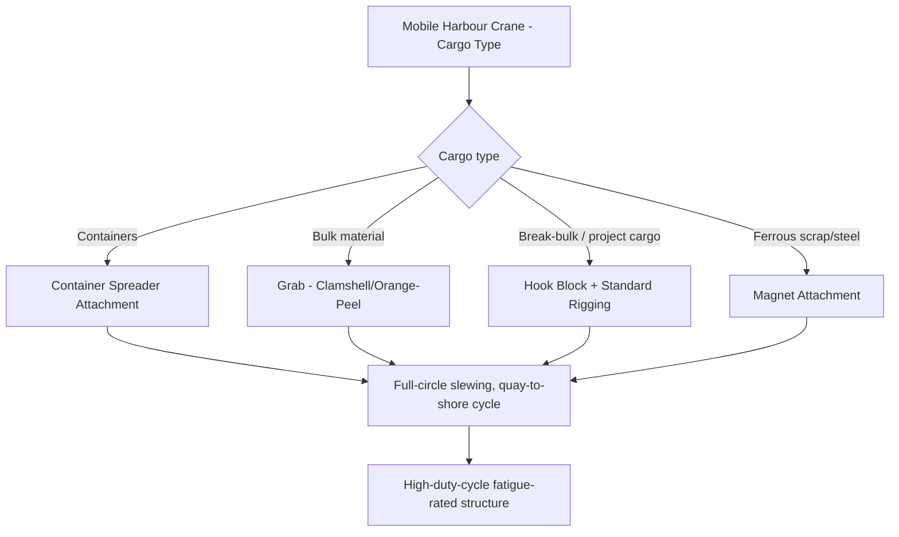

## Mobile Harbour Cranes for Port Operations

### Overview

Mobile harbour cranes (MHCs) are purpose-built, high-duty-cycle cranes designed specifically for port and terminal cargo handling — bulk material, containers, project cargo, and heavy-lift break-bulk goods moving between vessel and quay. Distinguished from the general-purpose mobile cranes covered earlier in this chapter (truck-mounted, all-terrain, crawler) by their duty-cycle rating, dedicated port infrastructure integration, and specialized attachment ecosystem, MHCs occupy a specialized niche where sustained high-cycle operation, rather than occasional heavy lift capacity, is the primary design driver — though many MHC models also serve genuine heavy-lift roles for project cargo and out-of-gauge loads.

### Core Configuration

**Undercarriage and Mounting**

Mobile harbour cranes are typically mounted on a rubber-tired, multi-axle undercarriage (distinguishing them from rail-mounted quay container cranes, a separate fixed-infrastructure category) allowing repositioning along a quay without dependence on a fixed rail system — a significant operational flexibility advantage for terminals handling varied cargo types and vessel positions across different berths.

- **Outrigger/leveling systems** similar in principle to truck-mounted and all-terrain cranes provide the stable base for lift operations, though many MHC designs incorporate a lower-profile, quay-integrated outrigger/support arrangement suited to the flat, prepared, high-bearing-capacity quay surface typical of port infrastructure
- **Slewing superstructure** — full-circle continuous slewing capability (unlike a sheerleg's typically limited slewing) is standard, essential for the crane's core function of transferring cargo between a vessel alongside the quay and shore-side storage/transport in a continuous, repeated cycle

**Boom Configuration**

Most modern mobile harbour cranes use either:

- **Fixed lattice boom with luffing capability** — offering high load capacity at various radii through boom angle adjustment
- **Telescopic boom** on smaller/mid-range units, offering faster cycle configuration changes at generally lower maximum capacity than the largest lattice-boom MHC models

### Duty Cycle and High-Utilization Design

The defining engineering distinction of a mobile harbour crane versus a general-purpose mobile crane of similar nominal capacity is **duty cycle rating** — MHCs are engineered for continuous, repetitive lift cycles throughout extended shifts (loading/unloading a vessel over many hours, potentially around the clock during port operations), a fundamentally different loading regime than a general mobile crane's typical occasional-heavy-lift, extended-idle-time service profile.

- **Fatigue design** — structural components are engineered against cyclic fatigue loading at the crane's rated duty cycle, not solely against the static/occasional-peak-load design factors that govern general mobile crane structural design (see Safe Working Load and Factor of Safety module for the general design factor framework this specializes)
- **Rapid load/unload cycle optimization** — hoist speeds, slewing speeds, and control system responsiveness are optimized for minimizing per-cycle time, directly affecting vessel turnaround time and terminal throughput, a commercial driver largely absent from general heavy-lift crane design priorities

### Attachment and Cargo-Handling Ecosystem

A major distinguishing characteristic of MHCs is the breadth of interchangeable, cargo-specific attachments available, reflecting ports' need to handle highly varied cargo types with a single crane asset:

- **Container spreaders** — telescopic spreader frames engaging standard ISO container corner castings, for containerized cargo handling
- **Grabs (clamshell/orange-peel)** — for bulk material handling (coal, ore, aggregate, grain), where the grab itself opens/closes to capture and release bulk material rather than lifting a discrete rigged load
- **Hook block attachments** — for conventional break-bulk and heavy-lift project cargo, using standard rigging (slings, shackles — see Rigging Fundamentals chapter) as the interface between crane and load
- **Magnet attachments** — for handling ferrous scrap and certain steel product cargo

Switching between these attachments is a routine, relatively rapid operational procedure at most MHC-equipped terminals, reflecting the crane's role serving a terminal's full cargo mix rather than a single cargo type.

### Heavy-Lift and Project Cargo Role

Beyond routine containerized/bulk cargo handling, larger mobile harbour cranes serve a genuine heavy-lift function for **project cargo** and **out-of-gauge (OOG)** loads — items too large, heavy, or irregularly shaped for standard container handling:

- Wind turbine components (nacelles, tower sections, blades) at ports serving offshore and onshore wind installation supply chains
- Heavy industrial modules, transformers, and process equipment moving through port facilities en route to inland heavy-haul transport
- Yacht and specialized marine vessel handling at some ports with appropriately equipped MHCs

For these applications, the same rigging fundamentals, load calculation, and safe working load principles covered elsewhere in this program apply directly — the MHC functions as the lifting device, but sling selection, CG determination, and hardware selection follow identical engineering principles as any other crane-based heavy lift, with the MHC's specific capacity chart (radius-dependent, similar in structure to the tower crane charts discussed previously, though MHCs combine radius-dependent capacity with the additional boom-angle/luffing variable telescopic and lattice-luffing configurations introduce) governing the specific lift's feasibility.

### Quay and Ground Bearing Considerations

While port quay surfaces are generally engineered to a high, well-documented bearing capacity (unlike the variable native ground conditions crawler cranes may encounter — see Crawler Crane Configurations module), MHC outrigger/support loading still requires verification against:

- **Quay design bearing capacity**, which may have defined limits particularly near quay edges, expansion joints, or over buried utilities/services running beneath the quay surface
- **Quay edge setback requirements** — many ports specify minimum crane operating distance from the quay edge, both for structural bearing reasons and to manage overturning risk toward open water
- **Rail/track condition** for any rail-mounted (rather than rubber-tired) MHC variants, though rubber-tired configurations are more common in the "mobile" harbour crane category as distinguished from fixed rail-mounted quay cranes

### Vessel Interface Considerations

Unlike land-based lifts, MHC operations loading/unloading a vessel introduce a load-path consideration analogous to (though generally less severe than) the floating crane relative-motion issue discussed in the previous module: the vessel itself may experience minor motion (from wave action, even in a sheltered harbour, or from load-shift-induced list/trim changes as cargo is removed/added) during the cargo operation, requiring operator awareness of vessel condition throughout the loading/unloading sequence, particularly for larger or less symmetric single lifts affecting vessel trim.

### Example

A terminal operator handling a shipment of wind turbine nacelles (each approximately 90 t) needs to offload units from a vessel onto heavy-haul trailers for onward inland transport.

The terminal's mobile harbour crane, normally configured with a container spreader for its routine containerized cargo operations, is reconfigured with a **hook block attachment**. Standard heavy-lift rigging (appropriately rated slings and shackles selected per the Shackles, Hooks, and Rigging Hardware Selection module, sized to the 90 t nacelle weight plus applicable design factor) is fitted to the nacelle's designated lift points. The crane's capacity chart is checked at the specific radius required to reach from the vessel's hold/deck position to the quay-side trailer position, confirming adequate rated capacity at that radius under the lattice boom's current luffing angle configuration — the same fundamental capacity-chart-versus-radius verification process used for any boom crane, applied here within the specific operational context of a working, cargo-handling port terminal rather than a dedicated project or construction heavy-lift site.

**Related Topics**

- Truck-Mounted and All-Terrain Mobile Cranes
- Safe Working Load and Factor of Safety in Rigging
- Shackles, Hooks, and Rigging Hardware Selection
- Floating and Sheerleg Cranes for Marine Lifts
- Module Transport and Heavy Haul Route Engineering
- Out-of-Gauge and Project Cargo Handling Fundamentals