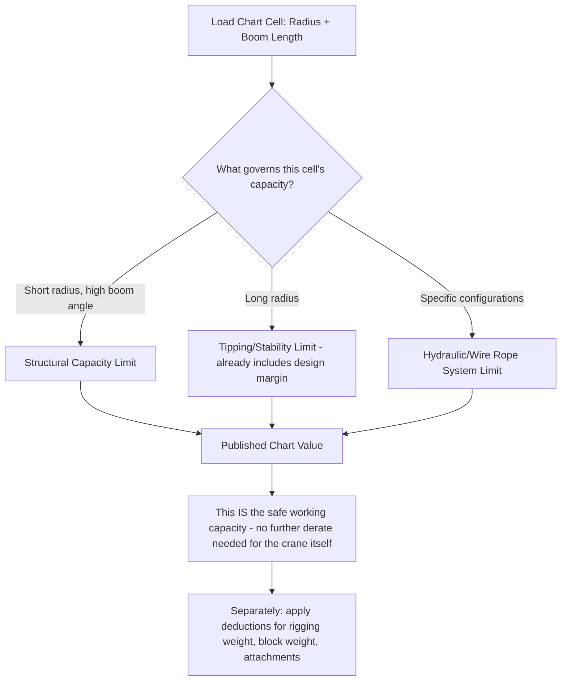
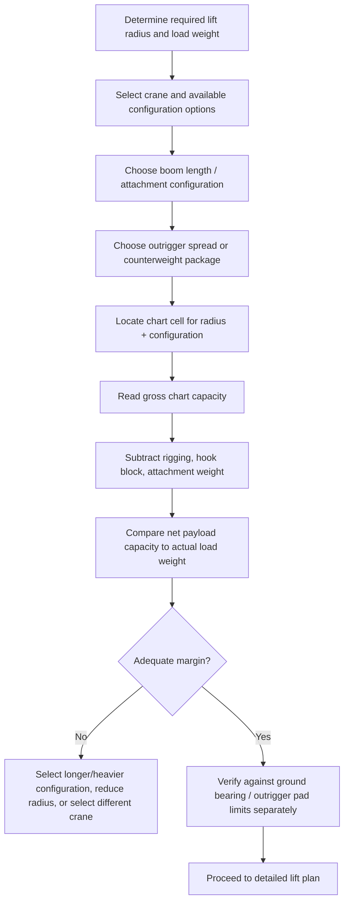

## Crane Load Charts and Capacity Selection

### Overview

The load chart is the single authoritative document governing what a specific crane, in a specific configuration, is permitted to lift — every crane type covered in this chapter (truck-mounted, all-terrain, crawler, tower, ring, floating, and mobile harbour) publishes its own chart structure, but all charts share the same underlying purpose: translating a crane's structural, hydraulic, and stability limits into a usable field reference matching load to configuration. Correct load chart interpretation is the final verification step connecting every calculation covered earlier in this program — rigging tension, CG position, ground bearing — to whether the specific crane selected can actually perform the specific lift safely.

### Chart Variables and Structure

**Primary Governing Variables**

Nearly all mobile/crawler crane load charts are organized around two primary variables:

- **Radius** — horizontal distance from the crane's center of rotation (or, for some configurations, a defined reference point) to the load's vertical hoist line
- **Boom length/angle** (or, for luffing/lattice cranes, boom angle directly) — as radius increases at a fixed boom length, boom angle decreases, and capacity decreases correspondingly; charts typically present capacity as a function of radius for each discrete boom length, since radius and boom angle are related but boom length is usually the configuration variable the operator/planner selects and holds fixed for a given lift

**Secondary Configuration Variables**

Beyond the primary radius/boom-length matrix, capacity is further modified by:

- **Outrigger spread** (wheeled cranes) — full, mid, or reduced spread each carry entirely separate chart pages/sections, since spread directly changes the crane's stability base (see Truck-Mounted and All-Terrain Cranes module)
- **Counterweight configuration** — the specific counterweight amount installed; many cranes offer multiple counterweight package options, each with its own chart section, trading capacity against transport/mobilization weight and complexity
- **Boom/jib attachments** — luffing jib angle and length, boom extensions, or fly jib attachments each introduce their own chart section, since these attachments change the load path and structural analysis entirely from the base boom configuration
- **Working area/quadrant restrictions** — for wheeled cranes without full outrigger symmetry, or where site-specific obstructions apply, some charts distinguish capacity over the front/side/rear of the carrier, since the crane's structural and stability margins are not always symmetric around the full 360° slew range
- **Duty designation** — some charts distinguish between "on outriggers" versus "on rubber" (tires) capacity for wheeled cranes with limited pick-and-carry capability, and static versus pick-and-carry ratings for crawler cranes (see Crawler Crane module)

### Reading a Load Chart: Governing Limit Behind Each Number

A critical concept for correct chart interpretation is that the published capacity at any given radius/configuration is **not always governed by the same physical limit** across the chart's range — different cells in the same chart may be limited by different failure modes:

- **Structural capacity** — at shorter radii/higher boom angles, the crane's structural rating (boom, base structure) is often the governing limit
- **Tipping (stability) capacity** — at longer radii, capacity is frequently governed by tipping stability (the load's overturning moment approaching the crane's stabilizing moment from counterweight and structure weight) rather than structural strength
- **Hydraulic/wire rope limits** — hoist line pull capacity, or, for very long boom configurations, cylinder/telescoping system limits, can govern in specific configurations

Manufacturers typically apply a required design factor against tipping (commonly published charts already reflect capacity at a fixed percentage, such as 75% or 85% of theoretical tipping load, varying by standard/manufacturer/jurisdiction) — meaning the published chart figure is **already** a safe working capacity, not a raw structural or tipping limit requiring the user to apply an additional design factor on top of it (distinct from rigging hardware WLL, where the design factor is embedded in the same way but the underlying MBS-to-WLL relationship, covered in the Safe Working Load module, is a useful parallel concept). [Inference] The exact tipping-margin percentage embedded in a given chart varies by crane manufacturer, applicable national/regional standard, and sometimes by specific chart section — this should be confirmed against the specific chart's governing standard reference rather than assumed universal, since it directly affects how the published number should be understood relative to the crane's absolute physical tipping point.

### Deductions from Gross Chart Capacity

The published chart figure typically represents **gross capacity** at the hook, requiring deduction of all rigging and attachment weight between the boom tip/hook and the actual payload to determine true net lifting capacity for the payload itself:

$$W_{net,payload} = W_{chart,gross} - W_{hookblock} - W_{rigging} - W_{auxiliary attachments}$$

Commonly deducted items:

- Hook block/ball weight
- All slings, shackles, spreader bars, and other rigging hardware between hook and load (see Rigging Fundamentals chapter)
- Any load-handling attachment weight (for MHCs — see previous module — grab or spreader weight; for general cranes, any below-the-hook lifting device)
- Auxiliary equipment sometimes suspended in the load path (cameras, load cells if externally mounted rather than integral)

A frequently cited field error is calculating a lift against gross chart capacity without deducting rigging weight, which can consume a meaningful fraction of the chart's margin particularly for lighter payloads with substantial rigging (large spreader bars, heavy multi-leg bridle hardware).

### Load Moment / Rated Capacity Indicators (RCLs/LMIs)

Modern cranes are generally equipped with an electronic **Rated Capacity Limiter (RCL)** or **Load Moment Indicator (LMI)** system, continuously calculating actual load moment (based on sensed boom angle/length, radius, and load cell/pressure-sensed load) against the chart's rated capacity for the current configuration, providing the operator real-time percentage-of-capacity feedback and typically an automatic cutout preventing further boom-down/load-increase movement approaching 100% of rated capacity.

- **RCL/LMI systems supplement, but do not replace, chart-based lift planning** — pre-lift planning still requires selecting an appropriate configuration from the chart before the lift begins; the RCL provides real-time verification and an automated safety limit during execution, not a substitute for the planning calculation
- **Configuration input accuracy** — an RCL's calculated percentage is only as accurate as the configuration data entered (boom length, counterweight, outrigger spread) — incorrect configuration input is a known failure mode where the system's displayed percentage does not reflect the crane's *actual* configuration-appropriate limit, underscoring that the system is a check against operator/planner error, not an independent, infallible source of truth

### Multi-Variable Chart Navigation Process

### Configuration Selection Strategy

Selecting the optimal crane configuration for a given lift generally follows a process of matching required radius and load weight against available options, since a chart with many boom-length options and counterweight packages typically offers multiple technically adequate configurations with different trade-offs:

- **Shorter boom, adequate radius reach** — often preferred where achievable, since shorter boom configurations frequently offer higher capacity margin at the same radius compared to a longer boom extended less fully, though this is chart/crane-specific rather than universal
- **Counterweight trade-offs** — maximum counterweight configuration generally maximizes capacity but adds transport/mobilization weight and complexity (additional counterweight transport loads, longer assembly time) — a project may select a reduced counterweight configuration if it provides adequate margin for the specific lift, simplifying logistics
- **Working radius margin** — selecting a configuration with meaningful capacity margin above the calculated required capacity (not simply the minimum technically adequate chart cell) provides tolerance for minor field variations in actual radius achieved, actual load weight versus estimated weight, and other practical execution variances

### Example

A lift requires setting a 28 t vessel at a 14 m working radius. The vessel's specified rigging (spreader bar, slings, shackles per the earlier modules in this chapter) totals 1.8 t.

Required gross chart capacity:

$$W_{chart,required} = W_{payload} + W_{rigging} = 28 + 1.8 = 29.8 \text{ t}$$

Checking a specific crawler crane's chart at 14 m radius: a 30 m boom length configuration shows 32 t gross capacity at that radius (governed by tipping limit per the chart's footnote), while a 36 m boom length configuration at the same radius shows 27 t (governed by structural limit at that longer, more heavily loaded boom condition, per the chart's structural limit designation) — illustrating that a *longer* boom does not always mean higher capacity at a fixed radius, since the longer boom's own structural limit can become the governing constraint before tipping stability does.

The 30 m boom configuration (32 t gross) is selected, since it exceeds the 29.8 t requirement with reasonable margin, while the 36 m configuration (27 t) is inadequate for this specific radius despite superficially seeming like it should offer at least equal capability at the same working point.

**Related Topics**

- Truck-Mounted and All-Terrain Mobile Cranes
- Crawler Crane Configurations and Ground Conditions
- Safe Working Load and Factor of Safety in Rigging
- Ground Bearing Pressure and Outrigger/Mat Sizing
- Rigging Certification and Competent Person Requirements
- Boom Extension, Jib, and Attachment Configurations