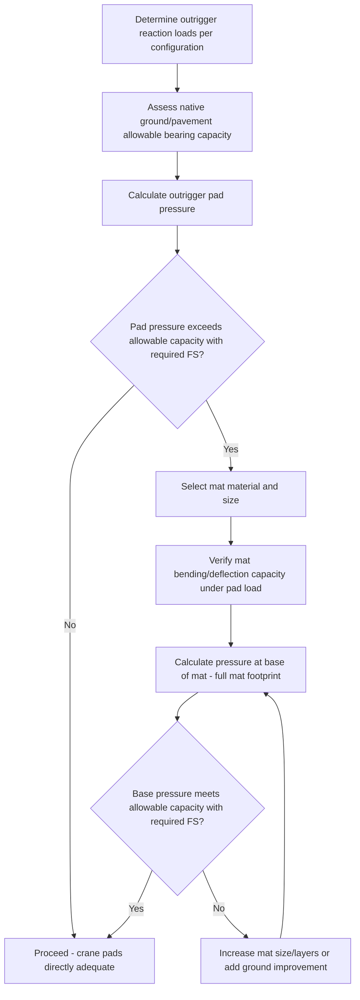

## Outrigger and Crane Mat Ground Preparation

### Overview

Outrigger and crane mat ground preparation is the discipline connecting a wheeled or crawler crane's load chart capacity (see previous module) to whether the actual ground beneath the crane can physically sustain the pressures that capacity implies. Every crane type covered in this chapter — truck-mounted, all-terrain, crawler, and even fixed tower crane foundations — ultimately depends on this same underlying verification: that the crane's calculated ground bearing pressure does not exceed what the supporting surface can safely carry, with adequate margin for uncertainty in both the load and the soil.

### Outrigger Pad Pressure Calculation

For wheeled cranes (truck-mounted, all-terrain, rough-terrain), outrigger float/pad pressure is calculated from the reaction force at each individual outrigger, not simply total crane weight divided by total pad area, since outrigger reactions are rarely equal across all four (or more, for larger multi-axle units) outrigger points:

$$P_{outrigger} = \frac{R_{outrigger}}{A_{pad}}$$

where $R_{outrigger}$ is the vertical reaction force at that specific outrigger (a function of crane weight distribution, counterweight, boom position/swing angle, and load — see the Crane Load Charts module for how load and configuration determine overall crane loading) and $A_{pad}$ is the contact area of the outrigger float/pad (crane-supplied pad, or a supplemental mat/timber placed beneath it).

**Non-Uniform Outrigger Loading**

Similar to the non-uniform crawler track pressure discussed in the Crawler Crane Configurations module, individual outrigger reactions vary substantially depending on boom swing position — the outrigger nearest the load-side, at the boom's current swing angle, typically carries a disproportionately higher share than the outriggers on the opposite side. [Inference] Crane manufacturers typically provide outrigger reaction load data (often integrated into modern RCL/LMI systems, per the Crane Load Charts module) as a function of configuration and swing angle, and this manufacturer-specific reaction data — not an assumed even split across all outriggers — should govern actual pad/mat sizing verification, since assuming equal distribution can significantly underestimate the peak-loaded outrigger's actual pressure.

### Ground Bearing Capacity Assessment

**Determining Allowable Bearing Pressure**

The same general approaches discussed for crawler crane ground assessment apply to outrigger ground preparation, calibrated to the specific site:

- **Geotechnical investigation** — soil borings, plate load tests, or standard penetration test data providing documented allowable bearing capacity, generally warranted for larger cranes, critical lifts, or sites with uncertain/variable soil conditions
- **Visual/qualitative field assessment** — for smaller cranes and lower-consequence lifts, a competent person's assessment of soil type, moisture content, compaction, and any signs of prior disturbance or fill placement may be judged adequate by project procedure, though (as with crawler crane assessment) this carries materially higher uncertainty than site-specific testing
- **Existing pavement/slab data** — for lifts on prepared surfaces (paved yards, existing concrete slabs), documented pavement/slab design bearing capacity may be available and applicable, though buried utilities, expansion joints, and slab edge conditions require separate verification even on documented, engineered surfaces

**Comparing Applied Pressure to Allowable Capacity**

$$FS_{bearing} = \frac{q_{allowable}}{P_{outrigger}}$$

with a required design factor (commonly a minimum of 2, though specific project/geotechnical requirements govern) applied against the calculated peak outrigger pressure — mirroring the same fundamental verification structure introduced for crawler crane ground assessment, applied here at the concentrated point-load scale of an individual outrigger rather than distributed across a full track's contact area.

### Crane Mat Selection and Sizing

When native ground or existing pavement bearing capacity is insufficient for the calculated outrigger pressure, mats are placed beneath the outrigger pads (or beneath crawler tracks, per the previous module) to spread the load over a larger area before it reaches the underlying surface.

**Mat Materials**

- **Timber mats** — engineered timber (often laminated or bolted multi-layer construction) mats, widely used for their combination of adequate strength, relatively lower cost than steel, and simpler handling/replacement; specific timber species, grade, and construction significantly affect actual rated capacity, so generic "wood mat" assumptions without reference to the specific mat's engineered rating are inappropriate for critical verification
- **Steel plates** — used for higher-pressure applications or where mat degradation/replacement cost over repeated heavy use is a greater concern than the higher initial cost and weight of steel; steel mats are also less susceptible to moisture-related strength variation than timber
- **Composite/engineered synthetic mats** — increasingly available proprietary mat systems offering high strength-to-weight ratio and durability advantages over timber in some applications, though [Unverified] specific product capacity ratings and appropriate applications vary by manufacturer and should be verified against the specific product's published engineering data rather than assumed comparable to timber or steel mat performance

**Mat Sizing Calculation**

Mat sizing requires verifying two separate conditions:

1. **Mat bending/deflection capacity** — the mat itself must not exceed its own structural bending capacity under the concentrated outrigger pad pressure applied to a portion of the mat's surface, since the mat spans between the outrigger contact area and the ground, carrying bending stress analogous to a beam on an elastic foundation
2. **Pressure at the base of the mat system, transmitted to the native soil** — the mat's function is to spread pressure over a larger area, but the *resulting*, reduced pressure at the mat's base (calculated using the mat's full footprint area rather than just the outrigger pad's smaller contact area) must still meet the site's allowable bearing capacity

$$P_{base} = \frac{R_{outrigger}}{A_{mat}}$$

where $A_{mat}$ (the full mat footprint) is substantially larger than $A_{pad}$ (the outrigger pad's own contact area alone), reducing the pressure delivered to the underlying soil proportionally — but only if the mat itself has adequate stiffness/strength to actually achieve that spread rather than simply flexing/failing under the concentrated point load without effectively distributing it.

### Layered Mat Systems

For the most demanding ground conditions (very soft native soil, very high outrigger reactions from large cranes), a single mat layer may not achieve adequate pressure reduction, requiring layered systems:

- **Primary mat layer** directly beneath the outrigger pad, sized for the immediate pad pressure and providing initial spread
- **Secondary/base layer** — a larger-footprint mat or compacted aggregate layer beneath the primary mat, further distributing the already-reduced pressure from the primary layer before it reaches native soil
- **Cribbing** — timber or engineered blocking stacked to build up height/spread area, sometimes combined with mat layers, particularly where existing ground level or drainage considerations require raising the crane's effective support elevation

Each layer interface requires the same bending/pressure verification as a single mat system, checking that pressure transmitted from each layer to the one beneath (or to native soil, at the base) remains within that layer's/surface's allowable capacity.

### Site-Specific Considerations Beyond Bearing Capacity

- **Buried utilities and underground structures** — a site with adequate soil bearing capacity may still have buried pipelines, tanks, vaults, or utility conduits directly beneath a planned outrigger position, requiring either repositioning or a mat/spreader system specifically engineered to bridge the buried structure's location without transmitting damaging concentrated load to it
- **Slope and level condition** — ground slope affects both outrigger extension/leveling capability (many cranes have limited allowable operating slope even with adequate leveling range) and the practical mat/cribbing arrangement needed to establish a level crane platform
- **Drainage and moisture sensitivity** — soil bearing capacity can vary substantially with moisture content, particularly for clay-type soils; a site assessed as adequate in dry conditions may require re-assessment following significant rainfall, and mat/ground preparation planning should account for anticipated weather during the lift window
- **Repeated use / settlement over time** — for cranes remaining in position for extended duration (rather than a single discrete lift), progressive settlement under sustained load is a distinct consideration from the instantaneous bearing capacity check for a brief lift, potentially requiring periodic re-leveling verification

### Example

An all-terrain crane's RCL system indicates a peak outrigger reaction of 85 t at the most heavily loaded outrigger for a planned lift configuration. The outrigger's own pad has a 0.6 m × 0.6 m (0.36 m²) contact area.

Direct pad pressure (without additional matting):

$$P_{pad} = \frac{85,000 \text{ kg} \times 9.81}{0.36 \text{ m}^2} \approx 2,316,583 \text{ Pa} \approx 2,317 \text{ kPa}$$

Site geotechnical assessment establishes native soil allowable bearing capacity of 150 kPa — far below the direct pad pressure, necessitating substantial mat spread. Selecting a timber mat with a 2.4 m × 2.4 m (5.76 m²) footprint beneath the pad:

$$P_{base} = \frac{85,000 \times 9.81}{5.76} \approx 144,786 \text{ Pa} \approx 145 \text{ kPa}$$

This mat size brings base pressure (145 kPa) just under the 150 kPa allowable capacity — technically adequate but with minimal margin ($FS \approx 1.03$, well below a typical minimum required factor of 2), indicating this specific mat size should be increased further (or a layered mat/ground improvement system added) before proceeding, illustrating that a mat merely bringing pressure numerically "under" the allowable figure is not sufficient without confirming the required design factor is also satisfied.

**Related Topics**

- Crawler Crane Configurations and Ground Conditions
- Crane Load Charts and Capacity Selection
- Truck-Mounted and All-Terrain Mobile Cranes
- Tandem and Multi-Crane Lift Load Sharing
- Site-Specific Hazard Assessment for Heavy-Lift Operations
- Rigging Certification and Competent Person Requirements