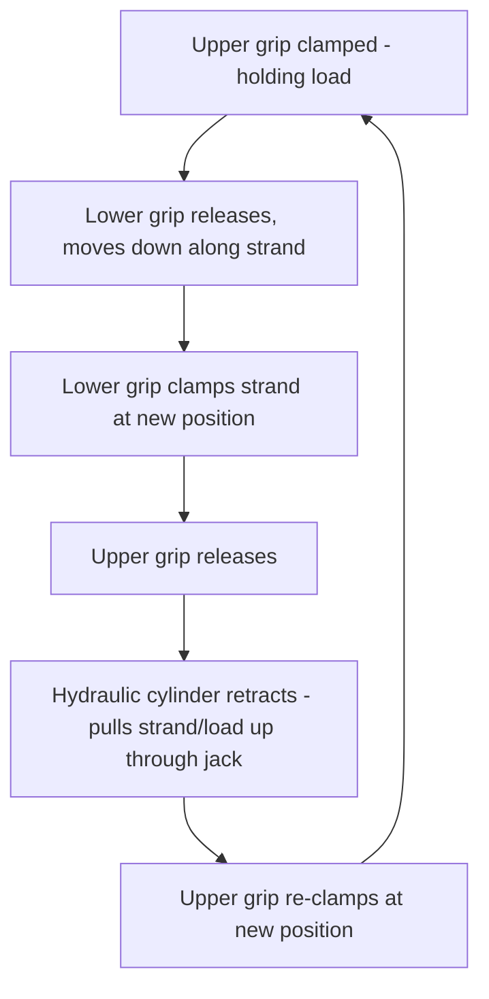

## Strand Jack Operating Principles

### Overview

Strand jacking is a hydraulic lifting technique that raises or lowers extremely heavy loads through incremental, synchronized gripping and pulling of high-tensile steel strand bundles, rather than through a boom-and-hook system as used by conventional cranes (covered in the preceding chapter). Where crane capacity is fundamentally limited by boom structural capacity and overall vehicle/vessel stability, strand jacking scales primarily by adding more strands and more jacks, making it the preferred method for the very heaviest, most compact single lifts and for lifts in headroom-constrained environments where a conventional crane's boom geometry simply cannot fit.

### Core Mechanical Principle

**The Strand Bundle**

The load-bearing element is a bundle of individual high-tensile steel strands — typically 15.2 mm or similar diameter prestressing-type strand, the same general strand technology used in post-tensioned concrete construction — grouped together to form a single composite tendon capable of carrying substantially more load than any single strand alone. A strand jack's total capacity is a direct function of how many individual strands the bundle contains, since each strand contributes a known, certified breaking strength.

**The Jack Mechanism**

A strand jack grips the strand bundle using two sets of hydraulically-actuated wedge grips (sometimes called "anchor" and "puller" grips, or upper and lower grip depending on lift direction), operating in an alternating cycle:

1. The **upper grip** clamps the strand bundle and holds the current load
2. The **lower grip**, initially released, is driven downward (via the jack's hydraulic cylinder) along the strand while not under load
3. The **lower grip** then clamps the strand bundle at its new, lower position
4. The **upper grip** releases
5. The hydraulic cylinder retracts, pulling the strand bundle (and the load) upward through the jack by the cylinder's stroke length, with the lower grip now bearing the load
6. The upper grip re-clamps at the new position, and the cycle repeats

This alternating "inchworm" gripping action allows the jack to pull the strand through itself in a continuous series of short strokes, achieving effectively unlimited total lift height (limited only by strand length available, not by the jack's own physical stroke length) — a fundamental advantage over a single-stroke hydraulic cylinder system, which would be limited to its own cylinder stroke length as the maximum single lift height.

### Strand Jack System Components

**Jack Unit**

The hydraulic cylinder and dual-grip assembly itself, rated by both maximum strand capacity (number of strands the jack can accommodate) and stroke length per cycle.

**Strand Bundle and Anchorage**

The strand bundle runs from the load's lifting point, through the jack, and terminates at an anchor point — for a lifting (rather than pulling/skidding) application, the strand typically anchors below the jack at the load itself, with the jack mounted in a supporting tower or frame structure above.

**Supporting Structure (Tower or Frame)**

Since strand jacks lift by pulling the load *up toward* the jack (rather than a crane's boom extending *out to* the load), the jack itself must be supported on a structure positioned above or around the load — commonly a purpose-built steel tower, an existing structure (for lifts within or adjacent to an existing plant/building), or a frame spanning across the load from supports on either side.

**Hydraulic Power Unit (HPU) and Control System**

A centralized hydraulic power supply and control system operates all jacks in a multi-jack lift as a synchronized group (see the synchronization discussion below), rather than each jack operating as an independent unit — this centralized control is fundamental to safe multi-point strand jack lift execution.

### Multi-Jack Synchronization

Nearly all significant strand jack lifts use multiple jacks simultaneously (at multiple lift points around a load, analogous in concept to the multi-point lift load distribution discussed in the Rigging Fundamentals chapter, but executed through jacks rather than crane hooks/slings), requiring precise synchronization:

**Why Synchronization Is Critical**

If jacks operating at different lift points advance at different rates, the load tilts — beyond the obvious concern of an unlevel load, tilting redistributes load away from the calculated per-point tension distribution, potentially overloading one jack/strand-bundle system beyond its rated capacity while another carries less than planned, mirroring the same load-redistribution risk discussed for tandem crane lifts (see Tandem and Multi-Crane Lift Load Sharing module) but generally with tighter tolerance requirements given strand jacking's typical application to the very heaviest, highest-consequence lifts.

**Synchronization Method**

Modern strand jack systems use a centralized programmable logic controller (PLC) or equivalent control system, continuously monitoring each jack's position (stroke progress) and often load (via load cells integrated into the jack or anchor system), automatically adjusting individual jack hydraulic flow rates to keep all jacks advancing at matched rates and maintaining load distribution within a specified tolerance band across all lift points. [Inference] The specific tolerance bands and control system architecture vary by manufacturer and by the specific lift's engineering requirements — this should be confirmed against the specific system and lift plan's documented specifications rather than assumed to follow a single universal standard, given strand jack lift engineering is typically bespoke to the specific project and load.

### Capacity and Configuration Scaling

Unlike a crane, where capacity is fundamentally limited by a single structural boom/base system, strand jack lift capacity scales through two independent variables:

$$W_{total} = \sum_{i=1}^{n} (N_{strands,i} \times F_{strand})$$

where $n$ is the number of jack/lift-point locations, $N_{strands,i}$ is the number of strands in the bundle at location $i$, and $F_{strand}$ is the certified capacity per strand (at the applicable design factor). This means total system capacity can be increased either by adding more strands per jack (up to that jack's rated maximum strand count) or by adding more jack/lift-point locations — a scaling flexibility that allows strand jack systems to be configured for an extremely wide range of total lift capacities using a relatively small set of standard jack unit sizes.

### Lifting vs. Lowering vs. Skidding Applications

Strand jacks are used across several related but distinct operational modes:

- **Vertical lifting** — raising a load from a lower to a higher elevation, the configuration described above
- **Lowering** — the same mechanism operated in reverse, controllably lowering a load (e.g., setting a heavy module onto its final foundation, or lowering equipment into an excavation/pit), with the jack's grip-and-release cycle managing controlled descent rather than ascent
- **Horizontal pulling (strand jack skidding assistance)** — strand jacks are also used to pull loads horizontally along a skid track system (see the related Skidding Systems module in this chapter), using the same alternating grip mechanism oriented horizontally rather than vertically
- **Combined vertical/horizontal sequences** — some heavy-lift operations combine strand jack vertical lifting with subsequent horizontal skidding (or the reverse sequence) to both raise a load and move it into final horizontal position, particularly relevant for module installation where the final position is not directly beneath the lift towers

### Load Monitoring and Control During Operation

- **Real-time load cell monitoring** at each jack/anchor point provides continuous verification that actual load distribution matches the engineered lift plan, with defined tolerance bands triggering operator alerts or automatic hold/stop if exceeded
- **Position/level monitoring** — tilt sensors or position feedback at the load itself (not just at each jack) verify the load's actual attitude remains within planned tolerance throughout the lift, since jack-level synchronization alone does not directly confirm the load's own geometry hasn't introduced unexpected flexure or shift
- **Emergency hold/lock capability** — strand jack systems are designed with the grip mechanism itself providing a fail-safe hold condition (the wedge grips' mechanical action tends toward self-locking under load, a passive safety characteristic distinct from a crane's brake system), meaning loss of hydraulic power generally does not result in uncontrolled load drop, though specific system fail-safe behavior should be confirmed against the manufacturer's documented design for the specific system in use

### Engineering and Planning Requirements

Given strand jacking's typical application to the largest, highest-consequence lifts, engineering requirements are extensive and virtually always constitute critical lift status (see Rigging Certification and Competent Person Requirements module):

- Full engineering analysis of the supporting tower/frame structure, strand bundle sizing at each lift point, and foundation/reaction loads at the tower base
- Detailed synchronization and control system commissioning/testing before the actual critical lift, including verification of load cell calibration and control system response
- Formal lift procedure documentation covering normal operation, and defined contingency procedures for scenarios such as a single jack malfunction requiring load redistribution or lift pause
- Site-specific foundation design for tower/frame support points, following the same ground bearing verification principles discussed for crawler cranes and outrigger systems in the previous chapter, adapted to the specific, often more concentrated reaction loads a strand jack tower foundation experiences

### Example

A 1,600 t reactor vessel is lifted vertically 12 m using four strand jack towers positioned at the vessel's four designed lift points, each nominally carrying 400 t.

Each jack is configured with a strand bundle rated at 450 t (providing margin above the nominal 400 t per-point load), and the central PLC control system continuously monitors all four jacks' load cell readings, holding each within a specified tolerance (for illustration, ±5% of the 400 t nominal target, or 380–420 t) throughout the lift sequence. If one jack's reading approaches the upper tolerance bound — indicating that point is beginning to carry a disproportionate share, potentially from minor asynchronous advancement or unexpected load flexure — the control system automatically reduces that jack's advancement rate relative to the others, allowing the remaining jacks to "catch up" and redistribute load back toward the planned even split before the affected jack's strand bundle approaches its own rated capacity margin.

**Related Topics**

- Tandem and Multi-Crane Lift Load Sharing
- Ring Cranes and Very Heavy Lift Capacity Systems
- Skidding Systems and Track Design
- Rigging Certification and Competent Person Requirements
- Ground Bearing Pressure and Outrigger/Mat Sizing
- Module Transport and Heavy Haul Route Engineering