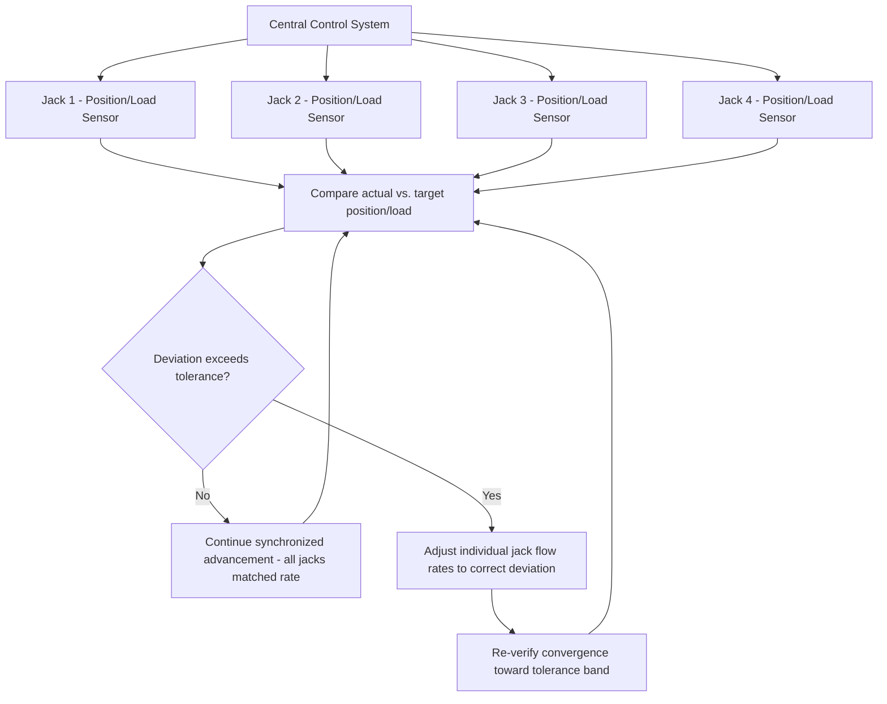

## Synchronized Multi-Point Strand Jack Lifting

### Overview

Synchronized multi-point strand jack lifting extends the single-jack operating principles covered in the previous module into the coordinated, multi-location control problem that characterizes nearly every real-world strand jack application. While the previous module introduced synchronization as one operating consideration among several, this module treats it as the central engineering and control discipline it actually is — since a multi-point strand jack lift's safety case rests almost entirely on the synchronization system successfully keeping actual load distribution within the bounds the engineering analysis assumed, distinguishing this technique's risk profile from a single-point lift or even a conventional multi-leg crane rig where sling geometry provides some passive self-correction.

### Why Multi-Point Strand Jack Lifts Are Different From Multi-Leg Crane Rigs

**No Passive Geometric Correction**

In a conventional multi-leg sling bridle (see Center of Gravity and Multi-Point Lift Calculations, in the Rigging Fundamentals chapter), sling angle and length passively respond to load position — if the load's actual CG differs slightly from calculated, the flexible slings naturally find an equilibrium angle, and the rigid geometry of hook-to-sling-to-load provides some inherent self-leveling behavior as the system settles.

A multi-point strand jack system, by contrast, has each lift point under **active, independent control** — there is no passive geometric self-correction; if the control system does not actively command matched advancement, the load points will not converge toward a natural equilibrium, they will diverge, since each jack simply continues advancing at whatever rate it is instructed to (or defaults to, in a control failure), with no inherent mechanical tendency to self-correct as a flexible sling system does.

### Rigid Body vs. Flexible Load Considerations

**Rigid Loads**

For a genuinely rigid load (most large modules, vessels, and structures lifted via strand jacking are effectively rigid relative to the strand system's own elasticity), all lift points are kinematically linked through the load's rigid geometry — meaning the *relative* position of all lift points is fixed by the load's own structure, and synchronization error at any one point directly translates into a calculable tilt/rotation of the entire load, following standard rigid-body rotation relationships.

**Semi-Flexible or Long-Span Loads**

For longer, more flexible loads (long bridge segments, some large modules with slender proportions), lift point synchronization error can additionally induce **internal bending/torsional stress** in the load itself, beyond simply tilting it as a rigid body — meaning synchronization tolerance for such loads must account for both the rigid-body tilt effect and an allowable internal stress limit in the load structure, requiring closer coordination between the strand jack lift engineering and the structural engineering of the load being lifted.

### Synchronization Control Architecture

**Centralized PLC/Control System**

As introduced in the previous module, a central programmable logic controller (or equivalent industrial control system) receives real-time position and/or load feedback from every jack in the system and issues coordinated commands, rather than each jack operating from an independently set target:

**Control Modes**

- **Position-based synchronization** — jacks are commanded to match stroke position/displacement precisely, appropriate where geometric level/attitude control is the primary concern
- **Load-based synchronization** — jacks are commanded to maintain a target load distribution (each point's load cell reading held within tolerance of its planned share), appropriate where load distribution control (rather than pure geometric level) is the primary safety concern, particularly for asymmetric loads where "level" and "evenly loaded" are not the same condition
- **Combined position and load control** — most sophisticated modern systems monitor and control against both simultaneously, since either variable alone can mask a problem the other would catch (a load that is perfectly level but has shifted load distribution due to an unexpected stiffness difference in the load structure, for example)

### Tolerance Bands and Trip/Hold Logic

Synchronized lift systems operate within engineered tolerance bands at multiple severity levels, typically structured as:

- **Normal operating band** — small deviations trigger automatic, continuous control correction with no operator intervention required, the routine function of the synchronization system during normal advancement
- **Warning/alert band** — larger deviations trigger operator notification while automatic correction continues, prompting increased attention and readiness to intervene manually if the trend continues
- **Automatic hold/stop threshold** — deviations exceeding a defined maximum immediately halt all jack advancement (a coordinated stop across all points, not just the deviating one, to avoid introducing a new asynchronous condition by stopping only part of the system), pending engineering/operational assessment before the lift resumes

[Inference] Specific numeric tolerance values (position deviation in mm, load deviation as a percentage) are engineered per-project, based on the specific load's rigidity, the lift system's precision characteristics, and the consequence of exceeding tolerance for that specific load and lift geometry — there is no single universal tolerance figure applicable across all strand jack lifts, and project-specific engineered values should always govern actual field tolerance settings.

### Redundancy and Contingency Planning

**Single Jack Failure Scenarios**

Multi-point strand jack lift plans typically address the contingency of a single jack malfunctioning (hydraulic failure, control fault, grip malfunction) mid-lift:

- **Immediate coordinated hold** — the control system's automatic stop logic (above) should halt all points, preventing the malfunctioning point from being left to passively hold load alone while others continue
- **Load redistribution assessment** — engineering analysis performed in advance of the lift typically establishes whether the remaining operational jacks (at their rated capacity margins) could safely support redistributed load if one point is taken out of service, informing the contingency procedure for whether the lift can continue with reduced points, must be reversed (lowered back to a safe resting position), or requires the failed jack repaired in place before continuing
- **Backup/standby capacity** — some critical lift plans specify standby jack units or additional strand capacity margin specifically sized to accommodate a single-point failure contingency without requiring full lift abort, reflecting a design philosophy similar in spirit to n+1 redundancy concepts used in other critical infrastructure contexts

**Power and Control System Redundancy**

- Backup hydraulic power supply and, in more sophisticated installations, redundant control system architecture (dual PLCs or equivalent) reduce the likelihood that a single control system fault halts or endangers the lift
- The passive, self-locking characteristic of strand jack wedge grips (introduced in the previous module) provides an inherent fail-safe against uncontrolled load drop in the event of a power/control failure, distinguishing the consequence of a control system fault (a controlled hold condition) from what might be feared as an uncontrolled release — though this passive locking behavior should be confirmed against the specific manufacturer's system design rather than assumed universal across all strand jack products.

### Commissioning and Pre-Lift Verification

Given the critical-lift status of virtually all significant multi-point strand jack operations (see Rigging Certification and Competent Person Requirements, in the Rigging Fundamentals chapter), synchronization system verification before the actual lift is standard and extensive:

- **No-load or light-load synchronization testing** — the full multi-jack system is commissioned and tested through simulated lift cycles, often with the load only partially engaged or with test loads, verifying the control system's actual synchronization performance matches the engineering assumptions before committing to the full, actual critical lift
- **Load cell calibration verification** — since load-based synchronization control depends entirely on accurate load cell readings, calibration verification immediately before the critical lift is standard practice
- **Communication and control system integrity checks** — verifying that all sensor feeds, control commands, and operator display/alarm systems function correctly under the specific site's conditions (cable runs, any wireless telemetry links, environmental exposure) before the lift begins

### Example

A 900 t bridge deck segment is lifted using a six-point strand jack system (three jacks per side, spanning the segment's length) as part of a bridge erection sequence, with each point nominally carrying 150 t.

The lift plan specifies **combined position and load synchronization control**, given the segment's slender proportions introduce meaningful concern for both rigid-body tilt (affecting final alignment with adjacent bridge segments) and internal bending stress (affecting the segment's own structural integrity during the lift). Position tolerance is engineered at ±15 mm between any two points, and load tolerance at ±8% of the 150 t nominal target per point (132–162 t).

During the lift, one jack's load cell reads 168 t — exceeding the 162 t upper tolerance bound — triggering an automatic coordinated hold across all six jacks. Engineering review during the hold determines the deviation resulted from a minor, unanticipated stiffness variation in the segment's as-built condition compared to the design model, rather than a jack malfunction; the lift plan's pre-established contingency procedure permits resuming under closer manual monitoring with tightened tolerance bands for the remainder of the lift, illustrating how the tolerance/hold system functions not merely as a pass/fail gate but as the trigger point for engineered decision-making during the lift itself.

**Related Topics**

- Strand Jack Operating Principles
- Skidding Systems and Track Design
- Tandem and Multi-Crane Lift Load Sharing
- Center of Gravity and Multi-Point Lift Calculations
- Rigging Certification and Competent Person Requirements
- Ground Bearing Pressure and Outrigger/Mat Sizing