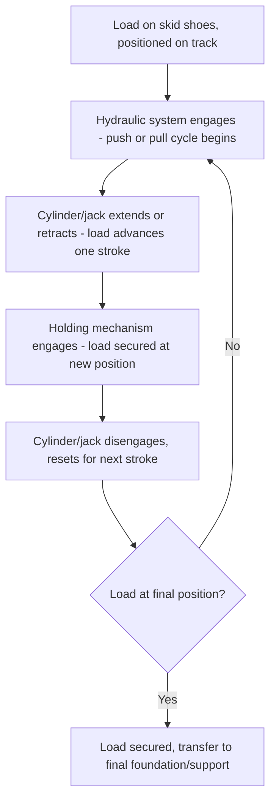
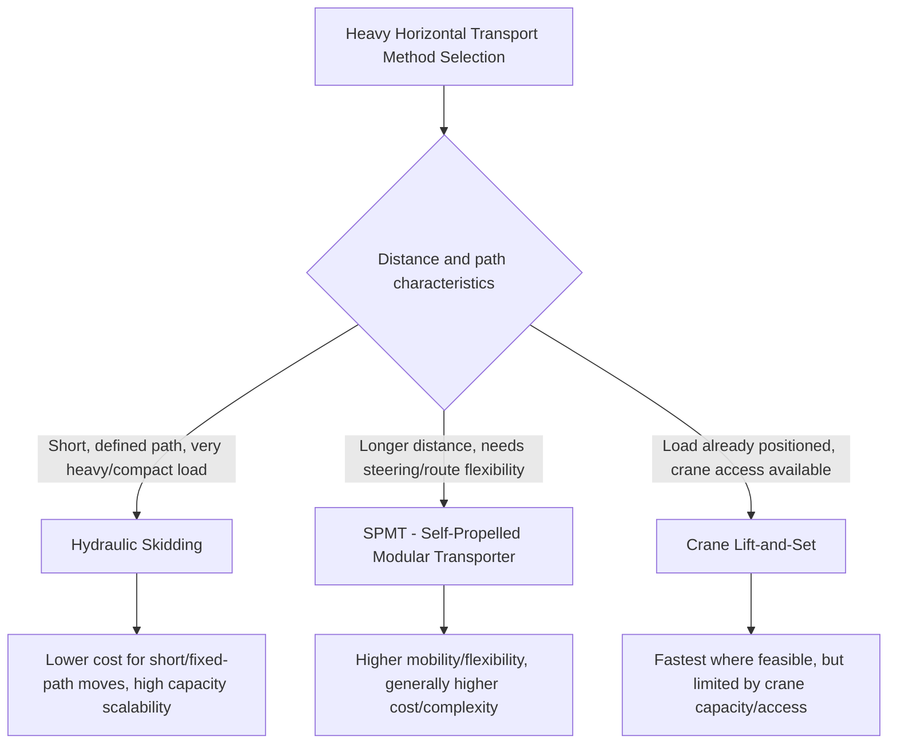

## Hydraulic Skidding Systems and Skid Tracks

### Overview

Hydraulic skidding moves extremely heavy loads horizontally along a prepared track system, using hydraulic push/pull cylinders (or, as covered in the previous two modules, strand jacks configured for horizontal pulling) rather than wheeled transport. Skidding is the preferred heavy-lift transport method where a load must travel a defined, relatively short horizontal distance — from a fabrication/assembly position to its final installed position, or from a transport vessel/barge onto a foundation — particularly where the load is too heavy for practical crane lift-and-set, or where the final position sits in a location a crane cannot directly access.

### Core Mechanical Principle

**Skid Shoes and Track**

The load rests on **skid shoes** (also called skid beams or slide shoes) — low-friction, heavy-duty sliding elements distributing the load's weight over the skid track's surface. The skid track itself is a prepared, leveled, and structurally adequate path (steel beams, concrete, or a combination) along which the skid shoes slide.

**Low-Friction Interface**

The critical enabling technology for practical hydraulic skidding is the low-friction interface between skid shoe and track, typically achieved through:

- **PTFE (Teflon) or similar low-friction pads** — bonded or mechanically fixed to the skid shoe's sliding surface, providing a substantially lower coefficient of friction than bare steel-on-steel contact
- **Stainless steel track surface** — paired with PTFE pads, providing a consistent, low-friction, and durable sliding interface
- **Grease or specialized lubricants** — sometimes used in combination with or as an alternative to PTFE systems, particularly on older or lower-budget skidding installations

The resulting friction coefficient directly determines the pushing/pulling force required to move a given load weight:

$$F_{required} = \mu \times W_{load}$$

where $\mu$ is the effective coefficient of friction at the skid shoe/track interface. [Inference] PTFE-on-stainless systems commonly achieve friction coefficients in the range of roughly 0.05–0.10 depending on specific pad condition, lubrication, and loading, substantially lower than untreated steel-on-steel contact — but the exact value for a specific system should be taken from the skid system manufacturer's tested/certified data for the specific pad material, track surface, and loading condition, rather than assumed from a general industry figure, since this value directly determines the required jacking/pulling force and therefore the entire system's sizing.

### Hydraulic Push-Pull Systems

**Strand Jack-Based Skidding**

As introduced in the Strand Jack Operating Principles module, strand jacks can be oriented horizontally and anchored to pull the load along the skid track through the same alternating grip-and-stroke mechanism used for vertical lifting — a common configuration for very heavy loads given strand jacking's scalable capacity.

**Hydraulic Cylinder (Push-Pull) Systems**

An alternative, particularly common for shorter-distance or lower-capacity skidding operations: hydraulic cylinders mounted at the skid track, pushing or pulling the load incrementally through the cylinder's own stroke length, with the cylinder re-anchored (or a secondary holding mechanism engaging) after each stroke to allow the next push cycle — mechanically analogous to the strand jack's alternating grip cycle, but using a mechanical stop/pin re-engagement system rather than strand wedge grips.

### Skid Track Design

**Track Structure and Materials**

Skid tracks are engineered structures in their own right, requiring:

- **Adequate bending/structural capacity** along the full track length to carry the moving load's weight without excessive deflection, since deflection during skidding can introduce uneven loading, increased friction, or in severe cases binding of the skid shoe against the track
- **Level and straight alignment** within tight tolerance, since even minor track misalignment can introduce lateral forces on the load or uneven skid shoe loading across a multi-shoe system
- **Continuous support or engineered span** — the track is either continuously supported (resting directly on prepared ground/foundation along its full length) or, where crossing an opening or gap, engineered as a spanning structure with adequate capacity for the load passing over that specific section

**Foundation and Ground Bearing**

The same ground bearing pressure verification principles discussed for crawler cranes and outrigger systems (see the Mobile, Crawler, and Specialized Cranes chapter) apply directly to skid track foundation design — the track transmits the load's weight to the ground along its length, and the resulting pressure must be verified against the site's allowable bearing capacity, with mat/ground improvement measures applied where native capacity is insufficient.

### Load Transfer Onto and Off the Skid System

**Jacking-Up Onto Skid Shoes**

Before skidding can begin, the load must be raised slightly (typically using hydraulic jacks at defined jacking points) to allow the skid shoes to be positioned beneath it, then lowered back onto the shoes — a discrete, engineered lifting operation in its own right, requiring the same jacking-point load distribution analysis discussed for multi-point lifting elsewhere in this program, applied at a smaller scale (lifting only enough to clear and insert the skid shoes, not a full transport lift).

**Transfer at Journey's End**

Similarly, arrival at the final position typically requires a reverse jacking sequence — raising the load slightly off the skid shoes to allow their removal, then lowering onto final foundation supports or bearing plates, or, in some sequences, direct transition from skid shoes onto final supports via a coordinated jack-down sequence without a separate shoe-removal step.

### Push-Pull Force Balance and Multi-Point Skidding

For loads skidded using multiple synchronized push-pull units (analogous in principle to multi-point strand jack lifting, see previous module), the same fundamental synchronization concern applies — asynchronous advancement at different points can introduce twisting/racking forces on the load or uneven track loading, requiring coordinated control:

$$\sum F_{applied} = F_{friction,total} + F_{grade} \pm F_{other}$$

where $F_{friction,total}$ is the total friction resistance across all skid shoes, $F_{grade}$ accounts for any track grade/slope (skidding on a rising grade requires additional force; a falling grade may require restraining/braking force rather than driving force), and $F_{other}$ accounts for any additional resistance or assistance forces (wind, minor track misalignment drag, etc.).

### Braking and Controlled Descent on Grade

For skid tracks with any grade (even slight), controlled movement requires the push-pull system to also function as a brake/restraint, preventing the load from accelerating uncontrolled down-grade under its own weight component along the slope — a safety-critical consideration distinct from level-track skidding, where the push-pull system only needs to provide driving force, not restraining force.

### Comparison to Alternative Heavy Transport Methods

Skidding is generally favored over SPMT transport (a related heavy-transport technique, covered separately in this program) where the travel path is short, fixed, and known well in advance — SPMTs offer substantially greater routing flexibility and are generally preferred for longer-distance moves or where the final path isn't a simple straight/defined track, while skidding's fixed-track nature suits situations where the same short path will be used for one or a limited number of moves and the cost/time of installing a dedicated track is justified by the load's weight or the specific site constraints.

### Engineering and Planning Requirements

- **Full structural engineering** of the skid track, foundation, and load path, following the same design-factor and ground-bearing principles established throughout this program
- **Jacking point analysis** for both the initial load-up and final load-down transfer sequences, verifying the load's structure can safely accept concentrated jacking loads at the specific points used
- **Push-pull force and capacity verification**, including friction coefficient assumptions, grade effects, and adequate margin above calculated required force
- **Synchronization control** for multi-point systems, following principles directly analogous to the strand jack synchronization discussion in the previous module

### Example

A 3,200 t process module must be skidded 85 m from its assembly position to its final foundation, on a level, prepared skid track.

Using a PTFE-on-stainless skid shoe system with a manufacturer-certified friction coefficient of 0.08:

$$F_{required} = \mu \times W_{load} = 0.08 \times 3,200 \approx 256 \text{ t of pushing/pulling force}$$

A multi-point hydraulic push-pull system is sized to provide this total force across several synchronized units (rather than one single unit at 256 t capacity), distributing the pushing force across multiple track locations to avoid concentrating the entire push reaction at a single point on the module's structure — mirroring the same multi-point load distribution philosophy applied to lifting, adapted here to the horizontal pushing force path a skidding operation introduces.

**Related Topics**

- Strand Jack Operating Principles
- Synchronized Multi-Point Strand Jack Lifting
- SPMT (Self-Propelled Modular Transporter) Operations
- Ground Bearing Pressure and Outrigger/Mat Sizing
- Module Transport and Heavy Haul Route Engineering
- Tandem and Multi-Crane Lift Load Sharing