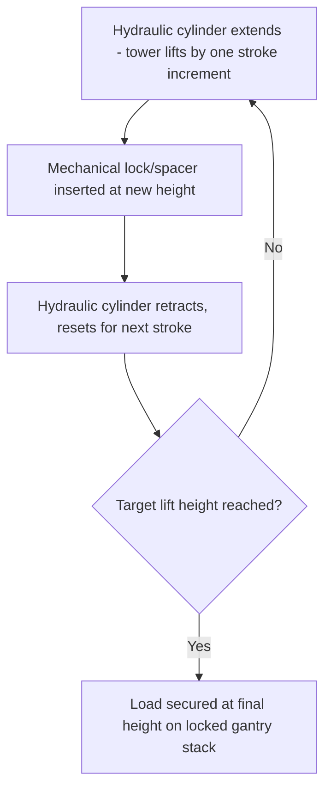
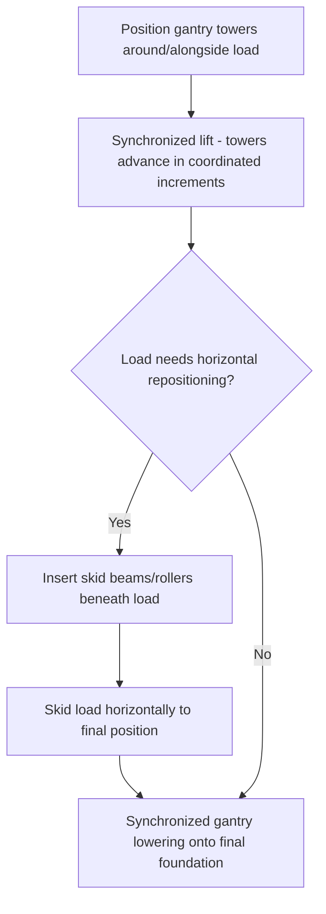

## Hydraulic Gantry Systems for Confined-Space Lifts

### Overview

Hydraulic gantry systems provide heavy lifting capability specifically engineered for the headroom-constrained and access-constrained environments where neither conventional cranes (Mobile, Crawler, and Specialized Cranes chapter) nor even the tower-based strand jack systems (Strand Jack Operating Principles module) can be practically deployed. By using multiple portable hydraulic gantry towers connected by beams spanning directly over or straddling the load, this technique achieves substantial lift capacity within a low, compact working envelope — a defining application for lifts inside existing process structures, beneath pipe racks, within building envelopes, or in any environment where overhead and lateral clearance are the primary constraints on method selection.

### Core System Configuration

**Gantry Towers**

Individual hydraulic gantry towers — modular, stackable hydraulic cylinder/frame units — are positioned at defined points around or alongside the load, each capable of independent vertical lift through its own hydraulic cylinder stroke, then locking mechanically at the achieved height before the next stroke cycle (an operating principle sharing the same fundamental "lift-lock-reset-lift again" logic as the strand jack's alternating grip cycle, but implemented through a rigid mechanical stacking/pinning system rather than strand grips).

**Spanning Beams**

Horizontal beams connect pairs (or groups) of gantry towers, spanning across or alongside the load, with the load's lifting attachment points connecting to these beams rather than directly to the towers themselves in many configurations — allowing the towers to be positioned outside the load's own footprint (straddling it) while the load hangs from or rides beneath the spanning beam structure between them.

**Modular Stacking**

A defining characteristic of hydraulic gantry systems is their **modular, low-headroom stacking mechanism**: each lift stroke is followed by inserting a rigid spacer/pin (rather than the gantry relying purely on sustained hydraulic pressure to hold position), allowing the tower to mechanically "grow" in discrete increments similar in spirit to the strand jack's incremental strand-through-jack advancement, but achieved through solid mechanical stacking elements — a configuration that keeps the overall tower height low relative to lift height achieved, since the mechanism doesn't require a single long-stroke cylinder to achieve the full lift height in one continuous stroke.

### Why Gantry Systems Suit Confined-Space Applications

**Low Headroom Requirement**

Unlike a strand jack system (which requires a supporting tower or frame positioned *above* the load, with headroom for both the load's lift height and the jack/tower structure itself above that), a hydraulic gantry system's towers rise from the ground alongside or around the load, meaning the overall headroom requirement is generally driven primarily by the load's own lift height plus the gantry's own compact stacked-tower profile — substantially less demanding of overhead clearance than a strand jack tower spanning above the load, particularly relevant for lifts inside existing process units or building structures with fixed overhead structural steel, piping, or ductwork.

**Narrow Footprint and Positioning Flexibility**

Individual gantry towers are generally more compact and independently positionable than a full strand jack tower/frame structure, allowing towers to be placed in tighter, more irregular site layouts — squeezed between existing equipment, positioned in a narrow aisle, or arranged asymmetrically around an irregularly shaped load where a symmetric strand jack tower frame would not fit the available space.

**Mobility Between Lift Locations**

Many hydraulic gantry systems are designed for relative ease of relocation (compared to a bespoke, engineered strand jack tower/frame structure built for one specific lift) — some systems are marketed and used specifically for their ability to be moved between multiple lift locations on the same project or even between projects, valuable where a facility requires similar confined-space lifts at multiple points (sequential equipment replacement across several identical process units, for example).

### Capacity and Configuration

Total system capacity scales through the same fundamental principle as multi-point strand jacking — total capacity is the sum of individual tower capacities across all towers deployed, meaning a required total lift capacity can be achieved through various combinations of tower count and individual tower capacity rating, selected based on the specific load's geometry and available positioning points:

$$W_{total} = \sum_{i=1}^{n} W_{tower,i}$$

[Inference] Individual hydraulic gantry tower capacities vary considerably by manufacturer and specific product line, ranging from smaller units suited to moderate industrial equipment lifts up through very high-capacity systems used for major module and vessel installation — specific tower capacity, stroke increment size, and stacking mechanism details should be obtained from the specific manufacturer's documented product data for the system under consideration, since this is a product-specific rather than universally standardized figure.

### Synchronization Requirements

As with multi-point strand jacking (see Synchronized Multi-Point Strand Jack Lifting module), a multi-tower gantry lift requires coordinated, synchronized advancement across all towers to maintain the load's level attitude and correct load distribution throughout the lift:

- **Position-based synchronization** — most relevant given the gantry's discrete, mechanically-locked stroke-and-stack mechanism, where each tower's current locked height (rather than a continuously variable hydraulic position) is the primary tracked variable
- **Load monitoring** — load cells at individual tower/beam connection points verify actual load distribution matches the planned per-tower share, following the same tolerance-band and hold-logic principles discussed for strand jack systems
- **Sequential vs. simultaneous stroke cycling** — some gantry system operating procedures cycle through towers sequentially (each tower advances one increment in turn, rather than all towers stroking simultaneously), which can simplify individual tower control at the cost of introducing brief, controlled periods of uneven support during the sequence — this approach requires the engineering analysis to explicitly account for the transient load redistribution occurring during each tower's individual stroke, rather than assuming load is always evenly shared across all towers at every instant

### Combined Lifting and Skidding Applications

Hydraulic gantry systems are frequently used in combination with skidding (see Hydraulic Skidding Systems and Skid Tracks module) for confined-space module installation sequences:

1. Load is lifted vertically via gantry towers to clear an obstruction or achieve final installation height
2. Skid beams or rollers are inserted beneath the load while gantry-supported
3. Load is skidded horizontally into its final position while still supported (fully or partially) by the gantry system, or is lowered onto a skid track for subsequent horizontal movement
4. Final gantry lowering sequence sets the load onto its permanent foundation/supports

This combined sequence is particularly common for large equipment replacement projects within existing, congested industrial facilities, where the replacement item must both clear overhead/lateral obstructions during removal of the old equipment and precisely navigate into a specific final position that a simple straight-line crane lift-and-set could not achieve given the surrounding congestion.

### Foundation and Ground Bearing at Tower Base

Each gantry tower's base transmits its share of load to the ground, requiring the same ground bearing pressure verification principles established throughout this program (see Ground Bearing Pressure and Outrigger/Mat Sizing, and the Crawler Crane Configurations module) — though typically at a more concentrated point-load scale than a crawler track or even a large crane outrigger pad, given the compact footprint that is precisely the gantry system's advantage in confined spaces. Mat or localized foundation reinforcement beneath individual tower bases is common where existing floor slabs or ground conditions require load spreading to safely support the concentrated tower reaction.

### Engineering and Critical Lift Considerations

Given the typical application of hydraulic gantry systems to significant equipment/module lifts within operating or complex industrial facilities, engineering requirements generally mirror those established for strand jacking:

- Structural analysis of gantry tower positioning relative to the load's actual lift points and CG (see Center of Gravity and Multi-Point Lift Calculations, Rigging Fundamentals chapter)
- Synchronization control system commissioning and verification before the critical lift
- Site-specific foundation/floor loading verification at each tower position
- Detailed sequencing procedures for any combined lift-and-skid operation, given the increased complexity of transitioning load support between systems (gantry to skid track and back) partway through the overall operation

### Example

A refinery must replace a 340 t heat exchanger bundle located deep within an existing pipe rack structure, with only 6 m of vertical clearance above the equipment and narrow access aisles on either side preventing conventional crane boom access entirely.

A **four-tower hydraulic gantry system** is positioned in the narrow aisles flanking the equipment, with spanning beams connecting tower pairs across the equipment's width. Given the confined vertical clearance, the low-profile modular stacking mechanism allows the towers to lift the bundle clear of its supports within the available 6 m headroom — a lift height a strand jack tower system, requiring headroom for both the lift height and an overhead support structure, could not achieve in this specific clearance. Once lifted clear, skid beams are inserted and the bundle is skidded laterally out of the pipe rack to a clear area where a conventional crane can complete the final transport lift onto a heavy-haul trailer, illustrating the common combined-method sequence bridging confined-space gantry/skid operations with conventional crane capability once clearance constraints are no longer the governing factor.

**Related Topics**

- Strand Jack Operating Principles
- Synchronized Multi-Point Strand Jack Lifting
- Hydraulic Skidding Systems and Skid Tracks
- Center of Gravity and Multi-Point Lift Calculations
- Ground Bearing Pressure and Outrigger/Mat Sizing
- Module Transport and Heavy Haul Route Engineering