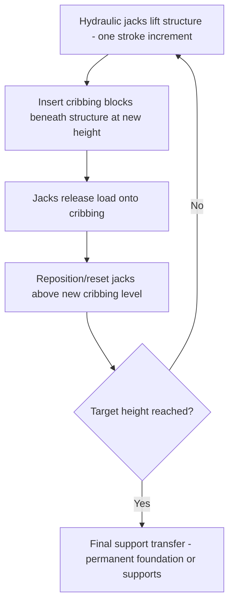
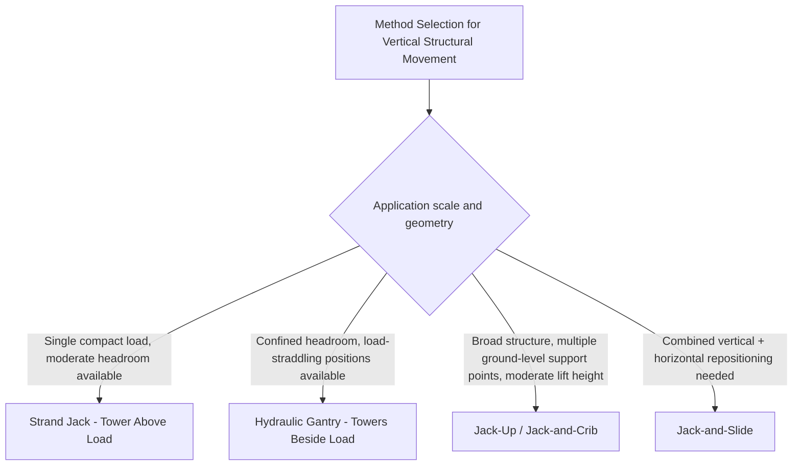

## Jack-and-Slide and Jack-Up Techniques

### Overview

Jack-and-slide and jack-up techniques form a related family of heavy-lift methods using synchronized hydraulic jacks to achieve controlled vertical movement, distinct from both the strand-through-jack mechanism of strand jacking (Strand Jack Operating Principles module) and the tower-based gantry approach (previous module) in their typical application to broader structural lifting — raising entire structures, large deck sections, or vessels as a whole, often over greater total lift heights and involving more points of support than a single-load-item lift.

### Jack-Up Technique Fundamentals

**Core Principle**

Jack-up systems use multiple hydraulic jacks positioned at defined support points beneath a structure or load, synchronized to raise the entire supported structure vertically in a controlled, coordinated sequence — conceptually similar to the multi-point synchronization challenge discussed for strand jacking and gantry systems, but typically applied at a larger structural scale (raising an entire platform, building module, or vessel section rather than a single discrete piece of equipment) and frequently using a **jack-and-crib** cycle rather than a strand-through-jack or beam-stacking mechanism.

**Jack-and-Crib Cycling**

A common jack-up method uses a repeating cycle of hydraulic jacking combined with cribbing (temporary structural support blocks) insertion:

1. Hydraulic jacks lift the structure by one stroke increment at each support point
2. Cribbing blocks are inserted beneath the structure at that new height, providing a temporary, load-bearing support independent of the jacks
3. The jacks release (fully or partially) onto the cribbing, allowing the jack itself to be repositioned/reset
4. The jack re-engages above the new cribbing level, and the cycle repeats

This is mechanically similar in principle to the "advance-lock-reset" logic seen in both strand jacking and hydraulic gantry systems, but implemented using discrete, removable cribbing blocks rather than an integrated mechanical stacking/pinning system built into the jack tower itself — a simpler, often lower-cost approach particularly suited to applications where the jack-up equipment is more generic (standard hydraulic jacks rather than a purpose-built proprietary gantry/strand jack product).

### Jack-and-Slide Technique

**Combining Vertical Jacking With Horizontal Movement**

Jack-and-slide techniques integrate the vertical jack-up cycle described above with horizontal sliding capability at the jacking/support points — after each vertical lift increment (or at a defined target height), the structure is incrementally slid horizontally on low-friction slide surfaces or rollers positioned at the jack/cribbing support points, combining vertical height gain and horizontal repositioning within a single coordinated sequence rather than as fully separate operations.

**Applications**

- **Structure/module repositioning during construction** — where a partially or fully assembled structure must both gain elevation (clearing formwork, temporary supports, or site obstructions) and shift horizontally into final alignment
- **Bridge and large span construction** — jack-and-slide sequences are used in some bridge deck construction methods, progressively advancing deck sections both vertically (achieving final deck elevation) and horizontally (advancing the deck span-by-span) using synchronized jack/slide cycles at pier or temporary support locations
- **Building/structure elevation projects** — raising an entire building or structure to a new final elevation (flood mitigation retrofits, foundation replacement projects) sometimes combines jack-up cycling with limited horizontal repositioning if the structure's final location shifts slightly from its original footprint

### Comparison to Strand Jacking and Hydraulic Gantry Systems

| Characteristic | Strand Jack | Hydraulic Gantry | Jack-Up / Jack-and-Slide |
| --- | --- | --- | --- |
| Support point location | Above load (tower/frame) | Beside load (straddling towers) | Beneath load (ground-level jacks) |
| Typical lift height range | Very high (limited by strand length) | Moderate, headroom-constrained | Moderate, cribbing-cycle dependent |
| Horizontal movement integration | Separate skidding operation typically | Combined with skid beams commonly | Integrated jack-and-slide cycle available |
| Typical scale of application | Single heavy compact load | Confined-space equipment/module lift | Broad structure, platform, or building section |

[Inference] These are general tendencies rather than strict boundaries — specific project engineering frequently combines elements of more than one technique (as illustrated in the previous module's gantry-then-skid example), and the specific method selected for a given project depends heavily on the load's actual geometry, available support points, and site-specific access constraints rather than a rigid categorical assignment.

### Cribbing Design and Verification

Since jack-and-crib cycling depends on cribbing blocks bearing structural load during each reset cycle (not merely as a passive backup), cribbing itself requires engineering verification:

- **Individual crib block bearing capacity** — timber or engineered cribbing blocks must be verified for adequate compressive strength under the transferred load at each cycle height
- **Crib stack stability** — as cribbing height increases (particularly for taller total jack-up heights requiring many cycles), the crib stack's own stability against lateral movement or buckling becomes a structural consideration distinct from simple vertical bearing capacity
- **Uniform bearing across the crib footprint** — ensuring the crib stack's top surface provides even bearing to the structure above, avoiding point-loading concentration that could locally overstress either the crib material or the structure being lifted

### Synchronization Across Multiple Jack Points

As with strand jacking and gantry systems, multi-point jack-up and jack-and-slide operations require coordinated synchronization to prevent uneven lift progress from tilting or racking the supported structure:

- **Position-matched cycling** — all jack points generally complete their lift-crib-reset cycle in a coordinated sequence, whether truly simultaneous or a carefully sequenced order that maintains the structure within an acceptable tilt tolerance throughout
- **Load monitoring** — load cells or hydraulic pressure monitoring at each jack point verify actual load distribution, following the same tolerance-band principles discussed for strand jack and gantry synchronization
- **Structural flexibility considerations** — for broader structures/platforms (a common jack-up application scale), the structure's own flexibility across multiple, more widely spaced support points is frequently a more significant engineering concern than for a single compact strand-jacked load, since a broad platform can develop meaningful internal stress from even modest inter-point synchronization deviation given the larger spans typically involved

### Slide Surface and Horizontal Movement Mechanics (Jack-and-Slide Specific)

Where horizontal sliding is integrated into the cycle, the same low-friction interface principles discussed for hydraulic skidding (see Hydraulic Skidding Systems and Skid Tracks module) apply at each jack/support point — PTFE or similar low-friction pad systems paired with a suitable sliding surface, sized to the vertical load being carried at that point during the horizontal movement phase of the cycle, with horizontal push/pull force requirements calculated using the same friction-coefficient-times-load relationship established in that module.

### Engineering and Planning Requirements

- **Support point layout and load distribution analysis**, establishing how total structure weight distributes across the selected jack/support point locations, following the same fundamental multi-point load distribution principles established in the Center of Gravity and Multi-Point Lift Calculations module (Rigging Fundamentals chapter)
- **Cribbing engineering** — material selection, individual block capacity, and stack configuration verification at each planned cycle height
- **Synchronization control system specification**, scaled appropriately to the structure's size and flexibility — larger, more flexible structures generally warranting more sophisticated, closely monitored control than a compact, rigid load
- **Sequencing and contingency procedures** for partial-cycle interruption (a jack or crib issue discovered mid-cycle), given the structure may be in a transient, partially-supported condition at various points through a multi-cycle jack-up sequence

### Example

A coastal facility requires raising an existing 1,100 t equipment platform 2.4 m to meet updated flood elevation requirements, using twelve jack-and-crib support points distributed across the platform's footprint.

Each cycle raises the platform 300 mm (the jacks' stroke increment), requiring 8 complete cycles to achieve the full 2.4 m target height. At each cycle, cribbing blocks rated for the calculated per-point load (based on the platform's weight distribution across the twelve points, following standard multi-point load distribution analysis) are inserted, and all twelve jack points are verified within the engineered position tolerance before proceeding to the next cycle — a substantially more cycle-intensive process than a single continuous strand jack lift of comparable total height, but appropriate here given the broad, flat platform geometry (well suited to numerous ground-level jack-and-crib points beneath it) rather than the compact, single-lift-point geometry strand jacking or gantry systems more typically address.

**Related Topics**

- Strand Jack Operating Principles
- Synchronized Multi-Point Strand Jack Lifting
- Hydraulic Gantry Systems for Confined-Space Lifts
- Hydraulic Skidding Systems and Skid Tracks
- Center of Gravity and Multi-Point Lift Calculations
- Module Transport and Heavy Haul Route Engineering