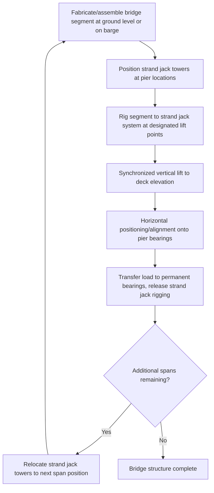
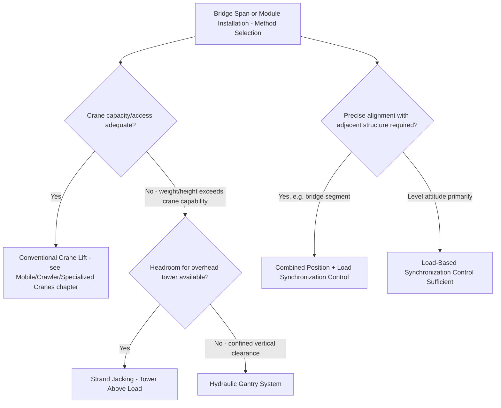

## Strand Jacking Applications in Bridge and Module Installation

### Overview

Having established strand jacking's core mechanical principles (Strand Jack Operating Principles module) and multi-point synchronization requirements (Synchronized Multi-Point Strand Jack Lifting module), this module examines how those fundamentals are applied across the two application domains where strand jacking sees its most extensive and well-developed use: bridge construction/installation and industrial module installation. Each domain imposes distinct geometric, sequencing, and load-path considerations that shape how the general strand jack technique is adapted to the specific application.

### Bridge Applications

**Span Lifting and Installation**

Strand jacking is widely used to lift pre-fabricated bridge spans or deck segments from a barge, transport trailer, or ground-level assembly position into their final elevated position atop piers or abutments — an application favored where the span's total weight and the required lift height exceed what conventional crane lifting can practically achieve at the specific span location, or where crane access beneath or around the final bridge position is constrained (over water, over an active roadway/railway requiring minimal disruption, or in a canyon/gorge setting with limited ground access).

**Incremental Launching Combined With Strand Jacking**

For some bridge construction methods, strand jacking (in its horizontal-pulling configuration, as introduced in the Strand Jack Operating Principles module) is combined with the deck's own incremental launching sequence — pulling a progressively assembled deck section forward across temporary or permanent piers using synchronized strand jack units, sometimes combined with jack-and-slide vertical/horizontal cycling (see previous module) at pier support locations to manage both the deck's forward advancement and any vertical elevation adjustment required at each pier.

**Cable-Stayed and Suspension Bridge Applications**

Strand jacking's core technology — high-tensile strand bundles and incremental grip-and-pull mechanisms — shares conceptual and, in some equipment designs, direct technological lineage with the strand/cable systems used in cable-stayed and suspension bridge main cable and stay cable installation and tensioning, though the specific equipment and procedures for permanent structural cable installation are a distinct specialized discipline from construction-phase strand jacking of temporary lift/erection loads.

**Segmental Lift Sequencing**

Multi-span bridge construction using strand jacking typically proceeds through a repeated sequence across multiple spans:

**Alignment and Tolerance Requirements**

Bridge segment installation via strand jacking typically demands tighter final-position tolerance than many industrial module lifts, given the need for precise alignment with adjacent segments (matching deck surface continuity, alignment of post-tensioning ducts or connection details) and correct seating onto pier bearings — meaning the combined position-and-load synchronization control discussed in the previous module's example is frequently the standard rather than exceptional configuration for bridge segment strand jack lifts, reflecting the elevated precision requirement compared to some industrial applications where level attitude alone (without the same tight positional alignment against an adjacent structure) may be the primary control target.

### Industrial Module Installation Applications

**Reactor and Vessel Installation**

As introduced in the Strand Jack Operating Principles module's worked example, strand jacking is a standard technique for installing very heavy reactor vessels, columns, and similar process equipment into refineries, petrochemical facilities, and power plants — particularly where the vessel's weight exceeds practical crane capacity at the required lift height/radius, or where the installation location's headroom/access constraints favor a tower-based lift over crane boom geometry.

**Modular Construction and Pre-Assembled Unit (PAU) Installation**

Large, factory- or yard-fabricated modules (piping racks, equipment skids, entire process units assembled off-site and transported for final installation) are increasingly common in industrial construction as a strategy to shift labor-intensive assembly work to more controlled, efficient off-site environments — and strand jacking, often combined with the SPMT transport and skidding techniques discussed elsewhere in this program, is a standard method for lifting these modules into final position once transported to site.

**Combined Transport-to-Installation Sequences**

A common heavy industrial module installation sequence integrates several techniques covered across this chapter:

1. Module is transported to site via SPMT or heavy-haul trailer
2. Module is positioned beneath or adjacent to a strand jack tower/frame system (or, for confined locations, a hydraulic gantry system per the earlier module)
3. Strand jacks lift the module to final installation elevation
4. Any final horizontal positioning is achieved via integrated skidding or jack-and-slide technique
5. Module is lowered onto final foundation/support structure, strand jack rigging released

**Retrofit and Brownfield Installation Challenges**

Industrial module installation via strand jacking frequently occurs within operating or partially operating facilities (brownfield sites), introducing considerations largely absent from greenfield bridge construction:

- **Proximity to operating equipment** — strand jack tower positioning and load path planning must account for minimum clearance/exclusion zones around live process equipment, piping, and electrical systems
- **Reduced positioning flexibility** — existing structures, foundations, and equipment frequently constrain where strand jack towers can be positioned, sometimes requiring asymmetric tower arrangements or a hydraulic gantry approach (see previous module) where true strand jack tower positioning isn't feasible
- **Outage/turnaround scheduling** — many brownfield module installations are scheduled within defined plant outage/turnaround windows, adding schedule-criticality pressure to the lift sequence beyond what a standalone bridge or greenfield construction project typically experiences

### Structural and Rigging Interface Considerations

**Lift Point Design on the Load**

Both bridge segments and industrial modules require purpose-engineered lift points (lugs, trunnions, or embedded lifting attachments) specifically designed for the strand jack rigging interface, following the same fundamental lift-point/lug design principles discussed for crane rigging (see Rigging Fundamentals chapter) but adapted to strand jack-specific attachment hardware — since strand jack rigging typically differs from conventional crane sling/shackle rigging in its specific connection hardware between the strand bundle and the load.

**Load Path From Strand Bundle to Load**

The connection between the strand jack's lower anchor point and the actual load structure typically involves purpose-engineered rigging hardware (spreader elements, load-specific brackets, or adapter hardware) bridging between the strand bundle's standard anchor fitting and the load's specific lift point geometry — this interface hardware requires the same design-factor and structural verification rigor applied throughout this program's rigging hardware coverage (see Safe Working Load and Factor of Safety in Rigging module), adapted to strand jack-specific loading and connection geometry.

### Comparative Selection: Strand Jacking vs. Alternative Methods for These Applications

### Example

A highway agency is installing a 165 m steel truss bridge span over an active four-lane highway, where closing the highway for conventional crane lift-and-set operations is restricted to brief overnight windows insufficient for a full crane-based lift sequence, and no adequate crane positioning exists that would avoid extended lane closures during daytime traffic.

A strand jack lift system is engineered instead: the truss span is fully assembled on temporary supports alongside the highway, then lifted and translated (combining vertical strand jack lifting with horizontal jack-and-slide or skidding movement) into final position over the highway during a single, planned overnight closure window — since the strand jack system's towers are positioned entirely outside the highway envelope (avoiding any need for crane positioning within the traffic lanes themselves), and the lift/translation sequence, once commissioned and rehearsed in advance, can be executed within the available closure window far more reliably than attempting an equivalent conventional crane-based lift-and-set sequence with its associated crane positioning and rigging time requirements within the same constrained window.

**Related Topics**

- Strand Jack Operating Principles
- Synchronized Multi-Point Strand Jack Lifting
- Hydraulic Gantry Systems for Confined-Space Lifts
- Jack-and-Slide and Jack-Up Techniques
- SPMT (Self-Propelled Modular Transporter) Operations
- Rigging Certification and Competent Person Requirements