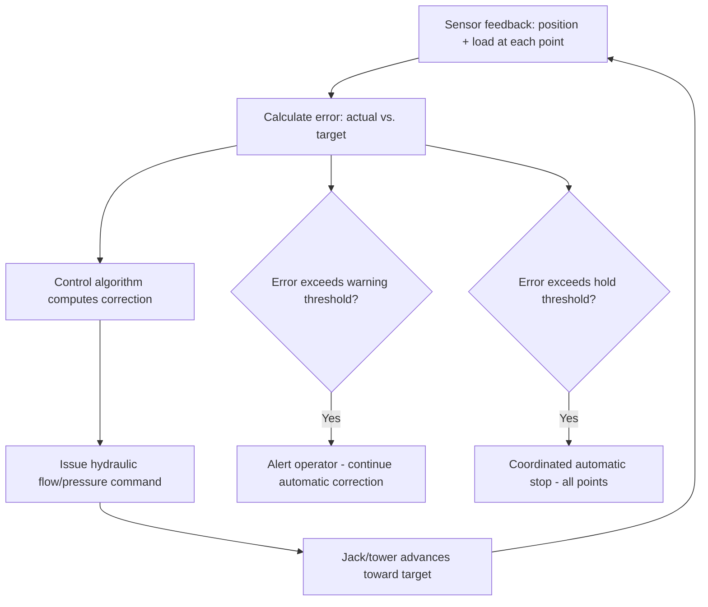

## Computer-Controlled Lift Synchronization Software

### Overview

Computer-controlled lift synchronization software is the software/control layer underlying the multi-point coordination discussed throughout this chapter — strand jacking (Synchronized Multi-Point Strand Jack Lifting module), hydraulic gantry systems, and jack-and-slide operations all depend on a control system translating engineered load-distribution and position targets into real-time hydraulic commands. This module examines that control layer directly: its architecture, the algorithms governing synchronization decisions, sensor/feedback integration, and the human-machine interface through which lift personnel monitor and, when necessary, intervene in an operation that is otherwise substantially automated.

### Control System Architecture

**Programmable Logic Controllers (PLCs) and Industrial Control Platforms**

Most modern heavy-lift synchronization systems are built on industrial PLC platforms (or, in more sophisticated installations, distributed control systems combining PLC-level real-time control with higher-level supervisory computing), reflecting the same general control technology used broadly across industrial process automation, adapted specifically to the lift synchronization problem's real-time, safety-critical requirements.

**Centralized vs. Distributed Control**

- **Centralized architecture** — a single central controller receives all sensor feedback and issues all hydraulic commands, offering straightforward, unified control logic at the cost of that central controller becoming a single point of failure unless adequately redundant
- **Distributed architecture** — individual jack/tower units incorporate local controllers handling their own immediate hydraulic control loop, coordinated by a supervisory system issuing target setpoints and monitoring overall synchronization rather than directly commanding every hydraulic valve — offering improved fault tolerance (a single local controller fault is less likely to affect the entire system) at the cost of increased architectural complexity

[Inference] Specific system architecture varies considerably by manufacturer and by the scale/criticality of the specific lift application — larger, more critical lifts (particularly those covered in the Ring Cranes and Very Heavy Lift Capacity Systems module's scale) more commonly justify the additional complexity and cost of distributed, redundant architecture, while smaller-scale applications may reasonably use simpler centralized systems, though this represents a general tendency rather than a fixed rule.

### Core Control Algorithm Functions

**Position and Load Feedback Processing**

The control system continuously ingests real-time feedback from position sensors (tracking each jack/tower's stroke position or cumulative advancement) and load cells (measuring actual force at each lift/support point), processing this data at a control loop update rate fast enough to detect and correct deviation before it grows beyond acceptable tolerance.

**Proportional-Integral-Derivative (PID) or Equivalent Control Loops**

Most hydraulic synchronization control implements some form of closed-loop feedback control (PID control being a widely used general industrial control algorithm, though specific implementations vary by manufacturer) — comparing each point's actual position/load against its target, calculating an error signal, and adjusting hydraulic flow rate/pressure at that point to drive the error toward zero, continuously repeating this comparison-and-correction cycle throughout the lift.

$$u(t) = K_p e(t) + K_i \int_0^t e(\tau) \, d\tau + K_d \frac{de(t)}{dt}$$

where $u(t)$ is the control output (commanded hydraulic adjustment), $e(t)$ is the error (difference between target and actual position/load), and $K_p$, $K_i$, $K_d$ are tuned proportional, integral, and derivative gain constants specific to the system's hydraulic response characteristics. [Inference] The specific control algorithm and tuning parameters are proprietary to each manufacturer's system and are tuned during commissioning to the specific installation's hydraulic response characteristics — the PID formulation above represents a widely used general control engineering approach rather than a claim about any specific commercial system's exact internal algorithm.

### Sensor and Feedback Systems

**Position Sensing**

Position feedback is typically achieved through linear position transducers, encoder-based systems tracking cylinder stroke or strand advancement, or, for some jack-and-crib/gantry systems, discrete position confirmation at each mechanical locking increment rather than continuous analog position tracking.

**Load Sensing**

Load cells integrated into the jack, anchor point, or rigging load path provide force feedback, either through dedicated load pin/load cell hardware or, in some systems, through hydraulic pressure sensing at the cylinder (inferring load from pressure, a less directly precise method than dedicated load cells but sometimes used as a supplementary or lower-cost feedback source).

**Redundant Sensing**

Given the safety-critical nature of the feedback data driving automated control decisions, more sophisticated systems incorporate redundant sensors at critical measurement points, with the control system comparing redundant readings and flagging/alerting on disagreement beyond an expected tolerance — providing a check against a single sensor failure feeding erroneous data into the control loop undetected.

### Human-Machine Interface (HMI) and Operator Monitoring

**Real-Time Display**

Lift personnel typically monitor the operation through an HMI screen (or, on larger systems, multiple screens/stations) displaying real-time position, load, and tolerance status at every monitored point, often with graphical representation of the load's current attitude/level status and each point's percentage-of-tolerance-band consumption, allowing operators to visually assess overall system health at a glance rather than parsing raw numeric data from every individual point.

**Alarm and Alert Hierarchy**

Following the tolerance-band structure introduced in the Synchronized Multi-Point Strand Jack Lifting module, the HMI typically presents a graduated alarm hierarchy — routine status indication for normal operation, distinct visual/audible alerts for warning-band deviations, and clear, unambiguous indication when an automatic hold has been triggered, along with the specific point(s) and parameter(s) that triggered it, to support rapid operator diagnosis of the cause.

**Manual Override and Intervention Capability**

While synchronization systems operate largely automatically during normal operation, operator intervention capability is a standard and necessary system feature:

- **Manual pause/hold** — operator-initiated stop capability independent of automatic threshold triggers, for situations where an operator observes a concern the automated system's specific monitored parameters may not directly capture (unusual noise, visual indication of an issue, an external condition change)
- **Manual point-by-point adjustment** — in some systems, capability for an operator to manually command an individual point's advancement (used cautiously, typically only under specific engineered contingency procedures) rather than relying solely on fully automatic multi-point coordination
- **Emergency stop** — a hard-wired, independent emergency stop capability (not dependent on the primary control software's own logic) is standard practice, ensuring an ability to halt the operation even in the event of a control software fault

### Data Logging and Post-Lift Documentation

Modern lift synchronization systems typically log continuous position, load, and system status data throughout the operation, serving several purposes:

- **Real-time troubleshooting support** — historical trend data assists in diagnosing the cause of any deviation or hold event during the lift itself
- **Post-lift verification and documentation** — logged data provides an auditable record confirming the lift proceeded within engineered tolerances throughout, supporting quality assurance and regulatory/client documentation requirements for critical lift operations
- **Engineering feedback for future lifts** — actual system performance data (achieved tolerance, correction frequency, any anomalies) can inform refinement of control tuning or engineering assumptions for subsequent similar lifts

### Commissioning and Verification of Control Software

Given that the control system is the primary mechanism actually preventing dangerous load maldistribution during a critical lift, software/control system commissioning is treated with commensurate rigor:

- **Factory acceptance testing (FAT)** — control system logic and hardware integration testing performed before shipment/installation, verifying the control algorithm behaves correctly across a range of simulated sensor input and fault scenarios
- **Site acceptance testing (SAT)** — on-site verification following installation, confirming the control system correctly interfaces with the actual installed sensors, hydraulic hardware, and site-specific configuration
- **No-load/light-load commissioning cycles** — as introduced in the Synchronized Multi-Point Strand Jack Lifting module, running the fully assembled system through simulated or partial-load lift cycles before the actual critical lift, specifically to validate real-world synchronization performance against the engineering design intent

### Cybersecurity and System Integrity Considerations

[Inference] As lift synchronization control systems increasingly incorporate networked components (remote monitoring capability, data logging to networked storage, or integration with broader site industrial control networks), standard industrial control system cybersecurity practices — network segmentation, access control, and protection against unauthorized modification of control parameters — are an increasingly relevant consideration for these systems, though the specific cybersecurity requirements and practices applied vary by project, system vintage, and the specific control platform's architecture, and this is a less mature or universally standardized aspect of lift synchronization system practice compared to the mechanical/structural engineering rigor applied elsewhere in this discipline.

### Example

During commissioning of an eight-point strand jack system for a major module installation, the site acceptance test reveals that one jack's position sensor exhibits a consistent 3 mm offset error compared to a physically verified reference measurement, discovered specifically because the system's redundant sensor comparison flagged persistent, small but consistent disagreement between the primary and backup position sensors at that single point throughout the test cycles.

Rather than proceeding to the critical lift with this discrepancy unresolved, the commissioning team traces the fault to a sensor calibration error, recalibrates the affected position sensor, and repeats the no-load commissioning cycle to confirm the redundant sensor readings now agree within expected tolerance — illustrating how the redundant sensing and comparison logic built into the control software functions as a verification tool during commissioning itself, not merely as an in-service fault detection mechanism during the actual critical lift.

**Related Topics**

- Strand Jack Operating Principles
- Synchronized Multi-Point Strand Jack Lifting
- Hydraulic Gantry Systems for Confined-Space Lifts
- Jack-and-Slide and Jack-Up Techniques
- Rigging Certification and Competent Person Requirements
- Strand Jacking Applications in Bridge and Module Installation