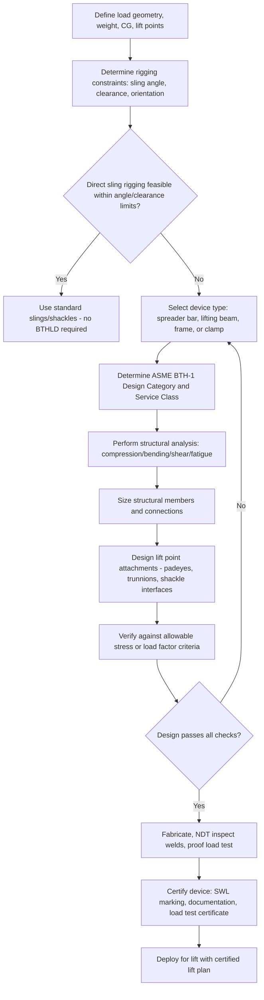

## Below-the-Hook Lifting Device Design

### Overview

Below-the-hook lifting devices (BTHLDs) are custom or standardized rigging equipment attached beneath the crane hook to engage, support, and control a load during lifting operations. Unlike simple slings or shackles, these devices — spreader bars, lifting beams, frames, clamps, and specialty attachments — are engineered structural assemblies designed to solve specific rigging problems: controlling sling angles, distributing load across multiple lift points, accommodating asymmetric loads, or providing a rigid interface between the hook and the load.

### Governing Standard

The primary U.S. design standard for below-the-hook lifting devices is **ASME BTH-1, "Design of Below-the-Hook Lifting Devices."** It establishes design categories, load combinations, allowable stress methodology (Design Category B, ASD-based) or load and resistance factor methodology, and classification of devices by service class (based on load cycles) and lift class (based on consequence of failure). [Inference] Specific edition requirements and applicability should be confirmed against the current adopted edition referenced in the governing project specification, as ASME periodically revises this standard.

### Device Categories

**Spreader Bars**

A rigid horizontal (or near-horizontal) member placed between the crane hook and the load, with the load rigged from each end of the bar rather than directly to the hook. Spreader bars are loaded primarily in **compression** along their length, with the rigging above pulling inward at an angle and the load rigging below also pulling inward — this converts what would be a wide-angle bridle sling arrangement (with high leg tension) into a compression member plus near-vertical slings, significantly reducing sling tension.

**Lifting Beams (Spreader Beams)**

Similar in function to spreader bars but loaded in **bending** rather than pure compression, because the top rigging point is typically a single centered attachment to the crane hook while the load attachment points are spread along the beam's length. This creates a beam in flexure with the hook load applied at midspan (or another point) and reactions at the load attachment points.

**Lifting Frames**

Two-dimensional or three-dimensional rigid structures (often a rectangular or triangulated frame) used when load attachment points exist in multiple planes or when a fully rigid, non-sling interface is required — common for large modules, skids, or prefabricated structural assemblies with engineered lift points on multiple faces.

**Below-the-Hook Clamps**

Mechanical devices that grip the load directly (friction clamps, screw clamps, vacuum lifters, or C-hooks) without requiring pre-installed lift points on the load itself. Common for plate handling, coil handling, or loads where welding lift points is impractical.

**Vacuum and Magnetic Lifters**

Specialty devices using vacuum pads or electromagnets to engage flat, non-porous, or ferrous loads (e.g., steel plate, glass panels, precast concrete slabs) without mechanical attachment points.

### Key Points

- **Spreader bar vs. lifting beam distinction**: Spreader bars primarily see compression (with minor bending from self-weight and rigging eccentricity); lifting beams primarily see bending. Selecting the correct device type for a given rigging geometry significantly affects both structural efficiency and cost.
- **Sling angle optimization**: The core function of most BTHLDs is to convert unfavorable sling geometries (low angles from horizontal, causing high leg tension) into more favorable near-vertical rigging, reducing both sling loads and the risk of load instability.
- **Center of gravity (CG) sensitivity**: Device design must account for the load's actual CG location, including tolerance for CG uncertainty; a lifting beam or frame with attachment points not properly aligned relative to the load's true CG can cause the load to hang unlevel or induce unintended eccentric loading on individual attachment points.
- **Self-weight contribution**: Larger BTHLDs (particularly heavy steel spreader beams and frames) can have substantial self-weight that must be included in overall lift weight calculations and crane capacity verification — sometimes representing a significant fraction of total hook load for lighter payloads.
- **Multi-point load sharing**: For loads with more than two lift points, load sharing among points is often statically indeterminate; devices must be designed to tolerate uneven load distribution (e.g., using load-equalizing sheaves, adjustable rigging, or conservative design margins) unless active load monitoring/equalization is used.
- **Modularity vs. custom design**: Standard modular spreader bars/beams (rated and re-certifiable, often rental equipment) are used for repeat/generic lifts, while custom-engineered frames are designed for unique, high-value, or irregular loads on a per-project basis.
- **Classification by service**: ASME BTH-1 assigns **Design Category** (A or B, reflecting the rigor and load factors used) and **Service Class** (0 through 4, reflecting expected number of load cycles over the device's life), which together determine the applicable allowable stress or load factors.

### Design Category and Service Classification (ASME BTH-1 Framework)

| Classification | Basis | Effect on Design |
| --- | --- | --- |
| Design Category A | Lower consequence of failure / more predictable loading | Lower design factor on yield/ultimate strength |
| Design Category B | Higher consequence of failure, less predictable/controlled loading, or where failure poses greater risk | Higher design factor, more conservative allowable stresses |
| Service Class 0 | Rarely used, very low cycle count | Static/limited fatigue consideration |
| Service Class 1–4 | Increasing expected load cycles over device life | Requires fatigue analysis per applicable S-N curve at higher classes |

[Unverified] Exact design factor values and cycle-count thresholds per service class should be verified directly against the current ASME BTH-1 edition, as this content is derived from general knowledge of the standard's structure rather than a verified citation of specific numeric values.

### Spreader Bar Force Analysis

For a simple two-point spreader bar of length $L$, with the crane hook rigged symmetrically from two points near the ends at an angle $\alpha$ from vertical, and load slings hanging from the same end points at angle $\beta$ from vertical down to the load:

**Compression force in the bar** (from the upper rigging pulling the ends inward):

$$C = \frac{W}{2} \times \tan(\alpha)$$

**Sling tension at each end** (upper rigging leg):

$$T_{upper} = \frac{W}{2\cos(\alpha)}$$

**Sling tension at each end** (lower rigging leg to load, often designed near-vertical, i.e., $\beta \approx 0$):

$$T_{lower} \approx \frac{W}{2}$$

where $W$ is total load weight. The bar itself must also be checked for bending due to its own self-weight between supports, and for combined compression-plus-bending (beam-column) interaction if the hook attachment is not perfectly axial.

### Lifting Beam Bending Analysis

For a simply-supported lifting beam with hook load $W$ applied at a single point and load reactions at two end attachment points spaced at length $L$, with the hook point at distance $a$ from one end:

$$M_{max} = \frac{W \times a \times (L-a)}{L}$$

The beam section (typically a wide-flange or fabricated box section) is then checked for bending stress:

$$\sigma_b = \frac{M_{max}}{S}$$

where $S$ is the section modulus, against the allowable bending stress per the applicable design category from ASME BTH-1. Shear, deflection, and lateral-torsional buckling (for unbraced compression flanges) are also typically checked.

### Below-the-Hook Device Selection Diagram (svg_diagram)

<svg xmlns="http://www.w3.org/2000/svg" viewBox="0 0 900 460" font-family="Arial, sans-serif">
<text x="450" y="28" font-size="18" font-weight="bold" text-anchor="middle">Spreader Bar vs Lifting Beam Load Path (svg_diagram)</text>

<text x="200" y="60" font-size="14" font-weight="bold" text-anchor="middle">Spreader Bar (compression)</text>

<line x1="200" y1="80" x2="200" y2="120" stroke="#333" stroke-width="3" />

<text x="215" y="100" font-size="10">Hook</text>

<line x1="200" y1="120" x2="120" y2="180" stroke="#333" stroke-width="2" />

<line x1="200" y1="120" x2="280" y2="180" stroke="#333" stroke-width="2" />

<rect x="100" y="180" width="200" height="16" fill="`#c9d6ea`" stroke="#333" stroke-width="2" />

<text x="200" y="214" font-size="10" text-anchor="middle">Bar in compression (C)</text>

<line x1="120" y1="196" x2="120" y2="240" stroke="#333" stroke-width="2" />

<line x1="280" y1="196" x2="280" y2="240" stroke="#333" stroke-width="2" />

<rect x="90" y="240" width="220" height="50" fill="`#e0e0e0`" stroke="#333" stroke-width="2" />

<text x="200" y="270" font-size="11" text-anchor="middle">Load</text>

<text x="200" y="310" font-size="10" text-anchor="middle">Lower slings ≈ vertical</text>

<text x="680" y="60" font-size="14" font-weight="bold" text-anchor="middle">Lifting Beam (bending)</text>

<line x1="680" y1="80" x2="680" y2="140" stroke="#333" stroke-width="3" />

<text x="695" y="100" font-size="10">Hook</text>

<circle cx="680" cy="150" r="6" fill="#333" />

<line x1="560" y1="150" x2="800" y2="150" stroke="`#c9d6ea`" stroke-width="14" />

<line x1="560" y1="150" x2="800" y2="150" stroke="#333" stroke-width="1" />

<text x="680" y="180" font-size="10" text-anchor="middle">Beam in bending (M_max)</text>

<line x1="560" y1="150" x2="560" y2="240" stroke="#333" stroke-width="2" />

<line x1="800" y1="150" x2="800" y2="240" stroke="#333" stroke-width="2" />

<rect x="550" y="240" width="260" height="50" fill="`#e0e0e0`" stroke="#333" stroke-width="2" />

<text x="680" y="270" font-size="11" text-anchor="middle">Load</text>

<text x="680" y="310" font-size="10" text-anchor="middle">Reactions at end points</text>

</svg>

### Design Process Flow

### Example: Two-Point Spreader Bar for a Long Equipment Skid

**Scenario**: A 40-ton equipment skid, 12 meters long, must be lifted with only two lift points near each end (no intermediate lift point available). Direct rigging from a single hook with a two-leg bridle would create a very shallow sling angle (high tension, risk of instability).

**Solution**: A 10-meter spreader bar is rigged from the crane hook at its center, with vertical (or near-vertical) slings dropping from each end of the bar to the skid's lift points.

**Calculation approach**:

1. Determine hook rigging angle $\alpha$ based on the spreader bar's headroom and hook sling geometry.
2. Calculate compression force in the bar: $C = \frac{W}{2}\tan(\alpha)$.
3. Size the bar (commonly a pipe or built-up box section) for compression plus self-weight bending, checking for **column buckling** given the bar's unbraced length — critical since compression members are buckling-governed rather than pure yield-governed for typical bar slenderness ratios.
4. Design and verify the end connection padeyes/shackle interfaces per the padeye design methodology (net section, bearing, shear tear-out).
5. Verify total hook load (skid weight + spreader bar self-weight + rigging) against crane capacity at the required radius.

**Outcome**: Near-vertical lower slings minimize tension and improve load stability, at the cost of adding the spreader bar's self-weight and requiring additional headroom compared to direct rigging.

### Fabrication, Testing, and Certification

- **Material selection**: Structural steel (commonly ASTM A36, A572, or higher-strength alloys for weight-critical applications) with verified mill certificates for critical devices.
- **Welding**: Performed per an approved welding procedure specification (WPS) with qualified welders; full-penetration welds typically required at primary structural connections.
- **NDT**: Magnetic particle or dye penetrant inspection of all load-bearing welds; ultrasonic testing for thick-section full-penetration welds.
- **Proof load testing**: Devices are commonly tested at 100–125% of rated capacity [Unverified — project/standard specific] prior to first use and periodically thereafter (especially for rental/reusable equipment).
- **Marking and documentation**: Rated capacity (SWL), device serial number/ID, and inspection date are typically stamped or tagged on the device, supported by a certification package including design calculations, material certificates, and test records.
- **Periodic inspection**: Reusable devices require scheduled inspection intervals (annual, or per number of lift cycles) consistent with their assigned service class.

[Behavior may vary based on specific device design, applicable code edition, material properties, and project-specific certification requirements — always verify against the current ASME BTH-1 edition and project engineering specification before design or use.]

### Common Design Pitfalls

- Failing to include the device's own self-weight in total hook load and crane capacity checks
- Underestimating compression buckling capacity of slender spreader bars (buckling governs before material yield for high slenderness ratios)
- Misalignment between design CG assumptions and actual load CG, causing unlevel lifts or unintended eccentric loading
- Inadequate consideration of side loading on lift points when rigging geometry is not perfectly planar
- Using non-certified or improperly documented "shop-built" lifting devices for critical lifts without proper engineering review
- Neglecting fatigue design for devices intended for repeated/production use (defaulting to static-only design)

### Related Topics

- Lifting Lugs, Trunnions, and Padeyes (lift point design fundamentals)
- Sling angle factors and rigging geometry optimization
- ASME BTH-1 design categories, service classes, and allowable stress methodology
- Center of gravity determination and load stability analysis
- Column buckling analysis for compression-loaded rigging members
- Vacuum and magnetic lifting systems for non-mechanical load engagement
- Load testing and certification procedures for lifting devices
- Critical lift planning and third-party engineering review requirements