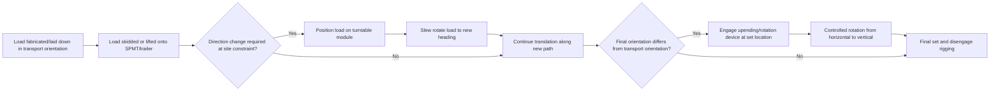

## Turntables and Rotation Devices

### Overview

Turntables and rotation devices are specialized transport and rigging equipment used to rotate a load's orientation — either about a vertical axis (yaw/slew, changing heading direction) or horizontal axis (roll/pitch, changing tilt or upending orientation) — during heavy-lift and transport operations. They solve a common problem in heavy-lift logistics: a load's transport orientation (dictated by trailer width, route constraints, or vessel stowage) often differs from its final installed orientation, and physically re-orienting a multi-hundred-ton load requires purpose-built rotational equipment rather than ad hoc rigging.

### Device Categories

**Turntables (Vertical Axis / Slew Rotation)**

A rotating platform, typically mounted on a low-bed trailer, SPMT (Self-Propelled Modular Transporter) deck, or fixed foundation, that allows a load to rotate horizontally (change heading) without repositioning the entire transport vehicle. Commonly used at tight intersections, inside congested yards, or when a load must change direction of travel without a wide turning radius.

**Rotation/Upending Devices (Horizontal Axis)**

Systems designed to rotate a load from horizontal to vertical orientation (or vice versa), typically pivoting about a trunnion or hinge point at the load's base while a crane or strand jack controls the elevation of the opposite end. Distinguished from simple crane-and-tailing-crane upending by the use of a dedicated mechanical or hydraulic rotation frame.

**Hydraulic Rotation Frames / Tilt-Up Systems**

Purpose-built frames incorporating hydraulic cylinders or winches that provide controlled, continuous rotation torque independent of crane capacity — used for very heavy or tall loads where crane-based tailing becomes impractical due to load magnitude or required precision.

**SPMT-Integrated Turntables**

Turntable modules that can be mounted atop a Self-Propelled Modular Transporter platform, combining the SPMT's multi-axis steering and load distribution capability with independent rotational capability of the payload itself — useful when a load must both translate and reorient within a constrained site.

### Key Points

- **Slew vs. upend distinction**: Vertical-axis turntables change a load's heading (like a lazy-susan) while keeping it in the same orientation relative to the ground; horizontal-axis rotation devices change the load's fundamental orientation (lying down to standing up), which is a structurally and operationally distinct problem.
- **Bearing/slew ring design**: Vertical-axis turntables rely on a large-diameter slew bearing (ball, roller, or slide-bearing type) rated for the combined vertical load and any overturning moment from an off-center load CG; bearing capacity and friction torque directly determine the rotational drive force required.
- **Center of rotation alignment**: For turntables, the load's CG should ideally be positioned at or very near the geometric center of rotation to minimize eccentric loading on the bearing and drive system; significant CG offset requires either counterweighting or a bearing/structure designed for the resulting moment.
- **Drive mechanisms**: Rotation can be driven hydraulically (radial hydraulic motors acting on a ring gear), via cable/winch systems pulling the load through an arc, or manually with pry bars/come-alongs for lighter, slow-speed applications — selection depends on load magnitude and required control precision.
- **Combined translation-and-rotation operations**: Complex heavy-lift moves in congested sites often require a sequenced combination of skidding, SPMT translation, and turntable rotation to navigate a load through direction changes that a rigid transport path cannot accommodate.
- **Structural interface with the load**: Both turntable and upending rotation devices require an engineered structural interface (often trunnions, padeyes, or a purpose-built saddle/cradle) between the rotating mechanism and the load, following the same lift-point design principles as static lift points but additionally accounting for dynamic/rotational loading.
- **Control and synchronization**: For very large or asymmetric loads, rotation devices often incorporate load monitoring (load cells, inclinometers) and synchronized multi-point control (similar in principle to strand jack synchronization) to maintain controlled, even rotation and avoid sudden load shifts.

### Turntable Structural and Load Considerations

For a vertical-axis turntable supporting a load with weight $W$ and CG offset $e$ from the rotation center:

**Overturning moment on the bearing**:

$$M_{ot} = W \times e$$

**Rotational drive torque** (simplified, accounting for bearing friction coefficient $\mu$ and effective bearing radius $r_b$):

$$T_{drive} \approx \mu \times W \times r_b$$

plus any additional torque required to overcome wind loading, ramp/grade resistance (if the turntable itself sits on a sloped surface), or acceleration effects during start of rotation.

[Inference] Actual drive torque calculations for specific turntable systems depend on the manufacturer's bearing specification, drive mechanism efficiency, and environmental loading assumptions; the above is a simplified conceptual framework, and detailed sizing should reference the specific equipment manufacturer's engineering data (e.g., Mammoet, ALE, Sarens turntable/SPMT systems).

### Upending Rotation Device — Force Analysis Concept

For a load of length $L$ and weight $W$ being upended about a base pivot (trunnion) with a lifting force $F$ applied at the top, the required lifting force varies continuously through the rotation as a function of the angle $\phi$ from horizontal:

$$F(\phi) = \frac{W \times \frac{L}{2}\cos(\phi)}{L}= \frac{W}{2}\cos(\phi)$$

(for a simplified case with CG at midlength and force applied at the top, perpendicular to the load axis). This shows that the required lifting force is maximum near the start of rotation (load near-horizontal, $\phi \approx 0$) and decreases toward zero as the load approaches vertical ($\phi \to 90°$) — this is why crane/rigging capacity requirements for upending are typically governed by the initial "break-over" condition rather than the final vertical position.

[Inference] This is a simplified planar mechanics model; real upending analyses account for the actual CG location (which may not be at midlength), base pivot friction, dynamic effects during the "break-over" transition, and any additional restraining/tailing forces — a full engineering analysis with the actual load geometry is necessary for design.

### Turntable and Upending Operation Sequence (svg_diagram)

<svg xmlns="http://www.w3.org/2000/svg" viewBox="0 0 900 480" font-family="Arial, sans-serif">
<text x="450" y="28" font-size="18" font-weight="bold" text-anchor="middle">Turntable Slew vs Upending Rotation (svg_diagram)</text>

<text x="200" y="60" font-size="14" font-weight="bold" text-anchor="middle">Turntable (vertical axis / slew)</text>

<ellipse cx="200" cy="200" rx="110" ry="30" fill="`#e0e0e0`" stroke="#333" stroke-width="2" />

<circle cx="200" cy="200" r="8" fill="#333" />

<rect x="150" y="170" width="100" height="20" fill="`#c9d6ea`" stroke="#333" stroke-width="2" transform="rotate(-15 200 200)" />

<path d="M290,190 A100,100 0 0,1 260,270" fill="none" stroke="#666" stroke-width="2" stroke-dasharray="5,3" marker-end="url(#arrow2)" />

<text x="200" y="260" font-size="10" text-anchor="middle">Load rotates about vertical axis (yaw)</text>

<text x="200" y="335" font-size="10" text-anchor="middle">Mounted on SPMT / trailer / fixed base</text>

<text x="680" y="60" font-size="14" font-weight="bold" text-anchor="middle">Upending Device (horizontal axis)</text>

<rect x="600" y="270" width="160" height="18" fill="`#c9d6ea`" stroke="#333" stroke-width="2" />

<circle cx="600" cy="279" r="10" fill="#333" />

<text x="600" y="305" font-size="10" text-anchor="middle">Base pivot</text>

<text x="600" y="318" font-size="10" text-anchor="middle">(trunnion)</text>

<line x1="760" y1="279" x2="760" y2="180" stroke="#333" stroke-width="3" />

<path d="M745,190 L760,160 L775,190 Z" fill="#333" />

<text x="810" y="200" font-size="10">Lift force F(φ)</text>

<path d="M650,240 A170,170 0 0,1 700,110" fill="none" stroke="#666" stroke-width="2" stroke-dasharray="5,3" />

<text x="680" y="380" font-size="10" text-anchor="middle">Rotates load from horizontal → vertical</text>

</svg>

### Combined Move Sequence

### Example: Reactor Vessel Site Delivery with Turntable and Upending

**Scenario**: A 300-ton reactor vessel arrives at a plant site via SPMT in horizontal transport orientation. The transport route includes a 90-degree turn in a congested pipe rack area where the SPMT's own steering turning radius is insufficient, and the vessel's final installed orientation is vertical.

**Approach**:

1. At the constrained turn location, the SPMT (with turntable module) executes an in-place slew rotation of the load to realign heading without requiring the full vehicle footprint to sweep through the turn.
2. The SPMT continues translation to the final set location.
3. At the set location, a dedicated upending frame (or crane-plus-tailing-crane configuration) engages the vessel's base trunnion and top padeye, executing a controlled rotation from horizontal to vertical.
4. As rotation progresses, the required lifting force decreases per the $\cos(\phi)$ relationship, with the crane/rigging capacity governing lift verified for the peak force condition near the start of rotation.
5. Vessel is set onto its final foundation once vertical.

**Outcome**: Combining a turntable for horizontal repositioning with a dedicated upending device for orientation change allows navigation through a congested site and achievement of final orientation without requiring continuous, uninterrupted crane coverage for the entire multi-stage move.

### Design and Operational Considerations

- **Bearing selection**: Ball, roller, or hydrostatic slide bearings selected based on load magnitude, required rotational precision, and duty cycle (single-use custom rig vs. reusable rental turntable).
- **Foundation/support**: Fixed turntables require an engineered foundation capable of resisting the full load plus overturning moment; mobile (SPMT-mounted) turntables must be compatible with the SPMT deck's load distribution requirements.
- **Wind loading**: Tall loads being upended present significant wind-exposed surface area during rotation, requiring wind speed limits for the operation and potentially guy lines or tag lines for lateral control.
- **Synchronization for multi-point rotation**: Very large upending operations may use multiple synchronized strand jacks or winches rather than a single crane, following similar control principles to multi-jack strand jacking systems.
- **Emergency/fail-safe provisions**: Rotation devices should incorporate mechanical or hydraulic locks/brakes capable of holding the load safely in position in case of power loss or control system failure mid-rotation.

[Behavior may vary based on specific equipment manufacturer, load geometry, bearing type, and control system design — always verify against the applicable equipment manufacturer's technical documentation and a project-specific engineered lift/rotation plan before execution.]

### Common Design and Operational Pitfalls

- Underestimating drive torque or lift force requirements due to CG offset from the assumed rotation center
- Neglecting the peak force condition near the start of upending rotation when sizing crane/rigging capacity
- Inadequate wind loading assessment for tall, slender loads during rotation with large exposed surface area
- Insufficient fail-safe/braking provisions for controlled hold in case of power or hydraulic failure mid-rotation
- Overlooking foundation/support structure requirements for fixed turntables under combined vertical load and overturning moment
- Poor coordination/communication between multiple rigging crews (main crane, tailing crane, turntable operator) during combined multi-device operations

### Related Topics

- Lifting Lugs, Trunnions, and Padeyes (structural interface for rotation devices)
- Self-Propelled Modular Transporters (SPMT) operation and load distribution
- Strand jacking synchronized control systems (applicable principles for multi-point rotation)
- Skidding systems for horizontal load translation
- Wind loading limits and environmental constraints for heavy lift operations
- Critical lift planning and sequencing for multi-stage heavy transport operations
- Load monitoring instrumentation: inclinometers, load cells, and rotation angle sensors