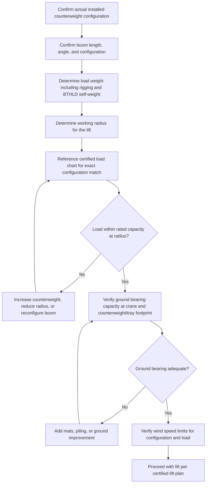

## Counterweight Systems and Moveable Ballast

### Overview

Counterweight systems and moveable ballast are mass elements added to cranes, derricks, and heavy-lift equipment to offset the overturning moment created by a suspended load, extending safe lifting capacity and stability. While counterweight is most commonly associated with crane superstructure (the fixed or removable weights at the rear of a crane's upper works), the broader category includes moveable ballast wagons/trays, derrick counterweight systems, and dynamic ballast management used in heavy-lift and specialized transport applications to actively manage stability throughout a lift or move.

### Fundamental Principle

A crane or lifting system is, structurally, a moment-balance problem. The load, acting at a radius from the machine's tipping axis (front tipping fulcrum for a mobile/crawler crane), creates an overturning moment. Counterweight, positioned at a radius behind the tipping axis, creates a restoring moment. Stability is maintained as long as the restoring moment exceeds the overturning moment by the required safety margin defined in the applicable crane standard or load chart.

The basic moment balance can be expressed as:

$$W_{load} \times R_{load} \leq (W_{cw} \times R_{cw} + W_{machine} \times R_{machine}) \times \frac{1}{SF}$$

where $W_{load}$ is the load weight, $R_{load}$ is the load radius from the tipping axis, $W_{cw}$ is counterweight mass, $R_{cw}$ is counterweight radius, and $SF$ is the applicable stability safety factor. [Inference] This is a simplified conceptual representation; actual crane load charts incorporate manufacturer-tested combinations of boom configuration, counterweight arrangement, and outrigger/track base geometry rather than a simple moment formula, and rated capacities should always be taken directly from the certified load chart for the specific machine configuration.

### Counterweight System Types

**Fixed Crane Counterweight**

Cast steel or concrete weight blocks mounted at the rear of a crawler or mobile crane's upper structure, sized and configured per the manufacturer's rated capacity charts for each boom/configuration combination. Larger cranes use stacked, modular counterweight slabs that can be added or removed to match the specific lift configuration.

**Superlift / Counterweight Tray Systems**

A trailing, often wheel- or track-supported tray positioned at an extended radius behind the crane, connected via a mast or beam structure, carrying additional counterweight mass beyond what can be mounted directly on the crane's upper structure. Superlift systems dramatically increase a crawler crane's restoring moment, enabling substantially higher lift capacities, particularly at larger radii, but require a much larger overall operating footprint and more complex setup/derig.

**Derrick Counterweight (Guy Derricks, Stiffleg Derricks)**

Fixed or moveable counterweight used in traditional derrick systems, sometimes combined with a moveable counterweight carriage that travels along a track to adjust the restoring moment as boom radius changes during operation.

**Moveable Ballast Wagons/Trays**

Wheeled or track-mounted ballast carriers that can be repositioned during a lift sequence to actively adjust the restoring moment as load radius or boom configuration changes, rather than remaining fixed for the entire operation. Used on some very large crawler cranes and specialized heavy-lift derrick systems.

**Vessel and Barge Ballast Systems**

In marine heavy-lift operations (heavy-lift vessels, floating derricks, barge-mounted crane operations), ballast water is actively pumped between tanks to counteract the heeling moment created by a suspended load, maintaining vessel trim and stability throughout the lift — a dynamic, fluid-based analog to mechanical counterweight.

### Key Points

- **Radius sensitivity**: Because overturning moment is a product of load times radius, capacity falls sharply as radius increases; counterweight effectiveness is similarly governed by its own radius from the tipping axis, meaning counterweight mounted farther out (as with superlift trays) provides disproportionately more restoring moment per unit weight than counterweight mounted close to the machine.
- **Configuration-specific load charts**: Crane rated capacity is never a single number — it is a matrix of values dependent on boom length, counterweight configuration, operating radius, and (for crawler cranes) track/carbody configuration; operators and lift planners must reference the exact chart matching the actual machine setup.
- **Two governing limits**: Crane capacity at any given configuration is governed by the lesser of (1) structural capacity of the boom/machine components and (2) stability (tipping) capacity; counterweight primarily affects the stability limit, while boom strength is a separate, independent constraint.
- **Dynamic vs. static stability**: Static moment balance calculations do not capture dynamic effects — load swing, wind loading, sudden load release (snatch/shock loading if a load unexpectedly detaches or is jerked), and travel/slewing accelerations all transiently affect the effective overturning moment, which is why load charts include safety margins beyond simple static balance.
- **Superlift tray ground bearing**: Superlift and similar trailing counterweight systems introduce a second, separate ground-bearing point that must be independently verified for adequate ground bearing capacity, similar in principle to the crane's own track/outrigger loading.
- **Sequenced ballast adjustment**: For marine and some large derrick operations, ballast must sometimes be actively adjusted in real time during the lift (as load transfers from quay to vessel, or as boom radius changes) requiring coordinated ballast control systems and experienced operators to avoid instability during the transition.
- **Removable vs. integral counterweight**: Most modern mobile and crawler cranes use removable, modular counterweight to allow the machine to be configured for transport (minimum weight) versus operation (maximum rated counterweight for the specific lift) — rigging crews must verify the actual installed counterweight matches the load chart being used before any lift.

### Comparative Counterweight System Table

| System Type | Typical Application | Key Characteristic |
| --- | --- | --- |
| Fixed crane counterweight | Standard mobile/crawler crane lifts | Modular slabs matched to load chart configuration |
| Superlift/counterweight tray | Very heavy crawler crane lifts at large radius | Extended radius trailing mass; large footprint |
| Derrick counterweight | Traditional guy/stiffleg derrick operations | Often combined with moveable carriage systems |
| Moveable ballast wagon | Specialized very-heavy-lift crawler/derrick systems | Actively repositioned during lift sequence |
| Vessel ballast (water) | Marine heavy-lift, floating derrick operations | Dynamic, fluid-based, actively pumped during lift |

### Stability Verification Process

### Superlift Tray Moment Contribution (Conceptual)

For a crawler crane with a superlift counterweight tray at radius $R_{sl}$ carrying mass $W_{sl}$, in addition to upper works counterweight $W_{cw}$ at radius $R_{cw}$:

$$M_{restoring} = W_{cw} \times R_{cw} + W_{sl} \times R_{sl} + W_{machine} \times R_{machine}$$

Because $R_{sl}$ is typically significantly larger than $R_{cw}$ (the tray trails well behind the machine on its own wheels/tracks), even a moderate superlift ballast mass can contribute a large share of total restoring moment — which is why superlift configurations can dramatically increase rated capacity at large radii compared to the base machine configuration. [Inference] Exact superlift tray masses, radii, and resulting capacity gains are manufacturer- and model-specific and should be verified against the specific crane's certified load chart rather than derived from this simplified formula.

### Counterweight Configuration Diagram (svg_diagram)

<svg xmlns="http://www.w3.org/2000/svg" viewBox="0 0 900 420" font-family="Arial, sans-serif">
<text x="450" y="28" font-size="18" font-weight="bold" text-anchor="middle">Crane Moment Balance with Superlift Tray (svg_diagram)</text>

<line x1="40" y1="340" x2="860" y2="340" stroke="#333" stroke-width="2" />

<rect x="300" y="300" width="140" height="40" fill="#888" stroke="#333" stroke-width="2" />
<text x="370" y="325" font-size="10" text-anchor="middle" fill="#fff">Crawler base</text>

<line x1="380" y1="300" x2="380" y2="340" stroke="#dc3545" stroke-width="2" stroke-dasharray="4,3" />
<text x="380" y="360" font-size="10" text-anchor="middle" fill="#dc3545">Tipping axis</text>

<line x1="380" y1="300" x2="700" y2="120" stroke="#333" stroke-width="4" />
<line x1="700" y1="120" x2="700" y2="280" stroke="#666" stroke-width="2" />
<rect x="670" y="280" width="60" height="30" fill="#e0e0e0" stroke="#333" stroke-width="2" />
<text x="700" y="300" font-size="10" text-anchor="middle">Load</text>
<text x="700" y="105" font-size="10" text-anchor="middle">Boom tip</text>

<line x1="380" y1="360" x2="700" y2="360" stroke="#333" stroke-width="1.5" />
<text x="540" y="378" font-size="11" text-anchor="middle">R_load</text>

<rect x="300" y="270" width="50" height="30" fill="#c9d6ea" stroke="#333" stroke-width="2" />
<text x="325" y="290" font-size="9" text-anchor="middle">CW</text>

<rect x="60" y="300" width="100" height="30" fill="#a8c8e8" stroke="#333" stroke-width="2" />
<text x="110" y="322" font-size="9" text-anchor="middle">Superlift tray</text>
<line x1="160" y1="300" x2="300" y2="290" stroke="#333" stroke-width="3" />
<text x="230" y="280" font-size="9" text-anchor="middle">Mast link</text>

<line x1="380" y1="380" x2="110" y2="380" stroke="#333" stroke-width="1.5" />
<text x="245" y="398" font-size="11" text-anchor="middle">R_superlift</text>

<text x="450" y="30" font-size="0" />

</svg>

### Example: Superlift Configuration for Extended Radius Lift

**Scenario**: A crawler crane must lift a 250-ton module at a 30-meter radius — a combination exceeding the crane's base (non-superlift) capacity at that radius per the manufacturer's load chart.

**Approach**:

1. Consult the manufacturer's load chart for the same crane with the superlift counterweight tray option engaged, at the specific boom length and superlift tray weight/radius combination available.
2. Confirm the superlift configuration provides sufficient rated capacity at 30 m radius with appropriate margin.
3. Verify ground bearing capacity independently at both the crawler track footprint and the superlift tray's own wheel/track footprint — these are often on different, sometimes temporary, ground preparation.
4. Confirm wind speed limits applicable to the superlift configuration (larger counterweight and boom systems often have more restrictive wind limits due to increased structure and moment sensitivity).
5. Execute the lift per the certified lift plan referencing the exact superlift configuration used.

**Outcome**: The superlift tray's extended-radius counterweight provides the additional restoring moment needed to achieve the required capacity at 30 m radius without exceeding structural or stability limits — an outcome not achievable with the base machine configuration alone.

### Marine Ballast Considerations (Heavy-Lift Vessels)

For floating heavy-lift operations, ballast water is used to:

- Counteract the **heeling moment** as a load is picked up from quay or another vessel, keeping the lifting vessel level
- Maintain **trim** (fore-aft balance) as load position shifts during a lift or load transfer sequence
- Achieve a specific **draft** required for load-out, float-on/float-off, or clearance under obstructions

[Inference] Marine ballast management for heavy-lift operations is a specialized naval architecture discipline requiring vessel-specific stability calculations (typically governed by classification society rules and the vessel's approved stability booklet); general moment-balance principles apply conceptually, but actual ballast operations must be planned and executed by qualified marine personnel using vessel-specific data.

[Behavior may vary based on specific crane manufacturer, load chart configuration, ground conditions, and environmental factors — always verify against the current certified load chart and project-specific lift plan before execution.]

### Common Pitfalls

- Using a load chart that does not match the actual installed counterweight configuration (a frequent and serious error, since capacity varies significantly between counterweight configurations)
- Neglecting independent ground bearing verification for superlift tray or outrigger footprints separate from the main crane base
- Failing to account for dynamic/wind loading margins beyond simple static moment balance
- Overlooking self-weight of rigging, BTHLDs, and headache ball/block in total load calculations against the load chart
- Inadequate communication of counterweight configuration changes between rigging crew, crane operator, and lift supervisor across shifts or configuration changes

### Related Topics

- Crane load chart interpretation and configuration-specific capacity verification
- Ground bearing pressure calculations and crane mat/outrigger pad design
- Selecting Strand Jacking versus Conventional Cranes (comparative stability considerations)
- Wind loading limits for heavy lift operations
- Marine heavy-lift vessel stability and ballast control systems
- Critical lift planning and third-party engineering review requirements
- Superlift and counterweight tray setup/derig sequencing