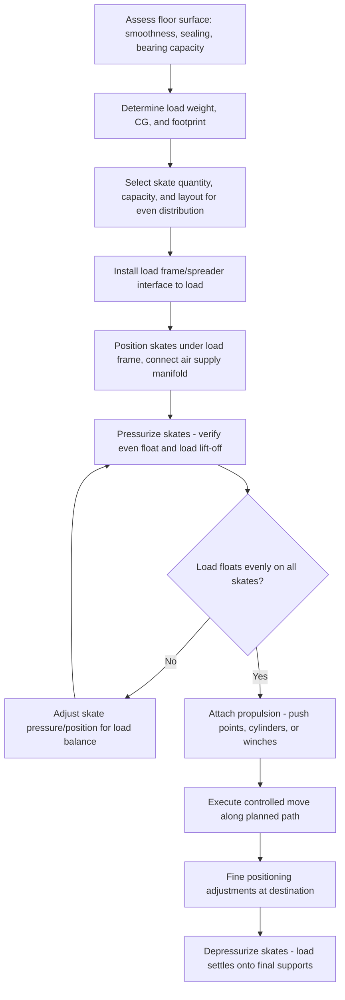

## Air Skates and Pneumatic Load-Moving Systems

### Overview

Air skates (also called air casters, air bearings, or air dollies) are load-moving devices that use a thin film of compressed air to create a near-frictionless cushion between a load and the floor surface, allowing extremely heavy loads to be moved manually or with minimal power in any horizontal direction — including sideways and rotational movement — without rails, tracks, or wheels. They are widely used in confined industrial spaces (power plants, manufacturing floors, shipyards) where conventional cranes, skidding, or SPMTs are impractical due to space, floor loading, or maneuverability constraints.

### Working Principle

An air skate consists of a rigid load-bearing plate (steel or aluminum) with a flexible, reinforced elastomeric torus (a doughnut-shaped bladder) mounted on its underside. Compressed air is fed into the torus, which inflates and forms a sealed air film against the floor. As internal pressure exceeds the load pressure on the skate, air escapes through a controlled orifice at the torus-to-floor interface, creating a thin (typically 0.1–0.3 mm) [Unverified — device-specific] lubricating air film. This film reduces the effective coefficient of friction dramatically — commonly cited in the range of 0.02–0.05 compared to 0.1–0.5+ for steel-on-steel or rubber-on-concrete rolling/sliding friction — allowing very heavy loads to be moved with a small fraction of the force otherwise required.

### Key Points

- **Floor surface requirements**: Air skates require a relatively smooth, sealed, and structurally sound floor (typically finished concrete, steel plate, or epoxy-coated surfaces); rough, porous, cracked, or debris-covered floors prevent proper air film formation and can damage the torus.
- **Omnidirectional movement**: Unlike wheeled dollies or rail-based skidding, air skates allow movement in any direction — including lateral "crab" movement and in-place rotation — because the air film provides frictionless support regardless of movement direction, a significant advantage in congested spaces requiring complex maneuvering.
- **Load distribution across multiple skates**: Heavy loads are typically supported on three or four (or more) air skates simultaneously, connected via a rigid or semi-rigid frame/spreader system to ensure even load distribution; uneven loading can cause one skate to bear excessive load while others are underloaded or lift off the floor.
- **Air supply requirements**: Air skates require a continuous, adequately sized compressed air supply (typically 80–100 psi supply pressure, with volume requirements scaling with skate size and load) [Unverified — model-specific]; loss of air supply causes the skate to settle onto the floor, requiring adequate contingency planning during a move.
- **Low floor loading advantage**: Because the load is distributed across the air film's contact area (rather than concentrated point loads as with wheels or rail systems), air skates can move very heavy loads across floors with lower point-load bearing capacity than would be required for wheeled or crane-based alternatives.
- **Propulsion methods**: Once "floating" on the air film, loads can be moved by manual pushing (for lighter loads), pneumatic or hydraulic push/pull cylinders, come-along winches, or dedicated air caster propulsion/steering modules for larger, more controlled systems.
- **Precision positioning**: The near-frictionless film allows very fine, controlled positioning adjustments — useful for final equipment alignment (e.g., setting large generators, transformers, or machine tools) where incremental millimeter-scale movements are needed.
- **Load capacity range**: Individual air skates range from small units rated for a few hundred kilograms up to heavy-duty units rated for hundreds of tons each; multiple skates are combined for very heavy loads (multi-thousand-ton moves using large skate arrays are used in industries such as shipbuilding and power generation).

### Air Skate System Components

1. **Air skate/caster units** — the load-bearing torus modules themselves
2. **Air supply system** — compressor, air receiver tank (buffer capacity), filtration/regulation, and distribution manifold
3. **Control/distribution manifold** — valves to regulate air pressure/flow to each skate, sometimes with individual pressure regulation for load balancing
4. **Load frame/spreader** — rigid structural interface connecting the load to the array of air skates, ensuring even load distribution
5. **Propulsion system** — manual push points, air/hydraulic cylinders, or powered air caster drive modules
6. **Guidance/steering** — for larger systems, steering skates or a track/guide system to control direction of travel

### Comparative Positioning vs. Other Load-Moving Methods

| Method | Direction of Movement | Floor Requirement | Typical Application |
| --- | --- | --- | --- |
| Air skates | Omnidirectional (any angle, rotation) | Smooth, sealed floor surface | Confined indoor spaces, fine positioning |
| Skidding (skid shoes) | Linear, along skid track | Level, prepared skid path or greased track | Long linear moves, heavy modules |
| SPMT | Multi-axis steered, wheeled | Reasonably level, adequate bearing capacity | Outdoor/yard heavy transport, route flexibility |
| Rail/roller systems | Linear, along fixed rail | Rail installation required | Repeated linear moves along fixed path |
| Rollers/dollies | Linear, limited steering | Reasonably smooth, higher point loads | Lighter to moderate loads, short moves |

### Air Supply Sizing Concept

Required air flow for a skate system depends on the number of skates, individual skate air consumption rate, and desired lift/float time. A simplified relationship:

$$Q_{total} = n_{skates} \times q_{skate}$$

where $Q_{total}$ is total required air flow, $n_{skates}$ is the number of skates in the array, and $q_{skate}$ is the individual skate's steady-state air consumption at operating pressure and load. Adequate receiver tank volume is typically included to buffer compressor output against transient demand spikes during load "float-up" (initial pressurization before movement begins). [Inference] Exact air consumption values are highly manufacturer- and model-specific (varying by skate diameter, rated capacity, and torus design) and should be obtained from the specific equipment supplier's technical data sheets rather than estimated generically.

### Load Distribution and Skate Layout (svg_diagram)

<svg xmlns="http://www.w3.org/2000/svg" viewBox="0 0 900 420" font-family="Arial, sans-serif">
<text x="450" y="28" font-size="18" font-weight="bold" text-anchor="middle">Air Skate Array Under a Heavy Load (svg_diagram)</text>
<rect x="250" y="120" width="400" height="140" fill="#e0e0e0" stroke="#333" stroke-width="2" />
<text x="450" y="195" font-size="14" text-anchor="middle">Load / Equipment Skid</text>

<ellipse cx="290" cy="280" rx="35" ry="16" fill="#c9d6ea" stroke="#333" stroke-width="2" />
<text x="290" y="285" font-size="9" text-anchor="middle">Skate 1</text>
<ellipse cx="610" cy="280" rx="35" ry="16" fill="#c9d6ea" stroke="#333" stroke-width="2" />
<text x="610" y="285" font-size="9" text-anchor="middle">Skate 2</text>
<ellipse cx="290" cy="330" rx="35" ry="16" fill="#c9d6ea" stroke="#333" stroke-width="2" />
<text x="290" y="335" font-size="9" text-anchor="middle">Skate 3</text>
<ellipse cx="610" cy="330" rx="35" ry="16" fill="#c9d6ea" stroke="#333" stroke-width="2" />
<text x="610" y="335" font-size="9" text-anchor="middle">Skate 4</text>
<line x1="290" y1="260" x2="290" y2="264" stroke="#333" stroke-width="1" />
<line x1="610" y1="260" x2="610" y2="264" stroke="#333" stroke-width="1" />

<line x1="290" y1="296" x2="290" y2="314" stroke="#4285f4" stroke-width="3" />
<line x1="610" y1="296" x2="610" y2="314" stroke="#4285f4" stroke-width="3" />
<rect x="420" y="350" width="60" height="30" fill="#a8c8e8" stroke="#333" stroke-width="2" />
<text x="450" y="370" font-size="9" text-anchor="middle">Manifold</text>
<line x1="290" y1="310" x2="420" y2="360" stroke="#4285f4" stroke-width="2" />
<line x1="610" y1="310" x2="480" y2="360" stroke="#4285f4" stroke-width="2" />
<line x1="290" y1="340" x2="420" y2="365" stroke="#4285f4" stroke-width="2" />
<line x1="610" y1="340" x2="480" y2="365" stroke="#4285f4" stroke-width="2" />
<rect x="360" y="385" width="180" height="24" fill="#e8f0fe" stroke="#333" stroke-width="1.5" />
<text x="450" y="401" font-size="9" text-anchor="middle">Compressor / receiver tank</text>
<line x1="450" y1="380" x2="450" y2="385" stroke="#333" stroke-width="2" />

<text x="450" y="70" font-size="11" text-anchor="middle">Air film (0.1-0.3mm) between torus and floor — near-frictionless movement</text>

</svg>

### Operational Sequence

### Example: Repositioning a Large Generator Within a Power Plant

**Scenario**: A 180-ton generator stator must be moved 25 meters within an existing power plant building, navigating around structural columns and through a doorway with limited overhead clearance, where crane access is unavailable and the floor has adequate but not unlimited point-load capacity.

**Approach**:

1. Verify the finished concrete floor is structurally sound, sealed (no significant cracks or porosity), and rated for the skate contact pressure at the planned array layout.
2. Design a load frame/spreader beam system distributing the 180-ton load across (for example) six air skates, keeping individual skate loading within rated capacity and providing redundancy margin.
3. Install the skate array and load frame beneath the stator (using jacks or a temporary lift to transfer the load from its existing supports onto the skate frame).
4. Pressurize the system, verify even float across all skates via visual inspection or pressure monitoring, and confirm the load lifts cleanly off its prior supports.
5. Move the load using hydraulic push cylinders and tag lines for directional control, navigating around columns using the omnidirectional movement capability.
6. Perform fine positioning at the final location using incremental air pressure adjustments, then depressurize to set the load onto its permanent foundation.

**Outcome**: The load is relocated without crane access, using the building's existing floor structure and the air skate system's ability to move heavy, precise loads through a congested indoor space that would be inaccessible to cranes or SPMTs.

### Verification and Quality Considerations

- **Floor load capacity verification**: Contact pressure under each skate (load per skate divided by torus contact area) must be checked against the floor's rated point-load or distributed-load capacity, particularly for elevated floors or floors over basements/utility spaces.
- **Torus inspection**: Air skate tori should be inspected for wear, punctures, or degradation prior to use, as damage compromises the air seal and load-bearing capability.
- **Redundancy margin**: Systems are typically designed with sufficient additional skate capacity beyond the calculated minimum, so that failure or underperformance of a single skate does not immediately overload the remainder of the array.
- **Air supply contingency**: Adequate receiver tank buffer capacity and, for critical moves, backup compressor capability help prevent an uncontrolled settling event if primary air supply is interrupted mid-move.

[Behavior may vary based on specific manufacturer skate design, torus material, floor surface condition, and load configuration — always verify against the specific equipment supplier's technical documentation and a project-specific move plan before execution.]

### Common Pitfalls

- Moving loads across floor surfaces with cracks, expansion joints, or surface irregularities that break the air seal and cause sudden, uneven settling
- Uneven load distribution across the skate array due to CG misalignment with the load frame's geometric center
- Underestimating required air supply volume/pressure, causing inadequate float or inconsistent movement control
- Inadequate floor point-load capacity verification, risking local floor damage or failure under skate contact pressure
- Insufficient directional control (tag lines, push cylinders) leading to loss of control during movement, particularly on floors with slight unevenness or slope
- Failing to plan for contingency load support (cribbing, blocking) in case of air supply interruption mid-move

### Related Topics

- Skidding systems and skid shoe/track design fundamentals
- Self-Propelled Modular Transporters (SPMTs) and comparative load-moving method selection
- Floor and foundation load capacity assessment for heavy equipment moves
- Center of gravity determination and load distribution frame design
- Below-the-Hook Lifting Device Design (load frame/spreader interface principles)
- Fine positioning and alignment techniques for precision equipment setting
- Compressed air system sizing for industrial pneumatic applications