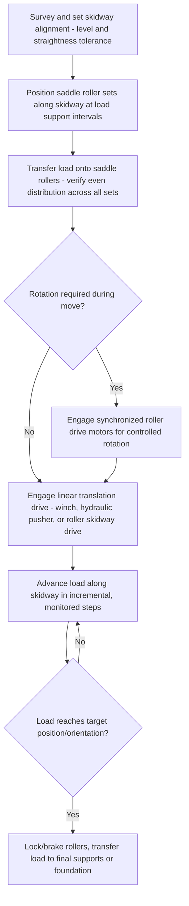

## Powered Saddle Rollers and Transport Skidways

### Overview

Powered saddle rollers and transport skidways are load-moving systems that support long, cylindrical, or module-type loads on a series of driven or free-rolling support units, allowing controlled linear translation or rotation along a fixed or semi-fixed path. They occupy a niche between full skidding systems (sliding on greased tracks) and SPMTs (independently steered wheeled transporters), offering continuous roller support well suited to very long or heavy cylindrical loads — pipe spools, vessels, reactor sections, wind turbine tower segments — that must be moved axially, rotated about their longitudinal axis, or both.

### Device Categories

**Saddle Rollers**

Curved-cradle roller assemblies (often paired as a "saddle" set) that support a cylindrical load along its curved surface, allowing the load to roll or be rolled about its own longitudinal axis while remaining supported. Used extensively for rotating cylindrical vessels during welding, fabrication, coating, or inspection ("turning rolls" in fabrication shop contexts), and for controlled rotation during transport-related positioning.

**Powered Saddle Rollers**

Saddle roller sets fitted with a motor drive (electric or hydraulic) on one or more roller shafts, allowing controlled, synchronized rotation of the supported load without external rigging input — commonly used in fabrication shops for vessel rotation during circumferential welding or coating application, and adapted for heavy-lift use when a cylindrical load must be rotated in place during a transport or installation sequence.

**Transport Skidways**

Linear, prepared paths — typically parallel steel beams or rails — along which a load is moved axially using rollers, roller skates, or low-friction skid shoes, distinct from full skidding (which typically uses PTFE-faced skid shoes sliding directly on a greased or PTFE-faced track). Roller-based skidways reduce required pulling force compared to sliding skid systems because rolling friction is substantially lower than sliding friction, at the cost of a more complex roller/bearing mechanism that must itself be load-rated.

**Roller Skidding Systems**

Systems that combine elements of both — the load rides on roller units (rather than sliding skid shoes) which themselves travel along a linear track, offering lower pulling force requirements than pure sliding skid systems for very heavy, long-distance linear moves.

### Key Points

- **Rolling vs. sliding friction advantage**: Roller-based systems (saddle rollers, roller skidways) exploit rolling friction coefficients that are substantially lower than sliding friction coefficients for comparable loads — commonly an order of magnitude lower — significantly reducing the pulling/driving force required to move or rotate a given load compared to pure sliding skid systems.
- **Continuous curved support for cylindrical loads**: Saddle rollers distribute load across a curved contact arc matching the load's cylindrical profile, avoiding the point/line contact stress concentration that would occur if a cylindrical load were placed on flat rollers or a flat skid surface.
- **Synchronized multi-saddle rotation**: For long vessels supported on multiple saddle roller sets along their length, rotation must be synchronized across all sets to avoid twisting or binding the load — particularly important for long, relatively flexible cylindrical sections.
- **Combined axial translation and rotation**: Some transport applications require a load to both translate along a skidway and rotate about its axis simultaneously or sequentially (e.g., positioning a long pipe spool for final orientation while advancing it into position), requiring coordinated control between the drive/translation system and the roller rotation drive.
- **Track/skidway alignment tolerance**: Linear skidways must be set and maintained within tight alignment and level tolerances along their full length; misalignment causes uneven load distribution across roller/skid support points and can induce binding or excessive drive force at localized points.
- **Roller bearing capacity governs system rating**: Unlike sliding skid shoes (where capacity is largely a function of contact area and allowable bearing pressure on the sliding surface), powered/free roller systems are limited by the structural and bearing capacity of the roller assembly itself, which must be verified against the actual load per roller station.
- **Drive force and torque requirements**: Powered systems require drive motors sized for both static breakaway friction (higher than dynamic/rolling friction) and the desired travel or rotation speed; breakaway torque is typically the governing design case rather than steady-state running torque.

### Force and Friction Relationships

**Required pulling force for a roller-supported linear skidway** (simplified):

$$F_{pull} = \mu_{roll} \times W$$

where $\mu_{roll}$ is the effective rolling friction coefficient of the roller system (commonly in the range of 0.01–0.05 for well-maintained roller bearing systems, substantially lower than the 0.1–0.3+ typical of PTFE-on-steel sliding skid systems) [Unverified — highly dependent on specific roller bearing type, lubrication, and load condition], and $W$ is total load weight.

**Rotational drive torque for saddle rollers** supporting a cylindrical load of weight $W$ resting on rollers of radius $r_{roller}$, with the load's own radius $R_{load}$:

$$T_{drive} \approx \mu_{roll} \times W \times r_{roller}$$

with additional torque margin required to overcome static breakaway friction and any load eccentricity (CG offset from the geometric centerline) that creates an uneven contact force distribution between the paired rollers in each saddle set.

[Inference] These are simplified conceptual relationships; actual force and torque requirements depend on the specific roller bearing design, lubrication condition, load distribution uniformity, and manufacturer-specific equipment data, and should be verified against the actual system's engineering specifications for any real application.

### Comparative System Table

| System | Primary Motion | Friction Basis | Typical Load Type |
| --- | --- | --- | --- |
| Saddle rollers (powered) | Rotation about longitudinal axis | Rolling | Cylindrical vessels, pipe sections |
| Transport skidway (sliding) | Linear translation | Sliding (PTFE/grease) | Modules, skids, structural loads |
| Roller skidway | Linear translation | Rolling | Very heavy, long-distance linear moves |
| Turning rolls (shop fabrication) | Rotation during fabrication | Rolling | Vessels/cylinders during welding/coating |

### Saddle Roller Configuration Diagram (svg_diagram)

<svg xmlns="http://www.w3.org/2000/svg" viewBox="0 0 900 420" font-family="Arial, sans-serif">
<text x="450" y="28" font-size="18" font-weight="bold" text-anchor="middle">Powered Saddle Roller Set (svg_diagram)</text>
<circle cx="450" cy="220" r="110" fill="none" stroke="#c9d6ea" stroke-width="3" />
<circle cx="450" cy="220" r="110" fill="#e8f0fe" fill-opacity="0.3" stroke="#333" stroke-width="2" />
<text x="450" y="225" font-size="12" text-anchor="middle">Cylindrical Load</text>
<text x="450" y="242" font-size="10" text-anchor="middle">(vessel / pipe section)</text>
<circle cx="370" cy="315" r="28" fill="#888" stroke="#333" stroke-width="2" />
<text x="370" y="320" font-size="9" text-anchor="middle" fill="#fff">Roller</text>
<circle cx="530" cy="315" r="28" fill="#888" stroke="#333" stroke-width="2" />
<text x="530" y="320" font-size="9" text-anchor="middle" fill="#fff">Roller</text>
<rect x="330" y="343" width="240" height="20" fill="#666" stroke="#333" stroke-width="2" />
<text x="450" y="358" font-size="9" text-anchor="middle" fill="#fff">Saddle frame / base</text>
<path d="M370,287 A80,80 0 0,1 430,235" fill="none" stroke="#666" stroke-width="2" stroke-dasharray="5,3" marker-end="url(#arrow3)" />
<text x="330" y="260" font-size="9" text-anchor="middle">Rotation drive</text>

<text x="450" y="395" font-size="10" text-anchor="middle">Paired rollers support curved load surface — motor-driven for controlled rotation</text>

</svg>

### Operational Sequence — Combined Skidway Translation and Saddle Rotation

### Example: Positioning a Long Pressure Vessel Section for Field Welding

**Scenario**: A 220-ton, 30-meter-long cylindrical reactor section must be advanced 40 meters along a fabrication yard skidway while being rotated periodically to present the correct circumferential weld position to a stationary welding crew, without lifting the vessel off its supports between moves.

**Approach**:

1. Establish a linear skidway with multiple powered saddle roller stations spaced along the vessel's length, each rated for its share of the total load based on the vessel's weight distribution.
2. Set and verify skidway alignment and level tolerance along the full travel path to avoid binding or uneven loading during translation.
3. Transfer the vessel onto the saddle roller stations (via jacking or crane lift) and verify even load distribution across all stations before releasing any temporary supports.
4. Use synchronized translation drives to advance the vessel incrementally along the skidway to each weld station position.
5. At each weld station, engage the synchronized saddle roller rotation drives to rotate the vessel to present the next weld seam segment to the welding crew, without needing to lift or re-rig the vessel.
6. Repeat translation and rotation steps sequentially until the vessel reaches its final position/orientation.

**Outcome**: The combined translation-and-rotation capability of the powered saddle roller/skidway system allows continuous, controlled positioning of a very long, heavy cylindrical load through a multi-stage fabrication sequence without requiring repeated crane lifts or re-rigging, reducing handling risk and cycle time.

### Design and Verification Considerations

- **Load distribution analysis**: For loads supported on multiple saddle/roller stations along their length, load distribution among stations is often statically indeterminate (especially for a load with significant bending stiffness); analysis should account for possible uneven distribution due to support settlement, load stiffness, or fabrication tolerance.
- **Roller bearing rating**: Each roller assembly's bearing and shaft must be verified for the actual peak load it may see, including reasonable allowance for uneven distribution among stations.
- **Skidway foundation/support**: The skidway beams or rails themselves require adequate foundation or ground support along their full length, verified for both the vertical load and any lateral thrust from rotation or minor misalignment.
- **Synchronization control**: Multi-station powered systems typically use a central control system (PLC-based, similar in principle to strand jack synchronization) to coordinate translation speed and rotation angle across all stations, preventing binding or twist.
- **Emergency stop and holding capability**: Drive systems should incorporate braking or locking capability to safely hold the load in position in case of power loss or control fault during translation or rotation.

[Behavior may vary based on specific roller/skidway manufacturer, load geometry, bearing design, and control system architecture — always verify against the applicable equipment manufacturer's technical documentation and a project-specific move/rotation plan before execution.]

### Common Pitfalls

- Skidway misalignment or inadequate level tolerance causing uneven load distribution and binding during translation
- Underestimating static breakaway friction/torque relative to steady-state rolling friction when sizing drive motors
- Inadequate load distribution analysis across multiple support stations for long, relatively flexible cylindrical loads
- Insufficient synchronization between multiple powered roller/translation stations, risking load twist or binding
- Overlooking roller bearing capacity limits, leading to premature wear or failure under sustained heavy loading
- Neglecting foundation/ground support verification along the full skidway length, not just at isolated points

### Related Topics

- Skidding systems and PTFE-faced skid shoe design fundamentals
- Turntables and Rotation Devices (comparative rotation mechanisms)
- Strand jacking synchronized control systems (applicable multi-point coordination principles)
- Self-Propelled Modular Transporters (SPMTs) and comparative load-moving method selection
- Lifting Lugs, Trunnions, and Padeyes (load interface considerations for vessel handling)
- Fabrication shop turning roll systems and their adaptation for field heavy-lift use
- Load monitoring instrumentation for multi-point support and synchronization systems