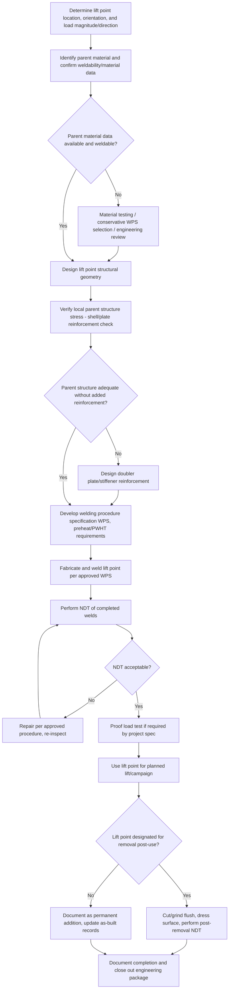

## Temporary Trunnions and Lift Point Fabrication

### Overview

Temporary trunnions and lift point fabrication addresses the engineering, fabrication, welding, and removal of lift attachments that exist for the duration of a single lift or campaign only — as opposed to permanent, design-integral lift points included in the original structural design. Many heavy loads (pressure vessels, structural steel, precast elements, retrofit equipment) were not originally designed with lift points, or their design lift points are unsuitable for the specific rigging configuration required for a given move. Temporary lift points bridge this gap but introduce distinct engineering, welding, and post-lift considerations not present with permanent, designed-in attachments.

### Distinction from Permanent Lift Points

**Permanent Lift Points**

Designed into the original structure or vessel, typically specified by the original equipment/structural designer, accounted for in the parent structure's design (local reinforcement, plate thickness, material selection at the attachment zone), and often remain in place for the equipment's operational life (used again for future maintenance lifts).

**Temporary Lift Points**

Added specifically for a single lift, transport campaign, or limited series of lifts, engineered as an add-on to an existing structure that was not necessarily designed to receive concentrated lifting loads at that location. Often removed (cropped, ground flush, and inspected) after use, particularly on process equipment where a temporary attachment could compromise pressure boundary integrity, create a stress riser, or interfere with operational/inspection requirements if left in place.

### Key Points

- **Parent material compatibility governs weldability**: The single most critical engineering step before welding a temporary lift point is confirming the parent material's weldability — chemical composition, carbon equivalent, existing heat treatment condition, and any special welding procedure requirements (preheat, post-weld heat treatment) — since welding onto an unsuitable or unknown parent material can introduce cracking risk or degrade the parent structure's properties.
- **Local reinforcement of parent structure**: Unlike permanent lift points designed with matched local reinforcement from the outset, temporary lift points frequently require verification (and sometimes addition) of local reinforcement — doubler plates, stiffeners — to ensure the parent structure itself can safely carry the concentrated load without excessive local deformation or stress concentration.
- **Removal and finishing requirements**: When temporary lift points must be removed post-lift (common on pressure vessels, piping, and any surface requiring a smooth finish or coating), the removal process (typically flame-cut or ground off, then ground flush) must avoid damaging the parent material, and the resulting surface often requires NDT (magnetic particle or dye penetrant inspection) to confirm no cracking or defects were introduced during attachment or removal.
- **Pressure boundary and code considerations**: For pressure vessels and piping, welding a temporary attachment to a pressure-retaining surface may fall under the jurisdiction of the applicable pressure vessel code (e.g., ASME Section VIII, B31.3) and may require the vessel owner/manufacturer's engineering approval, a documented welding procedure, and code-compliant NDT before and after the temporary attachment is used and removed.
- **Load path verification through the parent structure**: Unlike a standalone lifting device, a temporary trunnion or lug's load path continues into the parent structure itself; the engineer must verify not just the lug/trunnion's own capacity but the local stress in the parent shell, plate, or member at the attachment zone, which may govern the design rather than the lift point hardware itself.
- **Documentation trail importance**: Because temporary lift points are, by definition, not part of the original design documentation, a clear engineering package (design calculation, welding procedure, NDT records, removal/finishing records) is essential for traceability, particularly for pressure equipment or safety-critical structures subject to later inspection or regulatory review.
- **Reuse across a campaign**: Where a series of similar lifts will use the same temporary lift point configuration (e.g., repeated module lifts of similar design), the lift point may be engineered for the full campaign's cumulative load cycles (fatigue) rather than a single static lift, changing the governing design basis.

### Design and Fabrication Process

### Parent Structure Local Stress Verification (Conceptual)

For a temporary padeye or trunnion welded onto a thin-walled vessel shell or plate, local stress in the parent material at the attachment zone can be approximated using shell/plate bending theory or, more practically, finite element analysis (FEA) for critical/high-value applications. A simplified conceptual check for punching shear at a trunnion-to-shell weld:

$$\tau_{punch} = \frac{P}{\pi \times D_{trunnion} \times t_{shell}}$$

where $P$ is the applied load, $D_{trunnion}$ is the trunnion's outer diameter at the weld, and $t_{shell}$ is the parent shell thickness — compared against the parent material's allowable shear stress. This is a simplified screening check; [Inference] actual local stress distributions around a welded attachment on a curved shell involve more complex membrane and bending stress interaction, and detailed analysis (per applicable pressure vessel code local load methodology, such as WRC 107/297 bulletins for nozzle/attachment loads on vessels, where applicable) is typically required for any load-bearing temporary attachment on pressure equipment.

### Temporary Trunnion Attachment and Removal Diagram (svg_diagram)

<svg xmlns="http://www.w3.org/2000/svg" viewBox="0 0 900 440" font-family="Arial, sans-serif">
<text x="450" y="28" font-size="18" font-weight="bold" text-anchor="middle">Temporary Trunnion Attachment and Removal (svg_diagram)</text>

<text x="220" y="60" font-size="13" font-weight="bold" text-anchor="middle">During Lift</text>

<rect x="100" y="150" width="240" height="80" rx="10" fill="`#e0e0e0`" stroke="#333" stroke-width="2" />

<text x="220" y="195" font-size="11" text-anchor="middle">Vessel shell (parent material)</text>

<circle cx="220" cy="150" r="30" fill="`#c9d6ea`" stroke="#333" stroke-width="2" />

<text x="220" y="130" font-size="9" text-anchor="middle">Temp. trunnion</text>

<path d="M195,140 L245,140" stroke="`#dc3545`" stroke-width="3" />

<text x="220" y="112" font-size="9" text-anchor="middle" fill="`#dc3545`">Weld (full penetration)</text>

<rect x="180" y="200" width="80" height="16" fill="`#a8c8e8`" stroke="#333" stroke-width="1.5" />

<text x="220" y="212" font-size="8" text-anchor="middle">Doubler plate</text>

<line x1="380" y1="190" x2="480" y2="190" stroke="#333" stroke-width="2" marker-end="url(#arrow4)" />
<text x="430" y="175" font-size="9" text-anchor="middle">Post-lift</text>
<text x="660" y="60" font-size="13" font-weight="bold" text-anchor="middle">After Removal</text>

<rect x="540" y="150" width="240" height="80" rx="10" fill="`#e0e0e0`" stroke="#333" stroke-width="2" />

<text x="660" y="195" font-size="11" text-anchor="middle">Vessel shell (parent material)</text>

<ellipse cx="660" cy="150" rx="30" ry="8" fill="none" stroke="`#28a745`" stroke-width="2" stroke-dasharray="3,2" />

<text x="660" y="130" font-size="9" text-anchor="middle" fill="`#28a745`">Ground flush + NDT verified</text>

<text x="450" y="270" font-size="10" text-anchor="middle">Removal: flame-cut or grind off, dress surface, perform NDT to confirm no defects introduced</text>

</svg>

### Example: Temporary Lift Lugs on a Pressure Vessel for Module Installation

**Scenario**: A 60-ton horizontal pressure vessel requires four temporary lift lugs for a module lift into final position; the vessel design did not originally include lift lugs at the required rigging locations, and the vessel is fabricated from a low-alloy pressure vessel steel requiring controlled preheat for any field welding.

**Approach**:

1. Obtain the vessel's material specification and design data from the vessel manufacturer/owner to confirm weldability and applicable welding procedure requirements (preheat temperature, filler metal selection).
2. Engage the vessel's original designer or a qualified pressure vessel engineer to review and approve the proposed lift lug design, location, and local reinforcement requirements, since welding to a pressure boundary typically requires owner/manufacturer sign-off per the applicable code.
3. Design lift lugs with appropriate doubler plate reinforcement sized to keep local shell stress within allowable limits, verified per applicable local load methodology (e.g., WRC bulletin approach) for the specific shell geometry.
4. Develop and qualify a welding procedure specification (WPS) addressing the vessel's specific material and required preheat/interpass temperature control.
5. Fabricate and weld the lift lugs per the approved WPS, followed by 100% NDT (magnetic particle or dye penetrant) of all welds.
6. Use the lift lugs for the planned module installation lift.
7. Post-lift, remove the lift lugs via controlled flame-cutting and grinding, dress the surface flush with the parent shell, and perform post-removal NDT to confirm no cracking or defects were introduced during attachment or removal.
8. Document the complete engineering, welding, and inspection package for the vessel's permanent records.

**Outcome**: The vessel is safely lifted using purpose-engineered temporary lift points, with the pressure boundary's integrity verified and documented both before and after the temporary attachment's use — critical for maintaining the vessel's code compliance and operational safety record.

### Regulatory and Code Considerations

- **Pressure equipment**: Temporary welding to pressure-retaining components typically requires review under the applicable pressure vessel or piping code (ASME Section VIII for vessels, ASME B31.3 for process piping) [Unverified — jurisdiction and code edition specific], often requiring the original manufacturer's or a qualified engineer's written approval before proceeding.
- **Structural steel**: Temporary lift points on structural steel members are generally less code-restrictive than pressure equipment but still require verification against the member's own capacity and connection design, particularly for members not originally designed for the resulting local loading.
- **Welding qualification**: All welding procedures (WPS) and welder qualifications used for temporary lift point fabrication should be qualified per the applicable welding code (e.g., ASME Section IX, AWS D1.1) appropriate to the parent material and service.

[Behavior may vary based on specific parent material properties, applicable code requirements, welding procedure qualifications, and project-specific engineering approval processes — always verify against the current applicable code edition and obtain qualified engineering review before fabricating or welding any temporary lift point, particularly on pressure-retaining equipment.]

### Common Pitfalls

- Welding a temporary lift point without confirming parent material weldability, risking cracking (particularly on unknown or higher-carbon-equivalent steels)
- Failing to verify local parent structure stress, focusing engineering effort only on the lift point hardware itself rather than the load path into the parent material
- Proceeding without owner/manufacturer approval on pressure equipment, creating potential code compliance and warranty issues
- Inadequate NDT before use or after removal, missing weld defects or cracks introduced during attachment or grinding
- Poor documentation trail, leaving no traceable record of the temporary modification for future inspection or regulatory review
- Underestimating removal/finishing difficulty on curved or coated surfaces, leading to parent material damage or unacceptable surface finish

### Related Topics

- Lifting Lugs, Trunnions, and Padeyes (fundamental lift point design principles)
- Below-the-Hook Lifting Device Design (ASME BTH-1 framework)
- Welding procedure specification (WPS) development and qualification
- Pressure vessel local load analysis methodology (WRC bulletins and equivalent methods)
- Non-destructive testing (NDT) methods for weld quality verification
- Proof load testing procedures and documentation requirements
- Critical lift planning and third-party engineering review requirements