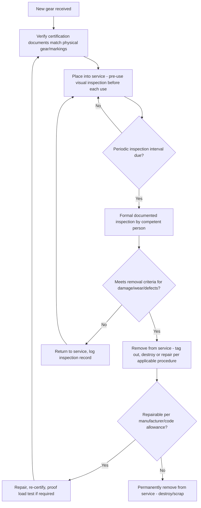

## Inspection, Testing, and Certification of Rigging Gear

### Overview

Inspection, testing, and certification of rigging gear is the systematic process of verifying that slings, shackles, hooks, wire rope, chain, below-the-hook devices, and other rigging hardware remain fit for continued safe use throughout their service life. Because rigging gear operates as a single load path with no inherent structural redundancy at the component level, a failed or degraded component can cause catastrophic load loss; inspection and certification programs exist to detect degradation before it results in failure, and to provide auditable documentation of gear fitness for use.

### Inspection Categories

**Initial/Receiving Inspection**

Performed when new gear is received, verifying the equipment matches its certification documentation (mill certificates, proof load test certificates), rated capacity markings, and that no shipping/handling damage occurred before first use.

**Frequent (Pre-Use) Inspection**

A visual inspection performed by the equipment user before each use or each shift, checking for obvious damage, deformation, wear, or missing/illegible markings. Typically not documented in detail but forms a critical first line of defense against using damaged gear.

**Periodic (Formal) Inspection**

A more thorough, documented inspection performed at defined intervals (commonly annual, though frequency may be shorter for gear in severe service or per manufacturer/regulatory requirements) by a designated "competent person" or qualified inspector, following a defined checklist and generating a retained inspection record.

**Post-Incident Inspection**

Inspection performed after any event that could have damaged gear beyond normal wear — an overload, shock loading, exposure to chemical/heat damage, or involvement in an incident — regardless of the normal periodic inspection schedule.

### Key Points

- **Removal criteria are prescriptive, not discretionary**: Most rigging standards (wire rope slings, chain slings, synthetic slings, shackles, hooks) define specific, measurable removal criteria (e.g., number of broken wires per lay length for wire rope, percentage of chain link wear, cut/abrasion depth for synthetic slings, throat opening deformation for hooks) rather than leaving fitness-for-use to subjective judgment alone.
- **Material-specific degradation modes**: Wire rope degrades primarily through wire breaks, corrosion, and core degradation; chain through link wear, stretch, and nicks/gouges; synthetic slings through cuts, abrasion, UV degradation, and chemical exposure; each material requires inspectors trained in its specific degradation indicators and removal criteria.
- **Proof load testing vs. periodic inspection are distinct**: Proof load testing (applying a specified load above working load limit, typically performed once at manufacture or after significant repair) verifies a specific structural claim at a point in time; periodic inspection is an ongoing visual/dimensional assessment and does not substitute for proof testing where proof testing is required.
- **Traceability and marking requirements**: Rigging gear must carry legible, durable markings indicating rated capacity (working load limit/WLL), and often manufacturer identification and/or a unique serial/asset number enabling traceability to inspection and certification records; illegible or missing markings are typically an automatic removal-from-service criterion regardless of the gear's physical condition.
- **Competent person qualification**: Regulatory frameworks (e.g., OSHA in the U.S. context) typically define a "competent person" as someone capable of identifying hazards and possessing authority to take corrective action, with specific training/experience expectations for rigging inspection that go beyond general safety awareness.
- **Below-the-hook device certification**: Custom-engineered lifting devices (spreader bars, lifting beams, frames) require their own certification package distinct from standard catalog rigging hardware — including design calculations, material certificates, weld NDT records, and load test certificates — per the applicable design standard (e.g., ASME BTH-1).
- **Documentation retention**: Inspection records, load test certificates, and repair/modification records should be retained and readily available for the life of the equipment (or per the applicable regulatory/project retention requirement), supporting both safety assurance and any incident investigation.

### Removal Criteria by Gear Type (General Reference)

| Gear Type | Common Removal Criteria (illustrative, not exhaustive) |
| --- | --- |
| Wire rope sling | Broken wires exceeding allowable count per lay length; wear/reduction in rope diameter; kinking, crushing, or birdcaging; corrosion; heat damage; core protrusion |
| Chain sling | Link wear exceeding allowable percentage of original diameter; stretch beyond allowable elongation; nicks, gouges, or cracks; bent/twisted links; illegible tags |
| Synthetic web/round sling | Cuts, punctures, or tears; abrasion/fraying reducing load-bearing yarns; UV degradation (discoloration/stiffness); chemical/heat damage; illegible tags |
| Shackle | Bent, elongated, or worn pin; body deformation; cracks; wear at bearing points exceeding allowable percentage; missing/illegible markings |
| Hook | Throat opening deformation (typically measured as percentage increase from original); twist beyond allowable angle; cracks; wear at load-bearing points; missing safety latch (where required) |
| Below-the-hook device | Structural cracks, deformation, weld defects; missing/illegible capacity markings; damage from overload or impact events |

[Unverified] Specific numeric removal criteria (exact wire break counts, wear percentages, deformation angles) vary by gear type, applicable standard, and manufacturer specification; the table above is illustrative of the categories of criteria used rather than a substitute for the specific applicable standard (e.g., ASME B30 series, applicable national/regional rigging standards) or manufacturer's inspection guidance, which should always be consulted directly.

### Inspection and Certification Process Flow

### Wire Rope Broken Wire Inspection Concept (svg_diagram)

<svg xmlns="http://www.w3.org/2000/svg" viewBox="0 0 900 380" font-family="Arial, sans-serif">
<text x="450" y="28" font-size="18" font-weight="bold" text-anchor="middle">Wire Rope Inspection — Lay Length Concept (svg_diagram)</text>
<line x1="80" y1="200" x2="820" y2="200" stroke="#888" stroke-width="14" stroke-linecap="round" />
<line x1="80" y1="200" x2="820" y2="200" stroke="#666" stroke-width="14" stroke-dasharray="2,8" stroke-linecap="round" />

<line x1="220" y1="192" x2="228" y2="208" stroke="#dc3545" stroke-width="3" />
<line x1="245" y1="192" x2="253" y2="208" stroke="#dc3545" stroke-width="3" />
<line x1="600" y1="192" x2="608" y2="208" stroke="#dc3545" stroke-width="3" />

<text x="234" y="240" font-size="9" text-anchor="middle" fill="`#dc3545`">Broken wires</text>

<text x="604" y="240" font-size="9" text-anchor="middle" fill="`#dc3545`">Broken wire</text>

<line x1="150" y1="270" x2="450" y2="270" stroke="#333" stroke-width="1.5" />
<line x1="150" y1="260" x2="150" y2="280" stroke="#333" stroke-width="1.5" />
<line x1="450" y1="260" x2="450" y2="280" stroke="#333" stroke-width="1.5" />
<text x="300" y="295" font-size="11" text-anchor="middle">One lay length</text>
<text x="300" y="312" font-size="9" text-anchor="middle">(count broken wires within this span per applicable standard)</text>
</svg>

### Example: Annual Rigging Gear Inspection Program at a Heavy-Lift Contractor

**Scenario**: A heavy-lift contractor maintains an inventory of wire rope slings, shackles, and custom spreader beams used across multiple projects, requiring a structured inspection and certification program to ensure continued fitness for use and regulatory compliance.

**Approach**:

1. Maintain a master equipment register assigning a unique asset ID to each piece of rigging gear, linked to its original certification documents (mill certs, proof load certificates, design calculations for custom devices).
2. Establish a periodic inspection schedule (e.g., annual formal inspection, more frequent for gear in severe/high-cycle service) with automated tracking to flag equipment approaching its due date.
3. Train and designate qualified competent persons responsible for formal periodic inspections, following documented checklists specific to each gear type's removal criteria.
4. Require pre-use visual inspection by field rigging crews before every use, with a simple, fast go/no-go checklist reinforcing (not replacing) the formal periodic inspection.
5. Immediately quarantine and tag out any gear identified as failing inspection criteria, routing it to either an approved repair/recertification path or permanent removal from service.
6. Retain all inspection records, proof load certificates, and repair documentation in the asset register, accessible for audit, incident investigation, or client due diligence review.

**Outcome**: A structured, documented inspection and certification program provides ongoing assurance of rigging gear fitness for use, supports regulatory compliance, and creates a traceable record reducing both safety risk and liability exposure.

### Testing Methods

- **Proof load testing**: Applying a specified test load (commonly a multiple of rated working load limit) to verify the item withstands the load without permanent deformation or failure; typically performed at manufacture and sometimes after major repair.
- **Visual inspection**: The primary ongoing inspection method for most rigging gear, relying on trained observation of wear, deformation, and damage indicators specific to the gear type.
- **Dimensional inspection**: Measuring specific parameters (hook throat opening, chain link diameter, wire rope diameter) against baseline or allowable tolerance values to quantify wear or deformation.
- **Non-destructive testing (NDT)**: Magnetic particle inspection, dye penetrant testing, or ultrasonic testing applied to critical welded connections (particularly on custom below-the-hook devices) to detect surface or subsurface defects not visible through simple visual inspection.

[Behavior may vary based on specific gear type, applicable national/regional standard, manufacturer guidance, and service severity — always verify against the current applicable standard (e.g., ASME B30 series for the specific gear category) and manufacturer's inspection criteria before making a fitness-for-use determination.]

### Common Pitfalls

- Relying solely on pre-use visual inspection without a structured periodic formal inspection program, missing gradual degradation not obvious on casual inspection
- Inconsistent or undocumented inspection criteria, leading to subjective and inconsistent fitness-for-use decisions across inspectors
- Failing to remove gear from service after a suspected overload or shock-loading event pending post-incident inspection
- Inadequate traceability between physical gear and its certification/inspection records, undermining audit and incident investigation capability
- Using generic inspection criteria not specific to the actual gear type/material, missing degradation modes unique to that gear category
- Allowing gear with illegible or missing capacity markings to remain in service based on assumed capacity rather than verified documentation

### Related Topics

- Lifting Lugs, Trunnions, and Padeyes (design verification for permanent/temporary lift points)
- Below-the-Hook Lifting Device Design (ASME BTH-1 certification requirements)
- Temporary Trunnions and Lift Point Fabrication (post-use NDT and documentation)
- ASME B30 series standards for specific rigging gear categories
- Non-destructive testing (NDT) methods for weld and material defect detection
- Competent person qualification requirements for rigging inspection
- Proof load testing procedures and certification documentation practices