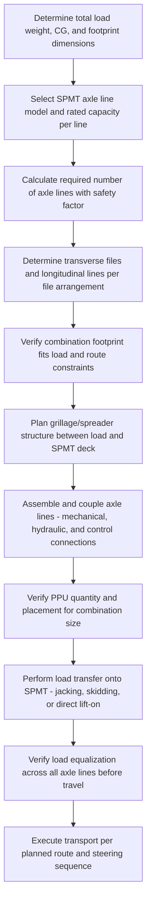

## SPMT Design and Axle Line Configuration


### Overview

Self-Propelled Modular Transporters (SPMTs) are hydraulically powered, computer-controlled multi-axle platform vehicles used to transport extremely heavy, oversized loads that exceed the capability of conventional trailers or cranes. Each axle line is an independent, self-contained module with its own hydraulic suspension, steering, and drive capability, allowing multiple axle lines to be mechanically and electronically coupled together — longitudinally, transversely, or both — to form a custom-configured transporter sized precisely to the load's weight, footprint, and required capacity.

### Fundamental Design Concept

Unlike a fixed-configuration trailer, an SPMT is fundamentally modular: a single axle line (commonly containing 4, 6, or more wheels per line depending on manufacturer and model) is the basic building block. Axle lines are coupled together end-to-end (longitudinally) to increase capacity along the load's length, and side-by-side (transversely) to increase capacity across the load's width, forming a "combination" or "carrier" sized to match the specific load. This modularity allows a single fleet of standardized axle lines to be reconfigured for a wide range of load weights and footprints across different projects, rather than requiring dedicated fixed trailers for each load type.

### Key Structural and Mechanical Components

**Axle Line**

The fundamental module containing wheels (commonly 4 per line in widely used systems, though this varies by manufacturer), hydraulic suspension cylinders providing independent ride-height and load control at each wheel, steering mechanism, and (for powered/motorized lines) hydraulic drive motors.

**Power Pack Unit (PPU)**

A self-contained diesel engine and hydraulic pump unit that supplies hydraulic power (for propulsion, steering, and suspension) to one or more coupled axle lines; a single PPU can typically drive a limited number of axle lines, with larger combinations requiring multiple PPUs working in coordinated (often wireless remote-controlled) unison.

**Hydraulic Suspension System**

Independent hydraulic cylinders at each axle/wheel position allow the platform to maintain a level deck surface even across uneven ground, and critically, allow active load equalization across all wheels — redistributing load hydraulically to prevent any single axle or wheel from being overloaded due to ground unevenness or load eccentricity.

**Steering System**

Each axle line's wheels can typically steer independently and through a wide range of angles, enabling several distinct steering modes: standard (front-and-rear coordinated) steering, crab steering (all wheels turned to the same angle for pure lateral/diagonal movement), and pivot/rotation steering (opposing wheel angles enabling the platform to rotate about a fixed point) — a critical capability for maneuvering in congested industrial sites.

**Coupling System**

Mechanical (and hydraulic/electronic) connections joining adjacent axle lines longitudinally and transversely, transmitting both structural load-sharing forces and the control signals necessary for synchronized steering, suspension leveling, and propulsion across the full combination.

### Key Points

- **Axle line capacity as building block**: SPMT combinations are sized by determining the total number of axle lines required to keep the per-line load within its rated capacity, then arranging those lines in the transverse (width) and longitudinal (length) pattern that best matches the load's footprint and weight distribution.
- **Active load equalization**: The independent hydraulic suspension at each axle/wheel is not merely for ride comfort — it actively equalizes load across all wheels in the combination in real time, which is essential given that a rigid, non-equalized platform would concentrate load unevenly across an uneven yard/route surface, risking local overload of individual axle lines.
- **Steering modes enable congested-site maneuvering**: Crab steering (lateral movement) and pivot steering (rotation about a point) allow SPMT combinations to navigate tight turns, align precisely with load-in/load-out points, and maneuver within footprints that would be impossible for a conventional fixed-axle trailer with only front-wheel steering.
- **Coupled combinations scale to project needs**: A project requiring transport of an 800-ton module might use a combination of, for example, 2 files × 12 axle lines (24 total lines), while a much heavier load might require significantly more lines in a wider, longer configuration — the flexibility of modular coupling is the core value proposition of SPMTs over fixed trailers.
- **Wireless synchronized control**: Modern SPMT combinations are typically operated via wireless remote control, with a central control system coordinating all coupled axle lines' steering, propulsion, and suspension in real time, often allowing a single operator to control an extremely large combination from a walking or riding position.
- **Ground bearing pressure distribution**: Because load is distributed across many wheels over many axle lines, SPMTs achieve relatively low ground bearing pressure per unit area compared to a crane's concentrated outrigger loads or a smaller-wheel-count trailer, making them suitable for use on prepared yard surfaces, temporary roadways, and even some paved public roads without extensive ground improvement.
- **Combination with other systems**: SPMTs are frequently used in combination with other heavy-lift methods — driving beneath a load lifted by strand jacks or skidded into position, then transporting the load to final position, sometimes combined with a turntable module for in-place rotation during transport (see related topics).

### SPMT Combination Sizing Concept

The number of axle lines required for a given load is governed by both the total load weight and the load's footprint/weight distribution:

$$n_{lines} \geq \frac{W_{total} \times SF}{C_{line}}$$

where $W_{total}$ is total load weight (including the SPMT platform's own structural self-weight and any load spreader/grillage), $SF$ is an appropriate safety/contingency factor accounting for uneven load distribution and dynamic effects, and $C_{line}$ is the rated capacity per axle line for the specific manufacturer/model. [Inference] This is a simplified conceptual sizing relationship; actual SPMT combination design also accounts for the load's specific footprint dimensions, CG location, required combination width/length for stability, route-specific constraints (turning radius, gradient, cross-slope), and manufacturer-specific technical data, and should be performed by a qualified heavy transport engineer using the specific equipment supplier's technical specifications.

### Axle Line Configuration Diagram (svg_diagram)

<svg xmlns="http://www.w3.org/2000/svg" viewBox="0 0 900 460" font-family="Arial, sans-serif">
<text x="450" y="28" font-size="18" font-weight="bold" text-anchor="middle">SPMT Combination — Axle Line Layout (svg_diagram)</text>
<rect x="150" y="80" width="600" height="280" fill="#e8f0fe" stroke="#333" stroke-width="2" stroke-dasharray="6,4" />
<text x="450" y="70" font-size="12" text-anchor="middle">Module load footprint (grillage on top of SPMT deck)</text>

<g>

<text x="120" y="130" font-size="9" text-anchor="end">File A</text>
<text x="120" y="200" font-size="9" text-anchor="end">File B</text>
<text x="120" y="270" font-size="9" text-anchor="end">File C</text>
<text x="120" y="340" font-size="9" text-anchor="end">File D</text>



```

<g fill="#c9d6ea" stroke="#333" stroke-width="1.5">
  <rect x="170" y="110" width="70" height="35" />
  <rect x="260" y="110" width="70" height="35" />
  <rect x="350" y="110" width="70" height="35" />
  <rect x="440" y="110" width="70" height="35" />
  <rect x="530" y="110" width="70" height="35" />
  <rect x="620" y="110" width="70" height="35" />

  <rect x="170" y="180" width="70" height="35" />
  <rect x="260" y="180" width="70" height="35" />
  <rect x="350" y="180" width="70" height="35" />
  <rect x="440" y="180" width="70" height="35" />
  <rect x="530" y="180" width="70" height="35" />
  <rect x="620" y="180" width="70" height="35" />

  <rect x="170" y="250" width="70" height="35" />
  <rect x="260" y="250" width="70" height="35" />
  <rect x="350" y="250" width="70" height="35" />
  <rect x="440" y="250" width="70" height="35" />
  <rect x="530" y="250" width="70" height="35" />
  <rect x="620" y="250" width="70" height="35" />

  <rect x="170" y="320" width="70" height="35" />
  <rect x="260" y="320" width="70" height="35" />
  <rect x="350" y="320" width="70" height="35" />
  <rect x="440" y="320" width="70" height="35" />
  <rect x="530" y="320" width="70" height="35" />
  <rect x="620" y="320" width="70" height="35" />
</g>
```

</g>

<text x="450" y="390" font-size="10" text-anchor="middle">4 files (transverse) × 6 axle lines (longitudinal) = 24 axle line combination</text>

<text x="450" y="410" font-size="9" text-anchor="middle">Each axle line: independent hydraulic suspension, steering, optional drive</text>

</svg>

### Steering Mode Illustration (svg_diagram)

<svg xmlns="http://www.w3.org/2000/svg" viewBox="0 0 900 320" font-family="Arial, sans-serif">
<text x="450" y="26" font-size="16" font-weight="bold" text-anchor="middle">SPMT Steering Modes (svg_diagram)</text>


<text x="150" y="55" font-size="12" font-weight="bold" text-anchor="middle">Standard</text>

<rect x="100" y="80" width="100" height="160" fill="`#e0e0e0`" stroke="#333" stroke-width="2" />

<line x1="120" y1="90" x2="130" y2="105" stroke="#333" stroke-width="3" />

<line x1="180" y1="90" x2="170" y2="105" stroke="#333" stroke-width="3" />

<line x1="120" y1="230" x2="130" y2="215" stroke="#333" stroke-width="3" />

<line x1="180" y1="230" x2="170" y2="215" stroke="#333" stroke-width="3" />

<path d="M150,250 L150,280" stroke="#666" stroke-width="1.5" marker-end="url(#arrowS)" />

<text x="150" y="300" font-size="9" text-anchor="middle">Forward travel</text>


<text x="450" y="55" font-size="12" font-weight="bold" text-anchor="middle">Crab (lateral)</text>

<rect x="400" y="80" width="100" height="160" fill="`#e0e0e0`" stroke="#333" stroke-width="2" />

<line x1="415" y1="90" x2="430" y2="100" stroke="#333" stroke-width="3" />

<line x1="485" y1="90" x2="470" y2="100" stroke="#333" stroke-width="3" />

<line x1="415" y1="230" x2="430" y2="220" stroke="#333" stroke-width="3" />

<line x1="485" y1="230" x2="470" y2="220" stroke="#333" stroke-width="3" />

<path d="M510,160 L550,160" stroke="#666" stroke-width="1.5" marker-end="url(#arrowS)" />

<text x="450" y="300" font-size="9" text-anchor="middle">Pure lateral movement</text>


<text x="750" y="55" font-size="12" font-weight="bold" text-anchor="middle">Pivot (rotation)</text>

<rect x="700" y="80" width="100" height="160" fill="`#e0e0e0`" stroke="#333" stroke-width="2" />

<line x1="715" y1="90" x2="730" y2="80" stroke="#333" stroke-width="3" />

<line x1="785" y1="90" x2="770" y2="100" stroke="#333" stroke-width="3" />

<line x1="715" y1="230" x2="730" y2="240" stroke="#333" stroke-width="3" />

<line x1="785" y1="230" x2="770" y2="220" stroke="#333" stroke-width="3" />

<path d="M810,120 A60,60 0 0,1 810,200" fill="none" stroke="#666" stroke-width="1.5" marker-end="url(#arrowS)" />

<text x="750" y="300" font-size="9" text-anchor="middle">Rotation about center point</text>

</svg>

### Configuration and Deployment Process



### Example: Transporting a Heavy Process Module Using SPMTs

**Scenario**: A 900-ton process module, 40 meters long and 12 meters wide, must be transported 500 meters from a fabrication laydown area to its final foundation, navigating a 90-degree turn within a congested plant road network.

**Approach**:

1. Determine total load weight (module plus grillage/spreader self-weight) and calculate required axle lines based on the SPMT model's rated per-line capacity, applying an appropriate safety margin.
2. Configure the combination as multiple transverse files of coupled axle lines matching the module's width and length, positioned beneath an engineered grillage/spreader structure that distributes the module's load evenly onto the SPMT deck.
3. Deploy sufficient power pack units, positioned and coordinated for synchronized wireless control across the full combination.
4. Transfer the module onto the SPMT combination (commonly via a combination of jacking-up the module and skidding the SPMT into position beneath it, or driving the SPMT beneath an elevated load).
5. Verify even load distribution/equalization across all axle lines via the hydraulic suspension system's monitoring before beginning travel.
6. Use standard steering mode for the majority of the straight-line route, transitioning to pivot steering at the 90-degree turn to rotate the combination in place within the confined road width, avoiding the wide turning radius a conventional trailer would require.
7. Complete transport to the foundation location, using fine positioning (crab steering) for final alignment before load transfer to the foundation.

**Outcome**: The SPMT combination's modular capacity, active load equalization, and flexible steering modes enable transport of a very heavy, wide load through a route geometry that would be impractical for fixed-axle trailer or crane-based alternatives.

### Route and Ground Considerations

- **Ground bearing verification**: Even with distributed loading, SPMT combinations still require route verification for adequate ground/pavement bearing capacity, particularly over buried utilities, culverts, or areas of soft subgrade.
- **Gradient and cross-slope limits**: SPMT combinations have manufacturer-specified maximum gradient and cross-slope capabilities, governed by both hydraulic suspension stroke limits and overall combination stability.
- **Turning radius and swept path analysis**: Even with advanced steering modes, large combinations require swept-path analysis to confirm clearance through turns, doorways, and around fixed obstacles along the planned route.
- **Bridge/structure crossing verification**: Where a route crosses a bridge or other load-limited structure, the structure's capacity must be verified against the SPMT combination's actual axle loading and footprint at the crossing.

[Behavior may vary based on specific SPMT manufacturer and model, control system software, route-specific ground conditions, and combination configuration — always verify against the specific equipment manufacturer's technical documentation and a project-specific transport engineering study before execution.]

### Common Pitfalls

- Undersizing the axle line count by neglecting the SPMT platform's own self-weight and grillage/spreader weight in total load calculations
- Inadequate route survey/swept-path analysis, leading to clearance conflicts discovered mid-transport
- Insufficient PPU capacity or coordination for the combination size, leading to inadequate hydraulic power for synchronized steering/suspension response
- Neglecting ground bearing verification along the full route, particularly at points crossing buried utilities or areas outside the main prepared yard
- Poor grillage/spreader design causing uneven load transfer onto the SPMT deck despite the platform's own load equalization capability
- Underestimating gradient/cross-slope limits for the specific combination, risking instability on sloped sections of the route

### Related Topics

- SPMT-Integrated Turntables (combined translation and rotation capability)
- Grillage and spreader structure design for load transfer onto transport platforms
- Ground bearing pressure calculations for heavy transport routes
- Selecting Strand Jacking versus Conventional Cranes (comparative heavy-lift method selection)
- Swept path analysis and route survey methodology for oversized transport
- Power pack unit (PPU) coordination and wireless synchronized control systems
- Load-out and load-in procedures combining SPMTs with jacking/skidding systems