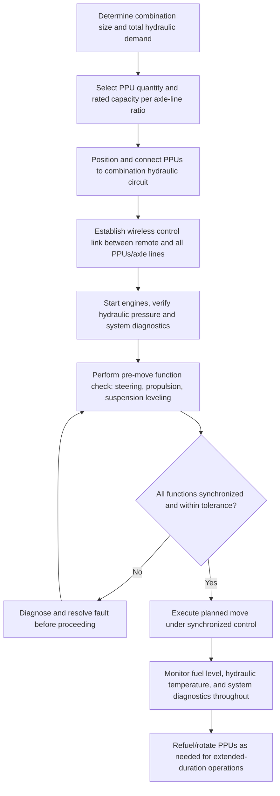

## Power Pack Units and Hydraulic Drive Systems

### Overview

Power Pack Units (PPUs) are the self-contained diesel-hydraulic power sources that drive Self-Propelled Modular Transporter (SPMT) combinations, supplying the hydraulic energy required for propulsion, steering, and suspension across all coupled axle lines. Because SPMT axle lines themselves contain no onboard engine, the PPU is the system's actual power source — a single PPU can power a defined number of axle lines, and larger combinations require multiple PPUs operating in coordinated, synchronized unison under a shared control system.

### Fundamental Architecture

A PPU is essentially a mobile hydraulic power station: a diesel engine drives one or more hydraulic pumps, which pressurize hydraulic fluid distributed through hoses/manifolds to each connected axle line's hydraulic motors (for propulsion), steering cylinders, and suspension cylinders. The PPU also houses the primary control electronics that interface with the SPMT's central control system, translating operator commands (via wireless remote control) into coordinated hydraulic actuation across every connected axle line.

### Key System Components

**Diesel Engine**

Provides the prime mechanical power input, sized to match the hydraulic pump demand of the maximum number of axle lines the PPU is rated to drive; larger combinations use multiple PPUs rather than a single oversized engine, both for redundancy and practical power distribution reasons.

**Hydraulic Pumps**

Convert the engine's mechanical power into pressurized hydraulic flow, typically using variable-displacement axial piston pumps that allow the system to modulate flow (and thus speed/force) in response to control system demand rather than running at fixed output.

**Propulsion (Drive) Motors**

Hydraulic motors integrated into powered axle lines (not all axle lines in a combination are necessarily driven — some may be "dead" or trailing lines depending on the specific configuration and required tractive effort) that convert hydraulic pressure into wheel rotation for self-propelled movement.

**Steering Cylinders/Motors**

Hydraulic actuators at each axle line controlling wheel steering angle, enabling the full range of steering modes (standard, crab, pivot) through coordinated, synchronized control across all axle lines in the combination.

**Suspension Cylinders**

Hydraulic cylinders at each wheel position providing both ride height control and active load equalization — continuously adjusting cylinder pressure/extension to maintain level deck surface and balanced load distribution across all wheels regardless of ground unevenness.

**Control System and Electronics**

The computerized system (proprietary to each SPMT manufacturer) that receives operator input via wireless remote control and translates it into synchronized commands across all connected PPUs and axle lines, maintaining coordinated steering angle, propulsion speed, and suspension leveling throughout the combination.

### Key Points

- **PPU-to-axle-line ratio is finite**: Each PPU model has a defined maximum number of axle lines it can adequately power (both in terms of hydraulic flow capacity and control system channel capacity); combinations exceeding this ratio require multiple PPUs working in parallel, with the control system coordinating their combined output.
- **Redundancy through multiple PPUs**: Using multiple PPUs on a large combination provides inherent redundancy — loss of a single PPU (mechanical failure, fuel issue) does not necessarily halt the entire operation if the remaining PPUs can maintain adequate combination function, though this depends on the specific loss scenario and combination size relative to remaining capacity.
- **Variable displacement pumps enable proportional control**: Because hydraulic pump output is variable rather than fixed, the control system can proportionally modulate speed, steering rate, and suspension response smoothly rather than through discrete on/off actuation, which is essential for the fine positioning control required in heavy-lift transport.
- **Not all axle lines are necessarily driven**: Depending on combination size, required tractive effort, and manufacturer design, some axle lines within a combination may be non-powered ("dead" lines with steering and suspension but no propulsion motor), relying on adjacent powered lines for tractive force — a design and configuration decision made based on total combination weight and required grade/traction performance.
- **Synchronized wireless control is safety-critical**: Because a large SPMT combination may span tens of meters with multiple PPUs and dozens of axle lines, reliable, low-latency wireless communication between the operator's remote control and every connected unit is essential; loss of signal or control system fault requires defined fail-safe behavior (typically an immediate, controlled stop rather than allowing uncoordinated movement).
- **Fuel and runtime planning**: PPU diesel fuel capacity and consumption rate under load determine maximum continuous operating duration before refueling is required, a practical logistics consideration for long-duration or long-distance heavy transport moves.
- **Noise and emissions considerations**: Diesel PPUs generate noise and exhaust emissions that may be subject to site-specific restrictions (indoor facility use, residential-adjacent sites, emissions regulations), sometimes requiring exhaust treatment, noise mitigation, or scheduling constraints for sensitive locations.

### Hydraulic Power Distribution Concept

Total hydraulic power demand for a combination scales with the number of active (powered) functions across all connected axle lines. A simplified conceptual relationship for required PPU capacity:

$$P_{required} = n_{PPU} \times P_{PPU,rated} \geq \sum (\text{propulsion demand} + \text{steering demand} + \text{suspension demand})$$

where the right-hand side varies dynamically throughout an operation — propulsion demand is highest during acceleration or grade climbing, steering demand peaks during active maneuvering (particularly pivot steering of a large combination), and suspension demand responds continuously to ground unevenness and load equalization needs. [Inference] This is a conceptual simplification; actual PPU sizing and combination configuration follow the specific SPMT manufacturer's technical specifications and configuration software/guidelines, which account for the detailed hydraulic circuit design, flow requirements per function, and the specific combination's axle line count and arrangement.

### PPU and Axle Line Power Distribution Diagram (svg_diagram)

<svg xmlns="http://www.w3.org/2000/svg" viewBox="0 0 900 420" font-family="Arial, sans-serif">
<text x="450" y="28" font-size="18" font-weight="bold" text-anchor="middle">PPU to Axle Line Hydraulic Power Distribution (svg_diagram)</text>

<rect x="80" y="90" width="120" height="70" rx="8" fill="#c9d6ea" stroke="#333" stroke-width="2" />
<text x="140" y="120" font-size="11" text-anchor="middle">PPU 1</text>
<text x="140" y="136" font-size="9" text-anchor="middle">Diesel engine</text>
<text x="140" y="150" font-size="9" text-anchor="middle">+ hydraulic pumps</text>
<rect x="80" y="200" width="120" height="70" rx="8" fill="#c9d6ea" stroke="#333" stroke-width="2" />
<text x="140" y="230" font-size="11" text-anchor="middle">PPU 2</text>
<text x="140" y="246" font-size="9" text-anchor="middle">Diesel engine</text>
<text x="140" y="260" font-size="9" text-anchor="middle">+ hydraulic pumps</text>

<rect x="280" y="150" width="130" height="60" rx="8" fill="#fff3cd" stroke="#e6a817" stroke-width="2" />
<text x="345" y="175" font-size="11" text-anchor="middle">Central control</text>
<text x="345" y="190" font-size="9" text-anchor="middle">(wireless sync)</text>
<line x1="200" y1="125" x2="280" y2="170" stroke="#333" stroke-width="2" />
<line x1="200" y1="235" x2="280" y2="190" stroke="#333" stroke-width="2" />

<g fill="#e0e0e0" stroke="#333" stroke-width="1.5">
<rect x="470" y="90" width="90" height="40" />
<rect x="470" y="150" width="90" height="40" />
<rect x="470" y="210" width="90" height="40" />
<rect x="470" y="270" width="90" height="40" />
</g>
<text x="515" y="114" font-size="9" text-anchor="middle">Axle line 1</text>
<text x="515" y="174" font-size="9" text-anchor="middle">Axle line 2</text>
<text x="515" y="234" font-size="9" text-anchor="middle">Axle line 3</text>
<text x="515" y="294" font-size="9" text-anchor="middle">Axle line n</text>
<line x1="410" y1="175" x2="470" y2="110" stroke="#4285f4" stroke-width="2" />
<line x1="410" y1="175" x2="470" y2="170" stroke="#4285f4" stroke-width="2" />
<line x1="410" y1="180" x2="470" y2="230" stroke="#4285f4" stroke-width="2" />
<line x1="410" y1="180" x2="470" y2="290" stroke="#4285f4" stroke-width="2" />

<text x="700" y="120" font-size="9">Each line: propulsion motor,</text>

<text x="700" y="135" font-size="9">steering cylinder,</text>

<text x="700" y="150" font-size="9">suspension cylinders</text>

<line x1="700" y1="105" x2="640" y2="105" stroke="#666" stroke-width="1" stroke-dasharray="3,2" />

</svg>

### Operational Sequence

### Example: Multi-PPU Combination for a Long-Distance Heavy Module Move

**Scenario**: A 24-axle-line SPMT combination is required to transport a heavy module over a 3-kilometer route with moderate grade sections, exceeding the practical hydraulic capacity and continuous runtime of a single PPU.

**Approach**:

1. Determine the total axle line count and calculate the number of PPUs required based on the manufacturer's rated axle-line-per-PPU ratio, adding margin for grade-climbing power demand on the moderate slope sections.
2. Position PPUs at appropriate locations within or alongside the combination per the manufacturer's configuration guidance, connecting hydraulic supply lines and control system links to their assigned axle line groups.
3. Verify wireless control synchronization across all PPUs and axle lines during pre-move function checks, confirming coordinated steering, propulsion, and suspension response.
4. Plan fuel logistics for the 3-kilometer route duration, including contingency for refueling if the move exceeds a single PPU fuel cycle, or pre-positioning fuel support along the route.
5. Execute the move, monitoring hydraulic system diagnostics and load equalization throughout, with particular attention to propulsion demand during grade sections where multiple PPUs' combined tractive effort is required.

**Outcome**: Multiple coordinated PPUs provide the combined hydraulic power and control redundancy necessary for a long-distance, large-combination move that would exceed a single PPU's practical capacity, while the synchronized control system maintains coordinated function across the full combination throughout the route, including variable-grade sections.

### Fail-Safe and Safety Considerations

- **Loss of communication**: SPMT control systems are typically designed to bring the combination to a controlled, immediate stop if wireless communication between the remote control and the PPU/axle line network is lost, rather than allowing continued uncoordinated movement.
- **Hydraulic pressure monitoring**: Continuous monitoring of hydraulic pressure and temperature across the system allows early detection of leaks, pump degradation, or overheating before a functional failure occurs.
- **Emergency stop provisions**: All SPMT control systems incorporate emergency stop functionality accessible to the operator, capable of immediately halting all propulsion and locking suspension/steering in a safe state.
- **Load equalization monitoring**: The suspension system's load equalization function should be actively monitored throughout a move, with alarms or automatic stops if load distribution across axle lines exceeds acceptable tolerance, indicating a potential local overload condition.

[Behavior may vary based on specific PPU manufacturer and model, hydraulic system design, control software version, and combination configuration — always verify against the specific equipment manufacturer's technical documentation and operating procedures before execution.]

### Common Pitfalls

- Undersizing PPU capacity relative to combination size, particularly for grade-climbing or high-maneuvering (pivot steering) demand scenarios
- Inadequate fuel logistics planning for long-duration or long-distance moves, risking mid-move refueling delays
- Insufficient redundancy margin, where loss of a single PPU in a combination sized at exactly minimum capacity halts the entire operation
- Poor wireless control system signal planning in congested industrial sites with potential radio interference sources
- Neglecting noise/emissions restrictions at sensitive sites (indoor facilities, residential-adjacent locations) during planning
- Inadequate pre-move function checks, missing steering/suspension synchronization faults before the combination is committed to a critical move

### Related Topics

- SPMT Design and Axle Line Configuration (fundamental combination architecture)
- SPMT-Integrated Turntables (combined translation and rotation capability)
- Ground bearing pressure calculations for heavy transport routes
- Swept path analysis and route survey methodology for oversized transport
- Wireless synchronized control systems (applicable principles shared with strand jacking)
- Fuel and logistics planning for extended-duration heavy transport operations
- Grillage and spreader structure design for load transfer onto transport platforms