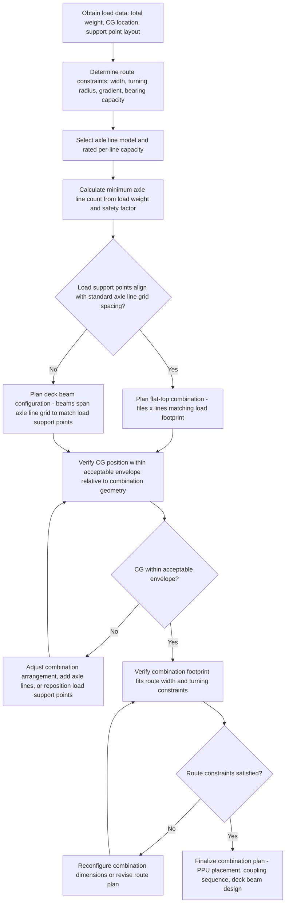

## SPMT Coupling Configurations and Combination Planning

### Overview

SPMT coupling configuration and combination planning is the engineering process of arranging individual axle lines into a specific transverse-and-longitudinal pattern — a "combination" — sized and shaped to match a given load's weight, footprint, center of gravity, and the route's geometric constraints. While individual axle line capability was addressed in axle line design fundamentals, this discipline focuses on the combinatorial planning problem: how many files, how many lines per file, what coupling method, and how the resulting combination interfaces with the load and the route.

### Combination Terminology

**File**

A longitudinal row of coupled axle lines running in the direction of primary travel; a combination's overall length is typically described by the number of axle lines per file.

**Row/Bank**

A transverse grouping of files coupled side-by-side; a combination's overall width is described by the number of files per row.

**Combination Notation**

Combinations are commonly described by a shorthand such as "4 files × 6 lines" (or similar manufacturer-specific notation), indicating the transverse-by-longitudinal arrangement — in this example, 4 parallel files each containing 6 coupled axle lines, for a total of 24 axle lines.

**Flat-Top vs. Deck Beam Combinations**

Flat-top configurations have axle lines coupled directly beneath a flat platform deck, suitable for loads that can sit directly on a level SPMT deck surface. Deck beam (or "PST"-type/beam-supported) configurations use longitudinal support beams spanning across multiple files, allowing the load's support points to be positioned independently of the underlying axle line grid — useful when the load's structural support points don't align neatly with a standard axle line spacing pattern.

### Key Points

- **Combination sizing starts from load data, not equipment availability**: The fundamental planning sequence begins with the load's weight, CG location, and physical support point locations/footprint, from which the required number of axle lines, their arrangement, and any necessary deck beam/spreader structure is derived — not the reverse.
- **CG position relative to combination geometry governs load distribution**: A load's CG that is off-center relative to the combination's geometric center creates uneven axle line loading even with perfect hydraulic equalization within physical stroke limits; combination planning must verify the CG falls within an acceptable envelope relative to the combination's footprint, or add additional axle lines/adjust arrangement to compensate.
- **Coupling method affects both structural continuity and maneuverability**: Rigid mechanical coupling between axle lines provides strong structural load-sharing continuity but can affect the combination's ability to articulate over uneven ground or through tight turns; different manufacturers offer coupling systems balancing these competing needs (some allow limited articulation between coupled units).
- **Deck beam configurations decouple load support points from axle line grid**: When a load's structural lift/support points are irregularly spaced or don't align with standard axle line spacing, deck beams spanning across multiple files allow the load's actual support points to be positioned where structurally appropriate, with the beams then transferring load down into the underlying axle line grid.
- **Combination width vs. route width constraints**: Wider combinations (more files) increase total capacity and improve transverse stability but must fit within available route width — bridge/roadway width, gate openings, and clearance to fixed obstacles along the entire route.
- **Combination length vs. maneuverability trade-off**: Longer combinations (more axle lines per file) increase capacity along the load's length but reduce maneuverability in tight turns, even with advanced steering modes, since a longer combination has a larger minimum turning envelope.
- **Symmetrical vs. asymmetrical combinations**: While symmetrical rectangular combinations are most common and structurally straightforward, some loads with irregular footprints or asymmetric weight distribution may require non-rectangular or asymmetric combination arrangements, requiring more detailed engineering analysis of load distribution across the non-uniform grid.

### Combination Planning Process

### Load Distribution Across a Combination (Conceptual)

For a rectangular combination with $n$ axle lines and a load with CG offset $(e_x, e_y)$ from the combination's geometric center, individual axle line loading varies from the average (uniform) load per line due to the resulting moment. A simplified conceptual approach treating the combination as a rigid plate on elastic supports (the hydraulic suspension) gives axle line load as:

$$W_i = \frac{W_{total}}{n} \pm \frac{M_x \times y_i}{\sum y_i^2} \pm \frac{M_y \times x_i}{\sum x_i^2}$$

where $M_x = W_{total} \times e_y$ and $M_y = W_{total} \times e_x$ are the moments from CG offset in each direction, and $x_i, y_i$ are each axle line's position relative to the combination's geometric center. [Inference] This is a simplified conceptual model analogous to a bolt group or pile group load distribution analysis; actual SPMT combination load distribution is typically calculated using the manufacturer's specific configuration software, which accounts for the actual hydraulic suspension characteristics, coupling stiffness, and deck beam flexibility rather than treating the combination as an idealized rigid plate.

### Combination Configuration Comparison Diagram (svg_diagram)

<svg xmlns="http://www.w3.org/2000/svg" viewBox="0 0 900 460" font-family="Arial, sans-serif">
<text x="450" y="28" font-size="18" font-weight="bold" text-anchor="middle">Flat-Top vs Deck Beam Combination (svg_diagram)</text>

<text x="220" y="60" font-size="13" font-weight="bold" text-anchor="middle">Flat-Top Combination</text>

<rect x="120" y="90" width="200" height="120" fill="`#e8f0fe`" stroke="#333" stroke-width="2" stroke-dasharray="4,3" />

<g fill="`#c9d6ea`" stroke="#333" stroke-width="1">

<rect x="130" y="100" width="45" height="45" />

<rect x="185" y="100" width="45" height="45" />

<rect x="240" y="100" width="45" height="45" />

<rect x="130" y="155" width="45" height="45" />

<rect x="185" y="155" width="45" height="45" />

<rect x="240" y="155" width="45" height="45" />

</g>

<rect x="130" y="230" width="160" height="20" fill="#666" />

<text x="220" y="245" font-size="8" text-anchor="middle" fill="#fff">Load sits directly on deck</text>

<text x="220" y="270" font-size="9" text-anchor="middle">Load footprint aligns with axle grid</text>

<text x="680" y="60" font-size="13" font-weight="bold" text-anchor="middle">Deck Beam Combination</text>

<rect x="580" y="90" width="200" height="120" fill="`#e8f0fe`" stroke="#333" stroke-width="2" stroke-dasharray="4,3" />

<g fill="`#c9d6ea`" stroke="#333" stroke-width="1">

<rect x="590" y="140" width="45" height="45" />

<rect x="645" y="140" width="45" height="45" />

<rect x="700" y="140" width="45" height="45" />

<rect x="590" y="100" width="45" height="30" />

<rect x="645" y="100" width="45" height="30" />

<rect x="700" y="100" width="45" height="30" />

</g>

<rect x="590" y="185" width="190" height="14" fill="`#a8c8e8`" stroke="#333" stroke-width="1.5" />

<text x="685" y="196" font-size="7" text-anchor="middle">Deck beam spans across files</text>

<rect x="620" y="205" width="130" height="20" fill="#666" />

<text x="685" y="220" font-size="8" text-anchor="middle" fill="#fff">Load support points</text>

<text x="685" y="270" font-size="9" text-anchor="middle">Load support points independent of axle grid</text>

</svg>

### Example: Combination Planning for an Asymmetric Reactor Module

**Scenario**: A reactor module with total weight 650 tons has its CG located significantly off-center due to internal equipment concentration on one side, with two primary structural support saddles that do not align with a standard axle line spacing grid.

**Approach**:

1. Obtain precise weight and CG data from the module's design engineering, including the exact location of the two support saddle points.
2. Calculate the minimum required axle line count based on total weight and the selected axle line model's rated capacity, applying an increased safety margin to account for the known CG offset.
3. Since support points don't align with standard axle line spacing, plan a deck beam configuration with longitudinal beams positioned to receive load directly beneath the two saddle points, spanning across the underlying axle line grid.
4. Analyze load distribution across the combination accounting for the CG offset, verifying no individual axle line exceeds rated capacity even with the uneven distribution — potentially requiring an asymmetric combination arrangement (more axle lines concentrated toward the heavier side) rather than a simple symmetric rectangular grid.
5. Verify the resulting combination footprint, including any width increase needed to accommodate the load distribution requirements, fits within route width and turning constraints.
6. Finalize the combination plan with PPU placement providing adequate power to the higher-demand (more heavily loaded) side of the combination.

**Outcome**: A deck-beam, load-distribution-informed combination plan accommodates the module's asymmetric weight distribution and non-standard support point layout, keeping all axle lines within rated capacity while providing structurally appropriate load transfer at the module's actual saddle support locations.

### Route Integration Considerations

- **Turning radius verification**: The combination's specific length and width, combined with its steering mode capabilities (standard, crab, pivot), determine the minimum practical turning envelope, which must be verified against every turn along the planned route.
- **Width pinch points**: Gates, temporary roadway sections, and areas between fixed structures must be verified against the combination's actual width, including any additional clearance margin for steering articulation during transit.
- **Combination reconfiguration mid-route**: For complex routes with varying width constraints, some projects plan combination reconfiguration (temporarily reducing file count) at specific pinch points, though this adds operational complexity and time.
- **Coordination with the load's original structural design**: Where possible, early coordination between the transport engineer and the load's original structural designer allows support point locations to be planned with SPMT combination compatibility in mind, reducing the need for complex deck beam solutions.

[Behavior may vary based on specific SPMT manufacturer configuration software, coupling system design, deck beam capacity, and project-specific load/route data — always verify against the specific equipment manufacturer's technical documentation and a qualified transport engineer's combination plan before execution.]

### Common Pitfalls

- Planning combination arrangement based on available equipment inventory rather than starting from actual load weight, CG, and support point data
- Underestimating the load distribution effect of CG offset, resulting in individual axle line overload despite adequate total combination capacity
- Failing to verify deck beam capacity and deflection when support points are significantly offset from the underlying axle line grid
- Inadequate route width/turning verification for the specific combination footprint, discovered only during actual transport execution
- Treating combination planning as purely a capacity/tonnage exercise without considering route geometric constraints from the outset
- Late coordination with the load's structural designer, resulting in support point locations that are difficult to accommodate without complex deck beam solutions

### Related Topics

- SPMT Design and Axle Line Configuration (fundamental axle line building block)
- Power Pack Units and Hydraulic Drive Systems (power distribution across combinations)
- Grillage and spreader structure design for load transfer onto transport platforms
- Swept path analysis and route survey methodology for oversized transport
- Center of gravity determination and load stability analysis
- Ground bearing pressure calculations for heavy transport routes
- SPMT-Integrated Turntables (combined translation and rotation capability)