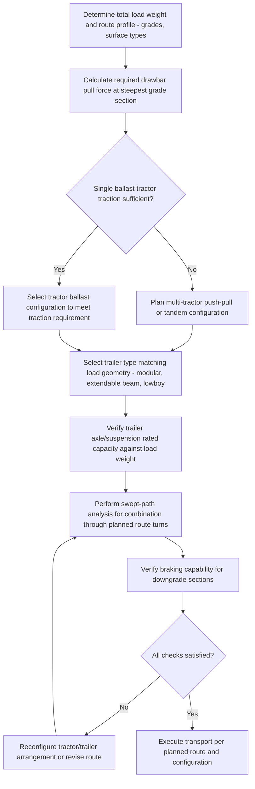

## Ballast Tractors and Conventional Heavy Haulers

### Overview

Ballast tractors and conventional heavy haulers are non-self-propelled or towing-based heavy transport equipment used to move oversized and overweight loads on conventional trailers, distinct from Self-Propelled Modular Transporters (SPMTs), which carry their own onboard propulsion at the trailer level. Ballast tractors are a specialized subcategory of heavy haulage prime movers that use added ballast weight (rather than sheer engine power alone) to generate the traction and pulling capacity needed for extremely heavy, high-resistance loads — particularly relevant for abnormal loads exceeding the practical limits of standard highway tractors.

### Fundamental Working Principle

A conventional heavy haulage combination consists of a prime mover (tractor unit) mechanically coupled to a trailer (typically a modular, extendable, or specialized low-bed/beam trailer) carrying the load. Unlike an SPMT, where propulsion is distributed across the trailer's own axle lines, a conventional hauler's tractive effort originates entirely at the tractor unit and is transmitted to the load through the trailer's drawbar or fifth-wheel/gooseneck connection — meaning the tractor's available traction (a function of its drive axle weight and tire-to-road friction) directly limits how much total combination weight it can move, particularly on grades or poor traction surfaces.

**Ballast Tractor Concept**

A ballast tractor adds substantial dead-weight ballast (concrete blocks, steel weights) to the tractor unit itself, increasing the weight carried on its drive axles and thus increasing available traction force, independent of the actual load being hauled. This is particularly critical for extremely heavy loads where the required pulling (drawbar) force would otherwise exceed what the tractor's own unladen weight could generate traction for, even with adequate engine power.

### Key Points

- **Traction is often the limiting factor, not engine power**: For very heavy loads, especially on grades, a conventional tractor's ability to move the load is frequently limited by available traction (drive axle weight × coefficient of friction with the road surface) rather than raw engine horsepower — a powerful engine is useless if the drive wheels simply spin due to insufficient weight transfer.
- **Ballast increases traction, not load capacity**: It is important to distinguish that ballast weight primarily improves the tractor's own traction capability; it does not directly increase the trailer's structural load-carrying capacity, which remains governed by the trailer's own axle/suspension rating.
- **Multiple tractor configurations for very heavy loads**: For loads exceeding a single tractor's pulling capacity even with ballast, combinations may use multiple tractors — pushing from behind, pulling from the front, or both simultaneously (push-pull configuration) — coordinated to provide combined tractive effort exceeding any single unit's capability.
- **Trailer types vary by load geometry**: Conventional heavy haul trailers include modular platform trailers (similar in concept to SPMT decks but towed rather than self-propelled), extendable beam trailers (for long loads like wind turbine blades or bridge girders), and specialized lowboy/double-drop trailers providing reduced deck height for tall loads under bridge/overhead clearance constraints.
- **Grade and braking considerations**: Heavy haul combinations require careful engineering not just for pulling capability on upgrades but for controlled braking capability on downgrades, where the combination's total weight and the trailer's own braking system (often air-actuated, coordinated with the tractor) must safely control descent without excessive brake fade or loss of control.
- **Route and swing radius constraints**: Unlike SPMTs' advanced steering modes (crab, pivot), conventional tractor-trailer combinations are generally limited to more traditional articulated steering geometry, requiring more conservative swept-path analysis for tight turns, particularly with long or multi-axle trailers.
- **Cost and mobilization comparison with SPMTs**: Conventional heavy haul tractor-trailer combinations are often more economical and quicker to mobilize for loads within their practical capacity range on reasonably good roads, while SPMTs offer superior maneuverability, ground bearing distribution, and precision positioning for very heavy, awkward, or site-constrained loads — informing the selection between the two approaches for a given project.

### Traction and Drawbar Force Concept

The maximum tractive (pulling) force a tractor can generate before wheel slip is approximated by:

$$F_{traction} \leq \mu \times W_{drive}$$

where $\mu$ is the coefficient of friction between drive tires and the road surface (varies significantly with surface condition — dry pavement, wet pavement, gravel, ice) and $W_{drive}$ is the weight carried on the tractor's drive axles (including any added ballast). The required drawbar pull to move a loaded trailer on a grade is approximately:

$$F_{required} = W_{total} \times (\mu_{rolling} + \sin(\theta))$$

where $W_{total}$ is the combined trailer-plus-load weight, $\mu_{rolling}$ is the trailer's rolling resistance coefficient, and $\theta$ is the grade angle. As grade increases, required pulling force increases substantially, which is why ballast tractors (increasing $W_{drive}$ and thus available $F_{traction}$) become particularly important for heavy loads on routes with significant grade sections. [Inference] These are simplified conceptual relationships; actual heavy haul route engineering accounts for dynamic effects, actual tire/surface friction coefficients (which vary significantly and are difficult to predict precisely), trailer-specific rolling resistance, and manufacturer-specific tractor drawbar rating data, and should be performed by a qualified heavy haul transport engineer.

### Comparative Table: Ballast Tractor/Conventional Hauler vs. SPMT

| Characteristic | Ballast Tractor / Conventional Hauler | SPMT |
| --- | --- | --- |
| Propulsion location | Tractor unit only | Distributed across all axle lines |
| Steering flexibility | Articulated (tractor-trailer geometry) | Standard, crab, pivot modes |
| Traction dependency | Tractor drive axle weight + ballast | Distributed traction across many powered lines |
| Ground bearing distribution | Concentrated at trailer axle groups | Distributed across many axle lines |
| Mobilization speed | Generally faster for standard configurations | Requires combination assembly/configuration |
| Typical best fit | Long-distance highway moves, moderate-to-heavy loads | Very heavy loads, congested sites, precision positioning |
| Grade/traction sensitivity | High — traction-limited on steep grades | Lower — distributed powered lines share tractive demand |

### Ballast Tractor and Trailer Combination Diagram (svg_diagram)

<svg xmlns="http://www.w3.org/2000/svg" viewBox="0 0 900 360" font-family="Arial, sans-serif">
<text x="450" y="28" font-size="18" font-weight="bold" text-anchor="middle">Ballast Tractor Pulling a Loaded Trailer on Grade (svg_diagram)</text>

<line x1="60" y1="300" x2="840" y2="200" stroke="#333" stroke-width="2" />
<text x="750" y="180" font-size="10">Grade θ</text>

<g transform="translate(140,240) rotate(-13)">
<rect x="0" y="0" width="100" height="45" rx="6" fill="#888" stroke="#333" stroke-width="2" />
<text x="50" y="27" font-size="9" text-anchor="middle" fill="#fff">Tractor</text>
<rect x="10" y="-25" width="40" height="28" fill="#666" stroke="#333" stroke-width="1.5" />
<text x="30" y="-8" font-size="7" text-anchor="middle" fill="#fff">Ballast</text>
<circle cx="20" cy="48" r="12" fill="#333" />
<circle cx="80" cy="48" r="12" fill="#333" />
</g>

<line x1="235" y1="215" x2="290" y2="205" stroke="#dc3545" stroke-width="3" />
<text x="260" y="195" font-size="9" fill="#dc3545">Drawbar</text>

<g transform="translate(290,180) rotate(-13)">
<rect x="0" y="0" width="320" height="35" fill="#e0e0e0" stroke="#333" stroke-width="2" />
<text x="160" y="22" font-size="10" text-anchor="middle">Heavy load on trailer deck</text>
<circle cx="30" cy="42" r="11" fill="#333" />
<circle cx="70" cy="42" r="11" fill="#333" />
<circle cx="250" cy="42" r="11" fill="#333" />
<circle cx="290" cy="42" r="11" fill="#333" />
</g>

<text x="450" y="330" font-size="10" text-anchor="middle">Traction force = μ × drive axle weight (increased by ballast)</text>

</svg>

### Push-Pull Configuration Diagram (svg_diagram)

<svg xmlns="http://www.w3.org/2000/svg" viewBox="0 0 900 260" font-family="Arial, sans-serif">
<text x="450" y="26" font-size="16" font-weight="bold" text-anchor="middle">Push-Pull Multi-Tractor Configuration (svg_diagram)</text>
<rect x="60" y="120" width="90" height="40" rx="6" fill="#888" stroke="#333" stroke-width="2" />
<text x="105" y="145" font-size="9" text-anchor="middle" fill="#fff">Pulling tractor</text>
<line x1="150" y1="140" x2="200" y2="140" stroke="#dc3545" stroke-width="3" />
<rect x="200" y="115" width="400" height="35" fill="#e0e0e0" stroke="#333" stroke-width="2" />
<text x="400" y="137" font-size="11" text-anchor="middle">Heavy load / trailer</text>
<line x1="600" y1="140" x2="650" y2="140" stroke="#dc3545" stroke-width="3" />
<rect x="650" y="120" width="90" height="40" rx="6" fill="#888" stroke="#333" stroke-width="2" />
<text x="695" y="145" font-size="9" text-anchor="middle" fill="#fff">Pushing tractor</text>

<text x="105" y="180" font-size="9" text-anchor="middle">Pull force →</text>

<text x="695" y="180" font-size="9" text-anchor="middle">← Push force</text>

<text x="400" y="200" font-size="10" text-anchor="middle">Combined tractive effort exceeds either unit alone</text>

</svg>

### Operational Planning Sequence

### Example: Wind Turbine Blade Transport Using Extendable Beam Trailer

**Scenario**: An 80-meter wind turbine blade must be transported 60 kilometers from a manufacturing facility to a wind farm site over a route including a sustained 6% grade section, using conventional highway infrastructure.

**Approach**:

1. Select an extendable beam trailer sized to the blade's length, with appropriate root-end and tip-end support fixtures matching the blade's structural attachment points.
2. Calculate required drawbar pull at the steepest grade section, accounting for the combined trailer-plus-blade weight and estimated rolling resistance.
3. Select a ballast tractor configuration (or standard highway tractor if calculated traction requirements are within its unladen capability) providing adequate traction margin for the grade section.
4. Verify trailer axle/suspension rating is adequate for the blade's actual weight and CG distribution along its length.
5. Perform swept-path analysis for the specific combination length through planned route turns and intersections, given the reduced steering flexibility compared to an SPMT.
6. Verify braking system capability for controlled descent on the grade section's downhill direction (if applicable to the route), ensuring adequate margin against brake fade.
7. Execute the move per the planned route, with a pilot/escort vehicle configuration appropriate to the load's length and route requirements.

**Outcome**: A properly configured ballast tractor and extendable beam trailer combination provides an economical, mobilization-efficient solution for a long-distance highway move within conventional tractor-trailer capability, avoiding the greater complexity and cost of an SPMT-based solution for a load that does not require SPMT-specific maneuverability or ground distribution advantages.

### Regulatory and Permitting Considerations

- **Oversize/overweight permits**: Heavy haul moves on public roads typically require permits from the relevant road authority, specifying allowable routes, travel times (often restricted to off-peak or nighttime hours), escort vehicle requirements, and maximum axle/gross weight limits.
- **Bridge and structure load ratings**: Routes crossing bridges or other load-limited structures require verification against the specific combination's axle loading and gross weight, which may govern route selection independent of general road capacity.
- **Escort and pilot vehicle requirements**: Depending on load dimensions and jurisdiction, escort vehicles (pilot cars, and for very large loads, police escort) are commonly required to manage traffic and warn of the oversized combination's presence.

[Behavior may vary based on specific jurisdiction permitting requirements, tractor/trailer manufacturer specifications, actual route surface and grade conditions, and load-specific engineering — always verify against the applicable road authority's current permitting requirements and a qualified heavy haul transport engineer's route study before execution.]

### Common Pitfalls

- Underestimating required traction on grade sections, resulting in wheel slip or inability to move the load on steep or wet/icy road surfaces
- Confusing ballast weight's traction benefit with an increase in the trailer's actual structural load capacity
- Inadequate swept-path analysis for long combinations with limited steering articulation compared to SPMT alternatives
- Insufficient braking capability verification for downgrade sections, risking loss of control during descent
- Late or inadequate permitting/route approval process, causing schedule delays or requiring last-minute route changes
- Failing to compare conventional hauler versus SPMT suitability early in planning, potentially selecting a less appropriate method for the specific load and route combination

### Related Topics

- SPMT Design and Axle Line Configuration (comparative self-propelled alternative)
- Selecting Strand Jacking versus Conventional Cranes (broader heavy-lift method selection framework)
- Swept path analysis and route survey methodology for oversized transport
- Oversize/overweight permitting processes and escort vehicle requirements
- Grade and braking system engineering for heavy haul combinations
- Extendable beam and modular trailer selection for long or irregular loads
- Ground bearing pressure calculations for heavy transport routes